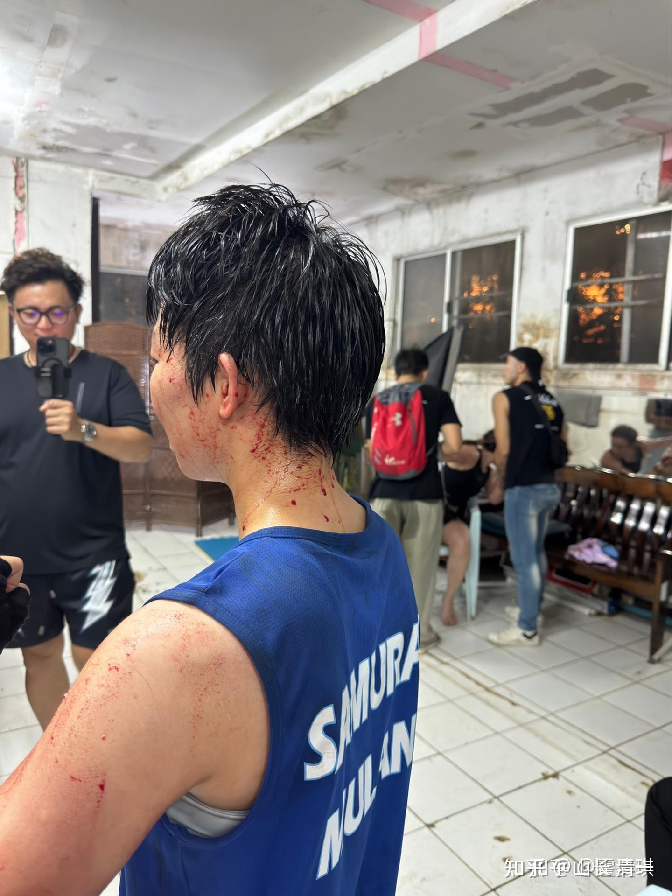
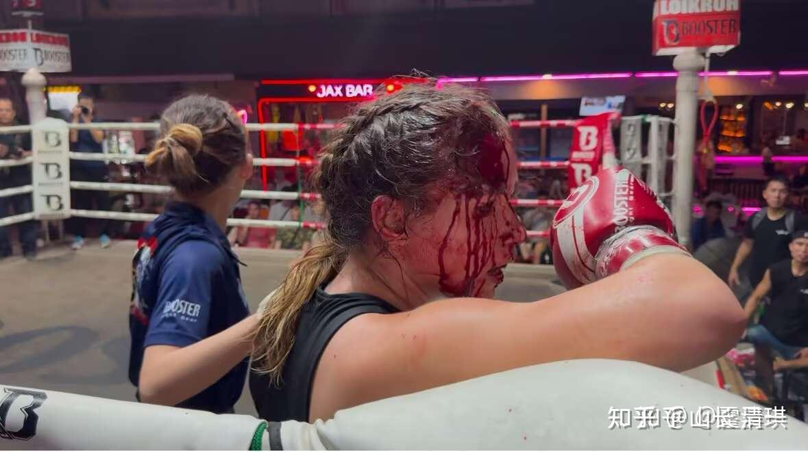

这个美国白人拳手已经击败了很多泰拳手，所以泰国拳场这次安排佳慧来跟她打。刚到拳场就有很多泰国朋友来递招：说此美国白女最近一年从无败绩，风格极为强悍，让林佳慧小心应对。她的体重也比佳慧更重5公斤左右。所以应该是一个不好对付的家伙！泰国拳场安排很久没有上场的佳慧（泰国人传说中最厉害的木兰拳手之一。另外一个是明晓）来打比赛。也有让中国人替泰国人报仇的意思！毕竟我们都是黄种人，面对白种人，还是有点不服气的！不过---美国人也一样，非常的自负，她抱一定要Ko佳慧的目的上场。美国人现在是瞧中国人就冒火的。中方自然也对美方不客气！所以这场比赛自然打的非常的剧烈。没想到一个只拿很低出场费的比赛，可以打的像是播求的大比赛一样激烈！此战的医疗费绝对不够用了！

*刚打完走下场的佳慧。全身到处是血！*

这是第一次木兰比赛出现如此血淋淋的局面，佳慧也是第一次给别人开口子。肘过如刀，打出这么多血出来！赛后我都担心佳慧有心理阴影，但她表现如常。说自己场上不努力的话，可能这次受伤的就是自己！毕竟对方身高体重均优于自己，力量还特别强大。不全力应对自己也有可能受伤的，当然不敢随便放过去！

这个对手美国人特别积极。应战态度也很傲慢和自信。赛前她拒绝接受采访，说要专心打完比赛后再说！显得特别的自信，场上也特别勇敢。作战风格很明显，就是拼命往前压。Alina说她好久都没有遇到这么敢于积极进攻她的对手了。普通人肯定就被白女这种不要命的打法吓垮了。可惜她遇到的对手书清一木兰。太极技术非常擅长防守，攻防合一。美国人想要开我们的口，难度还是很大的！打了三百多场，我们的拳手受伤很少。倒是对手吃亏太大，多家拳场的拳手，为了保护拳手，都已经宣布不跟我们打比赛了！认输避战。照片中，佳慧身上的血，都是对手的，不是自己的！你就可以想象对手有多惨了！

她被打成个血葫芦了！下面是场上的照片！

*就这样：看着都疼*

这美国人也真是了得---都已经被打成这样了，她居然还坚持想要继续打下去，特别的顽强。但场上裁判坚持不让她继续了，因此这场比赛， 第四局就TKO，因伤宣布提前结束了。真要继续打下去，她肯定会更惨。泰国裁判都是知道清一木兰实力的。因为多少泰国拳手都被我们KO了。清迈的泰国女拳手，现在都特别怕木兰，很多都已经弃赛不打了！所以现在安排比赛也很难。但这个老美，显然还不知道中国木兰的厉害。甚至可能还以为中国人比泰国人更好对付！要好好收拾中国人。这一次真的吃了大亏，但她赛后还是很不服气，以为如果坚持下来会有机会KO我们木兰的！

泰拳号称是全世界最凶猛的拳，世界最强站立格斗技。各位看了这两张照片，就知道名不虚传。国内还有人说因为我有钱，我就是在泰国组队，拿钱买比赛打名誉的。泰国拳场还真的会这样干。只要给钱给泰国拳手，真的会放水的。职业拳手的意思，就是拿钱比赛的。如果输了能够得到更多的钱，干嘛不干呢？中国也有很多武术人士。会来泰国刷战绩回去开武馆用。甚至可以多花一些钱拿到金腰带！因此国内有些“武术行内人士”，一直不相信我们创造的战绩，认为是买出来的。各位看这样子----谁会花钱让自己变这样呀？脑子有病吗？美国人也没有这么贱卖自己鲜血的！国内的全国锦标赛，武术总局举办的，更不可能买比赛吧？我们也是排名第一的金牌大户！怎么解释呢？

记得播求也有一场比赛被打到血流满面的，打俄罗斯人。今天的这个美国女拳手，她外围战，中远距离打不赢佳慧，技术有差距！她就拼命冲进来要利用自己的体重优势打内围战，还想要用肘来终结佳慧，场上的意图非常的明显。因为一般外围战强的拳手，内围战往往比较差。很多优秀的泰拳女拳手，内围和肘法都不行。她以为我们的木兰也一样。结果---我们让她在她最擅长的领域吃了一个大亏，直接给她开了大口，脸上血流不止！现场记录的公主赛后反馈的情况！【让我印象很深刻的是这个对手一直在往前，即使是被开口了之后也不想放弃，说自己可以打。后来在候场的地方缝针，她还在跟朋友说笑，还听到她开玩笑说“我又没死”。所以挺欣赏她这一点的。】

我们清一木兰战队，正在国外，用一己之力，用自己的鲜血和汗水，用自己的生命来捍卫中华传武的尊严、为国争光！