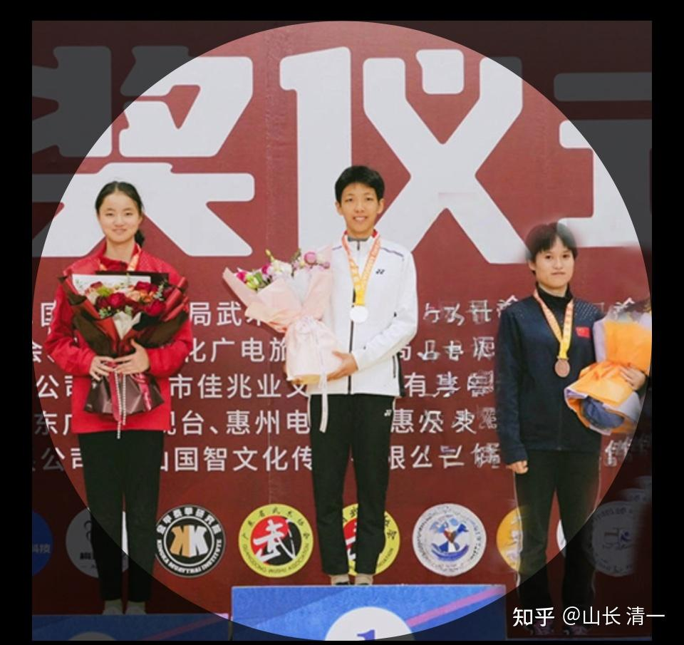

清一武道馆，去年一年就为中国贡献了15名全国格斗锦标赛冠军！拿到了20块金牌！听起来很牛----其实，这其中大多数学生。并不是练武的料，将来也不准备吃武术饭。练武，仅仅是这批学霸用来改变自己心理和个性缺陷的工具罢了。大多数人，还是需要去读大学，去做社会人的！

但我也希望能够培养出一批真正传承中华武道的人出来。**真心爱武，终身从事中华传统武道的学习和钻研，成为一个类似电影上人物叶问一样的【一代宗师】。**当然我知道电影是假的。因为真实的叶问，也不能一辈子专心练武。他也迫于生计，不能不去做很多谋生的事情。如果我能够找到一个小叶问，或者一批小叶问，我愿意用我的财富，来供养一批这种潜心钻研中华武术的武痴，让他们能够站在世界武术的顶峰，傲视群雄！

中国一定有一批从小就有武术梦的孩子，愿意终身练武的孩子。比如张伟丽，李景亮，张志磊。这些人去打比赛， 不完全是为了拿出场费，而是因为喜欢这种职业。我就希望找到11岁的张伟丽和李景亮，然后让她们来清迈上顶尖国际学校，同时练武。然后成为世界级的学霸和武霸！然后我捐助全部财富建立起来的清一教育基金会，将来给他发一份正常的工资，让他安心终身做中华武道研究员，一辈子都不用操心职业和生计的问题。然后专心研习武道，目标就是成为一代宗师----把中国很多的传武拳种，一个人就负责弄清一个拳种，成为这一拳种的代表人，掌门人，这样中华武术就不会失传了！

** 这就是【为往圣继绝学！】**

很多门派的拳，我看了都认为很有内涵和价值，就是后人都不懂如何使用了！任何有点名气的门派，其中的经典招式，只要真的练出来了，击败西方现代格斗根本就不是问题。问题是没有人来系统的掌握这些传武拳派的精髓，很多人，包括很多传武人，自己和子孙后代都忙着谋生找钱，因此没有人去潜心钻研这些中华武道，渐渐的就失传了！因此中华武术，就成为了一个玩套路的国际笑话，根本无法赢得世界武术界的尊重。国外戏称为“中国武术体操”。但只要我们培养出一批真掌握了中华传武的核心精髓，比如形意的五行拳，披挂的两拳，螳螂的钩挂，简单几招，练出来真的就足够击败世界格斗手，真的称霸世界武林了。可惜。。。一直没有人去真练。

比如咏春的“摊膀伏”：这一手功夫就特别的精妙，与太极和劈挂原理相通。用来打拳击，打泰拳都特别的好。但我看一直到现在，都没人真正的用出来，打法似乎已经失传了。电影上的「叶问」功夫，也只是表演罢了。真拿上去上擂台，打冠军，我看分分钟败下来的。这也让我替咏春人难过---电影上名气这么大，现实中却跟雷雷一样，被一个业余拳手就轻易击败，就是一个大笑话。但凡真学好了摊膀伏，区区晓东，那里是对手。所以，就需要有人用一生来万摊膀伏，用一个咏春经典招式，就打遍天下。只有这样做，才能真正的弘扬咏春。而不是靠砸钱制作电影，花钱请泰森来打假。假装咏春可以和世界顶尖拳手打-------我想，中国人要的是咏春去世界锦标赛上跟外国冠军打。这才是真功夫！

我就想招一批真有理想的人，家庭也支持的，11岁就来我这里学习。将来终身练武，习武，成为新时代的一代宗师！

这种人应该很少，可能一千个才有一个！但中国人人太多了，14亿人。每一年就有接近千万人出生。就算一千人只有一个，中国也能找到一万人有这种潜力的。因此，我只要找到一二十个这样的人，应该不是不可能！

目前的人，比如Ella小公主，我一直认为她不适合练武打冠军。身体上有缺陷，底子差，太文弱。个性上过于温柔贤惠。想要当世界冠军，其实按照我的观点来看，并不是最佳人选。不过她用练武来完善自己，倒是一条不错的道路。所以我也随她去了，想练就练！

很多目前冠军班的学生，都是ELLA这样的人，文人气质。这种人我帮忙拿个全国冠军问题不大。将来去当教师非常合格！但想要当未来的世界级的武林霸主，一代宗师，还嫌霸气不足。她们还弱了一点，文有余而武不足。他们最多，学成我现在这样，虽然连全国冠军也不是我对手。但-----还缺乏世界冠军的霸气！缺乏武林宗师的锐气。但我想要给世界留下中华武术代表人的话，就需要这种人出来担当。一辈子研习武术，只喜欢武术。这种人才会是中华武术的希望！现在这批学霸，几年后就去当文武双全的常春藤文人就行了！她们都不用终身习武，以武为正业！她们只需要把武术当做业余爱好就行了！做一个帮助孩子们成为一代宗师的人就行了！

所以，我自己想要的，是设法找到一批有武术天赋的小孩子，从小就学正宗的中国功夫。找一批“小小张伟丽”这样具有天生世界冠军气质的人，将来成为中华武术的代表人物。这种人如果11岁来我这里，我来供养和教育的话，将来肯定是文武都很强悍的人。张伟丽其实人很聪明的，就是小时候没有机会好好学文化课程，所以文上显得不足。如果张伟丽小时候就来今日，现在的她武术上会有更大的成就，文上也未必就不如ELLA。所以：我最想招收这种人来清迈训练10年，然后成为真正的太极派一代宗师！

如果你们身边有这种人的话--**-11岁的小小张伟丽，而不是11岁的ELLA小学霸。**心气单纯，高傲好强，就想当世界冠军，其他啥事都不想的话，可以推荐来上计划上是ELLA和谭木兰一起带班的【未来世界冠军班】。家里娇宠的孩子，只是想来蹭全奖学费的人，就免了。你不可能符合要求的，大多数清粉的孩子都不符合这个目标！

下面是ELLA公主在12月29日的演讲内容。她将负责组建新一届的【少年冠军班】。针对对象是家庭条件不符合国际学校招生标准的普通人家！有梦想，就有希望。愿意努力上进，就有人供养！家长不同担心经济压力！【八角笼中】只是一个电影。演员做不了啥事。但是ELLA是真正的武术跨界人士。她是做事的，不是作秀的！

欢迎大家好好看看下面的ella演讲，如果你真心认同她的理想，与她有一样的抱负，想要为国争光，您就可以为11岁的孩子报考“少年冠军班” 。我们会在今年五月份，推出2025年的新生（冠军班，突破班和少年班的招生和报名通告，任何人都可以报名。请关注我们五月份的公开信息，找到合适你的推荐人（我们会提供名单的）。

ELLA会为【少年冠军班】建立一个微信公众号！当这个号的关注人数超过1000人的时候，她就会在微信群上发布招聘和训练的要求，开始一一面试学生了。ELLA还会在今年8月--12月的中国格斗锦标赛的赛场上，见到这些想要跟随她练武的“小冠军”，如果面试合格，就会让他们组建小冠军班。但本班奉行【宁缺毋滥】的精神，如果缺乏真正理想人，就不会为了做事而做事。如果大家不是真心想要冠军，就不要来申请。玩投机取巧的事情。免得大家彼此都浪费时间！

不多说了：请大家看ELLA的演讲视频吧！

[!\[image\](images/img_001.jpg)

Ella公主的惠州现场演讲 https://www.zhihu.com/video/1882844595110511268](http://link.zhihu.com/?target=https%3A//www.zhihu.com/video/1882844595110511268)

