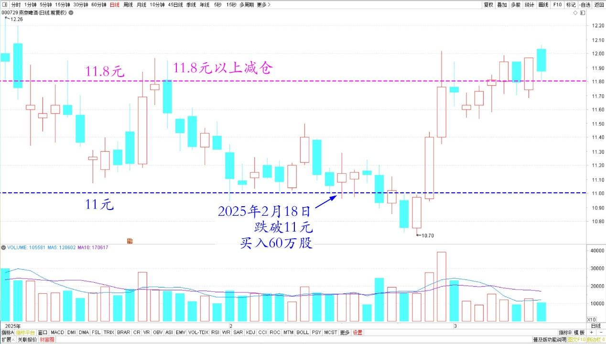
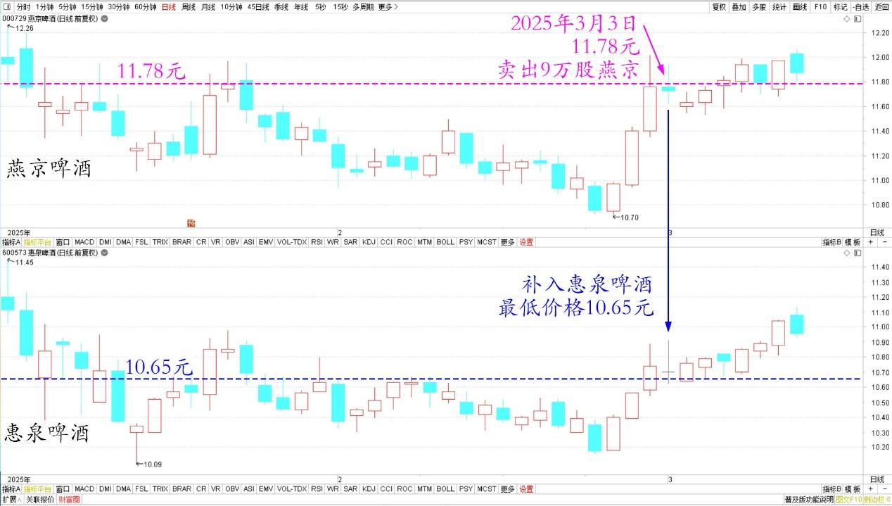

135篇.主升浪快来了，但我不贪心

清一山长 2025年3月3日

2月18日燕京跌破11元，我当日买入60万股。真没指望它涨，心想跌了就拿着算了，因为我在11.8元以上刚减的仓，别人不要我就买回来得了。这笔交易还在想法里面标注了。

燕京啤酒 2025年1月～3月 日线图

但没多久，居然又涨回来了？本来这样按道理是不该卖的，典型主力洗盘吗！不过，还是恪守诺言卖一点吧！毕竟我说了，给个块儿八毛的我就走（这批新买的），今天就11.78元卖了9万股，补入了惠泉啤酒。最低价格是10.65元补充进来的，每股1.13元的差价，我很满足。

燕京、惠泉 2025年1月～3月 日线图

查看我的燕京账户记录，持仓利润已经创历史新高（比14元多的时候更多了），目前持仓量相当于历史满仓位置（远远超过燕京14元时候的仓位，因为13元开始我就大幅减仓了），但持仓价才4.52元。远比上次满仓的时候，持仓价7元多更低。但这次的很多燕京股票，还是9元多买入的！因此我的调仓看样子是成功的！**啤酒继续涨的话，我会继续减仓燕京的。目前已经看好了别的股，正在买进中。**【**理论上，燕京的主升浪应该快来了。但我不贪心，会选择时机，把我的满仓减少一些的，起码目标是不要拿融资持有11元以上的燕京**】。

（标题、图片为编者所加）

**文章音频**：

[543篇.主升浪快来了，但我不贪心](http://link.zhihu.com/?target=https%3A//www.ximalaya.com/sound/821289798)

**参考链接：**
[125篇.卖出燕京、珠江，买入百威亚太](https://zhuanlan.zhihu.com/p/13640234438)
[126篇.卖出快涨的燕京，买入惠泉和百威](https://zhuanlan.zhihu.com/p/14007881655)
[127篇.差价1.7元，惠泉换珠江](https://zhuanlan.zhihu.com/p/15010761184)
[128篇.大多数散户都出局了！](https://zhuanlan.zhihu.com/p/19370680113)
[129篇.啤酒切换——买跌不买涨，卖涨不卖跌](https://zhuanlan.zhihu.com/p/20437542120)
[130篇.无意中发现原来证券系统还有这个功能](https://zhuanlan.zhihu.com/p/23675222317)
[131篇.跌破11元买燕京，差价两元换珠江](https://zhuanlan.zhihu.com/p/24939243244)
[132篇.盈亏数百万都是假的，啤酒切换才是真的](https://zhuanlan.zhihu.com/p/26380209616)
[133篇.燕京跌了又涨，我没买也没卖](https://zhuanlan.zhihu.com/p/27431147176)
[134篇.重仓华菱钢铁的原因](https://zhuanlan.zhihu.com/p/28286645670)

