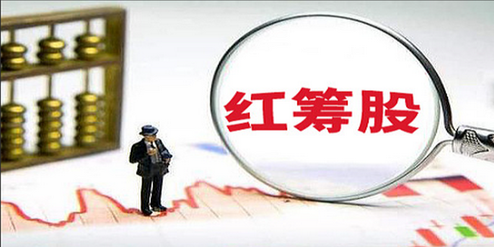
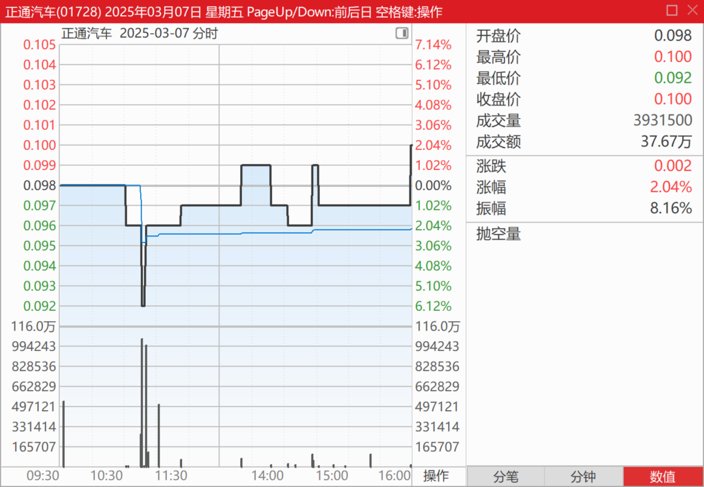
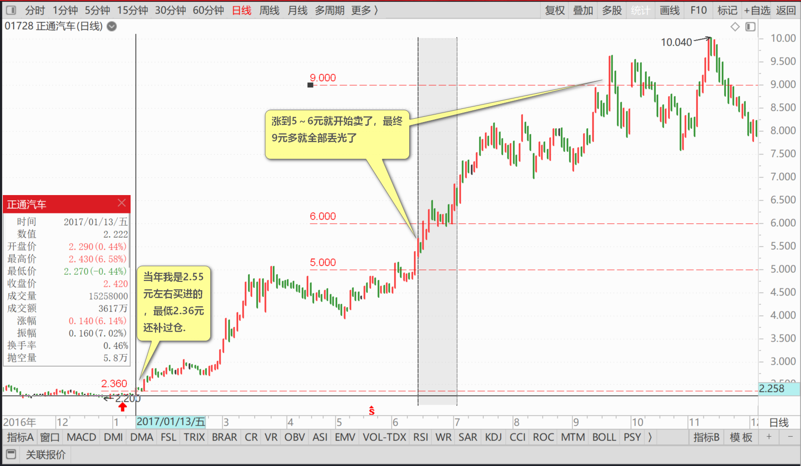
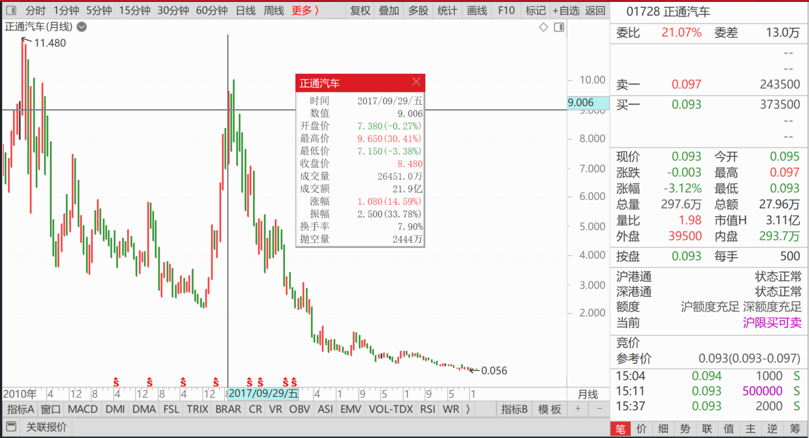
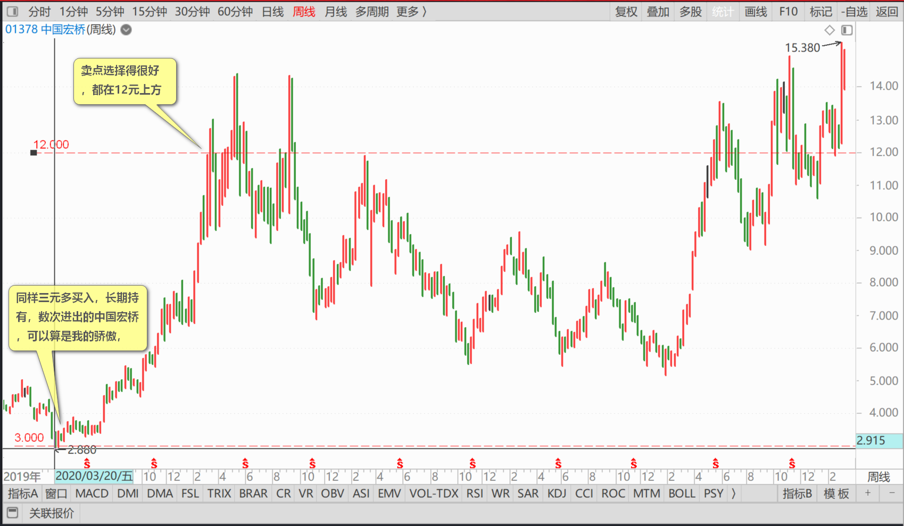

136篇.港股投资重点考虑国企红筹股

清一山长2025年3月10日

今天看到我持仓的一只港股涨幅挺大的，就卖了几十万股出去，另外买了一只同等性质，但没怎么涨的股。**我总喜欢这样换股玩。**虽然换掉了一些牛股，但总体持仓表现还是不错的。只要都是有基础的好企业，**先涨换后涨**，没啥不好的！没必要以为涨了还要涨，跌了也还要跌！

也因为我有这个“毛病”，居然也让我躲过了本来应该亏损99%，几乎投资要归零的股。今天正好看到正通汽车，我账面上躺着600多万人民币的利润（港股通），当年（2017年）赚了超过700万港币呢！今天去看看，居然才9分钱了

——我当年最高是9元多跑掉的。现在最富有幻想的大脑，都不敢想回到9元了吧？要涨100倍才回得去了！**居然这8年整整跌了99%。**当年我是2.55元左右买进的，最低2.36元还补过仓，买了大概两百万股。涨到5～6元就开始卖了，最终9元多就全部丢光了，留了500股在账上作为纪念。如果该股我一直看好，坚持持有到现在一直不放的话，就也只剩3%的本金了！幸亏跑了。不然今天成为亏损股的典范！

当年喜欢玩“探险游戏”，会买一些估值特别低的小股票，赌反转。就像正通汽车这种！有些也赌对了，赚了一些钱。也有些失败了，亏了一些钱。总体来说还是赚的！

现在人老了，我发现我的风险偏好已经完全改变了。我不再喜欢小股票，**只买大股了，我只关心这个企业会不会垮，**不太关心以后会不会涨。而且**我现在不买民营企业的股票了**。我发现民营企业老板的下限，真的太低了……虽然有很成功的投资案例，比如中国宏桥，是我赚了最多钱的港股。但很多民营企业毫无底线的行为，让我心惊。所以——**民营企业尽量远离。宁肯贵一点，买国企**——何况现在的国企港股并不贵，其实还超级便宜。因为港股投资者，嫌弃国营企业效率差。想买更有想象空间的题材股，这些股基本上都是民营企业在做。我承认国企效率差，但这种企业要垮也不容易，特别是全市场化情况下竞争行业起来的一些国企！起码有人会严格监管着这批管理人员，让他们不至于太过分！国资委的利益，与小股民的利益基本上是一致的，他们的诉求，也主要是“多分红”，涨不涨无所谓。这正好符合我的投资要求！

所以——**我认为中国的小股民买港股投资，可以重点考虑国企红筹股！**不像这些民企，不管科技还是啥的，玩概念的多，骗股民一套一套的。我们没这脑子去跟他们斗心眼，就买个“傻大黑粗”的国企拿分红！这才是可靠的投资！民企你等它完全成功了再投也才更保险（当然估值也不会太便宜了）。

**正通汽车，是我做的一笔“成功的错误投资”，永远是我的教训，而不是我的骄傲。**但同样三元多买入，长期持有，数次进出的中国宏桥，可以算是我的骄傲，优良投资的典范。最高曾经持仓五百多万股，惋惜是太早卖出了超过90%的持仓，但卖点选择得很好，都在12元上方，所以账面利润丰厚，分红也很好。现在账上只剩6位数的小小持仓了。如果我拿到现在的历史新高价格，赚的就更多了——但我不遗憾。卖了它，买的其他潜力也不错的股，也照样帮我赚钱！

**现在开启的中国时代，港股作为全球最低估值的市场，我相信2025年会有良好的表现！**

（标题、图片为编者所加）

**文章音频**：

[544篇. 港股投资重点考虑国企红筹股](http://link.zhihu.com/?target=https%3A//www.ximalaya.com/sound/822695265)

**参考链接：**
[130篇.无意中发现原来证券系统还有这个功能](https://zhuanlan.zhihu.com/p/23675222317)

[131篇.跌破11元买燕京，差价两元换珠江](https://zhuanlan.zhihu.com/p/24939243244)

[132篇.盈亏数百万都是假的，啤酒切换才是真的](https://zhuanlan.zhihu.com/p/26380209616)

[133篇.燕京跌了又涨，我没买也没卖](https://zhuanlan.zhihu.com/p/27431147176)

[134篇.重仓华菱钢铁的原因](https://zhuanlan.zhihu.com/p/28286645670)

[135篇.主升浪快来了，但我不贪心](https://zhuanlan.zhihu.com/p/30186294319)