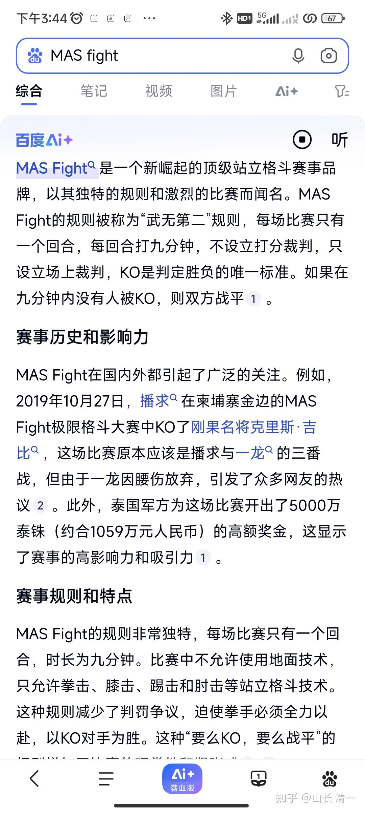
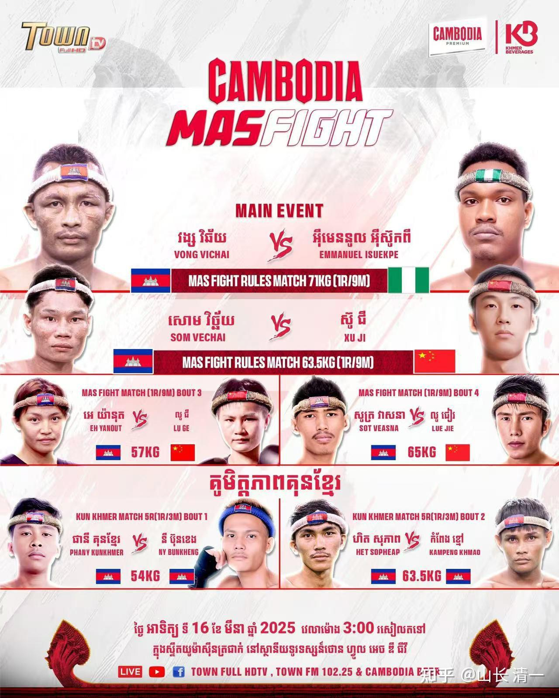
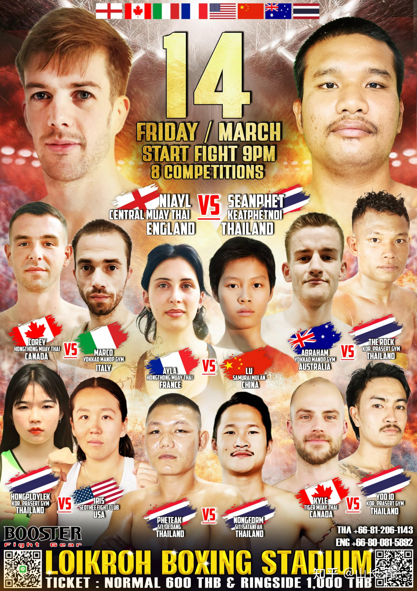

泰拳已经是站立格斗中最凶狠的拳种了。很多中国人，都因为泰拳过于血腥，而不愿意参加泰拳比赛。没想到：还有比泰拳更激烈的比赛。为了挑战极限，拳手们也是拼了！MAS就是最近几年新推出的更加极限的比赛项目！我想---下一次的中泰擂台对抗赛，我们是不是也搞成这种【MAS格斗模式】？也许大家更喜欢，当然拳手的压力就更大了！

MAS这种极限规则：只打一局，9分钟，可以踢打摔拿肘膝，只要是站立格斗技巧都可以使用，不设场下裁判，不打分。只要没有ko对手，双方就是平局！ko的奖金是出场费的5-10倍。值得一提的是：这个站立比赛还可以使用站立关节技，这不禁让我们想起来日本著名站立赛事Shoot boxing。

据说MAS是由昆仑决参与创投的极限搏击，吸引了包括播求，雅桑克莱，张伟丽，疯马等世界名将的参与。

这种格斗显然非常的残酷：可以使用任何站立格斗技术，包括踢打摔拿。而且不设裁判，不KO就判平局。中间不休息，连续打满九分钟（对比---泰拳的职业赛，女子比赛是五局，每局2分钟，共10分钟，中间休息一分钟）。由于该比赛设有高额的KO奖金（是出场费的5-10倍），必然吸引拳手拼命都想把对手干掉。比如播求和一龙当年给出的KO奖金就是一千万（5000万泰铢）。可惜一龙不敢上。应该是知道：就算上了肯定也拿不到这笔奖金，白白送给播求，所以弃赛了！两人真还不是一个级别的！

陆鸽，谭木兰和ELLA，目前已经出发去柬埔寨金边参与这个赛事了。陆鸽的对手，是柬埔寨的资深拳手，五年前就打过这个比赛。最近刚与IFMA的2024世界冠军（俄罗斯拳手）打过一场比赛，没有KO打满了五局比赛，相当于两人的实力差不多，按照MAS规则，就算是平局的结果！这拳手的扛揍能力一流，看着被击中了很多重拳，就是不倒。所以陆鸽要KO她的难度也很大。我让她不求结果，只求打出最好的自己就行了！这一回，裁判不介入。她可以尽情发挥自己的节奏，没必要考虑裁判的想法了！

因此，可以说陆鸽面对的对手级别，就是世界冠军一级的比赛！对手在陆鸽5年前还在当学霸考西语考试的时候，就已经是世界级的顶尖拳手了。陆鸽如果此战打得不错，应该可以借此记录，拿到今年打成都世界运动会的资格（由于上次与匡菲比赛，她被“潜规则”，失去2024全国泰拳冠军资格，只拿到亚军，有可能会失去2025参世界赛的机会。明晓就已经确定了有资格代表国家队去参赛）。所以---此战也是一个好消息---用世界顶尖职业赛来证明自己。如果上次没有打好，这一次她可以更努力地证明自己！

我看本期的赛事安排，中国队有三个拳手参加，看样子有点像是中柬对抗赛，国内的拳手很多人不愿意参加这个极限格斗赛。清一拳手愿意尝试任何规则的比赛。毕竟目标就是通过比赛去锻炼自己，不去计较啥出场费高低，以及危险不危险。

本次赛事，许骥也有去参赛，是他的正常体重级别。但陆鸽排到了57公斤级，就说明是按照她的对手来规定的级别。 她的真实体重，大概是53-54公斤，一般是参加54公斤级的比赛。我们参赛一般不寻求降重，但对手一定会大幅降重的。因此她的对手，日常体重肯定在60公斤以上！所以这场比赛也是小打大，够费劲的。但我们都习惯了打更重量的对手，上次佳慧KO的美国人，以及陆鸽在仑披尼打的对手，都比我方拳手大一圈。谁让我们吃素呢！我们吃点亏就认了。

由于MAS改变了规则，连续作战不休息。我方也是第一次参加这样的比赛。所以我建议陆鸽前三分钟，先不要猛攻，可以打舒缓一点，刚开始主要打陪形一样的防守反击，消耗对方的体力，少一点主动进攻！（有机会当然也要打进去）。等两三分钟之后，才开始猛烈的连续不断的攻击。因为人体有一个适应期，大致上就是2-3分钟左右就会出现极限。如果一开始就发力猛攻，后面就会脱力。体能会跟不上！但如果前面两三分钟适应过来了，后续力量就“源源不竭”的没问题，所以3分钟--5分钟是最关键的时间。有可能KO，决出胜负就在这段时间内！再往后，双方可能都适应过来了，以后的格斗很长时间都可以适应。所以最好谭木兰在赛前，要陪陆鸽做好热身，避免因为休息良好，但上场后身体不适应，开场就猛攻，会造成心肺不匹配，造成体力不够的假象！

场上 一旦开打，就要连续进攻。由于对手是老拳手，一般的单击格斗，水平再高，她都会很适应的！反击速度也会很快的。所以要求陆鸽必须连续攻击，可以在攻击一波比如十次连续攻击之后，累了就在场上休息一下，缓一缓气。也可以累了就抱住对手不放手，等缓过气再继续攻击。这样发动一波一波的攻击，对手会没脾气的。也会很快累惨掉。如果我方的拳肘膝都上的话，对手是不好反应的！

周日清一武道馆会尽量安排“转直播”，会使用B战的清一武道馆直播账号链接。群上也会提前发消息的！

今天晚上，陆韵如公主也有一场与法国人的比赛！现在泰国拳手都不愿意跟我们打了（被我们打怕了）。我们在清迈失去了很多的比赛机会。现在泰方主办方就只安排洋人来跟我们打了。上次是佳慧去打美国人，这次是陆公主要打法国人。我们真的开始打八国联军了[表情]。后天陆鸽又去柬埔寨打MAS极限格斗战。半个月后，谭木兰也去国外（中泰两国之外）打跨国比赛。现在的比赛频次减少了，但比赛的级别都提高了。对手基本上都是顶尖拳手。这也是好事，木兰们都在尽量把新教的招数用出来，看谁用得好了！