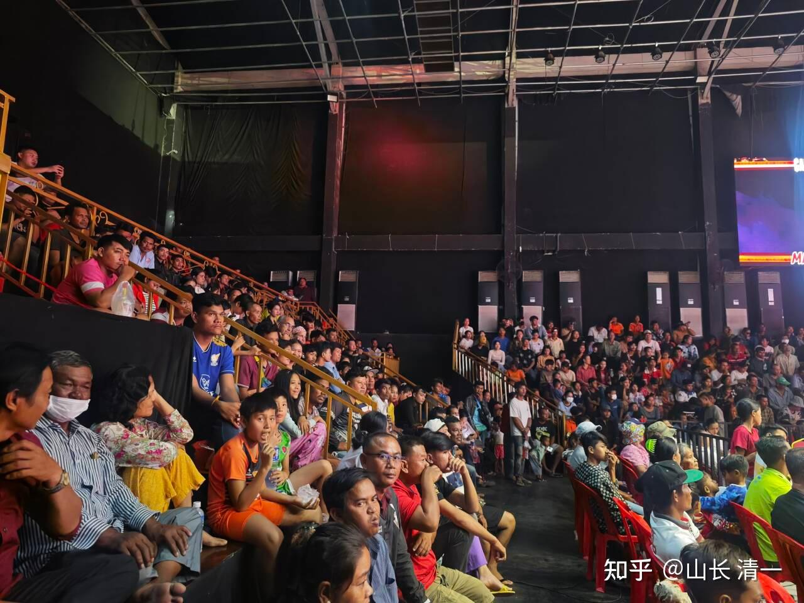
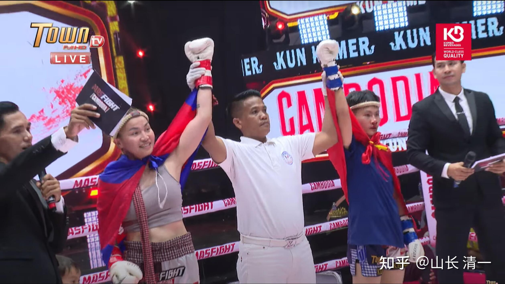
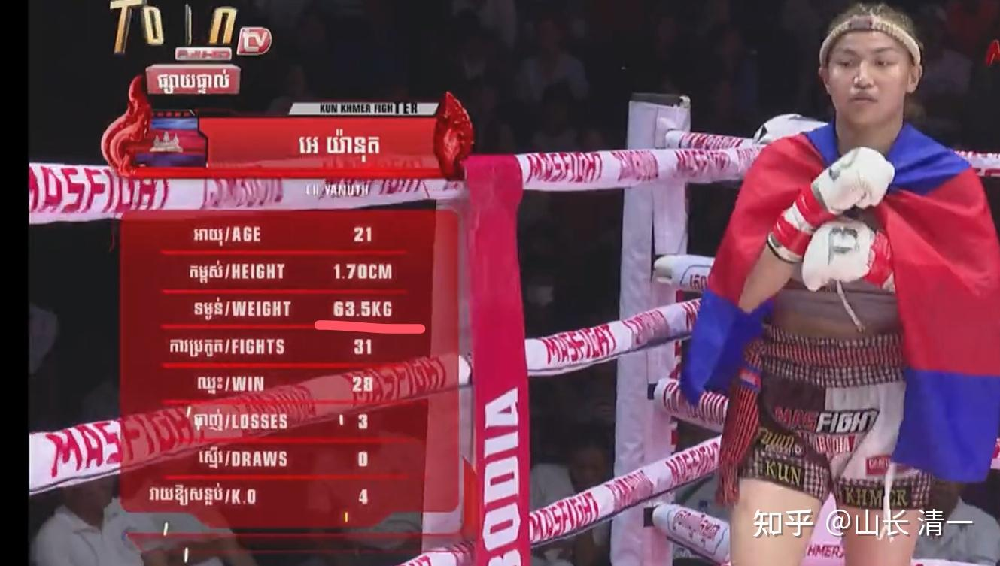

现场人气挺好的，似乎柬埔寨的拳风还很浓厚，民众的参与度挺高的！廊道上还有加座！

*打满9分钟，谁都KO不了谁，判平局！*

两场比赛都打完了。前三场MAS比赛都没有KO，均以平局收官。所以奖金池就从80万堆积到320万。据说是只要没有KO局，奖金就继续滚下去。后来打的拳手挺划算的---拿下了奖金就更多，不断加倍。这种比赛的确很残酷，双方都很强， 而且选手一定很拼，竭尽全力要KO对手。

今天两个孩子都打成了平局。场面上看，陆鸽的优势很明显，因为对手其实是63公斤的,比陆鸽重10公斤。身高体重都有优势，场上看，陆鸽就像个瘦弱的小女孩。我看大家都忍不住为她担心！对手还是资深老拳手。

*体重超过陆鸽10公斤的对手*

陆鸽能够和这种老资格的顶尖拳手打成这样结果，也算很不错了。这种老拳手，很善于防护自己，善于躲过重击。的确很难KO。她的护盾太厚实了！所以，最后的平局结果也就不错。对方的记录上显示她比赛的赢率很高！的确拳很重，腿也很猛，速度很快！

[https://www.zhihu.com/zvideo/1884687338292101973](https://www.zhihu.com/zvideo/1884687338292101973)

陆鸽赛后说：没有把老师教的拳用出来，感觉不好意思。我让她对自己要有信心， 今后就不用怕比自己重的人，知道就也不过如此而已。今后多重都一样打，特别将来练出来三拳一腿，更不用担心对手高低胖瘦，也不用担心男女，都一样打。这次虽然陆鸽的鼻子被打了一拳，但也踢退了她很多重量级的腿。总体来看，对手还是比较吃亏的。就是陆鸽的发力还是不够，可惜了 。如果她发力更好一些，对手中这么多腿。够她站不住的。估计和陆韵如公主的法国人对手一样，场上被打倒几次，赛后腹部明显有伤。老捂住。但凭意志坚持到结束，虽然法国人判负。但志气还在！