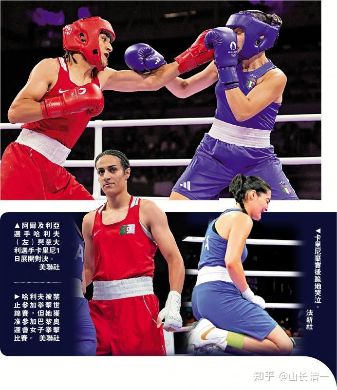

原来我计划中的，让中华武术赢得世界名声的方式，是让木兰去参加奥运会拳击比赛，夺取奥运金牌！一旦成功，就能获取世界的关注。特别是中国原来没有奥运女子金牌，如果拿到就创造了新纪录（2024中国女拳手首次夺金，该意义已经大减）。

要实现这个目标，目前最快的路径，就是要去争取参加2028奥运会。

要获得2028年奥运参赛资格，就必须2027年前，就提前通过奥运资格赛！

而奥运资格赛，亚洲只有四个拳手名额，因此我们必须要去参加2026年10月的亚运会！

而要获取参加亚运会拳击资格，就需要在中国的第15届全运会夺冠才行！

要参加全运会，至少今年，就要去获得省冠军！

可是---全运会今年就要开打了。我们还没有进行拳击手资格登记（奥运项目是举国体制，需要在中国的拳跆中心登记拳手资格）。

另外---我们忙于打泰，还没有正式训练拳击技术。这些都是问题！

因此：原计划是今年打完8月份的世界运动会和自由搏击全国锦标赛之后，我们就集中训练几个月拳击技术，年底或者明年年初，直接去北京，找到中国拳击国家队，要求比武，与中国的现任冠军拳手比武。如果赢了，就能代表中国去参加亚运会了！

上述计划有几个致命缺点：

一是一步也不能错过。万一不能按照这个程序走，夺取奥运金牌的计划就落空了！

二是：很多因素是我们不能控制的，官僚主义很可能不配合，让我们的计划失败！比如--- 不相信我们的技术，觉得很不正规，因此为了“保险”，就不给我们机会去打亚运会，奥运会！毕竟---这里面涉及很多利益分配问题，我们这些“外人”，不太可能轻易打进体制几十年形成的各种圈子中！

第三：这样我们特别包装，也只能包装几个拳手，不可能让这么多的公主拳手也都走向奥运赛场！无法形成批量震慑的优势！

有没有我们能够自由，独立地去比赛，不需要和官僚主义作斗争，就可以去赢得世界名声的机会呢？

**看起来好难！但机会总会有的！**

即使参加了奥运会，普通人也可能不会意识到这有啥稀奇的！因为除了专业格斗界人士外，其实普通人根本不理解我们技术的独特之处，外国人就更不理解的了----毕竟----世界**拳击冠军这么多，也不差我们几个木兰呀？**

所以：什么时候才是"中华传武爆发日"? 难道不是奥运会吗？

我一直认为：也许有一天。我们代表的中华传武，会像饺子的电影【哪吒】一样，看起来有个爆点就“横空出世”，突然就成为世界性的爆款现象了！我对冠军班的孩子们说：实现这一天，大概还需要五年吧。也许5年之后，代表中国文化，引起全世界关注的东西，就是我们的传武了！然后：因为传武，我们的教育就更让人有兴趣了！因为谁都想知道：这么厉害的木兰冠军，是怎样培养出来的！

可是：用怎样的方式，才能走出去，吸引全世界的目光？甚至比饺子现在只是让华人最热衷，但洋人其实看哪吒的不多呢？因为他们也不太能和中国文化共振！

要赢得人心，我们也必须有比打赢奥运会还更吸引人的方式才行！

像是现在这样，一批一批的培养拳手去参加全国锦标赛，固然可以获得国家体委的关注。但---要想赢得世界的关注，还遥遥无期呢！难道真的要等冠军班的同学10年之后，从常春藤毕业之后再慢慢推广出去吗？

没想到：机会今年就来了。

现在，我再也不用安排人去打奥运了，只需要专心现在的格斗训练就行了。

而且---就在**今年之内-----最迟明年，我们就能成为【哪吒2】一样的“爆款”了，会成为全世界的一个热点。**让全世界来关注中华文化，中华体育和格斗！

所以：不用再等四年。不用去参加奥运。今年，就是中华太极格斗爆发年！

而机会，就是这次陆鸽参加MAS格斗比赛，才突然给我发现的启示：**我们可以轻松地走一条超越奥运格斗的道路！**

我在MAS的介绍视频中，发现：MAS可以使用一切站立格斗技术。包括摔跤和站立擒拿。而且使用小拳套，杀伤力更大。最让我感兴趣的，就是这个比赛居然有“男女大战”?就像是为我们定制的专项比赛一样，完全不可思议！

这不正好是“文化爆款”的特征吗？而且容错性极高，效率也很好！我们完全可以非常从容地去参加比赛！假如2025年，一众木兰和公主，都在不断地击败各种级别的男拳手，这不比拿到奥运冠军，更让全世界惊叹吗？更会让人不得不去思考---这到底是什么因素，让一群女子（还不是一个），居然可以和职业男拳手打个有来有回？

我相信只要我们连续去打满一年，绝对就会全世界武术界，格斗界的“现象级代表”。绝对能够吸引大量的西方游客的关注和议论，如果拿了奥运冠军，未必会有这么多人关注和讨论的（其实应该没几个人记得奥运拳击冠军的名字」。但全世界一定会讨论男拳手输给一批中国女拳手的故事！

如果我们这一年，出来打 男拳手的女拳手越来越多，特别是明年公主班的拳手都出来了，批量呈现出来的女打男，而且是在国家级的权威格斗平台的机构验证下，这必将掀起格斗界的大讨论，大反思！我们就成为“现象级爆款产品”了！

这也必将在全世界范围内，展现出中华武术的魅力！木兰们就成为世界级的明星了！

*本届奥运性别大战《男人打女人，不公平）*

新闻报道：【8月1日，巴黎奥运会女子拳击赛场上，引起一场有关性别的激烈辩论。意大利女将卡里尼与曾因“性别测试失败”的阿尔及利亚拳手哈利夫对决，仅在46秒后投降退赛。**卡里尼倒地哭泣并称“为了保命只能弃权”**。意大利总理梅洛尼赛后指责赛事不公，奥运拳击赛掀起激烈的性别争议，美国共和党议员也趁机“抽水”，炒作性别议题为其大选拉票。

【大公报讯】8月1日，意大利女拳手卡里尼在奥运女子拳击66公斤级16强的比赛上，对阵阿尔及利亚选手哈利夫。双方只交换了几次拳头，全程只有46秒，卡里尼弃权退赛。卡里尼退赛后拒绝与哈利夫握手，离场前更在拳击台上失声痛哭。泪流满面的卡里尼赛后接受采访称，自己因鼻子严重受伤无法继续比赛】

能够参加奥运比赛的人，都是各大洲的冠军。比如这个意大利女拳手，就是欧洲拳击冠军！她居然被一个“变性男拳手”就打哭了。还得到了全世界的同情各关注！最终这个“男拳手”获取了女子拳击冠军！全世界都在议论不公平！

这就证明：**全世界都公认，女子是根本不可能与男拳手同台对战的。女生天生弱于男子！**

甚至特朗普在社交网站哈利夫与卡里尼的对战影片，**发文称“我会让男人无法参与女子运动。” **

彰显他的公平，对允许男人抢夺女人的机会表示不满。

连总统都关注到这件事情了！

如果：中华女子自愿参加男人的比赛！会不会也会吸引总统的关注呢？说不定-----我们的总统也会关注和接见这批敢于去男人世界中征战的中国奇女子---木兰公主呢！

所以：我想有机会去金边的时候，要与主办方谈好：我们将竭力支持他们的男女大赛。将来每周都会派出女拳手来参赛。正好也解决了现在木兰们在泰国难以找到愿意跟她们打的女拳手的困境！

大家也看到了：陆鸽的对手，居然比她重10公斤！因为同级别的女子，根本不愿意与我们的木兰接战！木兰还不如去打跟自己一样重的男拳手，其实打起来更轻松！ 因为我们懂得技术压制，男拳手也一样无法发挥优势！

[https://www.zhihu.com/zvideo/1884687338292101973](https://www.zhihu.com/zvideo/1884687338292101973)

这个视频的最后，有MAS赛事规则的介绍：其中17:20，显示了可以安排“男女大战”。

我昨晚见到这个信息，就马上给ELLA下了命令：让她去找主办方，表示我们有几个女拳手，都愿意来参加这个比赛！假装是被比赛奖金更高吸引的。

主办方很意外，当然也很高兴！他说的确有这个比赛安排。但是因为太难找到愿意跟男拳手打的女拳手了！所以想安排比赛也无法实现。如果我们愿意打男女对抗赛，当然太好了！还表示：为了提高观赏性，也为了安全，他们会特别安排“水平不太高”的男拳手来与木兰比赛、重量也限制，绝对不会超过木兰（不像上次陆鸽打的中泰比赛，泰国男子重量明显超过陆鸽！），这样才能双方打的很激烈！也符合赛事方的要求！

我暗笑：你们就算拿冠军来打，只要体重差不多，都是不太可能打赢我们木兰的。特别是MAS规则，不KO就算平局。我认为即使是最优秀的男拳手，要想轻松KO木兰的可能性也不大。当然，反过来木兰的杀伤力也不够强，想要KO男拳手也有一点困难，但不是做不到！如果我们的木兰能够击败，甚至KO了这些相对平庸的拳手，赛事方绝对会派越来越高级的拳手来打的，直到拿出自己的王牌---世界冠军级别的男拳手来打！所以，刚开始我们就当热身熟悉比赛，用比赛来训练自己。到了今年底，绝对每场比赛，对方就必须安排最顶尖的国际冠军级别的拳手来打比赛了！因为水货男拳手被我们KO。太丢男拳手的脸。因此肯定会吸引越来越强悍的男拳手来打比赛的。赛事方也会控制节奏，会根据我方拳手的水平、应对的情况，来安排对手打比赛！对我们来说也有循序渐进的好处！

但现在，我们没必要展示自己的能力，一定要打高级拳手。木兰们要想ko男拳手目前也比较困碍，但我相信一旦开打之后，木兰们这一年专门打男生，等适应过来后，恐怕男子同级别冠军，也不够她们打的！毕竟她们还在飞速进步！

如果以后每周都举行这样的男女比赛，就会吸引大批的全世界游客来看稀奇。一年后----全世界的新闻记着都会来采访的！我们也会要求主办方安排各国拳手来跟我们打（不能老是打老柬埔寨拳手，该国男拳手如果打不赢女子，肯定太丢人了。但我相信主办方，很快会把这个丢人的机会让给各国洋人来打的。我们打一个，服气一个。不就是世界扬名了吗?

MAS居然还举办过一打三的比赛。正好我们也打过---不错呀，可以玩玩。万一我们的木兰来玩一个一打三-----还打男职业拳手，我看全世界都要疯掉了！

** 关键是这种比赛，比去打世界锦标赛，以及奥运会更有话题可以讲。更有热点可以议论，只要持续下去，就有不断的能量加入进来关注。**我们还可以慢慢的来打，以战养战，逐步提高水平和战斗力！ 这样，孩子们可以边挣出差费，边出名。只是去打各种锦标赛，除了圈内的人，其实对社会的影响力并不大。打MAS比赛，在电视台的转播中进行，具有足够的公信力，一定能够引起世界级的关注！

**2025：必将是清一公主战队走向辉煌的元年！**