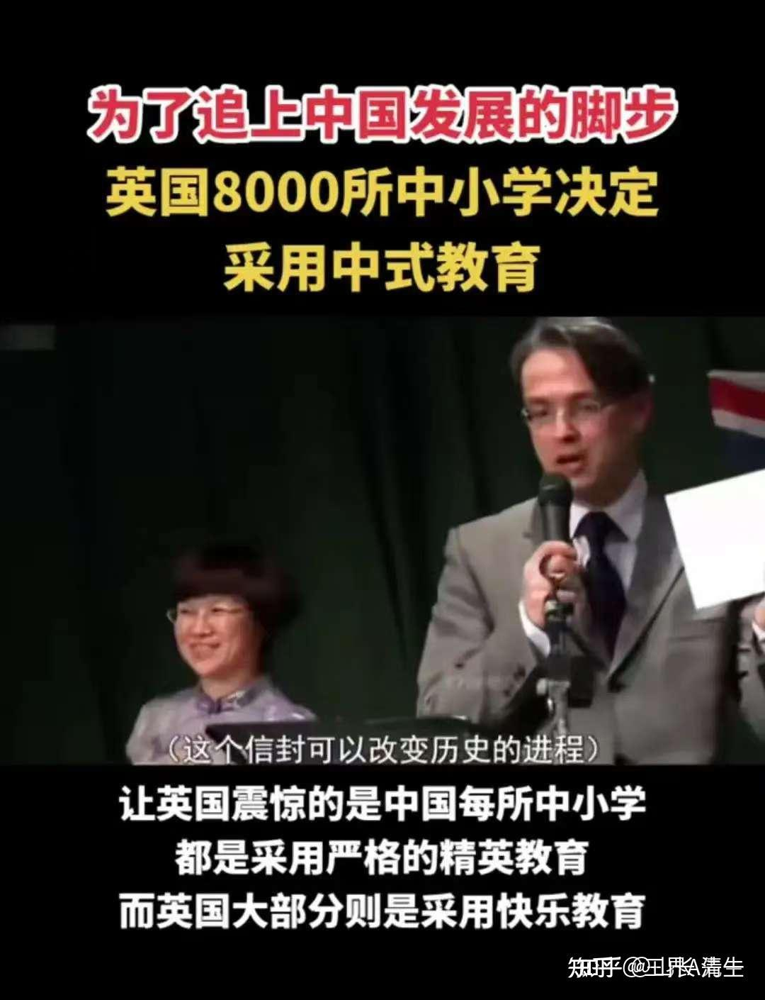
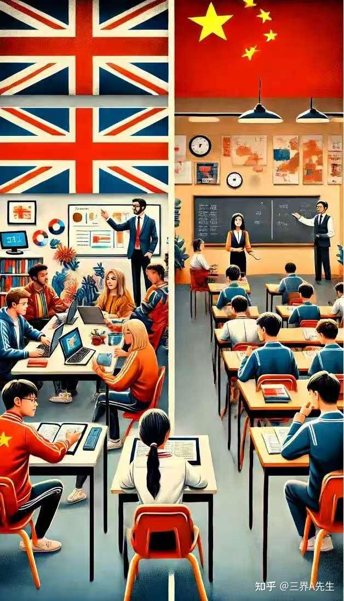

报道：英国教材与师资的"上海化"改造
计划核心是教材与教师体系的全面升级。柯林斯出版社引进36类上海数学教材，英国版《一课一练》删除插画与故事，仅保留密集习题。更颠覆性的是师资培训：每校选派两名教师接受特训，学习"确保全班同步"的教学法，140名先锋教师已完成改造。

英式（西方式）和中式教育的区别是啥？大概就是这张图的样子。中国要求乖乖听老师的话。英式是学生自行其是。老师就是个影子！

我看英国人现在真急了：中国大幅超前发展，英国人再混下去，已经不行了。得教自己的国民、也要学会打工了！只会躺赢。以后没机会了！我认为这很务实！

不过，真要学数学，而且在英国日薪200镑的英国教师还很缺乏。干嘛不让学生去学可汗学院呢？

另外---真想提高教学水平，干嘛不学【清一新教育】呢？我们三年就学完12年。50%的学生成绩可以达到1%优等生的程度。根本是任何体制教育赶不上的！干嘛不学？

喔---英国人还不知道有新教育。只知道有体制。。。另外。他们的思维还是体制思维，不知道互联网思维！

不过，十年后英国人肯定就知道了。等冠军班学生，一批一批的出去上大学，外国人就知道原来中国有比“上海模式”更好的基础教育模式了。

如果他们连上海模式都能接受，我相信“中西结合”的清一新教育，会更对胃口的。我们只是需要有一个“被看到”的机会！

【中国时代】可能真的开启了！