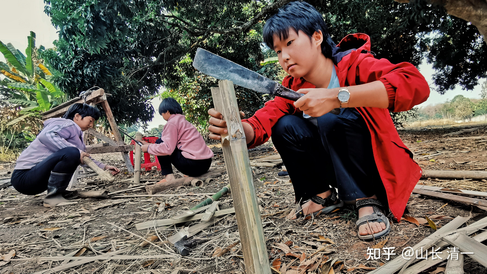
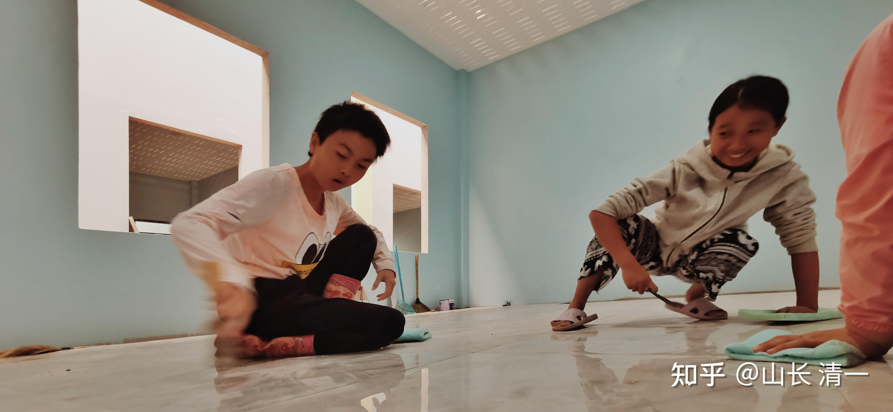
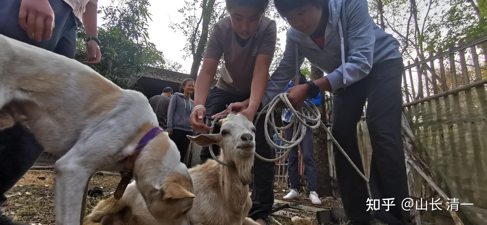

家长：【确实如山长所说，15、16岁直接扔到大学里或者社会上打工，完全没有监管的情况下，孩子基本都会把被压制下去的身体本能迅猛的爆发出来，打游戏、玩感情这些吃喝玩乐的行为就是必定躲不过去的。我店里已经遇到几个新教育退出来的学生了，都是说来学手艺的，但是来了以后身体、心理都不行，吃不了做学徒的苦，实在看不下去都给请走了。在这里真心跟给家长说一句，15、16岁的孩子，从普通人到精英的改造路线根本就没有完成，这个时候如果就放手不再看护，前期的所有努力必然是一场空啊。】

我回复：你就别把这种废材，说成是“新教育学生”了。这种人，不学无术，不思进取，贪图享乐，放到任何地方，都是个废物！只是家长正好把他们送到一些说是学新教育的学堂学了一段时间罢了。而且肯定没有好好学，否则15-16岁怎么可能到处晃悠？家长也不肯按照不好好学，就丢出去自生自灭的真正新教育理念来教训。这种人，这种家庭，怎么有资格称为“新教育学生？”。养出这种孩子，就是家长的愚蠢和标记！你们就别跟我们新教育扯上关系。今日三校， 一旦发现这种糊涂家长，不思进取的混子，都会第一时间开除的！

中国的社会和文化风气，就是好逸恶劳，崇尚吃喝玩乐。这种父母不学新教育理念，才会出现你说的情况！

**什么才是正宗的新教育学生？你们好好去看一下我们的标准是啥，你们再来说！**

** 新教育学业标准**：11岁进入新教育，就必须在15-16岁达到美国高中毕业优等生水平！

** 新教育15岁之后的教育标准：**

15岁考完美国高考后，SAT达到7%的优等生成绩后，进入冠军班训练武术格斗。 这种学生，今日三校90%能够实现这一目标！

16岁，考完GED，拿到美国高中文凭！

17岁，考完三语，拿到B2以上终身有效的资格证书！

18岁，拿到全国格斗锦标赛的前三名。

这三年期间，还要去完成半年的海底捞社会实践工作！然后18岁以后，去正式入读海外的名牌理工科大学，学习技术和专业知识。只有完成这样要求的人，才算符合要求的“新教育学生”。上述流程走下来，就算是学业不符合目标，达不到世界一流大学的水准，但要去读个好一点的亚洲大学还是毫无问题的。要去工作就业也是毫无问题的。起码去海底捞打工是能够适应的！这才是新教育的底线！不是上线！

只要不符合上面这个流程的，没有保住底线的，就是“自动放弃新教育的人”。属于“其他的情况”，这些人。本来就是不懂得新教育，不符合新教育要求的学生，你们还来谈啥新教育？号称是新教育的学生？新教育的废品还差不多！就别出来恶心人了！

下面几张照片。是公主班的学生在清迈干活的照片，各种活都要干。这些孩子都是三校选出来的优等生，学霸级别。来到泰国啥活都要干，还要去打泰拳，拿全国性的奖牌！这才是真正的新教育！你们送孩子去上了一点学，读了一点英文。就号称你们是新教育的学生？你们真有脸来碰瓷新教育！

如果家长真心支持新教育，能够让孩子在学堂坚持下去，一直坚持到18岁，完成以上任务的概率，就是90%成材率（今日三校的培养结果比率）。就算有剩下10%的学生部分项目不达标，成绩不好，基本上也是正常人一个！出去上大学，自食其力都没有问题。这就是目前今日三校的培养成功率！这才算新教育的学生！

但：家长和学生的思想根本就没有转变，刚来学堂学习没多久，就中途就因为孩子不思进取，或者混日子，家长还娇惯放纵，短期上了一段时间学就离开的学生。这种人，可以说去哪里都是废物。如果在新教育这种成功率都这么高的地地方，你们都学不好，这种人去哪里还有希望呢？只能等着变废了！

比如：这个月，公主塾突破班有两个女生，寒假回来开学就表示说要回家，不想继续上新教育了！这种人就是家里过春节，家长娇生惯养，弄成吃喝玩乐已经习惯了。现在偷懒，家长抽她两鞭子就马上改过来了。(现实中。第三个这样耍无赖的学生，家长回复说：不想好好学，就自己滚出去流浪，也不用回家了家长还是省学费。结果这小孩马上乖乖的学习，现在一点事情也没有）。相反：接走孩子的两位家长，都是“爱心无限，娇惯无限”的“殷夫人”。以为她们家养的是英雄无比的哪吒呢！但现在就退学回家？无论回家去，是去读体制，还是不读体制，她们肯定不会好好读的，三年后青春期绝对出幺蛾子的。基本是废掉的可能性最大！等这种孩子15岁还在外面晃，还不去好好上学的人，绝对是废物一个！但你们拿来说这种人就是“新教育的学生”。我真想呸你！

这种无知和愚蠢的家庭，给再好的机会，孩子也出不来的！比如下面这个泰国家长的案例。昨天晚上我看到这孩子在外面逗狗玩。我对女儿说： 这孩子其实很简单，换我看他混日子，就给他几耳光，赶出去流浪几天。回来肯定就乖乖的，好好去读书，去训练自己了。现在家长每天都好言好语的跟他讲道理，每天拿巧克力牛肉干给零钱给他随便吃，想提供最好的生活条件，他就会乖乖学习。这叫“与狐谋皮”，真是愚蠢的家长一个！我们虽然知道答案很简单，处理也很容易。但这家长太固执，太执着于自己的讲道理魅力，我们暗示提醒了几次，看他执迷不悟的样子，就随他去了。反正废了是他儿子，也不关我们的事情。我们就只能当笑话来看了---每天我们自己的孩子傻乎乎的训练，学习，排名。累得像狗。他家的孩子每天轻松愉快，快乐似神仙！但最终走向社会，生活和社会会来教育他的，会让他明白什么才是“真相”。这就是自己挖坑，自己跳进去躺着的蠢货家长！

[山长 清一：给孩子充分的爱与自由？我们也会！](https://zhuanlan.zhihu.com/p/31753535186)

但这样愚蠢的家长，中国太多了。指望孩子是圣人的家长，真的愚蠢至极！

比如这位花费千万把孩子培养成废物的家长：大学毕业从英国回来后---【儿子一躺就是两年，老蔡好几次都想冲到儿子家，拿着大棒子把他赶出门去。可是面对一米八五的儿子，身高不足一米七的老蔡发现自己的确老了，根本没有动用暴力的底气。在长沙读国际学校，去英国读本科，老蔡粗粗算了一笔账，**对儿子的教育支出竟有一千多万。**毫无工作意愿的儿子，让已年过五十的老蔡感到疲惫：前半生算是白奋斗了】。

[拒绝孩子回国躺平, 一批中产父母送娃当厂妹、外卖员…](http://link.zhihu.com/?target=https%3A//mp.weixin.qq.com/s%3F__biz%3DMjM5MTE5MTU0Nw%3D%3D%26mid%3D2652150500%26idx%3D1%26sn%3Dd6f9f801adbcd4e5145191fe3b5a8534%26chksm%3Dbcb56d0e36df4f622be3816220eb51dcab486fd0ae4f137535b1eb4f161dc2a677b80f51fc85%26mpshare%3D1%26scene%3D23%26srcid%3D0322uqFLCRb9T9oEHLFWlLOU%26sharer_shareinfo%3Daaa352677fc76c1997c0e9130488c15e%26sharer_shareinfo_first%3Daaa352677fc76c1997c0e9130488c15e%23rd)

上面这个千万鸡娃的家长，真应该反思的应该是：自己怎么会花大钱去培养出这种白眼狼来的？为啥不动脑子，不见棺材不落泪？现在见了棺材，孩子已经废掉了，还不反省自己的错误？还要怪社会？难道去怪国际学校？怪英国？干嘛不怪自己从小就没教孩子基本的责任和荣誉？不让孩子懂得基本的因果？ 这不是家长基本生活常识和教育理念的缺乏吗？

其他现在他也不是没有办法：就是把孩子赶出去自生自灭就行了！有可能孩子还会慢慢振作起来。这样他无限爱心养下去，这孩子只有越来越废的！等他死的时候会更绝望！但这家长有这觉悟吗？

【一位爱尔兰裔的学习搭子告诉她：“作为加拿大本地人，我找一份工作很容易，去超市当理货员或者是收银员都不难。但是想拿到传媒专业的实习，也就是我们眼中的好工作，却是一件非常艰难的事。但如果我不努力找份好工作，直接躺平，就是对父母交学费的侮辱。这是一笔不小的开支，每一分钱都是我妈妈开校车一趟一趟安全把孩子们送回家赚来的。”

看到没：中国的孩子，似乎就没有这个常识和良心！中国孩子似乎就认为爹妈的辛苦是应该的。爹妈的钱是从天上飘下来的！。。。。。。

另外---各位注意没----这些千万留学躺平的家庭，他们孩子学的都是文科[表情]。。。还敢去上大学读文科吗？ 真的是智商税，你直接读废掉！所有的英式，美式的国际学校，我看全都是智商税！