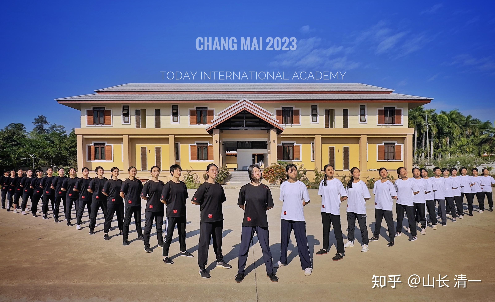
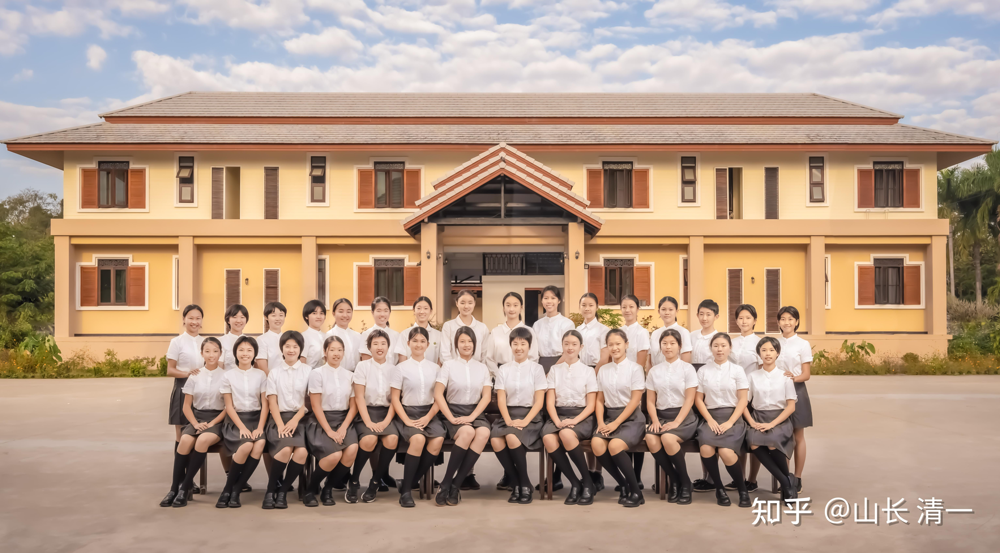
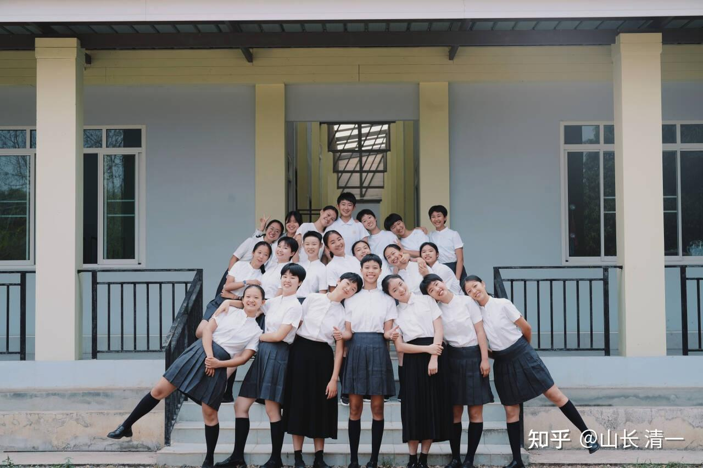

下周末，我就开启本年度新开发的【家长新教育基本理念培训】了。今年如果无法通过这个教育理念考核的家庭，是没有资格申请奖学金的！孩子即使考上了冠军班，家长理念没通过，也只能付费入读，就不能享受还含生活费的全奖入读了。如果孩子的成绩再差一些，连付费入读的资格都没有了！因此---想要奖学金，起码也得证明你是懂行的人！值得我们花钱来支持你。而不是把资源拿给完全不值得付出的愚蠢家庭了！

当然，不是你一定要参加培训才会通过考试，我们又不是收保护费的。如果你聪明能干，善于学习和思考，不来参加培训也照样通过考试，我还认为你高明。事实上，去年就有很多家长已经通过了这个裤衩考试，也不难，就是基本常识。但有人就是笨一些，基本常识就是不知道。怎么考也都通不过考试。没有人指导就是考不过去！所以----就只能来参加培训了！

另外----从今年开始，11岁的普通突破班，也有全奖机会了。。。前提----**家长当然必须教育理念考核通过且必须是优良水平。**给一些根本不懂行，不尊重我们的人全额资助，我看就是肉包子打狗！好东西就是全白给的！公主班这么好的班级，我花了20多年才整出来的一个班，就有人给了也不要。一查今年两个要离开的女孩的家长，就是公主班的家长教育理念考察的最后两名----全都不及格！你说----我大好的礼物，送大礼给这种不识货的人，有啥意思呢。

以下是该培训班的首日培训课的课前作业。

请阅读下面这个【百万啃老】链接中的内容，文中花费千万送孩子去国际学校，去英国留学的家长，肯定是你们不想重复的道路。但你如果意识不到自己日常行为中体现出来的“真实身份”，恐怕将来这个故事中的主角就是你！如果你不想成为这样的家长，那么：请认真回答以下问题，看你能否避免这种命运！

[拒绝孩子回国躺平, 一批中产父母送娃当厂妹、外卖员…](http://link.zhihu.com/?target=https%3A//mp.weixin.qq.com/s%3F__biz%3DMjM5MTE5MTU0Nw%3D%3D%26mid%3D2652150500%26idx%3D1%26sn%3Dd6f9f801adbcd4e5145191fe3b5a8534%26chksm%3Dbcb56d0e36df4f622be3816220eb51dcab486fd0ae4f137535b1eb4f161dc2a677b80f51fc85%26mpshare%3D1%26scene%3D23%26srcid%3D0322uqFLCRb9T9oEHLFWlLOU%26sharer_shareinfo%3Daaa352677fc76c1997c0e9130488c15e%26sharer_shareinfo_first%3Daaa352677fc76c1997c0e9130488c15e%23rd)

一：你认为这个留学英国大学，毕业回家，不出门玩游戏，在家啃老的孩子，不谈恋爱不工作不学习不做事。就是每天混日子？他什么样的心理问题和行为障碍？请你站在孩子的立场上，去理解他的内心是怎么想的？他为何会这样毫无自尊的在家混日子？

二：你认为，这个孩子7岁之前的教育，家长有哪些不当之处，现在你是否也有类似的问题？可能会在将来造成后续的“千万啃老”故事？为了避免出现这种情况，你在孩子七岁之前，应该怎样去教育孩子防止这种情况的出现？请说出具体的教育实施方案！

三：如果孩子七岁之前，没有得到你认为合适的教育。那么7-10岁如何补救？你应该做什么类型的教育，来弥补这个孩子缺失的信念教育？你最应该严防死守，不让孩子做什么？你最应该严格要求，让孩子必须做什么？

四：孩子11岁的时候，你应该怎样做什么？才能让孩子考上今日塾突破班？考上之后，作为家长你应该做什么，才让他不至于离开？

五：孩子12岁的时候，如果没有考上挑战班，你认为是什么原因？如果孩子学习成绩垫底，你认为导致成绩不佳的主要问题最有可能是什么？你应该怎样做才能解决问题？

六：你怎样才能让孩子15岁顺利考上冠军班？你需要做一些什么，才能实现这个目标？

七：如果孩子成绩达标，可以读冠军班。但表示他不想去练武，只想好好学习理工科，你该如何处理？

八：如果孩子的成绩不达标，考不上冠军班。你该怎样安排孩子的后路？防止他走上上面这个【千万留学啃老】的道路？

九：如果孩子到了18岁，该去好好上大学的时候，孩子告诉你一堆的理由，表示自己有自己的理想和爱好，不想读乏味的理工科。而是想去读商科，或者文艺啥的专业。你该怎么去处理？请拿出你的处理方式！

十：15岁以上，就是青春期。你认为怎样才能顺利度过青春期？请拿出你认为最有效的办法，并说明如何实施的前提条件和完成的过程！

十一：假如你是这个家长，你的孩子出国留学回来后，躺平不出去了。你该怎么办？请拿出你有效处理的方案来！【如果不是可以实施的有效想法，只是你的一厢情愿，直接判零分】

以上题目，均实行打分制。有效，落地，可行，每题就能得到10分。如果回答的方向有效，但实施的手法有问题，就是5分。如果拿出来的方案无法落地，属于家长一厢情愿的幻想，就是零分。首日实行学员排名，将在首日课程结束后，我的五位助教，给所有来参与本次培训的学员打分，排名，并公示成绩！既然玩培训，我们来真的，不玩假的！大家都别虚伪，拿出真本事来好好答题！

看了这份答题，你应该知道：这一次的培训。最少价值千万------如果上述的【千万留学啃老】的家长，提前来我这里培训，不仅仅千万投资可以避免损失。还可以收获一个健康，乐观，积极上进的孩子。这样算账，一进一出，你们说家长的价值是多少?

当然，如果各位觉得我的指导就没啥意义，我说的这些你都全都懂了，你当然就不用来参加我的培训了。就怕你自以为是，自欺欺人。将来要用巨额的金钱，和孩子的一生，来为你今天的狂妄和自负买单！

2023年年中，公主班拍了一些集体照！一年半以后的昨天，公主班又拍了一张新的集体照，你们看到已经有很多人消失了！消失的学生，她们的家长考评都是不及格的。就是说：家长根本就看不懂新教育的价值。他们的孩子，我提供全额供养，但这些孩子，还是拿不到我白送的礼物。即使是贵重无比的“国礼”就在眼前，他们都不要。她们只想去大千世界中闯荡江湖，觉得这样很快乐！

当然，她们也拿走了我这几年送出去给公主班的宝贵礼物---自立自强！这些离开的孩子，每一个人都挺自强的，都很有自己的想法，没有谁有躺平的迹象，只有无畏和勇敢的探寻和追求自己的人生，她们在创造自己的人生。虽然我认为会很苦，但她们不会输给普通人的！

这就是留在坚持留在新教育，至少到17岁以后的好处！未来所有的新教育的孩子，都必须离开我们这里，去闯天下。只有最后这张照片的少量孩子，允许留下来做“平台留守少女”！我以为是给她们的机会，但显然有些人认为是限制---她们更喜欢去迎接广阔的世界！

也希望你的孩子，拥有这份征服世界的勇气和决心，以及能力！

*2023年年中公主班合影*

*昨天：2025年3月22日的班级合影 *