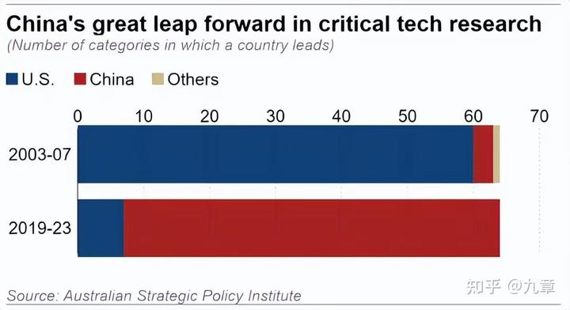

1989年之前，作为美国最大的敌人，苏联与美国正在进行全方位的竞争，这种竞争，让美国无论是科技，教育，文化，科技上，都取得了不可思议的进步，成为世界当之无愧的霸主！记得50年代。苏联卫星率先上天，美国大力反省自己的问题，大力整顿教育体系，强化数学和科学的教育，培养了大批的工程师。这也成就了90年代以前【美国制造世界第一】的辉煌。

1989年，苏联国力无法和美国匹配，在超级大国争霸赛中垮掉了。但美国拥有的巨大发展惯性并没有消失，反而越来越强。比如苏联垮台20多年后，美国与当时的中国比较---中国完全就是不值一提！

世界上有64项关键技术，每一个都是举足轻重的存在，甚至可以决定一个国家的未来发展，中国和美国在这些技术的第一争夺上也是持续了多年之久。2003年，美国关键技术在世界占比94％，中国仅5％。在2003年到2007年的这五年时间里，美国可以说是实现了断层式的领先，**一共64项技术，美国有60项都成功取得了世界第一的成就。**

美国人在顺利击败中国，骄傲自满之下，以为自己的科技优势是不可能被超越的。因此国策和教育方向都开始改变。学校开始摆烂，教育内容越来越差劲。美国人也普遍不去读理工科了，大多数人去读金融。傻子（NERD)才去度理工科，当学霸！最近20年，哈弗耶鲁等名校的毕业生，70%都是去投行，华尔街。因为这里的收入最高。美国制造业空心化。企业把低附加值，赚钱辛苦的工作。都交给海外的穷国去做。华尔街只做投资，控制这些企业赚大钱就行了。

在教育上，美国的教学水平滑坡令人吃惊：达里奥得到的下面的数据，居然是这个！

60%危机 一个解释一切的震惊统计数据：**60%的美国人阅读水平低于六年级水平。** 在3亿3千多万人口中，只有300万人（1%人口）在推动所有的技术创新。**这种教育差距正在造成前所未有的贫富分化。**

[访谈：美国的教育品质和国力](http://link.zhihu.com/?target=https%3A//x.com/Yangyixxxx/status/1894734300664434697)

从我们的学生参加美国高考SAT就能看出：美国每年18岁的学生中，大约只有不到一半人才能高中毕业，才会去参加SAT考试。其中去参加考试的人，结果就是还有一半人达不到平均分---大概相当于百分制度的50分！基本上相当于白痴----因为就算是我们的学生认真学了两年去考试，起码都可以超过这个平均分。我们90%的学生，可以得到相当于SAT全体考生7%的优胜成绩。如果算上全体人口----我们90%的学生可以达到美国总人口顶尖2%的学业优秀程度。其实----这些只是中国的普通学生罢了！有很多的中国学霸，要比我们的这些学生努力用功得多！这些人，就是中国优秀的工程师队伍的主体成员！

美国的骄傲自满，以及教育的落后，带来的国家整体落后的后果，结论是惊人的！

2024年8月，国外某智库对中美竞争力进行了一个对比，发现：仅仅20年后，2023年呈现出来的结果，就完全反转过来了！（2025，肯定差距更大了）
说明中国面对强大的对手，一直危机重重，一直在奋发图强。20年时间，我们达成了中美翻转的局面！

**中国在57项技术上获得了世界第一，而美国仅仅只在7个领域获得了第一**，这一结果令不少人都感到了惊讶无比。

这不是亲华媒体的吹捧，而是一家知名“反华智库”——澳大利亚战略政策研究所的结论：就对此进行了统计，早在2003年到2007年的这五年时间中，**美国在世界的占比达到了94％，而中国却仅仅只占到了5％。**

**这种对比，说明了一个国家可以在20年时候就衰落到如此不堪的地步，令人震惊！很多国人一直认为美国才是最先进的国家，要送孩子去美国留学！对现在这个结论，恐怕是最难以置信的！20年，就是一代人的时间！**

**中国目前正在强化工程师红利。中国的知名大学，正在减少文科大学专业的招生人数，而扩大理工科专业的学生人数。新成立的几家私立大学，无一不是理工科大学。这说明中国人把握到了国家竞争的重点：制造业才是一个国家强大的基础！**

**特朗普已经意识到了美国原来抓金融业，服务业，文化的虚胖。导致现在美国积重难返，连军事工业都被中国远远拉下来了。因此急于让制造业回流美国，甚至特朗普们不惜代价都要逼迫企业回流美国。就是看到了这种国家级的危机！**

**但是：他看到了危机，找到了方法，但长期享受惯了的美国人，能够像中国的996工人们一样去“卷工作”吗？我相信美国人不会干的。**

**因此，再过20年，不知道美国金融崩溃后，还会剩下什么东西！我怀疑美国到时候还会不会存在都难说！经济崩溃，会带来国家的分裂。**

**也许----绝望的美国还会冒死和中国一战，试图用战争来凝聚美国。但这样只会令美国更加快速的崩溃！**

**对于我们这些小民来说：当然就应该奉行---学好数理化，走遍天下都不怕了！新教育家长必须深刻牢记这一点----上大学，千万不要学文科！（清一大学每年只招几十个文科学生，去打世界冠军。这个由于人数很少，不影响国家的科技发展）**