116篇.**[庄股走势分析：一天成交194亿的小股票！](https://zhuanlan.zhihu.com/p/912328879)**

清一山长 2024年10月10日

今天突然发现：天风证券开盘一分钟成交了53个亿，全天成交194个亿，什么概念？开盘一分钟的53个亿是全天成交194个亿的27%了！

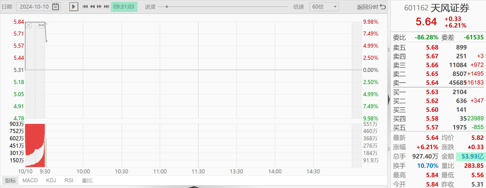

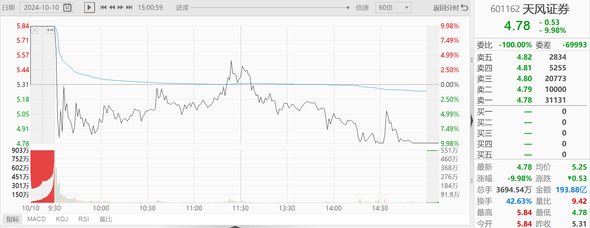

问题是：九月初，这个股票的总市值，也不过就200亿。而且——这是一个亏损股。长期无分红，多年前就算分红，也就区区几分钱！这家企业也没啥了不起的技术和护城河，就是一个苦苦过日子的地方券商。在现在市场上，几乎没有发展的空间！

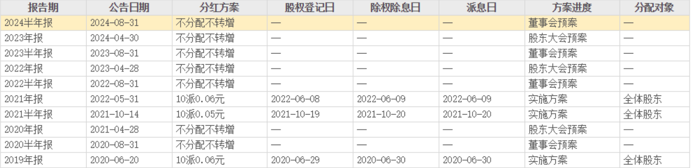

可是，这样的股，一天的成交居然就是差不多两百亿。开盘一分钟的成交，就是中国建筑这样的大盘股今天冲涨停的全日成交价。

数了一下：算上今天，这个股已经连续涨了8个涨停版。

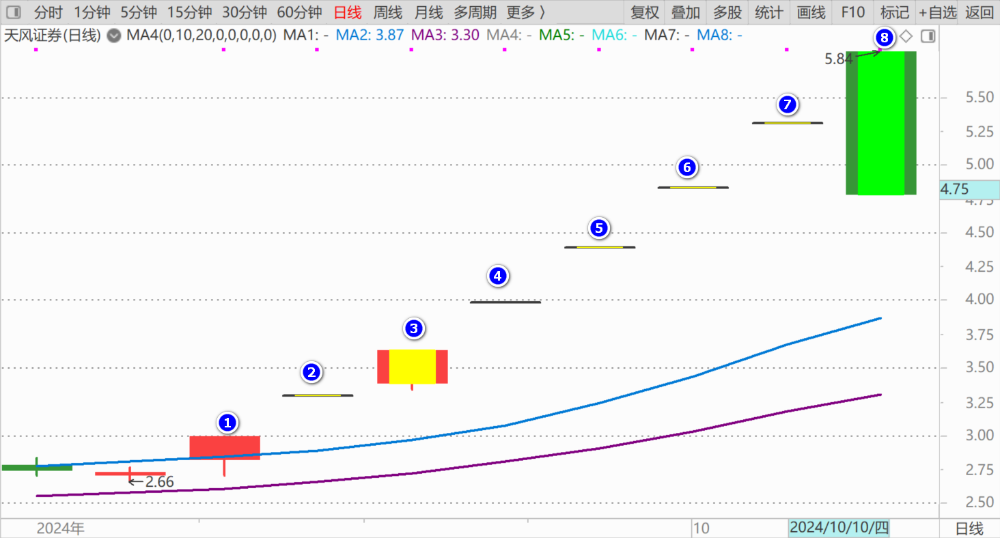

今天破板——“天地板”！我判断——这是一个典型的杀猪盘。大量的散户被套了，估计以后别指望解套了！已经顺利套现的主力，很久都不会再来做盘了。只会跟随大市，做一点反弹，继续出掉手头已经是负成本的股票，主力应该大赚了上百亿。今天拉盘，也可能会进一点货了（因为今天买入拉盘的票是不能卖的），但目测拉盘的资金使用不多的！

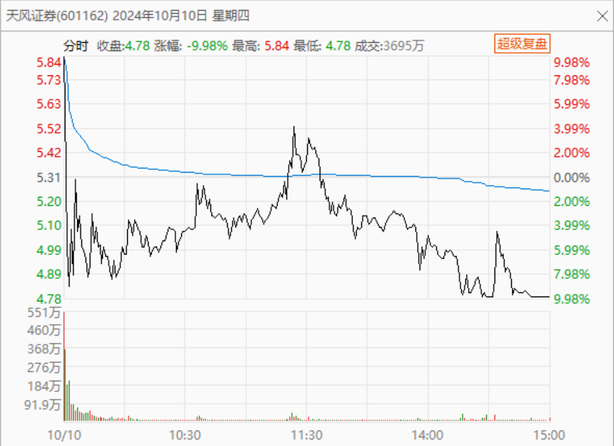

**观察操盘手法，以及走势：这个股的庄家颇为老辣——应该是一年前就动手收集了！**是2023年6月份的平台收集整理的第一批筹码，成本大约在3元左右。

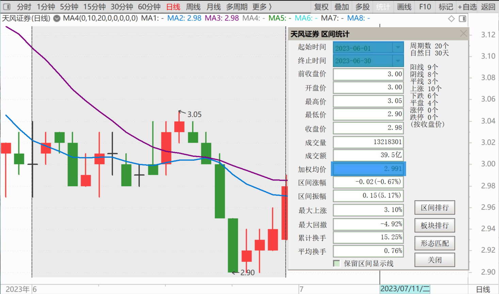

7月份上涨，拉了一块钱！然后就一路缓慢下跌，跌了一年，跌到今年5月份，把一块钱（30%）的涨幅全跌没了。

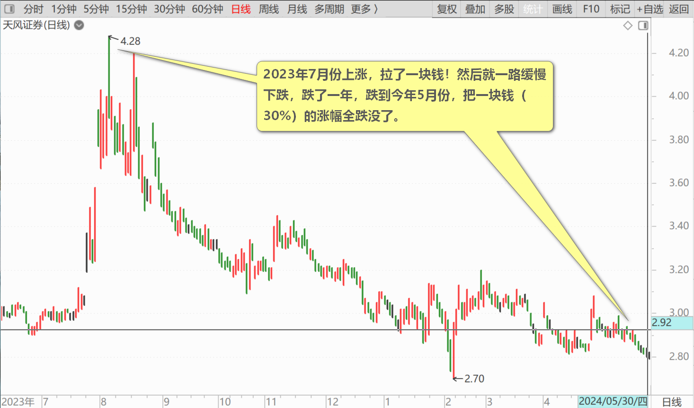

6月份突然破位下跌，制造恐慌，跌破了一年前的最低价，跌到了2元区间。原来3元底部抄底买入的股民，账面损失50%左右。

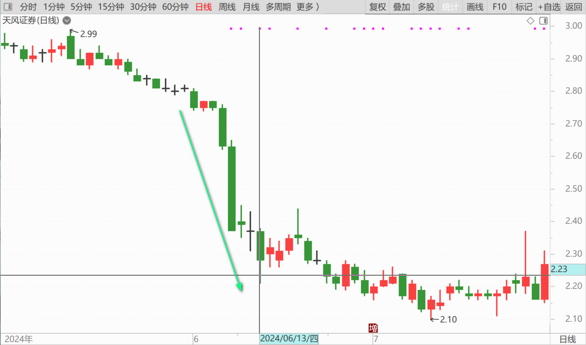

这个状态，一直持续到8月份。8月份走高了一轮又跌下来，成交有所放大。

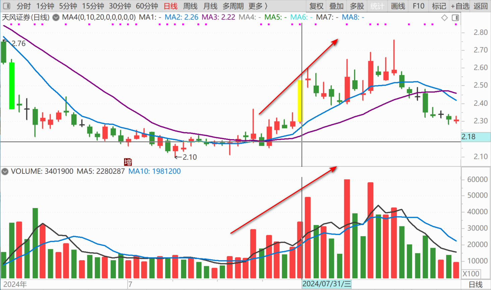

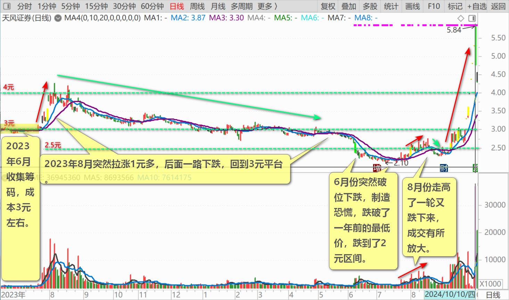

9月6日，周五突然涨停。整个周末时间都在扩散涨停消息，吸引跟风盘。周一开盘继续涨停，兑现利好消息，让散户坚定买入的信心！之后三天，略有回调。

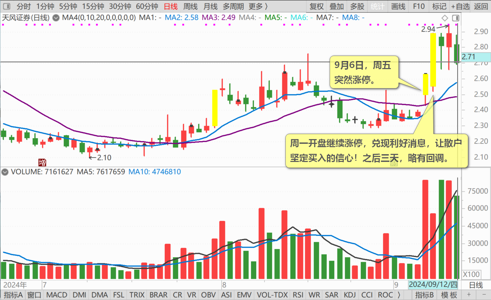

9月13日再度涨停，但之后五天一直在跌，把涨停的涨幅全部吃掉了。估计持股的散户心都凉了，认为上当了。

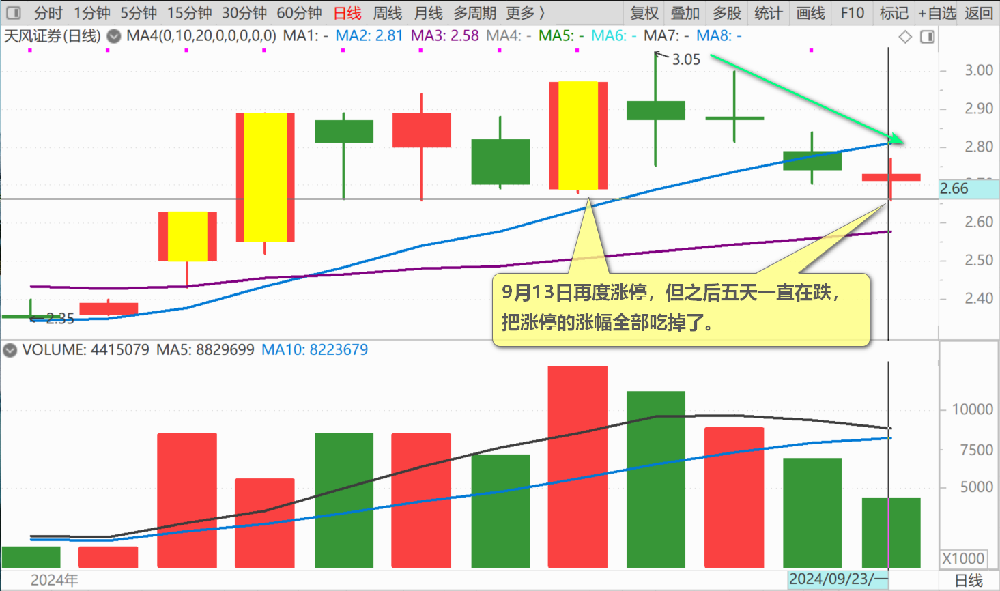

但9月24日，股票开始上涨，差不多收复上次跌掉的涨停。这一天，大量散户卖出，成交20亿！股价到达了3元整数（庄家一年前收货的成本价格）。

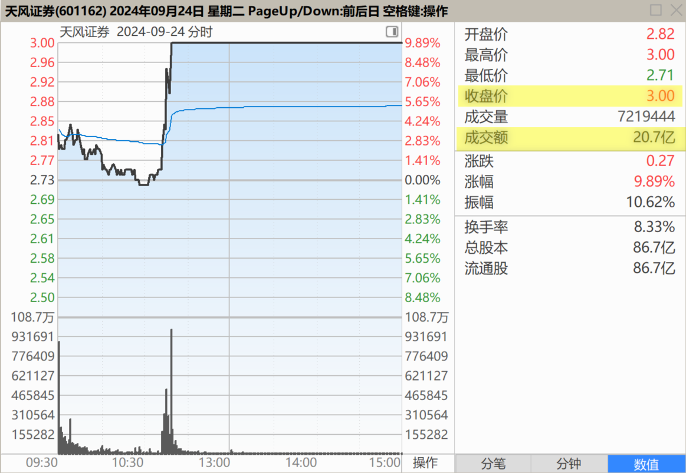

但有些散户肯定没赚钱不走的，所以第二天开盘涨停，但没有啥成交量！

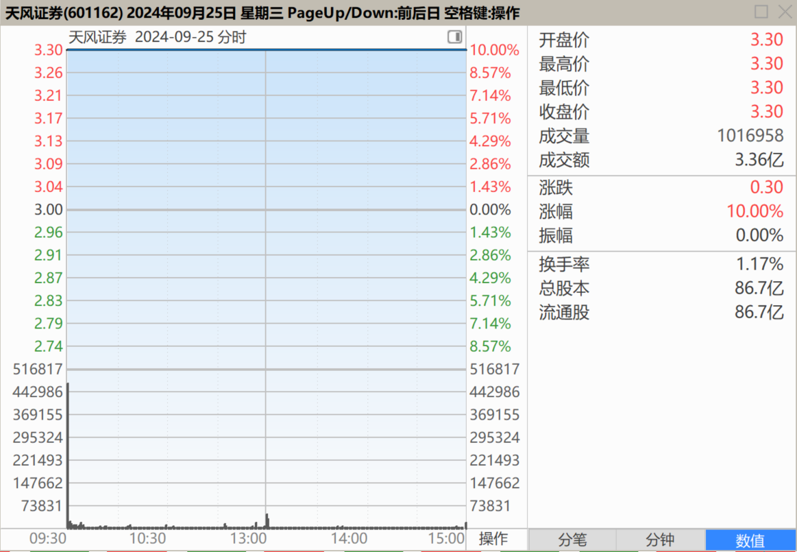

第三天，开盘涨停后，破板！大量的浮动筹码流出来，成交放大到45亿了！（**吓人的量，想想燕京这种盘子的股票，如果当日成交45亿，涨停破板又涨停，估计我全仓都要卖掉了，天量天价呀！**更别说194亿了）

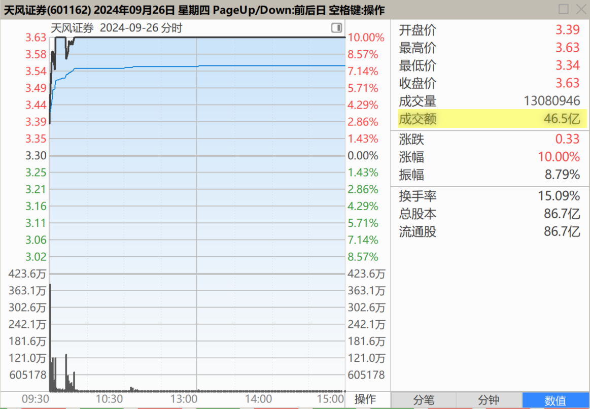

但，这一天，抛出的所有筹码，应该都被庄家接走了。肯定是一个实力强悍的庄家！比燕京这个小气抠门又狡猾的主力厉害得多，手法也更凌厉！

第二天，该股不再停留磨叽，连续五天都是涨停，从三元多直接涨到5.84元！

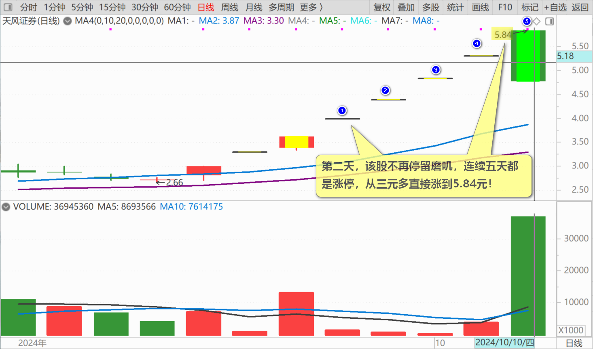

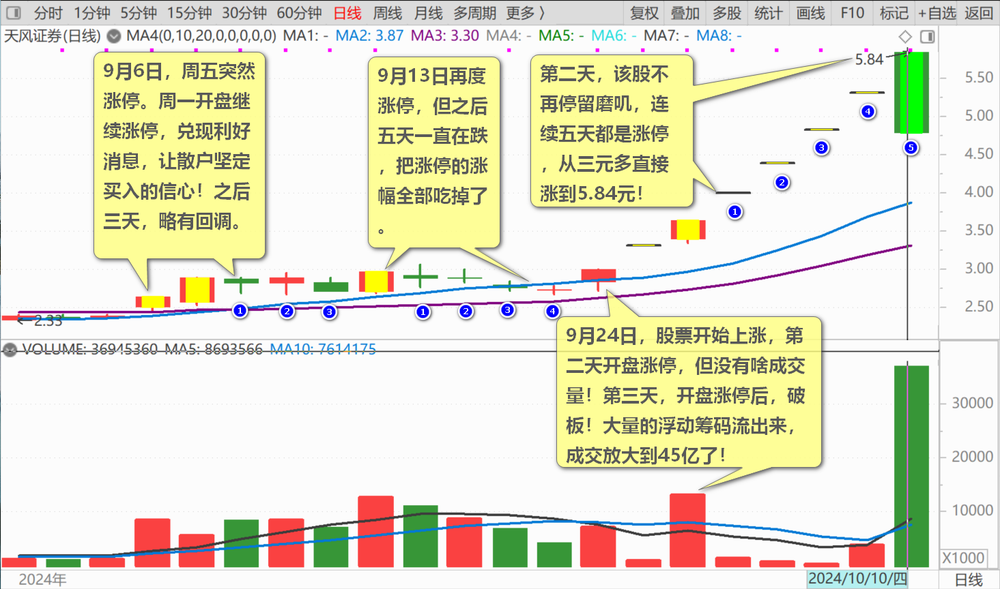

昨天，由于大盘大幅下跌，该股也居然丝毫没有破板，一字板封得死死的。它坚决承接住了昨天一批最精明的人的最后抛盘——这一天，20个亿换手了！估计年报上，四季度的十大全都是新的面孔！

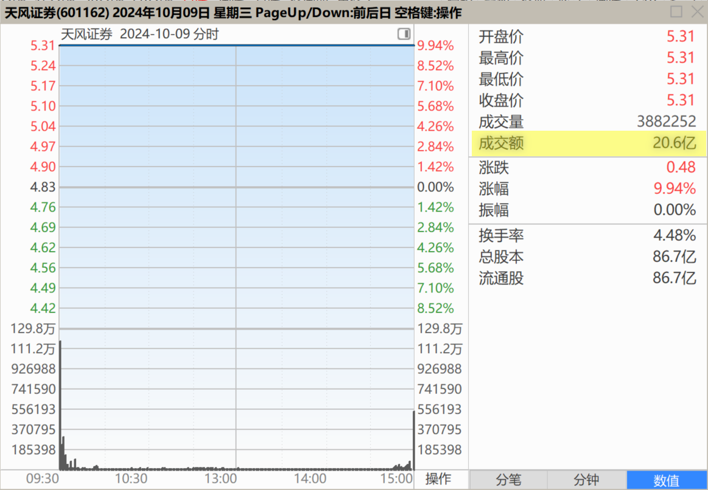

如果你昨天是看盘的，甚至大量的消息都在坊间流传，关于天风的种种消息！今天早上，你会怎么想？这个股，太强了。20个亿的抛盘都打不下来，这不得涨到天上去？想怎么涨就怎么涨？

今天一早，国家队拉升，大盘股涨停。这给了主力绝佳的出逃机会。今天早上，很多资金在手，可能前天高点逃走了的人，一看今早局势反转了。看到这个昨天大盘跌这么惨，都坚决涨停的股票，今天就吸引来了大量的投机买入盘，**开盘一分钟，就成交了53亿！全都是高位追涨的单子。**我相信：这批5.84元追高买入的人，几年内都别指望能解套了！该股就是个根本就没业绩的垃圾股。谁没事来当“解放军”？

主力上午的控制盘面节奏非常的好，很有节奏地跟随大盘走势推高和走低，还配合大势做一个上升的波浪！上午，主力今天完美地借助国家队的进场号角声，借助这些一波一波的买单，把股票推高了4～5%，但中午之后，主力不装了。大量的卖单涌出来，最终封死跌盘价！

其实——今天的抛盘并不厉害（因为市场上的筹码，估计都被主力拿走了），主力可以不封死跌盘价格的。但明天反应过来，发现被套的投机客，肯定会不顾一切地杀跌想要逃离。所以今天主力，杀鸡就要杀个透，一点机会都不给今天杀进来的留下的。所以尾盘，就死死地按住跌停！明天——肯定是下跌趋势，我不相信今天赚了钱的主力，明天会把今天赚到的钱来“维护盘面”，已经榨干了——不能再干了。明天一定是争相出逃的散户们多杀多的踩踏局！精彩而绝望的股民，都在想赶快出清手上今天好不容易抢来的筹码！

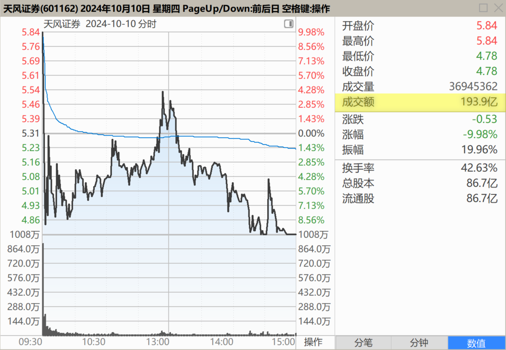

当然，我不是神。明天到底怎样走，我也不知道！但我知道，这个股，死定了！**肯定长期趋势就是下跌。不太可能转势了**！不过，这个股票几年前曾上过11.37元。也许——这会给股民们一点希望。但今天这个成交量，我认为别再指望10几元了。因为**当年主力筹码并没有出清，只能自拉自唱冲高。现在筹码都转移到你们散户手上了，谁来帮你们拉？**所以，恐怕未来10年都起不来了！这种没有业绩的垃圾股，说说故事拉升？谁给钱？

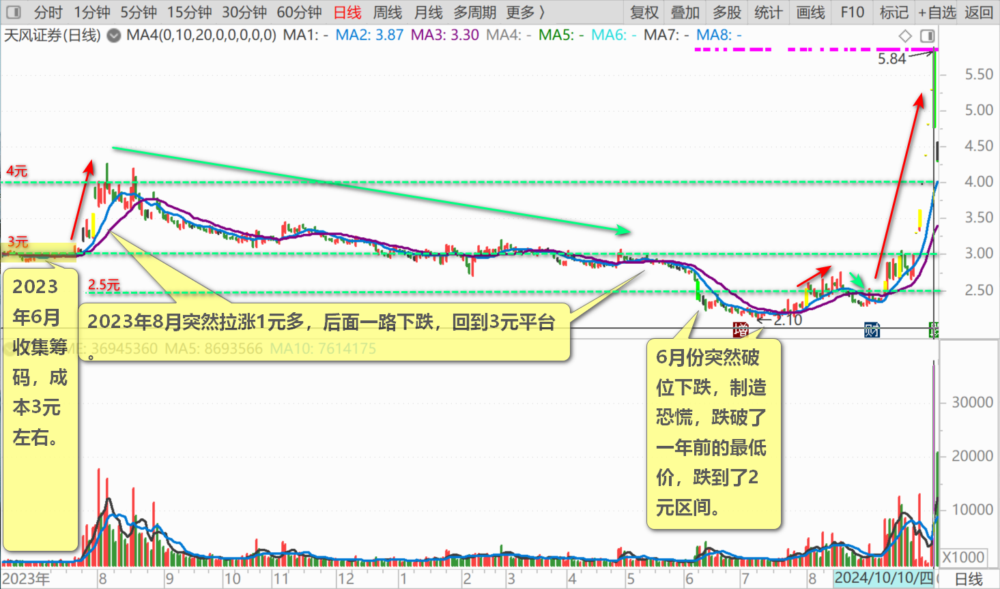

分析完这个股，我心中很悲凉：

**一方面，特别佩服主力，资金大，实力强，杀伐果断！**而且——似乎背景特别深厚，好像懂得这次国庆救市的安排和节奏一样。这个月的盘面走得漂亮极了！完全不是我们这种后知后觉的傻瓜小股民！

**一方面，觉得这些混蛋，根本就不顾及国家大政，把宝贵的资金全浪费在这种垃圾股上了。**如果这194亿，拿来拉升中国建筑，几个板都有了，而且套住也不怕，是良好的长期持股示范！因为该股长期有分红。假如这些资金用来买啤酒股，啤酒股都可以飞到天上去！也对得起中国啤酒销量的市值。不至于世界销量最大的啤酒市场，却不得不忍受不可思议的低价市值！

如果这些钱用来消费，购物，吃东西，可以让多少万的小市民充满了快乐和富足！

但**这两百亿，拿去炒垃圾股，对市场，对股民，对中国想要拉升的重要资产和企业的意图，用金融帮助产业升级的想法，都完全无用，没有帮助和价值！这大笔的利润，落入的依然是一群投机取巧的金融大鳄，不是真正的企业家手里！**

你们认为——我会同情今天被套住的这两百个亿的人数巨大的投机客吗？才不呢！我认为这些散户也不是啥好人——**他们不去认真研究投资，去发掘好股票，不去研究企业未来的发展，不去学习金融知识和价值投资。就是一味在市场上投机，跟风，死了也活该！**他们就是韭菜，毫无救药的韭菜！

**韭菜只能被消灭，不能被教育！**

但——我惋惜的是——**他们损失的资金，也是中国人本来应该拥有的财富！本可以发挥更大价值的财富**，可能就是这些人的养老钱。也许还是这些人卖房，上杠杆弄来的钱。如果就这样轻易地损失掉了，甚至难说会影响局部的社会稳定，家庭纷争。真是“可怜人，必有其可恨之处”！

指望中国的股民能够理性健康地投资，我看根本没希望。我已经看了30年了，**股民依然是疯狂的，庄家依然是强横的，市场依然是无助的！国民依然是贪婪的**。我依然没有看到中国股民有一点点成熟的标志！

不过——也感谢这样无脑和疯狂的市场，以及股民。没有他们，也没有我账户的丰厚回报。当然——我也会**守住初心——绝对不去玩这种风险股。我就算赢了100次，只要输一次——就会死定了！**

我还是**老老实实地跟随国家队，跟随优质的中国资产**，赚钱虽然少一些，但靠得住，也不怕跌！天风证劵这种——天上的风，我哪里能够驾驭。远远看看热闹，知道他们很厉害就行了！

**假如我因为看懂了天风的主力和手法，我大仓加入了“天风”的狂欢，难说有一天会变“天猪”的。等天上的风停了，猪就会从天上跌落，变成一地的猪肉！**

明天，你们想去看看“天猪们”的表现吗？我有点期待了——过去多日以来，天天涨停，夜夜笙歌的“天猪们”，今天这个“天地板”，涨停变跌停，一天就吃下来20%的亏损的“天猪们”，晚上睡得安好吗？他们明天会发出怎样的猪叫声呢？

**评论回复：**

**伊丽莎白**2024-10-10 21:51回复山长 清一：

写的很精彩！只是视角还停留在上古庄股年代，只占股市资金10%的小散接不了多少盘的，巨额成交量，接盘的都是心甘情愿接盘的大块头[捂脸]记住，股市盈利，功夫在盘外[捂脸][捂脸]

山长 清一2024-10-10 21:57回复伊丽莎白：

你是对的。这么多的资金，来源肯定不仅仅是小散户。有一大堆“业内人员”，一起合作，合法地吃掉各种“小白投资人”。私人银行、各种基金、私募、理财、信托，可能都有份！

（标题、图片为编者所加）

**文章音频**：

[501篇.庄股走势分析：一天成交194亿的小股票！](http://link.zhihu.com/?target=https%3A//www.ximalaya.com/sound/770471432)

**参考链接：**

[108篇.节后港股分析：昨天抢筹行情、今天日内调整](https://zhuanlan.zhihu.com/p/2594334405)

[109篇.国庆长假后第一天A股是否开盘就是收盘？](https://zhuanlan.zhihu.com/p/2594398022)

[110篇.这样走势是明显的控盘行为](https://zhuanlan.zhihu.com/p/3366754296)

[111篇.燕京走势健康，清洗筹码阶段](https://zhuanlan.zhihu.com/p/2594476768)

[112篇.对今天走势判断错误，本可以让我一天爆仓！](https://zhuanlan.zhihu.com/p/2594508494)

[113篇.国家队出手，中建涨停](https://zhuanlan.zhihu.com/p/2594572589)

[114篇.伊力特跌到“绝望区间”我才买](https://zhuanlan.zhihu.com/p/4113725975)

[115篇.不做空单、不做多单、只换股吃差价](https://zhuanlan.zhihu.com/p/2594605657)