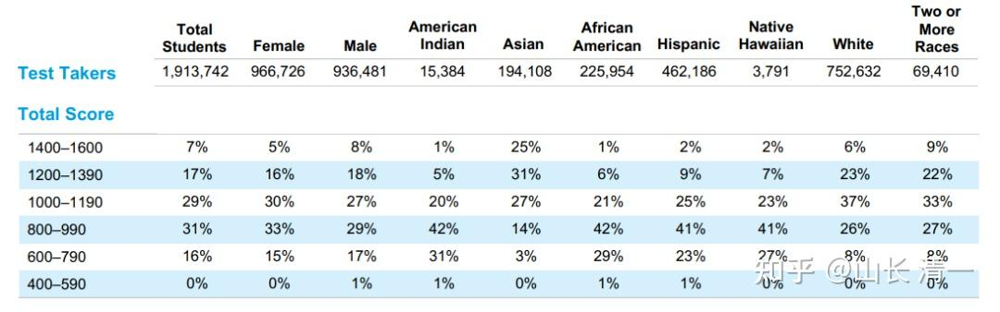

*2024SAT官考成绩分布表*

**比传统教育效率提升39—200倍！颠覆全世界的教育！**

都知道新教育的教育效果好，传统学校根本就比不过。但是，在这个讲求“量化指标”的时代，能不能用切实准确的数据，来说明新教育的优势有多大？效果有多好？能否用量化数据来评估一个教育体系的优劣呢？

显然，量化指标，只能用一些很有局限性的标准来比较。而且必须是两个教育体系都有的内容，才有可能比较！正好新教育的一部分内容，是要求与体制接轨的。全球教育界，都有国际标准考试成绩，可以用来作为两种不同体系教育效果的比较。不过也仅限于此了，其他不同的内容，就没法量化比较了！

通过传统体制学校的标准化成绩来量化不同教育系统的最终教学效果，最终的结论，却远远超过我们自己最初的想象！对照上面图片中的成绩档次，你就发现：

**结论一：今日三校的学生，“中低水平”成绩的学生人数为零。**学生成绩全部高于全球TOP25%的优良学生绩点。成绩属于75%以下人群的“中下成绩”学生，在三校的比例居然是“零”。也就是说，如果用标化绩点来找新教育的中等生和差生，在今日三校是找不到的！零记录！（这种教育成绩，就证明清一新教育超越体制教育是无数倍了。完全就没法比！）

**结论二：新教育培养的第一等级的学生**（TOP 7%以上的优等学生），比全球学生的总括成绩比例和教育效率要高39倍！

**结论三：新教育培养出全球top1%最卓越学生的等级，**教学水平和结果比传统学校效率提升了200倍以上！

这份量化指标，充分验证了清一山长一贯强调的，**新教育是能够把普通人培养为精英**的观点！ 真正做到了通过学校的教育，快速并大幅度地提升普通人的基本素质！

这个效率比较的结果，是怎样算出来的呢？

首先，这是采用了最严谨的，全球公认的SAT考试的学业成绩，来作为一个客观的检验标准，用国际标化考试的成绩结果来检验比较，肯定是最权威的。大家知道：这种国际标化项目，是无法全面衡量新教育全面教育成果的，只是衡量其中的“学术教育水平成果”，并不是新教育的全部优势！但因为全球的大学，都采用这个成绩来作为学生入学申请的重要学术成绩参考标准，我们就采用这个体制的标化考试来进行比较，最终结论就是：新教育的教育效率，至少比传统教育提升了39倍-200倍，注定是改写现代教育的历史！

**一：大幅缩短教育总时长，带来的教育优势达3-4倍！**

全世界的传统学校，完成基础教育阶段的时间都是12年。如果算上幼儿园阶段，就是15年的教育时长！但清一新教育完成基础教育的时间，只需要3-4年。就可以把传统学校12年的教学内容，全部学完！也就是说：仅仅在最容易看到，最容易比较的“教学周期”方面，清一新教育的学习效率，至少相比体制提升了3-4倍。

这个惊人的教学实践，早已经在“今日三语国际学校”长达四年的示范班跟踪示范教学直播中，体现出了它的真实无欺，这是毫无疑问的创新教育成果。

当然，大家更关心的是：罗卜快了不洗泥。会不会为了赶进度，求快，大大牺牲了实际教学品质，影响最终的教学成绩呢？

如果用高中毕业的最终学业成绩标准考试来检验，就可以发现：新教育拥有更加不可思议的教育效率！新教育学生去考美国高中毕业资格证书GED考试，用来作为毕业成绩检验，通过考试的学生达100%。证明这些学生经过三到四年的教育，的确达到了美国高中生的中上等水平！

如果用检验难度更高的【大学入学考试成绩】标准来检验，会发现新教育具有更为惊人的教学效率！

** 二：国际标化成绩结果显示：新教育成绩水平，比传统学校提高了13-50倍！**

国际学校每年有700多万学生入学，仅仅美国每年就有400万人口出生，但其中能够熬到高中毕业，并正式参加SAT（美国高考）这种标化考试的学生，每年还不到200万人。可见SAT考试代表了现在教育典范—-美国的高端教育结果展示！

SAT的成绩分布，特别能够说明两种教育效果的差异：

** 一：国际范围内，取得第一等学业成绩----SAT分数在1400以上者， 只参加考试总人数的7%。**而新教育首批系统完成四年学习任务的两个班级，每个班级都只有一个学生没有达到这个成绩。班级总平均成绩在1460分左右。说明新教育取得第一等优等成绩的通过率在90%以上。用这个指标来衡量的话，新教育学习成绩与全世界相比的标准差是12-13倍！

**二：取得SAT1480分以上的学生，属于全世界最顶尖的卓越学生**，是常春藤盟校的招收对象。但全世界只有1%的学生才能够实现这个成绩！而新教育首批完成四年教学示范的今日塾学生，超过50%的学生实现了这个顶尖卓越成绩。2025年，预计会有更多人超过这个标准。如果用培养出最顶尖卓越学生的成功比例，来衡量新教育和传统教育的效率，双方的差距就是超过50倍！（成功率1%与成功率50%的比较）

关键是：实现以上这个成绩，是只学了3-4年的国际教育，年龄仅15岁的外国非母语学生。而作为对照参考的西方国家和国际学校的学生，都是年龄已经是18岁的高中毕业生！两相对照，两种教育体系的优劣，就一览无遗了！

** 三：两项指标叠加，结论是新教育比体制学校提高至少39倍，最多超200倍的教育优势！ **

把学习时长大幅缩短3-4倍的时间优势，叠加学习结果，学习成绩比传统教育学生高13倍至50倍的优势，可以得出清晰的结论：新教育在基础教育阶段，学习效率要比传统的体制教育高39倍到200倍！这绝对是震惊全世界的教育创新，未来必然改变全世界的教育格局！

计算方法是：

**一：教学周期的效率优势，**如果用3年来对比体制12年的取值，就是效率提高了4倍。如果用4年教学时长来取值，对比体制的12年，就是三倍的优势。我们取最小值3倍！再乘以SAT成绩的最小差距（13倍），就得出结论——最保守的差距是3乘以13等于39倍！

**二：如果4倍的教学周期优势**，再取值培养出超越1480分最卓越学生的比例（50倍），就证明新教育学生相比传统学生拥有超越体制学校200倍的压倒性优势！（4倍乘50）

如果算上新教育学生是外国学生去考母语教育标准，要把母语习得阶段的幼儿园学习也算进教育周期的话，新教育就是用3-4年的教育周期，去完成了西方体制学校15年的教学时长（含幼儿园）达到的效果。新教育拥有五倍的教学周期效率优势。叠加1480分以上的顶尖成绩学生人数50倍的优势。结论就是：新教育比传统教育提升了250倍的教育效率！

不过——我们就不特别强调这一点了。只算前面的39-200倍的优势，这个结果就已经非常吓人了。另外，2025学生的成绩预期会更加突出，因此--新教育超越体制教育的效率，未来会超过300倍都不稀奇！

如果是一个产品，比如汽车，整体效率如油耗和提速，安全性等等，综合比较，要竞品高39倍。您认为这个产品还是不是一个级别？两者的价格差距会有多大？只是39倍吗？恐怕就是天价了！

假如你开的汽车，每小时只能跑30公里。你的竞品居然拥有200倍的优势，它可以用同样的耗油量，相同的价格，但可以跑到4000公里每小时，你确定这还是汽车吗？还是超级飞碟？（飞机都不过每小时一千公里左右）

产业界不太可能出现这种“跨时代”的产品，彼此之间本质上差距并不大。新教育相对体制教育的优势，还远远不止上面这种能够用国际标化成绩来衡量的优势。证明新教育与传统教育，是完全不一样的机制和学习方法，是降维打击。不然不可能有如此巨大的差距（就算今日三校突破班到挑战班有50%的淘汰选择机制，也不过把上述的成功率降低到19倍到100倍之间。最终的成功率依然非常惊人）

但相比之下，新教育学堂的学费，要比大多数国际学校的学费更低。甚至新教育还提供了大量的免费入读机会！这就是中国新教育的创新教育示范，为现代世界教育界提供的巨大价值！必将写入现代教育史。

其他更有优势的项目，就真的不好比较了。比如：

1：**新教育学生的运动和身体健康优势，全面压倒体制学校**

新教育特别强调学生的运动和健康教育。每天要求不低于3小时的体育运动时间。因此学生的身体状况普遍较好，体能相比体制学生，拥有绝对优势。甚至新教育学生作为业余爱好，可以批量地击败体育职业运动员，拿到国家级体育运动专业锦标赛的冠军！学生文武双全。这种教育的优势，就无法用国际上的标化成绩来比较了。但显然，这种运动和健康的优势，要比学习成绩的标化考试对人生的价值和意义更大！如果你更期待孩子的健康和强壮，而不是单纯的学业成绩。新教育相比体制的优势就是无限大！

**2：新教育学生的学习态度比较优势！**

新教育学生普遍学习态度更积极，更加热爱学习。而且拥有超强的自我学习，组织安排的能力，学生可以学会任何自己喜欢的学科！这是由于教学过程中，新教育的教师们，都更注意保护学生的学习积极性，引导学生采用正确方式学习的原因。但体制学校往往教学手段死板生硬，教学内容枯燥乏味。教学目标完全缺失、导致学生普遍厌学。两者相比，大家可以知道——一个能够培育和保护学生学习热情的新教育体系，对于目前这个必须终身学习的信息时代，是多么的重要！可以说——体制教育已经完全与现代社会的需求脱节，而新教育完美地解决和适应了现代社会的要求，是真正符合时代需求的教育模式！

把学生教到厌学的学校，与让学生热爱学习的学校。正数和负数，怎样比较其教育结果？也是无数倍吧？

**3：新教育的学生。更能够积极向上的面对人生和困难！**

传统教育无论在教学内容，教学方式，以及在适应日常生活和社会工作的实际目标上，都严重脱离社会现实。因此教育出来的很多学生都很迷茫！很多学生往往大学毕业后就躺平，实际工作能力也很低。但新教育学生，在面对不同的社会工作和实际生活中，都表现出更加积极和灵活的能力和态度，以及更好的沟通，理解的能力。与传统体制学生相比较，完全就是颠覆性的差别。但这种指标，就 真的无法去标化比较了。

教育的初衷，不就是提升学生对于社会的适应力吗？怎样才能符合社会的需求？从这个指标来看，体制教育完全无法与新教育相比！体制教育是工业化时代的产物，现在已经老朽，已经远远落后于信息时代社会和家庭的需求，未来---必将是新教育的天下！

** 新教育的基础教育阶段，拥有如此巨大的优势，不知是否有人有兴趣去算算：新教育的大学教育，相比传统大学，又有多大的差距呢？**