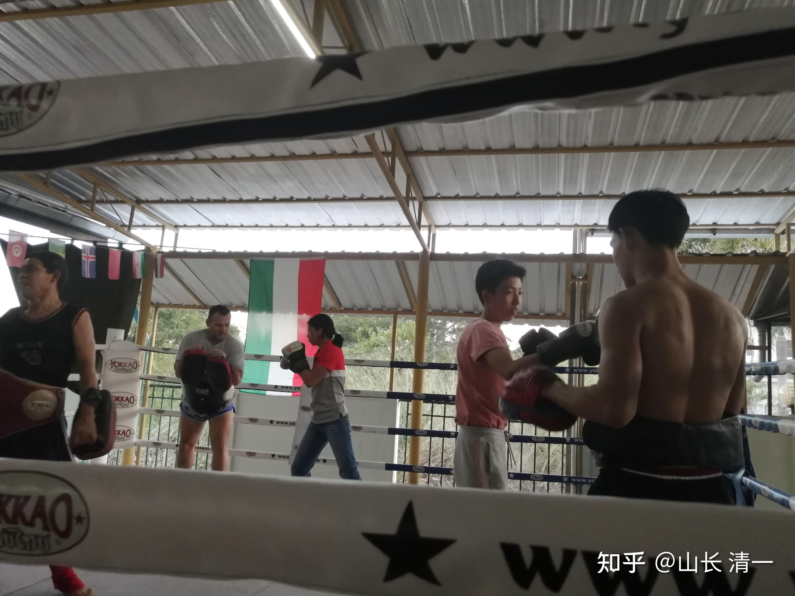
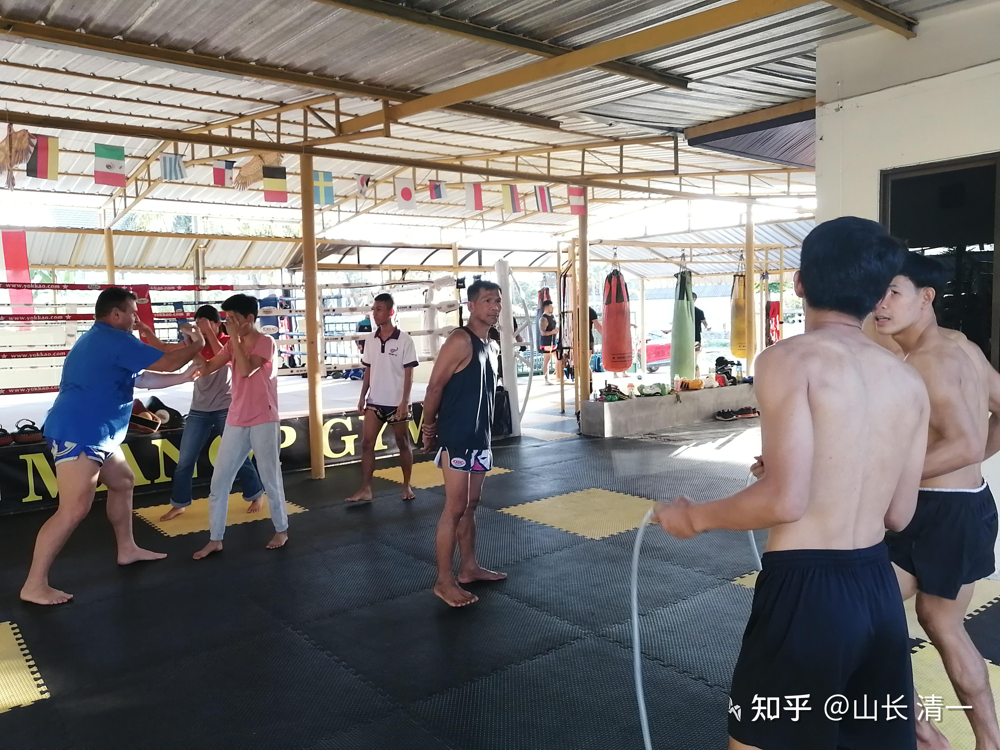
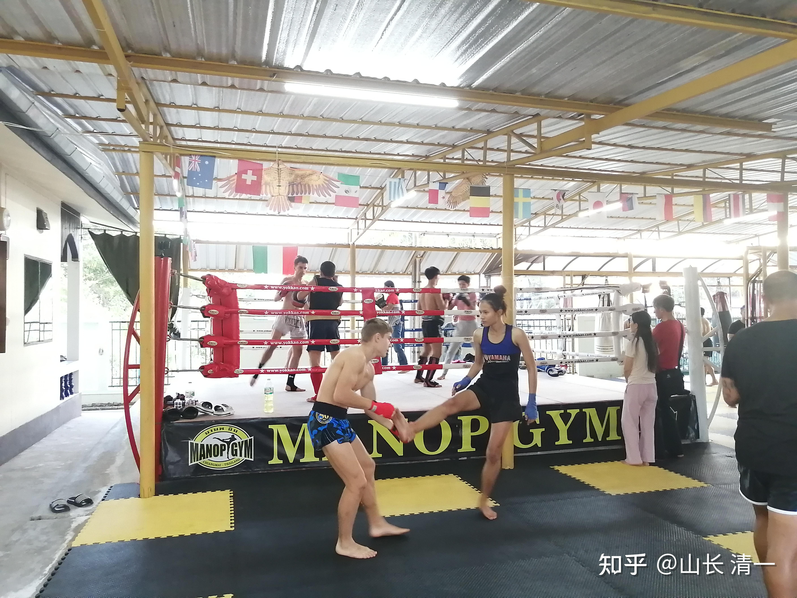

昨天是中国的除夕，大年30。前一天，清迈书院的几个大人，就问这一天我们该咋过节？刘老师说：要不大家一起来包饺子？我告诉四个小公主，过年想吃啥好东西？结果全都摇头，全都不想在吃上浪费时间，只想跟平时一样过。看样子，我已经带出几个不爱吃的，另类的中国人。于是，她们一大早，继续跑步，练拳，读书等。下午带她们看了一个BBC的纪录片。然后一起去泰国的梅州大学食堂吃晚餐。每人吃了一份25泰铢的份饭。吃完饭后，下午5点钟，就去刚刚报名的泰拳馆，继续日常的练拳了。这就是我们非常正常的一天。这一天，是中国的大年30和正月初一。也许，在你们这些最正常的中国人看来，我们这一小群人，非常的“不正常”。

不过，昨天我们依然中了大奖：我们意外地拿到了我们没有想到的春节大奖励：孩子们已经用行动，创造了一个中国的太极格斗记录，虽然这个记录，未来还需要正式的官方比赛的检验来证实（我们可不想只是凭“传说历史”来捍卫中华武术的人，我们将在世界官方擂台上，在媒体的记录下，正式记录中国太极征战世界各派现代格斗赛场的记录，而不是私下传言---太极很厉害，击败了某某世界泰拳冠军啥的）。清迈的四个女孩中，有两个女孩，是致力于18岁就去用四年读四个国家大学的“公主学堂”的小女生。另外两个女孩，是坚决不想上大学浪费时间和精力的学生，她们只想好好练实战太极，去拿世界冠军，捍卫中华武术的荣誉，所以进了【清一武道馆】当拳手了。但这两个小女生，我认为基础要比国内的武道馆成员要差一些，年龄也更小一些。对她们能否去拿世界冠军，特别是打泰拳，我也没啥信心的。只是认为她们如果真心喜欢，就跟着练练也行。学多少算多少了。也没指望她们真能练出来拿泰拳冠军。只是会开她们的玩笑，说她们如果18岁拿不到世界冠军，就去嫁人，生孩子去，当普通女生。现在已经练了两年半了。但与国内的伙伴不同，她们的训练环境要差一些，伙伴很少，也没有男队员跟她们做陪练，只是两人互相对练，我认为可能没啥高级水平。只要求她们：练好基本功即可。

但最近发生了一件特别的事情：一个练泰拳的泰国人，业余爱好者，跟我们交上了朋友。跟两个女孩打了一场友谊比赛。两女孩虽然是第一次跟男生打实战，更没有跟泰拳手进行过对抗比赛。但出于对泰拳的好奇，也想试试自己水平，看能不能抵抗泰拳的攻击。就双方约好时间，前不久，进行了一次中泰友谊赛。女生们做好了“被很厉害的泰拳痛击”的心理准备。因为男生比她们重20公斤。实战结果却让小女生信心大涨----泰国男生惨败。他虽然力量很大，打的拳也很重，但根本打不中我们的女生。但他却常常被女生击中（后来我会上传一个视频，女孩们第一次对战泰拳的比赛）。而且女生们觉得总自己打别人有点不好意思，所以基本上没有出全力进攻，只是点到即止。这个实战视频。后来给一个泰国的朋友看过。这个泰国人看的时候，就很吃惊，你们是真打呀？刚开始他还以为是练习玩的。看到男生打女生，这么猛，觉得不公平。但看完以后就说：你们女生这么厉害。以后谁敢娶她们？女孩们似乎根本就不考虑这个问题。我想：武道馆的师兄还是敢娶的。

男拳手对首战的结果有点不服气，说他这一次，是不敢用泰拳规则来打，因为怕用腿和肘部会伤人，他没有发挥出自己的真实能力。双方就再次约好时间，让孩子们戴上护具，双方再用泰拳的规则来打一次（拳腿肘膝并用）。但女孩们反馈：用泰拳规则，这男生就更惨了：因为男生一抬脚的速度比原来用手要慢，根本踢不到我们的孩子。而且一进攻，就会被反攻击（武当派后发制人，以及太极门“打死不后退”的格斗原则），比男生原来只用双拳攻击的效果还更差。更加的打不中她们。我看了视频，也发现泰国男生用泰拳规则之后，反而越来越被动，更不太敢主动进攻了。场面上显得很怂的样子，不像第一次实战，还会勇猛的进攻。估计是吃了亏，变小心翼翼了。女孩们也不想追穷猛打，出拳也比较保守，别人不攻，自己也不主动出击。因为不想弄得自己得理不让人的样子，死追着别人打，也太不文雅了。所以，后来的视频，是现场上比较消极的比赛。场面并不好看。不如第一次的还有一点“血腥气”。所以，后来的这次视频，我就不传上来了。

比赛的时候，我不在现场。都是孩子们自己玩的。两女孩把与泰拳业余拳手的比赛的视频传给我，我就觉得：这两个女孩，似乎也该给以更多的机会去参与实战训练了。需要找个水平高的专业拳馆，去了解一下泰拳的格斗规则。毕竟未来要对付泰拳的话，上场之前，我们必须“知己知彼”，充分了解泰拳的训练方式和特长。不能只知道自己的太极，不知道泰拳的规则和要求，以及特点，和泰拳的训练和实战的优胜之处。两年半以前，我组建了清一武道馆，已经公开宣布了：要用3-5年时间去练习太极实战，拿到现代格斗项目的世界冠军。现在已经进入第三年了，吹牛的兑现时间，就快到了。现在队员们，基本功已经练差不多了，也该去参加一些职业比赛。可惜国内没啥比赛机会。泰国的拳赛倒是较多，但国内的孩子暂时还过不来，也许就让她们两个人，先去练练看，说不定可以探探路。两人正式练拳的时间。大约也就两年左右。比武道馆的其他人时间要短一些。现在也该加码实战练习了。

我们找到的这个泰拳训练馆，是泰国比较有水平的一家拳馆。创办人是原来的泰拳冠军，今年已经58岁了。看上去很精神的样子。每天带队员练拳，指导。据说还被邀请出国教学，甚至去过中国教拳好几次。甚至曼谷都有学员，专门过来清迈。在这家拳馆练拳。目前有四个泰拳世界冠军在拳馆当教练。由于孩子们的泰语不错，去网上搜索了一下这些泰国人的名字，发现果然都是泰拳的名人，他们的比赛记录和视频都很多，粉丝也很多。看样子，找这家拳馆找对了。他们自己是职业拳手，要给拳馆的拳手安排比赛，机会也更多一些。实际上，拳馆每个月都有比赛的。今天，就有他们拳馆人员出场的比赛，一个女拳手，昨天就出发去曼谷参赛了。这女生，据说也是冠军，已经打了三百多场实战了。她就是靠打泰拳比赛来养家的，现在也在拳馆每天自己练习和提高，也做做教练工作。还有一个打过MMA实战的匈牙利人，也在拳馆当教练，因为他的儿子在拳馆练拳，准备走职业拳手的道路。他们一家人，对这个泰拳教练的评价都很高，说这是泰国最好的泰拳教练。我也不知道叫啥啥名字，挺拗口的。

泰国也有一些拳馆，是“吃旅游饭”的，主要靠蒙不懂行的外国人，业余时间练练泰拳玩的，没啥专业的水平。主要是学习者的水平太差。去这些拳馆练拳，就是浪费时间的。但我看这家拳馆，像是正正经经，以认真训练，认真打比赛为出路的专业职业拳馆。拳馆有已经训练很长时间的人，已经拿了冠军头衔的拳手，继续留在这里训练和比赛，作为职业生活。我想这家拳馆肯定有其优胜之处。所以，我们就先给孩子们交了一个月的训练费，让孩子去熟悉一下泰拳，熟悉未来的对手，方便未来的对抗。

*明晓和佳惠在泰拳馆拳台训练*

*明晓和佳惠在泰拳馆拳台训练2*

昨天，就是两女孩去泰拳馆的第三天。泰拳号称是全世界最凶猛的格斗派别。中国人提起泰拳，基本上认为：传统武术不可能是泰拳的对手。虽然中泰对抗赛举行了十几届，也有一些中国拳手击败泰拳高手的记录。但武术界内部人士，内心是承认：论实战的话，中国武术是打不赢泰拳的。中国做实战格斗的很多拳手，很多人都要去泰国专门训练和提升格斗能力。还有一个故事：前几年，一个中国散打的金腰带拳手，被日本拳手KO了。为了报仇，就去泰国拳馆刻苦训练了一年多，后来重新回来，再度挑战日本拳手，把失去的金腰带抢回来了。这些都在暗示和明示：在“站立格斗”这一块领域，似乎泰拳就是全世界最厉害的。

我们还是找一些武林界的权威人物出来说话吧：李建平：据说是中国散打的教父级人物。他多次担任国家散打集训队的主教练，培养了140多位全国冠军。2006年，他接到国家体育总局武术中心的通知，跟中国武术打了一辈子交道的他，转而成为中国泰拳国家队的组建者和牵头人，成为国家泰拳队的总教练。精通传统武术、散打、泰拳三大项的李建平，评价中国武术和泰拳，应该是比较权威的代表性想法了。他说：“中国武术应该放眼世界，多学习别人的长处，别总以为自己是天下第一。”不久前在佛山进行的中泰对抗赛，更是被炒到“关乎中国武林颜面”的高度。对此，李建平一针见血地指出：“散打和泰拳是规则完全不同的项目，这个比赛炒作的成分太大。”。很多练家子承认: 在中国散打界的所谓一线选手，在对抗赛就只能对上泰国的二三线的选手。这个事实，很伤中国人的自尊心，但打不赢别人，只能承认差距，谦虚学习。实际上，世界上很多格斗选手，都不约而同地选择了泰拳，作为实战格斗训练的重要内容。泰拳，已经不仅仅是泰国人的泰拳，而是世界的泰拳了。

中国人，其实骨子里面，是希望自己的传统武术在世界上发扬光大，不希望是输给泰拳的。世界上最善于军事和战争的民族，却在武术格斗上，被一个东南亚的小国藐视，肯定国人的内心是很不平衡的。但武术这种东西，是不能靠吹牛来获得尊重的。中国真实的结论，就是打不赢泰拳，有啥好糊弄的呢？你不能用一些学习了泰拳技术去击败了泰国人的拳手的记录，来说明中国武术的厉害。因为你都是拿来主义。你总不能做了面包，然后说你比西方人做的更好，是中国的国粹吧？事实上，中国的顶尖武术专业人士，已经承认了：中华武术本身不是泰拳的对手。中泰武术对抗比赛，虽然媒体会说一些激励人心的案例，似乎中国武术还是可以击败泰拳的，是代表国家荣誉了。但内部人都知道：中泰挑战赛，说难听一点，就是一个利用中国人的武术梦，来骗人的商业炒作。非关武术的事实。难道我们中国人，就只能永远活在梦里吗？

我一直很关心中国武术与泰拳的对抗。差不多20年前，我就与武汉体院散打队的一批队员是朋友，当时他们也正在做一些跟泰拳打对抗赛的训练。现在他们已经是一些省级散打队的教练了。但说起来，他们对抗泰拳，也没啥信心的。只是说：如果在中国比赛，用中国的散打规则来裁判比赛结果的话，他们有一些优势，可以用摔法来得分。这一点是中国唯一强过泰拳的技术。但泰拳更重视重拳击倒，加上三大队员对于膝击和肘击训练很缺乏，难以适应。所以，如果用泰拳规则来打比赛，中国散打基本上是不可能打败泰国人的。大致上，我们第一流的散打队员，勉强跟泰拳第二三流的队员打平。国内组织的一些比赛，也是这样玩的。来泰国邀请一些第二三流的泰拳选手来参赛，泰拳手往往是职业拳手，就靠大打拳吃饭的。只要有出场费，都是愿意来比赛的。输赢不是很在乎。这样才勉强给中国散打一点面子。

我却一直坚持认为：中国武术的技能和内涵，要比泰拳的更高，中国武术要打败泰拳，是完全可能的。中华武术打不赢泰拳，不是泰拳的拳学原理有多高级，只不过是泰拳的机制很好，强调真功夫。中国功夫都去玩假东西去了。当然打不赢泰拳。但只要有人组织一些认真练拳的人，专门练习中华武术的对抗和实战，我相信是可以赢过泰拳的。至少我认为理论上泰拳不是对手。我们很容易用中华武术获得速度和力量上的优势。泰拳的弱点，也是很明显的。主要就是变通不足，过于强调拼实力和体力了。但我很奇怪的是：一直没有中华武林中人来实现这个“伟大理想”。我真奇怪：这种名利双收的事情，居然没有人来做？真是太遗憾了。虽然也有一些中国人击败泰国拳手的消息，但本质上是用泰拳的技术来取得的胜利，我一直没有看见在赛场上用中国武术元素，技能来对抗的案例。特别是太极拳的拳理，更加的奥妙。一旦使用出来，击败泰拳是完全可能的，而且应该是压倒性的差距。只是----太极在中国，甚至在全世界，都已经成为笑话了。由于没有人实实在在的练太极，练传统武术。武林中人，似乎都在追逐功名利禄，体制内的在求稳，晋级加官。体制外的武林人，再求一份“官方认同”，都在玩假的，不求真功夫。于是，我就在2年半以前，成立了【清一武道馆】，招募了20多个队员，尝试用传统的太极拳，来与现代格斗对抗。首先选定的实战目标，就是目前相对最流行的三种现代格斗技术-----全世界最流行的拳击，以及中国的散打，再就是很多人公认：在站立格斗中，实战能力最强，最能打的泰拳。等我们用太极赢了这三大赛事以后，以后有机会，再去尝试一下无规则格斗如UFC，K1等。

这个梦想，看起来真是太虚妄了，就像一个人吹大牛。比雷雷的牛还大。因为从现实层面来看的话，中国武术，基本上这一百年来，只是在传说，小说和电影中，能够找到一点“面子”。一些门派鼎鼎大名的武术宗师，与外国拳手作战的历史，无非是老祖宗去打过“俄国大力士”等等街头摆摊的跑江湖的人的格斗历史。这根本就谈不上有啥水平的技击高手。现代格斗赛场上，基本上就没有中国功夫的影子。虽然有少数的中国人在赛场上又出现，但他们使用的技术，都是外国的拳技。别说现在了，就算是100年前的民国国术馆，在举办的所谓全国国术比赛，其中取得了优胜成绩的几个人，都是当年的中央国术馆，特别强调练拳击的一批人。虽然号称是中国武术人士，但真正的中华武术元素，恐怕民国时期就已经失去了。现实中的中国武术界，并不像各位在【一代宗师】里面看到的场景一样，【中华武士会】多么的牛叉。民国时期，武术就已经失落了。

我一介文人，却想重新恢复中国太极，以及中华武术的荣誉。我居然来做一件国家武术队的总教练，都判断是“不可能的任务”，我是不是疯了？何德何能？不过，我想：人总是要有理想的，万一实现了呢？所以，现在正好有一群年轻人，也怀着跟我一样的梦想，大家愿意聚在一起，来尝试这样一个“不可能的任务”。我们就去做一下，试试看吧。清一武道馆里面的队员都是学霸（太极是哲拳，我才不要一些四肢发达，头脑简单的人来练拳的。所以清一武道馆只收15-18岁达到学霸要求的学生，也就是达到了SAT1400分以上的学生才能来职业学拳，这样子，就算学拳不成功，没拿到世界冠军，他们也可以成为文武双全的人才，不会被一纸文凭所限制）。这些年轻人，放弃了去读世界前50名大学的机会，来武道馆里面学太极格斗技术。所以，清一武道馆，将来就算不是世界格斗界技击水平最高的武馆，但一定是格斗界里面文化水平最高的武馆。更大的可能性就是：清一武道馆是格斗界格斗和文化水平都最高的武馆。因为进来练拳的人，成为学霸之后才有机会学武。进来之后也文武兼修。我告诉这些孩子：“你们正在做的，是一件中国人100年来都很期待，却没有人做出来的事情。你们万一练出来了，你们就是中华武术历史上创新纪录的功臣，就会成为当代的太极大师。万一你们没有成功，你们至少也锻炼了身体，文武兼修，也没有吃亏。大家何乐而不为呢？哈佛耶鲁，这种大学每年都要培养数千人。中华实战太极，一百年都没有出啥顶尖人才了。万一你是其中之一，价值有多高?”。于是，大家齐心协力的练了两年多一点。现在该“出山”，试试水平了。看是不是太极拳，真的上了格斗场就笑话百出？只能挨打？难道太极就不是拳，就不会吃人吗？

我们第一天刚到拳馆，一开始热身。这帮拳手老江湖，马上看出来了我们的来历：上来就问，你们原来练的是太极吗？我们点头说是。他们说：太极很好，是一种艺术。用来健身锻炼身体很不错。不过，实战就要练泰拳才行。他们“很理解”我们为啥要“放弃太极”，选择来泰拳馆训练实战格斗技术。泰拳教练，也在女孩们训练的时候，不断教训她们：不要这样做，这不是太极。这是泰拳。手要伸直，双腿要站稳，要用摆动发力，踢腿的时候身子要后仰，躲闪的时候要如何通过头部的晃动来躲闪对方的攻击-----。这些完全与我平时对她们的训练方式相反。女孩们对此无可奈何。但我说：不要去辩护和反抗，只是跟着学习和了解。你知道他们是怎样训练的，你就更知道：为啥我们的训练方式和要求，跟他们都不一样了。也就更知道他们的弱点了---这样训练出来的人，肯定有我们不会有的弱点，也是他们上场后被我们狂殴的错误。如果我们认为他们练的方法是错误的，我们就要有能力抓住他们的错误。不然别人就不是错误。起码按照他们的格斗原理，他们是“正确”的。

这群职业队员，每天上午和下午各训练一次。晚上有一两个小时的时间，是用来练习双方对抗的，教练会带领这些队员来进行针对性的对抗练习。我们来拳馆的目的，就是想要跟泰拳手们实战对抗一下，看看差距有多大。但为了不让别人以为我们是来挑战的，引起不必要的纷争和麻烦，我们必须低调一些，不要让人以为是来“踢馆”的，就不好了。双方最好友好交流，学习，了解，别在别人的地盘上惹是非。所以，我交代去拳馆训练的两女孩，在拳馆的前10天，都只让她们老老实实的跟泰拳学习，观察，琢磨，训练，不要去主动跟这些拳手们过招。避免“暴露目标”，也可以多观察他们的优点，如果有发现她们难以对付的泰拳技术，就回来告诉我，我帮她们来调整解决，找到用我们的技术来对付泰拳的方法。等以后，跟泰国拳手的关系搞好了，再跟他们进行一些格斗对抗的比赛训练。这也是知己知彼。在正式上擂台比赛之前，先跟泰国的冠军拳手过过招，才能避免将来上场的时候心中有数，不至于懵圈。

不过，我的这种心细的安排，昨天晚上就“破功”了。昨天，一个55公斤级的泰拳冠军男教练。在常规训练完成之后，居然主动邀约两女孩（不到50公斤）跟他一起训练模拟实战格斗。双方进行了一场互相比技巧的对抗训练赛。由于是训练性质，所以双方，都不出全力，只是拼技术和反应，双方都是点到为止。但令人惊讶的局面出现了：我远远的看到，我带去的女生，带上护膝之后，居然就在场上跟泰国拳手对打起来了。但我发现：泰国拳手的进攻，虽然速度很快，但不太容易攻破女生的防守，基本上，无论拳脚，所有的进攻均被轻易化解。女生似乎忘记了我的告诫，防守的同时也不客气的打回去。由于节奏与泰拳不一样（回击与防守的时间点很接近泰拳手不断中招。只是女生也是点到为止，拳抓住空挡，或者打到了脸上，头上，马上就收手，收劲了。就算是腿踢到身上，也虚点一下，马上拉了回来。打得并不重。但泰拳手显然有点吃惊，没想到刚来拳馆的新女生，没学过对抗，就如此的不好对付。就不断试探用不同的攻击和防守手段，出拳也越来越快。各种虚实真假的进攻动作都出来了。但看我们的选手，主要是防守反击，估计想看看选手的主动进攻，还故意的放下双手，暴露头部，吸引对方来攻击。我们的太极拳手，见到空挡也毫不客气地直接攻击，反应的速度也很快。后来，泰拳冠军看用常规方式打不上女生，出击很难成功。就想用缠抱的方式来对付。结果更糟糕，根本就抱不住，反而会挨打。因为这本来就是太极的强项。泰拳手就想用摔法来摔倒女生，找回一点面子来，但连着试了几次，都没成功。有一次还差点被反摔。我只是远远的看，有点惊讶。当时我还不知道这个男拳手就是泰拳冠军，只是觉得这拳手，比上次女生们打的泰拳业余爱好者强多了，技术水平高得多，反应速度也快得多。后来下场，问跟她们对招的男拳手，是什么级别的，才知道是泰拳冠军。可惜昨天我们去拳场没有丝毫的准备，连手机都没有带，所以没有留下现场记录。场下的几个泰拳手，也听到他们互相之间交流，私下说：这两个中国的女生，挺厉害的。我看这评价不错，未来几个月，应该可以得到去曼谷实战的机会了。拳馆如果觉得你上场打不赢，实力太差的话，也不会推举你出去打的。因为会让拳馆的名声变差。主要的比赛城市就是曼谷。清迈本地，是没啥实战机会的。除了对游客的表演式的泰拳之外，这些基本上就是没啥技术含量的比赛。

女生下场后。见到我有点不好意思，她似乎想起来我说的：10天内不要和他们过招的话了。忙着解释说：是泰国的拳手，主动邀请他们参与实战模拟的，她们也想试一下，就上去开打了。我说：你打的不错，在格斗技术上，已经胜过这个冠军了。速度上也不比他差。只是在力量上有差距，经验上依然有所不足。真正恶实力还不够。如果真打实战，你还是会输掉的。但女生有点迷糊------她根本没有想刚才的实战对抗意味着什么，以为就是玩一下而已。说这个泰国拳手，应该是故意让她的，她没觉得拳手的技术实力不如她。我说：他击中你几次? 她想想，说好像没有啥有效击中。我说：你击中他有效部位多次，都没有发力，是吗？她说：是的，就是比比手，到脸上就停止了。我说：我如果比你水平高，我跟你过招，肯定也让你的，不会有意来伤你。但我肯定不会把脑袋和关键部位给你打上去，就是让你开心一点。我也不会能够击中你，却不下手。我只会拳到而不出力。头部这些部位被击中，是拳手的忌讳。他才不会故意拿空挡给你打的，是你抓住了他的空挡。你多次击中对方，就表示：他的实战技术，是弱于你的。并不是故意让招的。他只是让了力，但没有让招。而且后来他用力，想要摔倒你，没有做到是吗？女孩对自己没有被摔倒感到很自豪，高兴地说：是的，他努力了好几次想要摔倒我，可是没有做到。还有一次我还差点摔倒他了。虽然最终的结果，是男拳手的经验丰富，摔倒的同时把女生也带倒了。算平手。显然她也没输招。我说：他是冠军拳手，男女对抗，他力量比你大。他比你重，级别不一样，更有优势。但就算是摔跤这种力气活，他都没有超过你，还特别让你拳吗？所以，技术上你肯定赢了他。

[!\[image\](images/img_004.jpg)

佳惠第一次与泰拳手的格斗 https://www.zhihu.com/video/1471862252156936192](http://link.zhihu.com/?target=https%3A//www.zhihu.com/video/1471862252156936192)

说明：泰拳的站架 重心在后 前脚脚尖点地，目的是能更快的提膝格挡中低扫 前脚正蹬破敌制军 抢攻；阻截；进攻。这种站架利于腿法。泰拳手强调站稳，像个坦克车一样推进。双方拼对攻的实力，但由于我们的拳手风格是“太极如水”，移动灵活，基本不会站在原地等对方来打，所以对方的这种步法根本就不起作用， 看起来更像笑话。当然，也说明这个拳手经验不够，变通能力不足。不能适应我们的快节奏打法。下一个他出腿的结果，你们可以看到他的腿击基本上对我们的拳手没有威胁。

[!\[image\](images/img_005.jpg)

泰拳腿攻击的视频 https://www.zhihu.com/video/1472596911757160448](http://link.zhihu.com/?target=https%3A//www.zhihu.com/video/1472596911757160448)

由于没有昨天的实战对抗视频，我只能把前段时间她们与泰拳第一次相遇的格斗视频放在这里。供大家观看。这个业余泰拳选手的速度太慢，虽然已经练了很多年了，今年28岁。但由于紧张，对抗中出现大量的非必要动作，弄到他体力消耗很快，不能代表高技术的泰拳手。但他出拳很重，的确是泰拳风格，是毫不客气的重重攻击，不像我们的拳手，是控制住力量的，基本上是点到为止。我们的拳手轻松防住了他的后手重拳。同时反击的速度超过泰拳手的预期，所以他往往一出拳就中招。只是我们的女生往往只用拳在他脸上蹭一下，没有出力打。这个视频，外行估计看着就是热闹，觉得风格都差不多，不都是拳打来打去的? 但内行就应该看得出来：女孩们练的绝对不是泰拳，也不是散打。如果你不知道是什么，就对了。因为这是实战太极------一种几乎绝种的武术。当然，与你们想象的雷雷太极肯定是不一样的。一样就只会挨打了。但是，你们认真一点对照古拳经的描述。就会发现是符合要求的---太极实战要求，是如水一般的流动，让对手抓不住攻击点。如果你们认为：广场上慢悠悠的老人的样子，才是正宗的太极。好吧，我就只能承认：我们练的就是杂耍，不是你认为的太极。也许只是我们认为的太极。可能是你认为不正宗的，甚至你可以说，她们练的还不如你，连拳都不像。好吧，你说什么都对。我们只关心能不能击败泰拳。如果你觉得自己牛，干嘛不去抽泰国人一顿？不说别的，还有奖金可以拿的。

至于我们：与泰拳决战的时间已经越来越近了。我们的目标，不是只去击败个别的泰拳选手。这目标太容易了。我们要的目标是：让我们的太极选手，一旦出山，就能成为在她们这个级别里面，任何泰拳选手都无法超越的一座高山。甚至我们还可以设法越级挑战---有意去挑战超出自己级别的，更大量级的泰拳手。当别人要在尽量的减重，降级的时候，我们来增加量级，主动迎战更大的挑战。或者让我们的女选手，去挑战一下泰拳的男选手。预期明年，应该会实现这个目标。今年我们的女生，就先打同级别的女拳手好了。明年再设法让女生们，试着去挑战一下实力更加强大的男拳手。目前，为了对付泰拳擅长的硬打硬拼，他们正在用中华传统的练功方式，提升内功，提升抗击打的能力。以便实战中设法对付泰拳最令人头痛的硬度和强度----据说，很多中国练武的人，被泰拳的硬腿法击中后，就马上失去了战斗力。经常被泰国人一个鞭腿就踢断了肋骨，无法再打下去了。因为我们的拳手抗击打能力都太差了。中国散打，不太强调抗击打力，规则上是强调点数的。所以拳手也不太去练攻击力，更强调一些技巧。所以往往真实的攻防实战能力就不如泰拳。我们正在弥补这个技术无法弥补的差距----这就只能依靠孩子们的汗水和努力来实现了。孩子们每天练功时间达8小时，是远超这些泰国拳手的。他们似乎一天只是五小时左右。有些人还更少。所以这一天练习赛后，泰国拳手很累，瘫坐地上。也很奇怪我们的女生居然不累。打完后还玩仰卧起坐。他们都累得不想动了。估计这是锻炼，也是食物的关系。泰拳手都是食肉动物，耐力自然要差一些。据说他们不太适应超过五个回合的比赛。清一武道馆是按照12回合的比赛来安排体能的。所以发现一场只需要打三个回合，都觉得太轻松了。

清一武道馆国内的20多个成员，原计划是今年3月份以后，都来泰国训练和实战的。现在看疫情严重，可能来泰国的时间会推迟。来泰国之后，拳击和泰拳两项赛事都有举办，也可以在泰国安排去K1的比赛，如果想拿世界冠军，在泰国都可以申请参赛的。在泰国可以完成这些全部的比赛，比中国更方便。因为泰拳拳手融入国际赛事的比例是很高的。再过几个月，国人就可以看到中国当代最年轻的太极实战选手，在国际擂台上，用真正的中国功夫，来捍卫中华武术的荣誉了。而不是像原来一样，只能靠电影和小说，靠特技来“捍卫”中华武术。

期待孩子们用拳头打出中华文化的魅力！