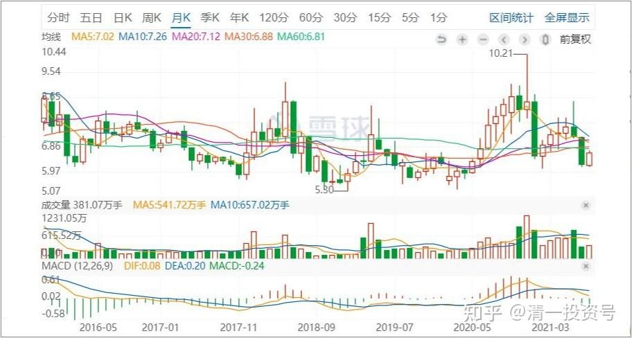

原27篇. 基本面和技术面结合——山长对话51姐

清一山长 2020年12月10日

清一山长雪球非专栏帖子整理文章第 27篇《基本面和技术面结合——山长对话51姐》

**我不会去判断主力如何如何，我只知道当自己精心挑出来的公司，市场充满恐慌情绪而公司经营越来越好时，我会埋头加仓**。

山长是看着我这些年怎么走过来的，顺鑫、健康元、老窖……无论是成功还是失败，我都是按自己的认知去买卖。

**[清一山长](http://link.zhihu.com/?target=https%3A//xueqiu.com/9310099567)**回复**[51nxp](http://link.zhihu.com/?target=https%3A//xueqiu.com/n/51nxp)**2020-12-10 11:19

**基本面投资其实比看技术更难**。要了解企业，了解行业，不然很难判断准确。我是偷懒，看技术，看庄家进出，主力博弈，要比研究企业的基本面容易得多。所以，我很敬佩你们这些潜心研究企业和产品的人。

当然，更多的人，什么都不懂，技术面看不懂，企业也看不懂，行业也不研究。这种人赚钱，全凭运气。

等我慢慢理解一下你的逻辑，如果理解了，也许可以投点信立泰。理解不了，就继续等，有时候会失去机会。酒鬼酒我17元买了不到十万股，但没有看懂，只是从技术上觉得很低了，买入很安全。如果我像您一样看懂了，我会买几百万股的，冲到30都敢追。所以，因为不懂酒鬼酒的基本面，我失去了一个赚到大钱的机会，证明看技术不是万能的。**所以，我要学习您研究企业的产品的精神。**

**[51nxp](http://link.zhihu.com/?target=https%3A//xueqiu.com/9203843585)**回复**[清一山长](http://link.zhihu.com/?target=https%3A//xueqiu.com/n/%25E6%25B8%2585%25E4%25B8%2580%25E5%25B1%25B1%25E9%2595%25BF)**2020-12-10 12:27

谢谢山长。我是这样理解投资的，我这样的散户，**只能买自己能理解的好公司等市场去发现价值。**当然因为自己的认知能力有限，也会错过很多机会，然而投资和人生一样，不是靠与别人比收益，而是自己是否在前进来衡量的。

我已经习惯了做逆行者，只要是符合我投资标准的公司，就是不理会市场，越跌越买。山长你是见证我在股市的成长的，以前我是单吊一个股，一步买到位，跌了用融资加仓，现在我用现金加资产组合来弥补自己认知的不足，比如说信立泰28买高了，那就保持自己能在它跌到16我还有子弹加仓。

我非常认同段永平的那句话——**投资要看远一些，我再补充一下，就是往未来看远一些的基础上，还应该往五到十年前回溯看，当时市场是怎么给的估值，我当时的资产又能买多少股。**正因为我会前想后想，才能安心地当自己选择的公司的股东，短期错了，就当股东呗！长期绝对不会错到哪里去，因为我相信这个市场是有效市场。

回到信立泰和天士力，慢病赛道的两个领军公司，都兼有创新药布局，掌舵人都是海归二代，人脉资源优于一般创业者。

山长，我和你不同，你是现实生活中已大获成功的人，我就是靠投资改变自己人生的人，所以我很满足能拿到这么多信立泰和天士力的股份，五年前我做梦都不能想到的。

古今多少事，都付笑谈中。山长，我们今天在雪球挥斥方遒，但愿来日能在清迈一壶酌酒喜相逢！[$信立泰(SZ002294)$](http://link.zhihu.com/?target=http%3A//xueqiu.com/S/SZ002294)

**[清一山长](http://link.zhihu.com/?target=https%3A//xueqiu.com/9310099567)**回复**[51nxp](http://link.zhihu.com/?target=https%3A//xueqiu.com/n/51nxp)**2020-12-10 16:11

谢谢！您来清迈，就请您喝泰国啤酒，或者日本清酒、中国黄酒也可以。似乎没有看到市场有中国白酒卖。但有外国的白酒，比如绝对伏特加、英国金酒。

我们是这个时代的幸运儿，有幸在这个资本爆发的时代获取财富自由。**我用“博弈学、心理学”的方式来赚钱，您用“看懂企业、与企业坚守”的方式来赚钱，都是在自己能力圈内的可行方式。长远来看，您的方式更靠谱，更国际化。**

但**由于中国人好赌、跟风、情绪化很严重，所以中国人的赌性也是一种宝贵的资源，我可以反向而行，投资效率也不错。**

不过我教我的商学院学生的投资方法，就不教我这玩的一套了，而是教你的一套——**与企业共同成长。博弈、人性这一门学问，教他们去社会上使用**（比如，如何进入各国的上流社会，取得影响力）。

**[清一山长](http://link.zhihu.com/?target=https%3A//xueqiu.com/9310099567)**[2020-12-12 19:27](http://link.zhihu.com/?target=https%3A//xueqiu.com/9310099567/165601690)

[$信立泰(SZ002294)$](http://link.zhihu.com/?target=http%3A//xueqiu.com/S/SZ002294)这个走势非常的不好，明显是主力资金出逃，连装都不装一下的。**最近三天成交量越来越大，跌幅越来越深，预后不良。**其实四天前的走势是收敛了的，有站稳的迹象，按道理就算是要跌，来个反弹再跌也好，没想到却是连续下跌。**主力不利用技术反抽，但也不是制造恐慌一般的故意打压，而是不断派货，这是最可怕的下跌图形，往往意味着有人不计代价出场。**当然，反过来说，有这么多接盘，也说明有很多人看好此股，就看谁占上风了。目前显然接盘很被动。

**[51nxp](http://link.zhihu.com/?target=https%3A//xueqiu.com/9203843585)**2020-12-12 20:13

山长你回忆一下顺鑫2018年初，贸易战刚出来时直接跌破19元的平台，放量跌到16.6元。那一年有个段子，买酒买了二锅头，买车买了长安，买银行买了民生等等。

健康元2018年7月份～12月一路阴跌，接近腰斩。

老窖2018年从72跌到35，当年业绩百分之二十几的增长，我买的时候很多人都说我会亏死，还说唐朝说的厨房的蟑螂出现了就不止一个。

投资成绩是自己对公司经营的认知在二级市场的提现，就像你说的啤酒，无论市场有多少偏见，你以产业成本的角度，办一个燕京啤酒也不止现在的总市值，你就觉得可以拿，我认可这种逻辑，现在还不是从5元爬到10元。

**这个市场最终是按你投资的公司的价值来定乾坤的！**

**[清一山长](http://link.zhihu.com/?target=https%3A//xueqiu.com/9310099567)**2020-12-13 13:57回复[@51nxp](http://link.zhihu.com/?target=http%3A//xueqiu.com/n/51nxp):

这个市场最终是按你投资的公司的价值来定乾坤的！非常同意**。如果信立泰的行业地位是稳定的，下跌，急跌中买入，这个逻辑就没问题。**就是市场上的医药公司太多了，我弄不懂谁会活下来。啤酒看起来就简单多了，比如燕京肯定不会死的，最多被兼并。

我还是容易被复杂的东西弄晕掉，好好继续学习中。

**[51nxp](http://link.zhihu.com/?target=https%3A//xueqiu.com/9203843585)**[2020-12-20 11:10](http://link.zhihu.com/?target=https%3A//xueqiu.com/9203843585/166202355)

[$天士力(SH600535)$](http://link.zhihu.com/?target=http%3A//xueqiu.com/S/SH600535) 这几天一直在思考。拿[天士力](http://link.zhihu.com/?target=https%3A//xueqiu.com/S/SH600535%3Ffrom%3Dstatus_stock_match)差不多1年，为什么那么笃定的一笔投资让我现在这么纠结？

我买[天士力](http://link.zhihu.com/?target=https%3A//xueqiu.com/S/SH600535%3Ffrom%3Dstatus_stock_match)是因为我公公长期吃丹参滴丸，且每个月都有药房送药上门自己只出百分之十，我们大院内还有一些冠心病的老者也是这样。这个基本盘就有30个亿，天士力拿着丹参滴丸的盈利不断投入研发，以后的创新药都是彩蛋。

为什么最近这么悲观呢？因为拿[天士力](http://link.zhihu.com/?target=https%3A//xueqiu.com/S/SH600535%3Ffrom%3Dstatus_stock_match)的这一年接触的所有专业投资者都不看好它——机构和个人。这个认知差来自哪里？我想我买天士力本来是当大消费公司买的，结果我却和拿创新药企的人交流，自然不在一个频道上，结论自然悲观。

沉静下来，内心一片澄明——一个稳定增长的30亿大单品，还有保守说脑梗普佑克未来20亿空间，不谈天境生物十数亿的财务回保，这个公司值不值得232亿？

**我们选择一个企业，肯定得看它的创始人**，闫董事长能从军医成长为现代中医的领军人物，能在1999年就投资茅台镇的第二家酱香酒（如果他投40亿买上市当天的茅台那就神了），我相信他对[天士力](http://link.zhihu.com/?target=https%3A//xueqiu.com/S/SH600535%3Ffrom%3Dstatus_stock_match)今后的布局。

还记得2018年初顺鑫跌破20元，山长和教授都先后买入，支持了我的逻辑，我现在坚定了自己持有[天士力](http://link.zhihu.com/?target=https%3A//xueqiu.com/S/SH600535%3Ffrom%3Dstatus_stock_match)的信心，你们看呢？[微进化ing](http://link.zhihu.com/?target=http%3A//xueqiu.com/n/%25E5%25BE%25AE%25E8%25BF%259B%25E5%258C%2596ing) [清一山长](http://link.zhihu.com/?target=http%3A//xueqiu.com/n/%25E6%25B8%2585%25E4%25B8%2580%25E5%25B1%25B1%25E9%2595%25BF)

**[清一山长](http://link.zhihu.com/?target=https%3A//xueqiu.com/9310099567)**[2020-12-26 13:01](http://link.zhihu.com/?target=https%3A//xueqiu.com/9310099567/166789519)

抱歉，一直没看到这个帖子。没有及时回复！

医疗公司的基本面，我基本上不懂，没法评价。与顺鑫不一样：顺鑫是销量第一的白酒公司，当时的价格，是停留在几年前，其他白酒公司都涨了。它没涨，是不合逻辑的，所以19元买入顺鑫，安全系数很高。而且这酒的销量保证了将来会有希望。它当时最大的问题，就是养猪业务不赚钱，以及地产公司赔钱。**但白酒一直是一家独秀的。一旦剥离两项不良资产，它就会是一个非常优秀的白酒公司，就像是现在的燕京，公司总体的盈利，还不如自己的一家分公司（广西漓泉），一旦主品牌走好，就会有爆发的可能。**所以这些基本面，使得我敢于大量买入。

单[京新](http://link.zhihu.com/?target=https%3A//xueqiu.com/S/SZ002020)，我就没发现一些基本面上明显可以见到的“亮点”，加上去年我看到下跌放量，技术面上就不正常。今年年初从17元下跌到13元多，也放量，这都是短期内股价起不来的重要原因。有什么人愿意在这么低的价格跑路？当然，有这么多人接盘，也说明有人看好。最近7月份的上涨，空间力度都不够。再次跌回来也不奇怪。不过，现在处在相对低位，风险已经不大了。也许坚持到风口，就可以有收获了。

由于我不懂医疗企业的基本面，就说一点这些技术面上的看盘心得，也许对您没啥意义。我个人，**习惯根据基本面和技术面两者结合，**如果能够融合在一起投资，胜率会更大一些。顺鑫当年是符合这个要求的，安全性、值博率都比较高。**从技术面看，当时看到顺鑫有主力压盘的迹象，不让涨。**我对这种就很有兴趣了。**而且压盘时间很长，已经压了两三年。**由于我能够看到主力的这些压盘动作，知道万一涨起来，50%以内是不可能出局的，所以顺鑫30元以内，我根本就不考虑卖出。后来才抓住了顺鑫这头大涨的牛。您由于下车过早，**也许就是没有关注主力的技术面“主力进驻两三年可能带来的空间”，您就只看到了“基本面带来的估值修复”就走掉了**。有点可惜。所以，**了解一下技术走势、博弈学，也许也是有价值的**。

[京新](http://link.zhihu.com/?target=https%3A//xueqiu.com/S/SZ002020)（药业002020）仅仅看技术面走势的话，基本上已经接近底部位置了。天士力还需要观察。

这些个人意见，仅供参考。

（标题为编者所加）

参考链接：

[清一投资号：5篇.投资·教育·人生——山长对话51姐](https://zhuanlan.zhihu.com/p/463934427)（整理文）