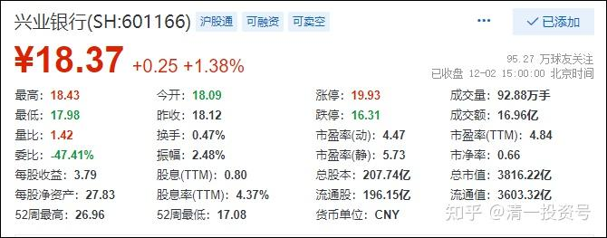
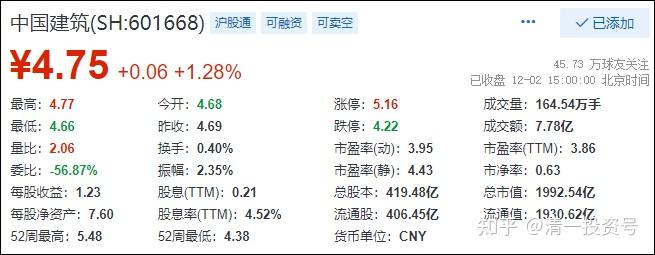

原来46篇.清一山长与归隐林地老师对话录

清一山长 2020年2月——2021年4月

清一山长雪球非专栏帖子整理文章 第46篇《清一山长与归隐林地老师对话录》//归隐林地回复 道可道也非恒道也:

中建专家谈不上，只是跟踪这个股票时间比较长，也在上面赚过不少钱。去年四季度，觉得时间空间都很合适，就在雪球重点聊了这个标的，我自己也连续做了加仓，目前是我的第一重仓股。关于中建，我想说的所有内容都已经散见于最近半年来我的帖子和跟帖中。您若有兴趣，可以去翻看，同时建议您也看看晕娜、 大股爱好者、猪先生666 等网友的文字，他们比我研究得更细更具体。

鉴于您说自己是新入市的股民，并且已经表露出想十年以上持股不动的思路，那我作为二十多年的老股民就多啰嗦几句，供您参考。

首先，我们都要明白，股市不是取款机，股市有一招制胜赚大钱的想法一定是错的。社会上有那么多聪明钱，包括保险资金、银行买理财的资金、全社会买债券的资金，都在绞尽脑汁，去赚年化5%左右的收益。银行业集中了大批最优秀的金融人才，建立了庞大的风控体系，基准贷款利率也只有5%左右，还要忍受1.x%的坏账率（而且全社会都不相信它们的坏账率只有这么低）。以上是常识，我们在做投资的时候一定不能忽略。

其次，您提到十年不动，即试图一劳永逸，也是错的。回顾历史，我们会发现很多股票十年涨了十倍百倍，但那是幸存者偏差。凡人不是历史穿越者，没有透视十年的能力。一个公司，十年足以几度生死。之前美国管理学家曾经筛选出数十家当时最优秀的企业，分析它们的特质，写出《追求卓越》那样的专著，事后看，大部分企业都衰弱了。最初的道琼斯指数成分股，无一还留在指数中。您买入一只股票，就意味着您要时时跟踪、分析它的经营活动，在它有向坏的迹象时，及时作出新的决定。

第三，正如我一贯强调的，买入股票是赌大概率的盈利，仓位如同下注，全仓一只股票赌性未免太大，我是很不赞成的。一个大企业，像中建这种，没有人能够了解它的方方面面，董事长和总经理也不能。它是一个复杂系统，就像一个小的国家，相信按部就班的规划能够完美实现，借用哈耶克的话，是一种“致命的自负”。

清一山长2020-02-27 09:24:40回复归隐林地:

金玉良言！值得所有投资人好好思考。

二、重仓中国建筑和兴业银行

归隐林地:

很久没有在雪球写点什么了，一方面是觉得想说想写的东西都已经说完写完了，另一方面也算是找到了新的消磨时间的方向，而且手里持仓股票的基本面也没有啥特别的变化，关注就相对少了。

有人曾经说，这个世界太大、太忙，如果一个人不管因为什么原因离开，三个月后除家人外还有人想起他，那他算没有白活。如果半年后还有人念叨他，那他就可以算比较成功。“归隐林地”作为网上的一个虚拟ID，在雪球已经超过半年没有写一个字了，直到最近，还有朋友挂念我，担心我是不是遇到了什么意外，让我非常感动。

我非常非常感谢你们：爱思堡、 shuaishen、 finra 、AllenChina、 欢颜XC、人和、 mengniuc、 扶苏1989 、shenle123、 流浪投资人、 晓香菜、 醉翁山水、 藏云阁、 戒赌一百天、 寻找不变、 不请自来也、 星爷夹头、 y6556、 增益投资 （如有遗漏，请见谅。）

请朋友们放心，我一切都很好，包括股票账户。

现在我看股票账户，也有点像看雪球，时不时会打开，但通常不做什么动作。我依然重仓中国建筑和兴业银行，这几年都表现不够好，以至于连续两年跑输指数，但是重仓他们的基本理由并没有变，我只是等风来。我相信依然有5年一倍（年化15%）的机会。

我这几年都没有写年终总结，实在是觉得与前几年相比有点寒碜，而且也没有实现自己的预期目标（年化12%-15%），不过今天放一张全景图在这里吧！算是给我自己一个鞭策，如果今年年底达标，我会再放一个图在这里。

这是我有完整记录的一个账户，长期表现很好，但最近三年、五年都跑输了指数，主要原因是过分重仓了中国建筑和兴业银行。分散化很重要，我另外一个分散到20多只股票的账户，就比雪球那个“满仓再平衡”的模拟盘好不少，三年、五年的年化都超过了20%。

不过，就算这个账户，只要今年能够有47%的收益，那么整体收益率就会如下图所示。用我个人估值模型计算，中建的（24个月）目标价是10.35-13.50，兴业的目标价是38.55-42.85，基本假设是两家公司未来3年的增速都在7.5%上下，分红率中建20%，兴业25%，所以总体上还是信心满满。

三、中建可做避险品种

//归隐林地:回复可乐西里:

从风险报酬角度，我觉得中国建筑比保险银行好得多，至少在经济下行阶段，它更安全。保险、银行又何尝不是苦命的生意？都是需要加那么高的杠杆才能赚几个点的收益，谁也别笑话谁吧！从生意角度，只有茅台才值得看。

清一山长2020-05-24 12:10:39

中建其实可以当做风险存在重大不确定性情况下的避险品种。我现在就觉得中建到了买入的时候，逐步把其它的品种换过来，这样才安心。市场涨了它会跟，万一市场垮了它跌幅有限，具有周期稳定性。

四、打新是博弈，买股票是投资

//归隐林地:回复归隐林地：

不过股市是最体现世界多样性的，山长不打新没错，炒家接盘开板新股也应该没错，他们都赚到了适合自己的钱。

至于亏钱的，那也是凭本事亏掉的。

清一山长2020-07-10 10:27回复归隐林地:

打新是博弈，而且是主导权操控在别人手里的博弈。买股票是投资。两者思维模式不一样。有人专心打新，就是坚决不买二级市场的股，这也是一个投资逻辑。他只相信博弈，不相信投资，他就是对的。因为，他拥有一套完整的投机博弈模型。只要一旦失去机会，会马上放弃的。小散户认为打新是“包赚不赔”的生意，就是无脑了。看看香港打新的结果？多数上市就跌破面值。

五、兴业与中建之间搬砖，赢面大于死守一方

//归隐林地:回复晕娜:

晕娜对银行的看法大有商榷余地。针对晕兄的5点，我也说5点。

1）十年后，银行业依然是全社会的支柱行业，因为间接融资的市场空间巨大，直接融资再发展，也吃不下多少份额，用直观的数据看，就是M2年年增长，而且增长慢了都不行。银行业也是难得的没有天花板的行业，特别是在如今的信用货币时代。另外，目前似乎还在为银行混业经营开口子，这个就先不说了。

2）利率市场化之后，银行业依然会生龙活虎。银行业经营的基础逻辑不是利率，而是信用。信用永远是稀缺的，特别是在中国。往远处看，欧洲、日本基本上都是0利率、负利率，但银行业依然还是最强大的金融力量。（就像保险业经营的基础逻辑不是投资能力，而是中产阶级的焦虑，所以我把保险产品看成是中产阶级的智商税。）

3）今年的疫情，肯定会传导到银行，但是到中报大家就会发现，银行业应该是受影响较小甚至不受影响的行业。M2增速这么快，银行业会吃亏？想多了！担心利润还不如担心再融资好了。

4）银行业不是阿猫阿狗都赚钱，这几年一定会有大量兼并托管等事件发生。有人总是说银监会的监管指标是ROE大于11%，但实际上，很多农商行、城商行的ROE非常低，而不良率非常高。

5）晕娜只喜欢招行，这个没啥可讨论的。交易永远是互道傻B的过程。在目前价位下，我只喜欢兴业，而且仓位不轻（当然比中建持仓少），大家看重的东西不同。

在这5点之外，晕兄还点评了农行的分红（实际是业绩）最近几年没啥增长，在我看来，这只是一个短期问题。这几年M2增速大幅降低，宏观经济趋向走缓，不良率提升导致拨备高增，而政策面又有巴三协议提升核心资本等要求，以至于ROE连年走低。但是，只要银行业还能存在，息差以及ROE就不会一路低下去。银行业的坡大概率比建筑业更长，雪也更厚。 总之，我对银行业一点都不悲观。前段时间我是从兴业、太保等金融股搬了一些资金到中建上，是因为中建跌得多，银行、保险相对跌的少，我希望有机会搬回去。从这里的跟帖看，大有希望啊！

清一山长2020-07-11 14:24:42 回复归隐林地:

写得挺好的，赞同！

不过，我认为晕娜强调的是“不确定性”，她更注重量化一些。 未来如果中国崛起的话，中国的建筑会崛起，中国的银行也会崛起的。大国重器，都值得拥有。 个人认为：在银行和中建搬砖，兴业对标中建，我个人认为赢面大过死守任何一边。当然，还要看运气。目前价位，中建占优。

六、人比人气死人，圣人无喜无忧更易常胜

//归隐林地:回复归隐林地:

在晕娜晕兄的提醒下，我刚刚去统计了一下从3月23日指数收盘低点以来的反弹，中国建筑上涨5.08%，排在沪深300指数成分股的倒数第25位，而兴业银行上涨13.17%，排在倒数第65位。从这个角度，我也算歪打正着，补了相对更低位的。不过，人比人气死人，不到4个月时间，300指数中涨得最好的前20家基本上都翻番了，我们是切切实实浪费了一个牛市啊。（全市场涨得最好的王府井没在300指数中，它居然用不到80个交易日从11.74涨到最高79.19！）

清一山长2020-07-15 16:45:41 回复归隐林地:

这样比，会气死的。任何一个季度的时段拿出来，比前20名，都有涨翻倍的股。不过，任何时段拿出来，比最后十名，都有腰斩的股。去跟这样的人比，就可以找到快乐？元位南，就是能够让很多小股民在比较中，获得很多心灵安慰的比惨大使，功德无量！所以，凡人喜欢比，就有N多快乐和N多沮丧的理由。圣人，胜无喜，败无忧。因此更容易常胜。

2020-08-12 20:50归隐林地:

我跟山长兄观点相对接近，都是在安全的股票上波段投机，唯有中建，在去年5.5左右，就在雪球发帖申明这个价位之下不考虑止损。对一个投机者来说，不止损是很重大的决定。不过我也有点矫枉过正，居然6块以上也没考虑做T（准确地说，是在很小的空间就买回来了）。现在也是我炒股以来持仓最重的一支股票了（我猜想，我跟山长大概都能排进散户持股数前十了）。我希望它慢慢涨，让不同时点进来的人都赚钱。如果很快达到1.1倍PB以上，我退出来的钱又能干啥呢？

七、入界宜缓，逢危须弃

（此标题内容曾经收录于非专栏整理26篇同名文章，这里再次纳入是为了保留全部山长和归隐林地老师的对话录于同一篇章中。）清一山长2021-04-29 22:31:08

评论归隐林地 04-29 《我依然在等风来 》[https://xueqiu.com/9564664610/174998438](http://link.zhihu.com/?target=https%3A//xueqiu.com/9564664610/174998438)

清一山长 04-29 22:31 · 来自雪球:

我刚打赏了这篇帖子 ¥88.00，也推荐给你。

借您本文的吉言：中建的（24个月）目标价是10.35-13.50，兴业的目标价是38.55-42.85祝福林地兄借助此两只股票的预期落地，实现投资20年增值200倍的目标（目前您是15年76倍，要实现这个目标很有希望）。

[https://xueqiu.com/9564664610/174998438](http://link.zhihu.com/?target=https%3A//xueqiu.com/9564664610/174998438)

//@归隐林地:回复@清一山长:

谢谢山长打赏。我的业绩没有那么高啊（那个76倍是假设今年净值能够上涨47%，我的中国梦），现在大概是15年多一点的时间53倍（最近兴业回撤不少），而且也是因为起点刚好是大牛市，去掉06-07年的大牛市，比如最近10年，只剩下8倍了。我现在的目标更是低得多，5年1倍（年化15%），10年3倍就满足了。

不管多少倍，只要能够实现在14亿国民中的资产排名略有增长，所谓保值增值就很满意。

清一山长 04-30 08:54 · 来自雪球 回复@归隐林地:

打赏您的帖子，是希望看我帖子的人，去学您和晕娜的方式：云淡风轻地就把钱赚了。财不入急门！主要是我得到的粉丝打赏太多了，需要用出去发挥价值。你的投资方式，是值得大家学习和模仿的，希望大家都向您学习这种投资风格——闲适从容。

但有些人就是喜欢跟着我，看我分析盘面、跟庄、看K线，买进卖出做T。其实这是不务正业。虽然我的确能看懂庄家的心意，也会与狼共舞，抢点庄家的饭吃。中国股市玩了三十年的老股民，活下去的老兵，都或多或少会一点。但绝大多数人，是学不会我的。与狼共舞的结果，基本上是被狼吃了。但他们学你，是学得会的。

我大约与@晕娜 是同时进入中国建筑的。过去七年，我进出中建大概是五次，最后一次也是5元进入，但6元就跑，居然还成功了。赚到了超额收益，成为我在A股的利润王。看起来比晕娜做得好，其实我内心真正佩服的是晕娜。我是运气好——中建如果不是安邦被抓，不会是现在的价格让我进来的。中建今天，很可能就是建筑行业的招商银行。我就放走了招商银行，一直感到遗憾。原来，我是重仓招商银行的，我内心深深的知道这一点差别。所以，我不会认为做中建的T很成功（五次，都是低点进入，高点退出的）。但我认为晕娜你们这种死死坐电梯的方式，才是正确的投资方式。

他笑话我是交易者，不是投资者。其实是对的。交易者，成功100次，只要失败一次，就把100次的成功抹去了。2015年，93老股民就是这样消失的。长长久久，还是你们的方式更好。中建我马上就快坐了一年的电梯了，越坐，我的股票越多。因为我的其他投机资金，正在慢慢进入中。我正在从交易者的身份，慢慢转变成投资者。

就算您说的，保守一点，您未来10年只有三倍，你就有投资25年150倍的业绩了，不比拿着茅台差。中国建筑的ROE，是可以保障你获得这种结果的。所以基本上是预期的最低结果。这十年，难说会有估值重估的时刻。您就可以“双击”一把。给个10PE给中建，10年就是超过6倍了，您就有300倍收益了。这是一种很稳妥的资产增值方式，也是我大仓中国建筑的原因。（不好意思，目前我也只有30%仓位，不如您的80%多）。如果不涨，我会占比越来越多的。主要是啤酒和低残的港股，拖住我的换股步伐了。

//@归隐林地:回复@清一山长:

不管是我，还是晕娜，都是从交易者转型，主要还是老了，我们可以赚无数次100%，但只够赔1次100%，胡雪岩的教训告诉我们，晚年是经不起失败的。

我在雪球也写过很多类似于“F=MA”，“一慢二看三通过”等技术分析（赌概率）的文字。所以有人说我是左右手互搏。现在不搏了，不仅左右手不互搏，跟谁都不搏。就等公司分红，等某一天机构来抬轿。

清一山长 04-30 10:33 · 来自雪球 回复@归隐林地:

【胡雪岩的教训告诉我们，晚年是经不起失败的】！

我去看过胡雪岩在杭州的老宅。据说，连建房的钉子，都是从德国进口的，应该是他顶峰时候的得意之作。估计当年，有点得意忘形了。可惜，刚建成，他就破产了。似乎他并没有住多久。可叹！局势的风云变化，是我们无法掌控的。随时保持警惕，是很有必要的。

这都是别人的教训，花了多少亿万资产买的教训，就是我们的教训！不要自己去经历。

一时的成败不算什么。晚年平淡如水，并不是失败。莫混个晚年凄凉，才是真的失败。

//@归隐林地:回复@人间五十年:

以我的经验来看，大多数人对股市赚钱方法都是有很大误解的。要么就说技术分析很管用，盘面说明一切；要么就说基本面最了不起，价值投资才是正途。我以前说过一句话，所谓估值低（价值高）都是走夜路唱歌，自我壮胆，中国建筑五年来的走势，包括今天在季报超预期依然下跌的走势，可以算是印证了我的话。其实还可以再补充一句，所谓技术指标走好，更是走夜路唱歌，自我壮胆。坚持技术分析交易到破产的，应该是比比皆是。

如果做基本面和做技术面都不一定靠谱，大家可能会问，我之前赚了那么多倍，都只是靠运气吗？真的是幸存者偏差吗？实事求是的说，运气是很重要的，比如我有个账户是2006年初开户，长期下来的收益率就很高，而我最早却是从1997年入市的，整体绩效就差很多。但是运气不可能总是站到自己一边，所以最最重要的还是要有概率思维，做好资金管理，即所谓的风险敞口管理，不要输掉自己输不起的钱，这才是真正的专业化。市场上讲投资的书，很少讲这方面。真正的保守不是买最低估值的股票，而是在买入任何品种后，不要亏掉太多的钱。“入界宜缓”，“逢危须弃”，这些围棋口诀，在股市中也是一样有用。

我之所以那几年敢在国投电力中投入7成仓位，现在敢在中建上投入8成仓位，是我自己风险评估之后的结果。每个人都有自己输得起的标准，但千万不要无原则的在股市中“赌”。@清一山长 @晕娜 点滴体会，供两位兄批评。

清一山长 04-30 15:25 · 来自雪球 回复@归隐林地:

林兄这种对股市的理解，是多少股市洗礼换来的。很对！一般人，看不到这种体悟的价值。

【千万不要无原则的在股市中“赌”】

是的，买入中建，就是看他的ROE能否保持。根据过去的记录，以及现在的表现，15%是没有问题的。所以，不赌的就是：它跌到一元，我们也能接受。十年后，每股分红都一元了。股价给多少钱？市场先生您看着办，反正市场给一元，我是不卖手上这笔股权的！给个2PB。可以考虑卖一些。

这就是不赌！

赌就是：我猜明天一元，现价4元，我就赶快做空。要不我猜明天6元。我赶快买入，做多！

不赌就是：管你是1元，还是6元。我都不卖！不理。

假如手上有钱，都可以继续买！

