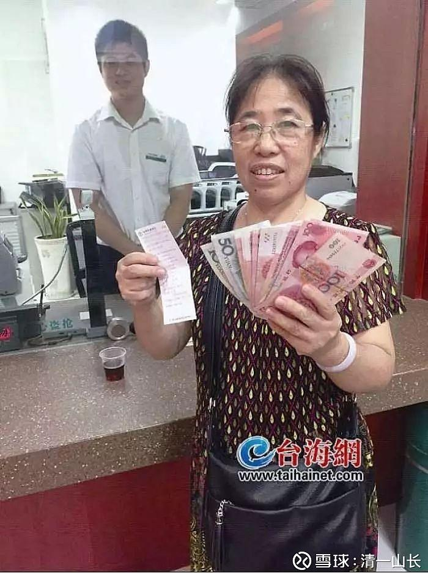
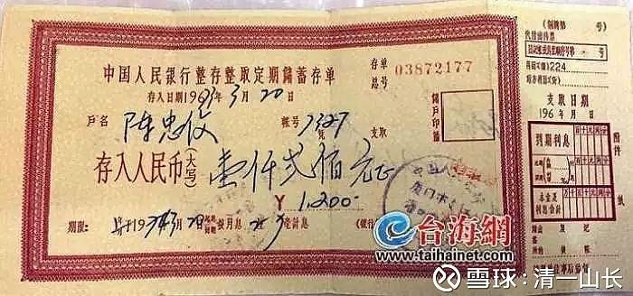

**原专栏6篇.1973年存入的1200元存款，今天能买什么**

清一山长 2017年9月21日

1973年，我才十岁。当时的五元钱，就可以买一家人一个月的粮食了。50元，就够一家人的全部生活费了。茅台酒当年的价格是5-7元，而且还觉得“很贵”。当时的1200元，是一笔“巨款”，足够去盖一栋房子了。北京的一个小四合院，我听说当年的价格，也就2000多元3000元不到。这笔钱，如果当年买了房子，留到今天，就是一笔价值亿万的资产。当时的普通职工工资，是每月20多元。当时请个小保姆，给个5-10元就行了。

那么，您放到银行存款存了44年之后，今天这笔钱，可以买什么？

答案是：可以请朋友吃餐饭！因为，连本带利，今天您可以收到2684元。这笔钱，好像连小保姆一个月的工资都不够付了。

所以，各位朋友：您今天如果有点钱，千万别存钱了。存钱是大傻瓜一个。您最应该做的事情是：用来买银行！比如，我不买保险，但是我把你们会用来买保险的钱，买了保险公司。因为：我喜欢跟利益集团站在一起，而不是相反的方向（不肯做他们的服务对象）。我宁肯用钱来买银行，也不肯把钱存在银行，而且我还要想方设法，要从银行贷款出来用。我喜欢当负翁。

转载：

存款的主人：感谢国家，感谢政府。至少你们还认这张44年前的存单！我终于取到钱了！

报道：太感谢你们了，为了存单忙前忙后。”19日，成功提取出存款的陈女士喜笑颜开，向银行工作人员表达感激之情。

厦门市民陈女士持一张存有1200元的老存单，取款时似乎遇到了“历史难题”。近日，在中国人民银行厦门市中心支行的组织协调下，经过银行系统的不懈努力，终于在农业银行厦门灌口支行找到了底单。

人行改制，存款分流到了哪里？

陈女士手中的老存单，记载着存款时间为1973年。记者注意到，这张存单虽然已泛黄，但上面的手写字体清晰可辨，落款盖着“中国人民银行厦门市支行灌口营业所”的蓝色印章。

然而，最大的问题是，中国人民银行于上世纪80年代改制，普通银行的储蓄业务早已剥离。这笔钱，如何找到相对应的凭证，钱又在哪里？

人行厦门市中心支行对陈女士的存单高度重视，经核实确认，人民银行改制后，其储蓄业务先后由农业银行和工商银行承接。也就是说，这张存单的底单被分流到了这两家中的一家。

在人行厦门市中心支行的组织协调下，工行厦门分行和农行厦门分行发动全系统力量，在可能的网点展开全力查找，他们还就此咨询了早已退休的老前辈。功夫不负有心人，8月29日，记者接到喜讯，底单在农业银行找到了！

历经44年，得到1400余元利息

44年过去，这张1200元的存单究竟能支取多少钱？

人行相关负责人介绍，这笔存单的利息计算要涉及1972年、1980年、1993年的多次储蓄管理制度变革、至少16次的利率调整，还要考虑到利息个人所得税的多次变化。经过多方计算确认，在支取日这笔存单本息合计为2684.04元，其中利息1484.04元。

顺利支取出现金后，陈女士开心地表示：“总算把钱取出来了，虽然不多，但也要对银行工作人员的敬业和辛劳表示衷心的感谢。”平日里热情好客的陈女士透露，亲戚朋友看到报道后都很关心，她要拿这笔钱好好款待一下厦门的亲戚朋友。

44年前1200元能买什么？

记者了解到，上世纪70年代是计划经济，普通职工工资每月20多元钱。当年，好一点的大米约1角3分钱1斤，猪肉7角钱1斤。当年家里若有12口人，一天只需要1元钱左右的伙食费。也就是说，这1200元，在当年堪称一笔“巨款”。有人提出，“甚至可以盖两栋楼房”，只可惜，44年的利息终究敌不过经济发展和收入增长，如今，这2600多元只相当于一名基层工人一个月的收入。