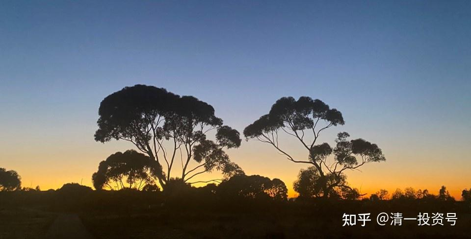

**原专栏7篇.揭秘“国家担保标的”**

清一山长 2018年1月2日

说过国庆节我会公布我的“国家担保标的”的，现在履行诺言吧！

原贴：[网页链接](http://link.zhihu.com/?target=https%3A//xueqiu.com/9310099567/91986528%2522%2520%255Ct%2520%2522_blank%2522%2520%255Co%2520%2522https%3A//xueqiu.com/9310099567/91986528)（此链接已失效）

一、真的有批发价比零售价还高48%的市场产品吗？

这种事，在实业界是绝无可能的，早就会被蜂拥而来的资金抢光了。但是，金融界真的太变态了，会出现种种完全违背市场规律的事情。因为金融界的市场先生一向很疯狂，真的会把各种不可能的价格都给弄出来，价格可能会高到离谱（比如400元的全通教育），也可能低到你觉得不可思议。可惜，我们无法要求市场先生讲理性，讲“市场规则”等等，我们无法说服他们按照经济学家要求的原则来报价。但巴菲特说：“我们只能，且应该好好地利用市场先生的错误。”如果您觉得市场先生给了你一个可以利用的机会，您就去买一点折价48%的产品。尽情地利用市场先生的错误吧！

请看公开的市场报道：光大银行(601818)(06818)发布公告，于2017年5月2日，该公司与认购方订立认购协议，据此，该公司拟配发及发行合共不超过65.69亿股H股股份(其中华侨城认购方认购不超过42.38亿H股，光大集团认购不超过23.31亿H股)，认购价为每股5.3283港元，较收市价每股3.60港元溢价约48.01%。

认购股份的上限占该公司已发行股本约14.07%，及该公司经配发及发行认购股份扩大后的已发行股本约12.34%。认购股份受自完成日期起计60个月的禁售期规限。

认购事项的所得款项总额将不超过350.02亿港元，认购事项的所得款净额将全部用于补充该公司核心一级资本。

据悉，于2017年5月2日，光大集团直接持有该公司已发行股本约25.15%，并为该公司主要股东。

二、这家公司真的是“国家担保品”吗？

当然是，中央汇金是她的大股东，这家全国性银行，是财政部（汇金的后台老板）的“亲儿子”，地位仅次于四大，大约位置是“六大”，列于交通银行之后。所以，国家会严格监管并防止这样的企业出现系统性风险。

也正因为她有着“超级硬的后台”，所以，一旦你选择在香港的金融机构给你融资，你可以取得目前市场上最大的融资额度比例。如果你有1000万元的自有资本，你可以买入4000万元的光大银行。而且，利率如果你借入欧元，结算只需要1.5%左右的利率。如果你借入港元，只需要2.2%左右的年利息。相对于国内融资8.35%的利率，这简直就是白送一样。而且，融资你还无需展期，你可以一直借用这笔钱，一直到你愿意还为止。

三、风险防范和配置：

首先，利率风险应该是零。因为，光大正常的分红，接近5%。但去年因为资本金紧张（业务太好了），所以分红少了一半。估计这也是造成光大银行股价低迷的原因。但相信2018年会恢复正常的派息。

第二，价格波动风险。融资4倍的话，如果跌幅达到20%，就爆仓了。这有无可能呢？还是有的。虽然从估值上说，比如PB值，光大几乎就是最近五年的最低价格。但是看了最近五年的k线图，最低的价格，就是现价（3.6港币）下跌20%的样子。所以，全额融资买入的风险，还是无法避免的。所以，不应该用满券商给的融资额度。我认为如果放一倍的杠杆率（1000万本金，买入2000万的股票），就可以抵抗50%的跌幅，不用太担心平仓，最大限度地保证了这笔投资不会爆仓，用来熬过去艰难时间就好了。所以，真正安全的做法，是留下50%的融资余地作为“护城河”使用。不要太贪心，真的给四倍，你就买入四倍了。这样的话，你必须每天都祈祷市场不要往下跌。一跌你就要被平仓（IB是跌一点平一点的，让你总在下跌中卖出，不亏死了吗？）。这样的生活，实在太紧张和无趣了。所以，我决定只买超过本金一倍的仓位就放手。不要这么贪心。

风险防范手段之二：如果我要融资的话，我不喜欢单一仓位持有一只股。所以，我会把买入一批与光大银行估值和利率回报都差不多的金融股进行“配比”，本次特别名单如下：

目前最低估的四家银行：

9月30日 收盘价 资产净值 市净率（价格以人民币计价）

中信银行 4.23元 7.27元 PB 0.57

光大银行H: 3.08元 5.15元 PB 0.60

民生银行H 6.10元 9.94元 PB 0.61

交通银行H 4.86元 8.10元 PB 0.60元的仓位

外加两家我特别看好，认为比银行更有前途的金融股：AMC企业，也是财政部的亲儿子，就是中国华融和中国信达。

中国华融的经营情况资料如下，她很可能是最有前途的金融股，相当于十年前高速发展的银行，市盈率与银行差不多。所以应该比银行更值得投资。

中国华融2012-2017年连续五年的经营情况汇总：

资产规模年复合增长率45.5%

收入总额年复合增长率38.2%

归属于本公司股东净利润复合增长率35%

归属于本公司股东权益复合增长率35.5%

ROE（2016年）为18.4%，5年平均19.7%

成本收入比（2016年）为17.7%

目前的价格：9月28日收市价 3.48港元。预期今年的收益是：0.65元。所以她的动态PE仅仅是：4.5倍 动态PB：0.87倍。

当然，还有中国信达！9月30日仅仅2.88元港币的价格，提供了无与伦比的安全边际。所以，六只股票，可以一起配备进去，作为一项安全的融资计划。

为了防止爆仓，我还买入了一个融资额度也一样是四倍的香港本地股，嘉华国际。这家公司是香港房地产商，经营特别的保守，虽然不是国家担保品，但4.5倍的市盈率，0.5倍的市净率，提供了我足够安全的垫子。我认为买入后下跌幅度，不会超过30%。

风险提示：

本人已经用香港的IB账户，融资买入了以上标的，融资额度100%。也就是说，如果有1000万元自有资本，就只买入两千万元的上述“国家担保品”。我买入后，准备迎接下跌不超过40%的跌幅。也准备三年或者五年，获得两倍以上的涨幅。而且上涨途中我不计划增加融资，不追高，可能会换仓。

最大的风险：我有可能遇到极端的黑天鹅，这笔投资会下跌50%以上，导致我全部亏光的结果。如果发生这种情况，我还有其他不融资的账户，资金比融资账户更多。东山再起也很容易，不会影响我的日常生活。如果您无法做到我这样融资后就“准备完全亏光”的策略，请不要模仿我的操作和持仓。

有奖征求：请雪球高手们对我的投资组合中的投资逻辑问题，投资风险问题，研判错误、不足等，提出宝贵意见。有理有据，就有奖。有奖买抽！欢迎多抽。

雪球组合：[网页链接](http://link.zhihu.com/?target=https%3A//xueqiu.com/P/ZH1179508%2522%2520%255Ct%2520%2522_blank%2522%2520%255Co%2520%2522https%3A//xueqiu.com/P/ZH1179508)[https://xueqiu.com/P/ZH1179508](http://link.zhihu.com/?target=https%3A//xueqiu.com/P/ZH1179508)

**评论回复：**

**[生活从周末开始](http://link.zhihu.com/?target=http%3A//xueqiu.com/n/%25E7%2594%259F%25E6%25B4%25BB%25E4%25BB%258E%25E5%2591%25A8%25E6%259C%25AB%25E5%25BC%2580%25E5%25A7%258B)回复[清一山长](http://link.zhihu.com/?target=http%3A//xueqiu.com/n/%25E6%25B8%2585%25E4%25B8%2580%25E5%25B1%25B1%25E9%2595%25BF)：**

这样的投资思路有两个错误。一是锚定的理的错误，把大股东增发价当作企业价值及市场定价。增发价高于市场50%是完全正常的，设想你用300亿资金到市场买，在港股这样的流动性下，你买的平均价可能远超过溢价50%的水平。当然这个价能增发说明参加者看好光大的未来价值，但认为好不等于事实上就好。另外别人可以等上十年、八年，待到价值回归，或者说另一个经济周期的到来，你的融资能等多少年？二是小股东做大股东的梦。小股东投资能拿到回报只有两条路，一是分红，二是股价涨。而大股东还有第三条路，通过关联交易从光大拿到贷款，授信额度。因此它参加增发未必指望股价上涨带来回报。想想恒大许老板可以挥挥手亏70亿卖万科股份，你能亏几个亿？

**清一山长[2017-10-07 12:30](http://link.zhihu.com/?target=https%3A//xueqiu.com/9310099567/93338791)回复[生活从周末开始](http://link.zhihu.com/?target=http%3A//xueqiu.com/n/%25E7%2594%259F%25E6%25B4%25BB%25E4%25BB%258E%25E5%2591%25A8%25E6%259C%25AB%25E5%25BC%2580%25E5%25A7%258B)：**

[大笑]。您的提问很正确，可惜跟投资逻辑一点关系也没有。许老板亏70亿，我能亏多少？我当然亏不起，比不过许大老板。所以，我才买七八家企业，不敢押注任何一家（其实可能更多）——要亏就七八家公司都全部倒下，我就跟随倒下算了。[大笑]。您可以算这个概率有多高。

**[生活从周末开始](http://link.zhihu.com/?target=http%3A//xueqiu.com/n/%25E7%2594%259F%25E6%25B4%25BB%25E4%25BB%258E%25E5%2591%25A8%25E6%259C%25AB%25E5%25BC%2580%25E5%25A7%258B)回复[清一山长](http://link.zhihu.com/?target=http%3A//xueqiu.com/n/%25E6%25B8%2585%25E4%25B8%2580%25E5%25B1%25B1%25E9%2595%25BF): **

许老板高杠杆借款，全部押注一家公司，其实比做金融危险得多，跟赌博也差不多了。只是他成功了，你觉得他是正确的。但很多实业家，就因为这个原因，破产的真的太多了。

**[清一山长](http://link.zhihu.com/?target=http%3A//xueqiu.com/n/%25E6%25B8%2585%25E4%25B8%2580%25E5%25B1%25B1%25E9%2595%25BF)[2017-10-07 12:59](http://link.zhihu.com/?target=https%3A//xueqiu.com/9310099567/93339302)回复[生活从周末开始](http://link.zhihu.com/?target=http%3A//xueqiu.com/n/%25E7%2594%259F%25E6%25B4%25BB%25E4%25BB%258E%25E5%2591%25A8%25E6%259C%25AB%25E5%25BC%2580%25E5%25A7%258B)：**

[大笑]您的提问很正确，可惜跟投资逻辑一点关系也没有。许老板亏70亿，我能亏多少？我当然亏不起，比不过许大老板。所以，我才买七八家企业，不敢押注任何一家（其实可能更多）——要亏就七八家公司都全部倒下，我就跟随倒下算了。[大笑]您可以算这个概率有多高。

**[牛宝贝儿888](http://link.zhihu.com/?target=http%3A//xueqiu.com/n/%25E7%2589%259B%25E5%25AE%259D%25E8%25B4%259D%25E5%2584%25BF888)回复清一山长：**

强烈提示有可能要模仿山长的操作方法的散户，山长整个这次的融资总额可能占不到山长总额的10%（恕我瞎猜），就算全部亏光（概率几乎为零），也不会影响山长的事业、生活，所以请众位小散量力而行，怕的是到时候融资占比太高，经受不住风险考验，亏了钱，又来怪山长，变成“清黑”，那可真是太冤了。

**清一山长[2017-10-07 12:48](http://link.zhihu.com/?target=https%3A//xueqiu.com/9310099567/93339070)回复[牛宝贝儿888](http://link.zhihu.com/?target=http%3A//xueqiu.com/n/%25E7%2589%259B%25E5%25AE%259D%25E8%25B4%259D%25E5%2584%25BF888): **

支持，**一般人的确不要玩杠杆。我是做生意的人，一直习惯了上杠杆**。当年做生意起家的时候，自有资金只有一万，但高息借了十几万元，杠杆率十几倍，年利息33%。所以现在玩一倍的杠杆，利息1-2%的，对我来说实在是“安全至极”的，毫无压力。没做过生意的人，就省省吧！**不修德，不修心的人，明明有钱都赚不到的。**

深呼吸a 回复清一山长：

山长老师，感觉你一直比较稳，喜欢寻找价值低谷，而且也不忌讳于融资。投资也比较分散，都打得是有把握的仗。对于大资金的您来说，稳定的复利持续的滚雪球，投资理念已经成型。像我等小散二三十万资金如何在股市里操作呢，如何达到财富自由？现在非常困惑。想听听您的高见，还望老师不吝赐教。

清一山长2017-10-07 12:51回复深呼吸a：

我只有20-30万，也是一样做的。别忘了**我的投资起点，入市仅仅一万二千元。**

**[云蒙](http://link.zhihu.com/?target=http%3A//xueqiu.com/n/%25E4%25BA%2591%25E8%2592%2599)回复[清一山长](http://link.zhihu.com/?target=http%3A//xueqiu.com/n/%25E6%25B8%2585%25E4%25B8%2580%25E5%25B1%25B1%25E9%2595%25BF)：**

资本市场变幻莫测，很多人身处其中而迷失了方向，错乱了心神，导致悲剧的结果。资本市场没有什么神秘的东西，本质还是投资企业，只要平淡看待波动，坚守基本的常识，耐得住寂寞，守得住繁华，想不成功都是非常艰难的。我没有做过实业，但我觉得清一老师眼前提到的这个生意是实业投资者不可想象的：

清一老师提到的7家标的平均市净率只有0.6倍左右，而它们期初ROE超过12%，也就是说一年下来从生意人角度看一年能赚20%。这7个标的从生意角度看都是非常好的标的，只不过资本市场总是给表现好的找理由，也总是给表现差的找原因，而人性总是总是跟着趋势走，乐观的时候总是乐观过头，悲观的时候也总是悲观过度，这其实才是我们价值投资能存在的基础。所以说资本市场和实业不同的是，会有市场这个疯子每天报个价格扰乱投资人的心神。

清一老师也提到了融资欧元来规避国内高额融资的利率，其实您那个量的融资资金年化利率是0.56%，远低于国内的融资利率。未来5年，可以看到美国、中国还会蒸蒸日上，而欧洲大概率在政治、经济和文化等领域继续会走下坡路，而现在是完全可以融资欧元年化不到1%的资金来做一年稳赚20%的生意。和实业不同的是，还是会有市场这个疯子每天报个价格扰乱投资人的心神。

清一老师提到的融资黑天鹅，这也是大家经常提到的，首先世上没有无风险的事情，只是一个概率而已，让这7家标的在历史最低估值的位置同时暴跌50%，这个概率应该小于车祸的概率。其实就是跌50%，只要不在1天内暴跌，按照4倍平仓杠杆的要求，这1000万融资1000万依然可以保住40%左右的股份，基本上会是这样：平均跌25%之前不会有平仓，跌25%的时候流动性枯竭，然后再每跌1%平仓4%的样子，25次每次4%的平仓后还有40%左右的股份。和实业不同的是，由于杠杆效应每天盈亏会有较大的波动导致投资人心神不宁，亏了熬不住，赢了守不住。

需要强调的是，**世上没有无风险的事情，尤其是杠杆投资需要投资人想清楚两件事——这笔生意是否划得来？市场波动是否扛得住？**每个人对划得来扛得住有不同的理解，以上意见仅供参考，据此操作，风险自负。

清一山长[2017-10-07 13:09](http://link.zhihu.com/?target=https%3A//xueqiu.com/9310099567/93339483)回复[云蒙](http://link.zhihu.com/?target=http%3A//xueqiu.com/n/%25E4%25BA%2591%25E8%2592%2599):

我刚打赏了这条评论 ¥100，也推荐给你。说明：我的【国家担保品示范】一文，是希望给股民们一个正确的投资思维逻辑的示范。但本人水平有限，怕误导人，故有奖征求意见和批评：请雪球高手们对该组合中的投资逻辑缺陷，投资风险问题，研判错误不足等，提出批评和意见。有理有据，就有奖。

**癫自石来回复清一山长：**

除了杠杆外，其他都赞同！

**清一山长[2017-10-07 13:36](http://link.zhihu.com/?target=https%3A//xueqiu.com/9310099567/93339906)回复[癫自石来](http://link.zhihu.com/?target=http%3A//xueqiu.com/n/%25E7%2599%25AB%25E8%2587%25AA%25E7%259F%25B3%25E6%259D%25A5): **

同意[赞成]。不过这一条巴菲特已经早就说过了。所以，就不给你打赏了！等有机会打赏老巴！[大笑]

**清一山长2017-10-07 19:09回复小农夫 ：**

不要跟不同意见者争吵，永远不会赢的。每个人都认为自己是对的，让市场来说话好了。

**[朴拙投资](http://link.zhihu.com/?target=https%3A//xueqiu.com/9310099567/93722668)回复清一山长：**

谢谢！山长给我们这些小散，示范投资思维。从国家担保标的这篇文章中，我获得很多信息；使我提前布局一些国家担保标的。1：嘉华国际：如果我没有分析错的话，应该是9月20号平均成本2.83买进2M；此股价值低估，吕老板信誉一流。2：这个持股组合非常不错，硬要找一点缺点的话，那就是行业配置太过于集中在金融行业（当然这并不是老师你唯一账号）。我自己单一账号的话，我一定会再配置制造业、煤炭行业个股等，这样假如金融业发生黑天鹅事件，也不会伤筋动骨。

**清一山长[2017-10-14 18:29](http://link.zhihu.com/?target=https%3A//xueqiu.com/9310099567/93722668)回复[朴拙投资](http://link.zhihu.com/?target=https%3A//xueqiu.com/9310099567/93722668)：**

[很赞]。我的融资方案，是用安全无忧的【**国家标的**】来借款，融资一倍。但我用其他跌不动的、高息、小盘、低市盈率、市净率的小股票，来作为保障的资金池。比如【胜狮国际】之类的，还有消费类，制衣业等，共20来种小股票。如果发生意外的下跌，这些小股就提供了最大的安全垫。如果上涨，这些小股票涨得最疯，比正股还有“投资、投机价值”。如正通跌到2.5元，涨到9元多卖出。这些股票就是“安全垫”，比公布的还要厚实。但我不方便透露过多，避免影响市场。我公布的正股，主要好处是跌不下去。它们是不是最能涨的，倒不一定。