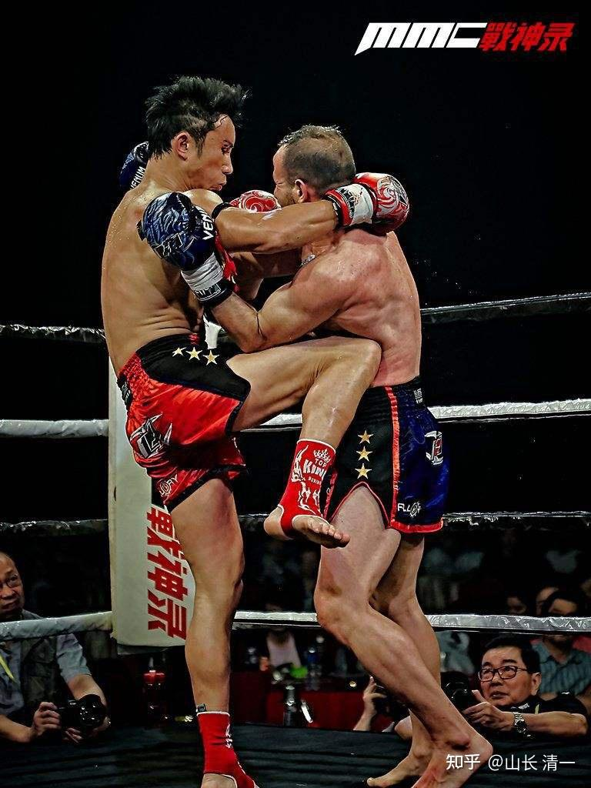

昨天在拳馆训练的时候，我们的太极小拳手，跟一些去中国练过散打，目前也正在泰拳馆练习的欧洲人试手交流，男打女。结果我们的小拳手发现打中他们并不难（对方一出手，我们就会抢先移位，错位攻击，出手封杀对方攻击的同时还要还击对方，这是内家拳的后发先至格斗要求），而这些拳手却很难击中我们的小拳手。不过他们对此结果并不在意，说他们原来去中国学过功夫（散打）。知道中国功夫的特点，就是速度更快，技术也更好。但----中国功夫没有力量。他们来学泰拳，虽然速度会慢一点，技术上也不是很高明，但很实在。攻击的力量很强，所以他们认为还是泰拳更厉害。言下之意，就是中国功夫有花拳绣腿之嫌。

不怪别人这样说，实话实说：站立格斗中，泰拳可能是最强的格斗技术了。泰拳的核心，强调重创对手，不是太在乎拳手的身体伤害程度的。日本比武中中有“寸止”的要求，以及中国过手要求的“点到即止”，常常以点数来获胜，导致中国散打对拳手的保护更多。当然，在兵器时代，这种不尚厮打耐心的技术是有效的。无论是用刀，用剑，一旦你被“点到”了，其实你就输了。就算当时还可以一斗，但对手只要脱离距离，你跟你拼死，你你一定输掉的。所以，从传统的武术格斗里面，产生的中华传统武术，你用原样招式照搬，肯定是无法去和作为体育竞技来弄的现代格斗打的。并不是说：现代格斗的能力就更强了，而是他作为一个竞技系统，他的技术和要求，和传统的战场搏杀系统肯定是不一样的。我们必须根据赛场的需要，重新制定新的训练方式。如果按照传统中国的招式，传统的训练技术，用传统练法，按照泰拳的规则来上场打斗，我们肯定是输家。我估计：这就是中国传武这么多年一直走不出来的原因。特别是泰拳，有一个其他拳种可能没有的特点，就是泰拳的赌拳很厉害。泰国赌博是非法的，但赌泰拳就是合法的。观众喜欢看拳手们竭尽全力的拼搏，很忌讳假拳（虽然难以避免）。所以拳手们上场，往往都是全力以赴的。擂台上，没有啥“友谊第一”的说法。而是赢家通吃。当然，一些表演给游客看的泰拳，打斗起来就温和多了，就像是训练赛。与伦披尼这样的拳场比赛相比，根本就不是一个级别的。

前几天，清迈这家泰拳馆，去曼谷伦披尼比赛的职业拳手，打了三百多场比赛的女冠军，最终的结果是输掉了。虽然前两局，她还是占优的一方。但因为对手在前两局，双方互拼的时候，远距离用腿不断攻击她的大腿内外侧，结果这种积累下来的伤害，导致她的大腿都淤青了。严重影响体能和技术，所以导致第三局之后，她的状态和体能就急剧下降，无法对对方的攻击进行有效的应对，导致最终输掉了这场比赛。回来后在家休息了一个星期才来拳馆恢复训练。可知泰拳的硬度和力度，都是很强的。

从这个案例就知道：中国的太极，要用泰拳的规则，来与泰拳选手一较高低，就必须训练抗击打能力。不然你击中别人十拳，无法打垮对方。但别人只要击中你一腿，你就垮掉了，结果自然是你输了。除非你是拿剑来进行拼杀。

实战中，泰拳是很追求远距离打击的效果，训练中，都是“放长击远”的模式，尽量的拉开身形的长度。特别强调腿击的力度和速度。你们看播求的训练视频，靶师都会被他踢了站不稳倒下去。所以，如果是远距离跟泰拳拼腿击技术，拼身体的硬度，抗击打力，基本就是找抽的。相同的技术，就算赢了也是惨胜。各位可以搜索播求与对手死拼的一场比赛，双方全都打得血糊糊的，实在是残酷。腿击力量超强，据说原来有一些中国拳手，一上去没多久就被踢断了小腿骨，肋骨等。用手接泰拳鞭腿的，据说还有被踢断了手骨的人。可知泰拳的攻击力量之强大。

如果采用中距离（手臂距离）来拼拳的话，客观来说是有优势的。因为泰拳的手击技术，就比腿技术差得多，远远不如拳击的技术细腻，所以是很大机会的。甚至训练中，以及比赛中，我们看到很多普通的泰拳手，前手基本上不会用来攻击，有点摆设的味道。主要用后手进行大力的重拳攻击，一旦被击中还是很倒霉的。高级泰拳选手，为了提高中距离搏斗水平，会专门去学习拳击技术来恶补。那么，我们是不是可以利用泰拳手的中距离弱点，技术不强的特点，跟泰拳选手拼中距离的格斗呢？其实又错了。因为泰拳本质上，他不重视中距离拼拳，是有道理的。他们大可以跟你拼远距离的重腿，让自己处于优势的地位。如果你想要拉进距离，泰拳手会随时把你拉入更近的内围战。他们才不会用自己不擅长的拳技术来跟你打的，而是会用他们很擅长的内围战优势，用肘部和膝部来干掉你。欧美选手，在内围战中对付泰拳手是很吃亏的。内围技术上，由于拳击只能用拳头部位攻击，所以拳击的内围技术，主要就是双方搂抱，没有啥真正的实战意义。但泰拳的内围，是非常重要的作战战术，甚至是决定胜负的战术，是泰拳选手全身几乎所有部位，都必须参加的全方位决斗。泰拳内围，除了头部，任何部位都可以用来攻击。这对于练拳击的人来说，内围战就是噩梦。

中国一般的格斗运动员，其实也比较怕泰拳的内围战。比如，我看过一场比赛：中国排名前三名的散打王，对战泰拳选手，应该只是泰拳的二流选手---播求的大弟子，结果被打到很惨。全场看下来，基本上没有啥胜的机会。勉强支撑到三个回合，直到最后被KO，赛后这人就直接退役了。为啥：完全桑失了格斗信心。因为散打的技术，就没有能够有效地对抗泰拳的技术优势，所以一路基本上就是被泰拳手压着打的。我看到前两局，双方对战中，我国拳手外围战的实力不足很明显。踢腿的力量和进攻有效性都不行。只会用一些摔法来对付泰拳的腿击，散打的出腿，可以说对泰拳手基本上没有威胁。用摔法，看着好看，但对付泰拳却没有得分，但中国的散打摔法（慢摔），是很耗费体力的。反而耗费了自己的大量的体力。都是泰拳不能摔跤，其实不是不能摔跤，是不能纠缠在一起，要求“搭手即摔”，闪电摔。不允许用腿，用身子来别住对方，用杠杆力来摔跤。不能搂抱和扛起对手来摔跤。这个散打队员相对擅长的摔法，实战中，并没有起到伤害对方，减少对方战斗力的作用（除非在地面格斗，抱摔可以让对方严重受伤），只是在拳台上摔一跤的话，根本就没事。不如挨上一重腿的打击效率更高，这就是现实中的实战，与擂台上实战技术的差异。你必须放弃一些上了擂台就“无用”的技术，也必须放弃一些带上拳套就无用的技术来打拳。中国摔跤，对于散打来说是“得分”的，算是有用的技能，对泰拳就是无用了。

由于中国拳手的距离作战不敌泰拳，就只能用进入内围作战来回避外围能力不足了。可中国的散打队员，偏又不会对付泰拳的内围肘膝攻击，所以场面上，是完全处于劣势。加上这个散打队员，体能上又不会控制节奏，距离感保持也不对，第三局就体能严重下降，连基本的防守姿势都丢了。估计是体能耗尽，最终被一脚高扫踢KO。赛后连复仇的心思都没有，直接退役。我看这是对自己的散打技术绝望了。不像李景亮，被对手KO之后，一门心思要打复仇战。这就是中国散打的真正实力----对拼，还真不是泰拳的对手。

那么，一向软绵绵的太极，用来对战泰拳的重炮强力攻击，有用吗？想要对付泰拳的狂轰滥炸，太极拳有何办法？

其实是有的：首先就是不能陷入外围远距离作战的坑里面。跟泰拳拼腿法互轰，我们根本就不占便宜。别人500年的实战经验积累，拿什么实力去拼？中国武术一向强调“脚起半边空”，传统上，不是很重视腿法进攻的。特别不赞成出高腿。所以我们在武术基因上，就不能选这一条与泰拳对拼的路。选了这条路，也只能跟泰拳一样的练腿击技术，就别聊啥太极了。在这个距离上格斗，泰拳就是权威。我们就别忽悠别人了，假装中国功夫处处都是第一。虽然我也教孩子们如何去对付泰拳的腿击，核心就是面对腿攻击，别躲，别逃走。反而要往前冲，进入泰拳手腿击的死角区域进行格斗。或者以腿还腿，利用我们步伐的灵活性，进行错位对攻。绝对不能站在原位来防守，双方硬拼抗击打力，我们就没有赢面了。就算勉强拼过去了，也是很划不来的。因为这不是太极的格斗心法。

如果只是进行中距离格斗，这本来就是泰拳的弱项。我们小拳手的拳斗能力是很强的，对手很难有效击中我们小拳手的头面部。但困难点是：我们是无法与泰拳手有效的保持中距离。略远一点，就要被腿攻。靠近一点，就要被内围战的肘部膝部攻击。我们自己是很难控制保持这个恰当的距离。这个距离，除了拳击技术外，我们也没有很好的技术可以使用。特别是这个距离，用拳互相打击，很难造成对手的伤害。所以欧美的拳击比赛，会安排总共12局一轮的比赛。原来还有更多，需要打15局，双方才能分胜负。而泰拳，是3-5回合就必须解决问题的。所以，不可能选择“拳击距离”来跟泰拳拼，规则不一样。别人肯定不跟你这样玩的。

所以我们如果一定要用中国的传统功夫，来跟泰拳实战，就只剩下唯一的选项：必须在最血腥的泰拳内围战上，跟泰拳手一较高低。虽然看起来，这是最危险的选择，但这是太极唯一可以选择的方向。除此之外，我们没有其他有效的技术路径了。

*泰拳内围战：号称贴身缠斗最可怕的技术！ *

太极对泰拳内围战有没有机会呢？还真有。这个领域，可能是唯一中华传统武术格斗体系和理论中，可以与这些长期擂台征战的外家拳，拼技术和内涵的地方。

实战太极，强调人要练到“一身都是拳”，身体上的任何地方，都可以用来打人。如果你真的理解了这是要练什么技术？你就明白了：泰拳号称三宫步，八体技。也就是用身体肢端的八个部位来打人。中国太极起码是“12体技”。因为泰拳还是用四肢来进攻的，每个肢体用前面的两节进行攻击。而中国的传统武术，是要练出四肢的“三节”，都要用来进行格斗。各位去看太极拳经【九要论】。这个要求是很清晰的。只是很多人只知道这个名词，但不懂得用法，更不懂练法。如果练太极的不懂“三节格斗术”，甚至很多太极拳手，连一节都用不好（“一节”上用的比较好的，就是以拳击为代表的西方格斗术），当然就只能被动挨打了。目前说太极不能打，就是我们现代的太极练拳的人，都没有练出“节节贯通”的打击技术来。

说起来，太极技术，就只是比泰拳多了肩和胯（跟节）这么一点，看似没啥优势的部位，也是一般人根本就不会发力，也认为不可能发力的部位。但一旦会了三节，你的训练方式，以及实战技术，就完全两样了。就像是泰拳的训练体系，与拳击的训练习题肯定不一样。全世界的武术格斗，目前我看，还没有重视和使用“跟节实战技术”的。我知道的唯一使用跟节技术的，就是以太极为代表的中国传统内家拳。如果你知道有其他拳派用跟节用的高明的，可以告诉我一声，给我个学习，开眼界的机会。

太极瞧不起外家拳，就是认为外家拳练的就是“梢节技术”，不够高明。因为太极强调练更核心的“跟节发力技术”。可惜的是：现在练太极的人，别说核心的“跟节技术”了，他们连最“梢节”的功夫都没有，都是全玩虚的。自然不能打了。只能内部自己玩。

你要理解一下什么是“三节格斗术”的区别，我可以用现代格斗来详细的介绍一下。拳击就是仅仅采用单节（“末节”拳头）的格斗技术拳种。这种使用肢体的方式，是相对最符合人体惯性和常识的，也是最简单，最符合人体习惯的。所以，拳击，也相对最容易练。只要你去认真练了三个月的拳击，打一般人，已经绰绰有余了。另外，韩国的跆拳道，也是“末节格斗”技术的体现。属于“单节格斗技术”。特别是奥运会的跆拳道比赛，双方都是拼用“足部末梢”去打人。据说手还不能用。他们就是三节技术最初级的攻击技术。本质上都是一类的。

但泰拳就多了两节技术，因此成为现代格斗中与拳击完全不同的“异种格斗”技术，实战中，也更有伤害性，打起来比拳击更血腥一些。这就说明：泰拳很强调“中节”格斗技术的运用----使用肘部和膝部对对手进行攻击。因为多了这两项技术，就让泰拳手成为“八体技”，而不是普通技术的“四体技”。让泰拳拥有在长距离的腿击，以及短距离的内围肘膝技术上，综合格斗水平，算是站立格斗的“世界第一”了。其他综合格斗，MMA。本质上，没有超过泰拳的技术，泰拳选手也很容易进入MMA以及UFC的赛场进行格斗。而其他如拳击选手，跆拳道选手，就必须重新练新的对抗技术，才能上泰拳场了。

那么，泰拳是两节，八体技术。中国的实战太极是啥技术呢？太极是“三节十二体打法”。这是我知道的，唯一能够真正把人体三节格斗技术，全都用上来进行格斗的拳种。一旦太极拳手真正练出来了“12体打法”，是可以向下兼容，去参加四体的拳击赛，以及八体的泰拳比赛的。真有12体技术的话，就算采用拳击规则，以及泰拳规则来打，要取得对抗这些拳种的优势地位并不难。将来一旦太极的这种优势被认可，是有可能成为世界格斗界的“王者拳种”的。至少目前在拳术理论上，是可行的（如果理论上都不可行，我就根本不会开武馆，来试验这种与现代格斗的比赛了。想打架的话，大家就直接去学泰拳得了）。但实践上如何呢？说实话，我原来只看古书上，拳谱上看过这种打法。但很幸运的是：我在现实中，我也看到了两个传统拳的拳师，是使用12体打法的。可惜的是：这两个拳师都没有传人。他们似乎不知道怎样教出来跟他们一样的学生。有人跟学了快20年，都没有学到他们身上的功夫。不知道是不会教，还是因为保守，不愿意教。当然，愿意教，也不见得有人愿意学。学太极，比学拳击，泰拳难多了。我们的拳手，练了两年后，国内去拳击馆训练，很快就掌握了拳击的技术，比其他专练拳击的强得多。练了两年多的小拳手，第一次去泰拳馆训练。就打得像模像样的，教练都很喜欢。孩子们觉得这些技术很容易掌握，这就是太极具有兼容性，要模仿别的拳法很容易。还可以打出别的拳法不可能打出的招式来。所以，未来我们的小拳手练出来了，你就可以第一次在赛场上，看到我们的小拳手用12体技术进行格斗了。我就是担心：你看了也看不懂。因为能够看出双方发力技术不一样的人，非得自己也是高手才行。没练过拳的人看，只会觉得都差不多。

内围技术本质上，是太极的优势和特点。太极本来就是为了缠斗而生的，而不是拉开距离来打。老祖宗们，在古代残酷的战争中，一直在找到更好的格斗方式，才能顺利地在血肉拼杀的竞争中生存下去。所以，古人发展出了采用“更高维度”来训练和实战的太极拳法。当时创立者的目标，是要用来对付当时的外家拳（古书云，得其一二，足以胜少林）。主要就是两者练习的维度不一样。我们比外家拳，多练了一个维度---跟节劲。太极拳，为啥一直崇尚“柔和软”？师父天天叫你练拳，必须练到大松大软才合格。因为太极必须要用肩胯两个部位来发力，来打人。如果你的身子是硬的，怎么可能用出来太极的力量？为啥练了外家拳的人，来改练太极的时候，特别的困难？就因为他们已经把身子都练硬了，再改过来习惯很难。脑子接受了，但“肌肉记忆”不接受。所以，真太极，其实很难教给练过现代格斗的人，因为技术核心就不一样。我的武馆里面，有拿过青少年搏击冠军的人，跟其他人一起跟随练太极格斗。但就是练不过从头开始的新手。虽然技术上也有进步，但很遗憾，光改习惯，就够他忙的了。反而是从来没有学过拳的新手，上手要快得多。目前清一武道馆具备可以与现代格斗实战能力的拳手，都是零起点开始练的。练成之后可以说“笑话百出”，就是去拳击馆，和泰拳馆里面一练，一出手，一动足，教练们都说全练错了。但实战能力有很强，他们难以理解。这就有点笑死人了。

比如，我们的小拳手去拳馆练习的时候，起脚攻击中，被对手抓住了腿。但对手却无法把我们的孩子弄倒，反而被我们的拳手用双手来打击他的头面部。结果拳手只能赶快放下抓住的腿，还说：不能这样打。问他难道犯规吗？说虽然不犯规，但泰拳不是这样打的----其实是泰拳打不出来这种拳。因为泰拳手被抱住腿之后，双手是无法发力的。这就是练“梢节”功夫的特点。而太极练“跟节功夫”的人，被抓住任何地方，都会“放空”，不会影响其他部位的攻击。我们的单足是可以发力的。所以，就算被抱住一条腿，依然可以用双手来打人。

另外，对抗训练的时候，我们的小拳手，有时候会同时用双手分别攻击对方的面部和腹部。让他们防不胜防，经常中招。但泰拳训练师却说：你们不能这样打。问为啥？说这样双手打拳，是没有力量的。但他明明看到我们的孩子，是能够打出力量来的。他们接拳的时候，会连连倒退。但泰拳训练师说的也没错，一般人练梢节功夫的，就必须用双手轮流发力，才有力量。至少双手，必须共同一个方向来发力（其实就是双手一起推的力量）。但外家拳手，是不太会把双手，分别用于不同方向上，再同时发力的。各位看官自己试试看就知道了：你能否单足站立，发出又快又重的力量?你能否同时用双手，往不同的方向，发出很强的力量？比如一个往左打？一个往下打？你肯定能用手比出这个动作，但没练过真太极的人，只有动作，是没有力量的。由于实战太极拳手，会这种“双拳同时反向发力技术”，就让我们的拳手格斗中，特别是内围近战，比对方多了一个维度。更容易取胜。

所以，各位别以为“跟节打人"，就一定用肩膀去打人，用屁股去撞人，才叫“跟节打人”。而是“跟节发力技术”的使用，才是真正最关键的内容。这样，可以帮助双手双脚，都获得更多的打击维度。练出了这种功夫的人，身体是柔软的，会如蛇一样扭动。看起来松松的，一点力量也没有，但搭手就觉得很沉重，这就是太极的“举重若轻”---请注意是“若轻”，不是“真轻”。只是看起来很轻而已，这种出手，很具有欺骗性，容易让人误解没有用力量。有时候我慢悠悠的出手，看着当事人就一下子拍飞出去，本人觉得我用了很大的力量打他。但旁观的人却觉得我根本就没有用力气，肯定是当事人没站稳，或者是故意“配合师父”来做秀的。一些太极骗子，就用“真轻”来代替“若轻”，表示真太极就是这样的。太极就必须练到柔弱无力才好。自然，这种虚假的太极，上了拳台就是别人的菜，爱怎么吃就怎么吃。真太极，其实很威猛的。会令对手不寒而栗的。因为根本找不到对付的方式。谁想确认自己就是真太极的，就走上擂台去打就行了。

太极宗师们，把外家拳叫做根头棍。就是因为外家拳发力是一条线，身体必须挺直，绷紧，才能发出力量。太极是软软的才能发力。所以，在泰拳场上，泰国拳手们，一直很奇怪：我们的小拳手似乎可以一直练下去，就不会累一样。往往练完对抗后，泰拳手们都累瘫了。而我们的小拳手却活蹦乱跳的。问你们不累吗？小拳手说不累，他们摇头不相信。小拳手就说：我们再来打一场，看是不是假的。当然，泰拳手都摇头，说要先休息一下再来。为啥有这种区别? 其实并不是我们的小拳手体能更好，她们对比的是泰拳真正的职业拳手，体能是很强的。主要是双方实战训练中，泰拳手由于是“梢节发力”技术，这种发力技术很累人的，打的时间长一点，体能自然就跟不上了。但如果你会用人体的跟节发力，打人就是不费力的。各位都知道：太极打人，要求是“不用力”。很多人都很迷糊：不用力咋打人？其实是要求你“手上不要用力”，而要用胯部，大腿和足部的力量来用力，来打人。这样用力，当然就不容易累了。想知道有啥区别?你爬两圈，跟走两圈比比看，你用四肢，比跟节的两肢，会不会走起来更轻松？你就知道区别了。

最终结论就很简单了： 为了对付泰拳的“重炮攻击”，实战太极必须用贴身技术，进圈进行“内围战”，并用跟节发力技术，克制住泰拳的肘膝内围技术，这才是唯一的取胜之道。学会跟节发力技术的太极选手，使用肘膝的能力，一点也不比泰国人差，其实我们的攻击方向更多，会从泰拳选手想不到的方向来发动攻击。会用破坏对方重心的方式让对方根本就无法出招，发力和攻击。但如果仅仅看外形，我们与泰拳的差异并不大。看起来都是用肘膝而已，只是我们的拳手看起来更巧妙，这就是三维对付二维的区别了。但泰国人作为拳手，一定知道我们的技术跟他们是完全不一样的，我相信将来你们采访的对象，会不断告诉你们：和这个中国人打很奇怪，用不上力气，他输的蛮冤的。不知不觉就被击倒了-----。（这个时间很快了，几个月后，就有与泰拳手的比赛实战了。现在只有练习赛视频，不够权威，我们等比赛的安排吧）。

本文主要是泰拳和太极的格斗理论解析。下一篇文章，将从细节来讲解分析太极的一些技术细节，如何对付泰拳强大的鞭腿？如果轻松突破泰拳的强大远距离攻击，轻松进入内围来解决战斗？