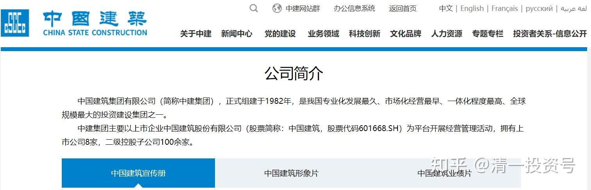

**原专栏71篇.中建有连跌五年就上涨的周期性规律吗？**

[清一山长](http://link.zhihu.com/?target=https%3A//xueqiu.com/9310099567/column) 2020年7月2日

[$中国建筑(SH601668)$](http://link.zhihu.com/?target=http%3A//xueqiu.com/S/SH601668)本轮，我买入[中国建筑](http://link.zhihu.com/?target=https%3A//xueqiu.com/S/SH601668%3Ffrom%3Dstatus_stock_match)的投资逻辑，不是看简单的报表和历史数据，估值等因素来买的，而是**主要看中建的“历史周期规律”来买的**。**一般在股票的这种周期性规律上，又会叠加股票的内在价值估算、低估极限位置等。两者如果叠加到一起了，**我认为就**是最好的买入机会**，我就敢大仓买入这种股票了，也敢大胆介绍其他人买入中建。赢的概率极高，持有被折磨的时间也最短。这就是最近几周我做的事情。不断买入中建（这就是我自称“价值投机派”的意思，我在价值计算的基础上，叠加趋势和市场的周期影响因素，选择最佳的市场趋势变动机会，实际介入标的（买入或者卖出）。

我观察到的中建，似乎存在五年一个大涨跌周期的运行规律，他一般会开涨后连跌五年，不断创造估值新低。然后来一个快速的估值修复，大涨一两年，然后又继续慢慢的继续跌五年，让持有者空欢喜一场。全靠企业的内在价值不断增长，来勉强弥补投资者的失落。中建上市是2009年，一直到2014年，这五年，中建无论绝对价格还是估值，都是一年比一年低，价格2009年的高度7.98元。2014年创新低，2.71元，跌了一大半。尽管每年中建的收益和利润均在大幅增加，但无论价格还是估值，五年来就是不断创新低的过程，这五年坚持持有中建的人，可能哭都哭不出来。假如上市就持有中建，五年后没有赚钱还赔钱。只能每天安慰自己拿了股息，过过日子，数数股票一股没少，就算了。所以，长持中建的收益，远远不如跟随她走大周期，高估就卖出，反复进退的收益高。

2014年下半年，中建迎来估值修复，很快就涨了一倍多。我很幸运，在2014年年中，3元多一点买入中建的。一买就是除了银行股之外的最重仓。当时市场上种种质疑中建，不看好中建的声音。我买入后不到半年，居然就开始涨了，套的时间并不长。最终我在2015年，10元以上全部逃走了（没能在最高点12元走掉）。2016年5元再度买进，年底11.35元再度跑掉，这回几乎是最高点走的。后来奉行破五就买的策略，又进出了几次，仓位不算大。赚点小钱就走了。算算我持有中建的时间，基本上没有超过半年，就一定涨一次，我也走掉资金用于干其他的事情，不跌回五元就是不回头。但中建一直给我回头的机会，一直到现在。估计以后不会有破五的了。

最近五年的走势（2015年年中至2020年中），中建无论是不除权的价格，还是复权的价格，都是一直在创新低的4.77元，就是五年来的最低价。更别说估值的低估了，不断刷新和考验持有人的信心和耐心。虽然这五年，我一直宣称“破五就买”，做了好几个来回。但最近一个月的破五，估值才是最低的。比2016年的破五，以及2017年的破五，估值都要低得多。很像是2014年的局面，一直在跌。所有看好中建的人都不断被打脸。我认为，正因为这样，中建的最佳买入时间已经到来了。

这个股，今年正好达到一个大周期性的极限底部了（中建的五年周期性规律）。所以，我这一次买入的中建，仓位最大，买入的信心也最强，安全感最高。五年的上涨周期来到，套了也就最多套半年，干嘛不买？难得的投资，投机双重机会。也许，大周期就要启动了。戴维斯双击就在眼前。本轮如果启动的话，我就不会6元以上就跑掉了。如果中建重复过去的经验，涨幅最低也会有一倍。我要开始学长持了，坚持到2030年（不排除快速的大涨还是会跑的，我有大涨恐惧症），但保证会至少持有100万股不动。等着看**“[中国建筑](http://link.zhihu.com/?target=https%3A//xueqiu.com/S/SH601668%3Ffrom%3Dstatus_stock_match)2030悬念”**[@晕娜](http://link.zhihu.com/?target=http%3A//xueqiu.com/n/%25E6%2599%2595%25E5%25A8%259C)预测的，中建万亿市值的实现（好像是中建管理层的2030年规划中提出来的）

**古人云：“万事万物，盈虚有道，否极泰来。”没有绝对的破股，也没有绝对的好股。**茅台好到极处，可能会带来不好的结果。中建连跌了五年，烂股票烂了五年，可以会变身好股票了。就是差不多“否极”了？下面的“泰”就要来了？根据西方的方程式和电脑算账，不如用中国道家的思维方式，用能量的转动变化周期来说明，更容易理解！中国的五和七，都是一个奇妙的数字，代表自然和周期的变化循环。

本轮买入，我还有一个核心逻辑，就是后疫情时代，中建更值得拥有。因为我算不清疫情会怎样影响经济和身边的环境，更算不清会怎样影响到企业的盛衰。未来几年经济不好，喝酒的人还会这么多吗？买手机的人会减少吗？会去旅游吗？会卖更多空调吗？甚至私立学校的学费，会不会有人放弃交钱？这些我都不知道，所以都是暗雷——到处都是。但中建似乎最简单、好算，她似乎是很难得的**“疫情无影响概念股”**，您还能找到第二家这种**“疫情和金融危机无影响股”**吗？