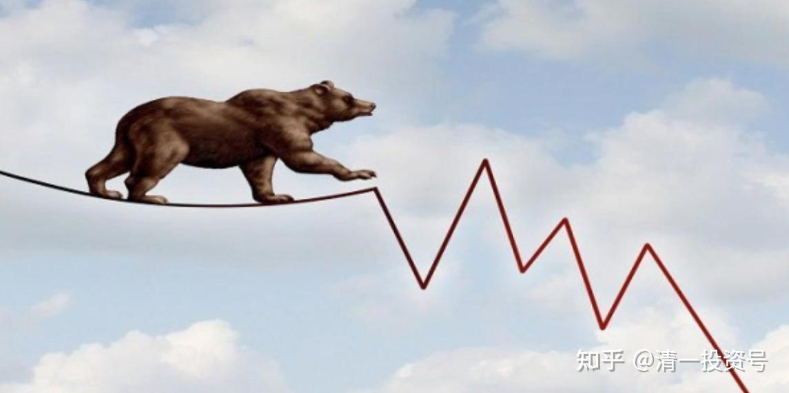

**原专栏74篇.[银行降速，利好中建吗？](http://link.zhihu.com/?target=https%3A//xueqiu.com/9310099567/154231114)**

[清一山长](http://link.zhihu.com/?target=https%3A//xueqiu.com/9310099567/column)2020年7月16日

券商中国记者独家获悉，7月初以来，银监部门对部分银行进行窗口指导，建议适当控制上半年利润增速。

“没有文件送达，而是以口头通知形式提出，大意是上半年利润不要太多反映，增幅尽量不超过两位数，应该多计提拨备，把家底夯实，不良应核尽核。”一位地方上市银行高管透露。

这是啥意思？联系到一个月前的建议是降低分红，夯实资产。简单地说明：上面正在应对未来的大型的金融危机。后面的日子不好过，现在是冬天，多储点粮食。别瞎嚷嚷春天来了。

这个基调，跟我的感觉一致了。跟前段时间的“牛市来了”的呼声，觉得特别的不协调。这个牛市，显然是一场阴谋，一些人拉升，找人垫背的。

如果真是这样，“熊途”恐怕才刚刚开始！做好过冬的准备吧！

就没有好消息吗?

有啊！说明银行其实是真的赚钱了。但上面说，赚的钱别拿出来，先藏起来。万一有问题，拿来填坏账。所以——万一没问题，顺利度过危机，将来银行的利润爆发出来，会大增的。

另外一个好消息，就是中建的增速，未来不会低于10%。也没有打压的必要，所以，中建就成为“绩优股”了。也许对不足两位数增长感到失望的银粉的资金，会来追捧中建？