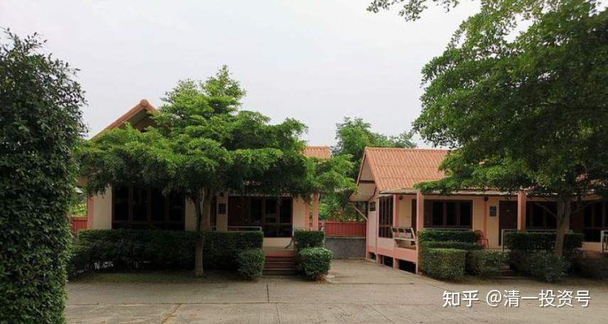
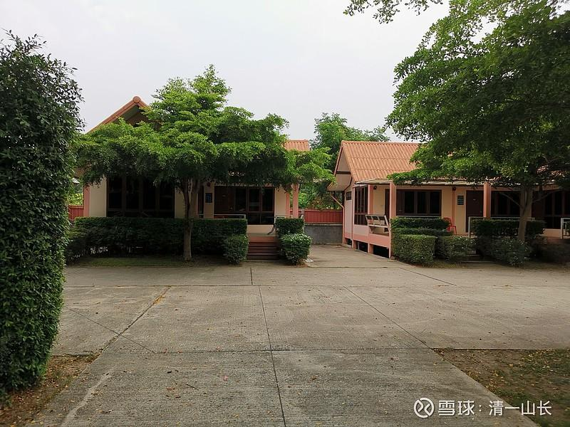
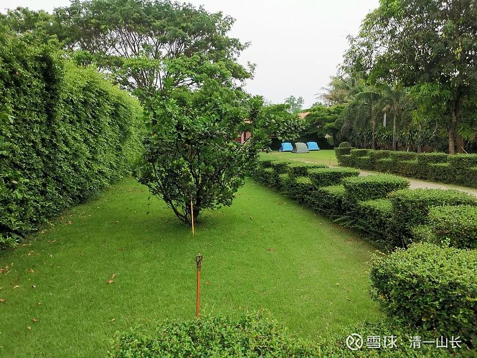
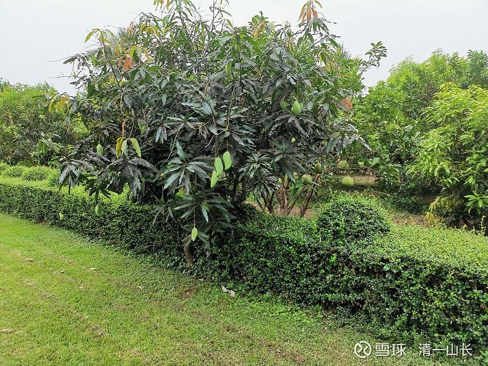
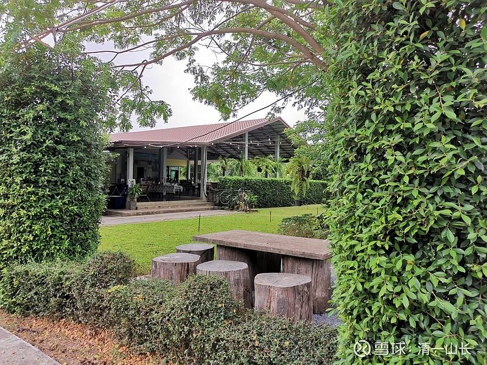
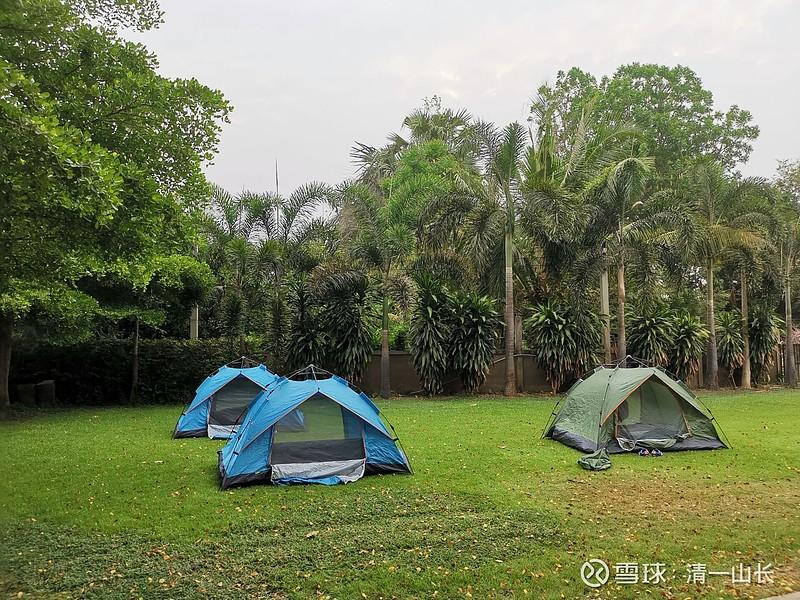
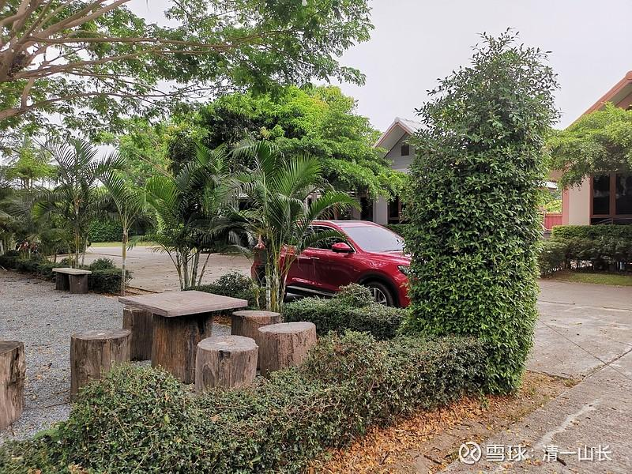
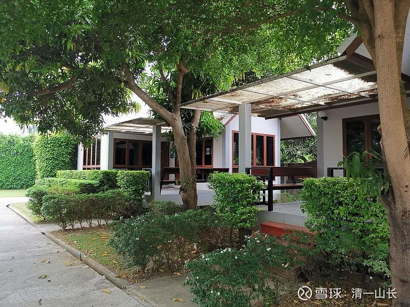
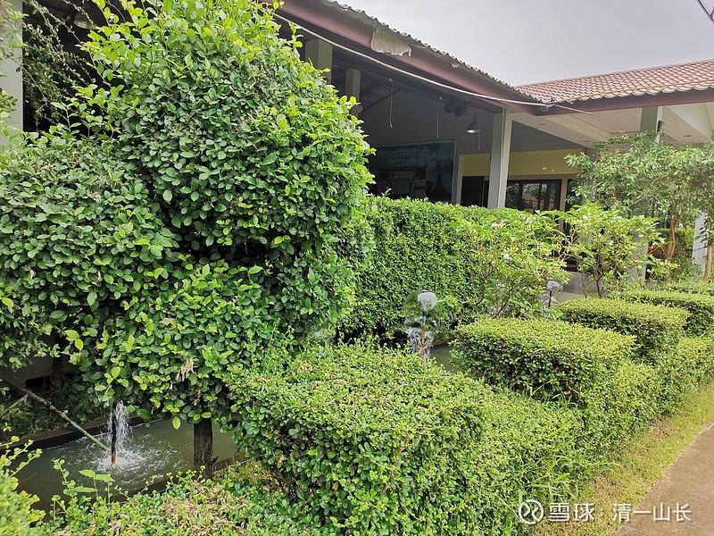

原专栏**134篇.450泰铢一晚的度假酒店，是啥样的？**

清一山长 2021年3月30日

在清迈，中国人租一个不到50平方的城区高层小公寓，价格是一万至1.5万一个月。好处就是离大商场很近。其他的，真说不上来有啥好处。这种地方，外国人很多，街道、餐馆，以及物价，都有英文甚至中文的标识。当然，物价也要高不少。比如新鲜草莓，我买给小女的是100B（泰铢）一桶，大约2～3公斤，采购的地点是是泰国人去的郊区菜场集市上。但如果是高层公寓附近，这些商场、超市，同样品质的草莓，价格就是80B（泰铢）一盒，大概是400克左右。我猜：是不是都是外国人买的。泰国人应该都知道集市上可以买到更便宜的，20泰铢一小袋子，够一个人吃了。

这种市场上，甚至会出现不可思议的低价。如芒果的价格，一般在20～100B（泰铢）之间浮动，根据季节，以及销售的地点不同而有区别。但去年在集市上，买到过5B（泰铢）一公斤的芒果，味道还很好，就是个头小一点。我都怀疑：运到集市上的汽油钱够不够？因为批发市场的价格，一般都在15B（泰铢）～20B（泰铢）一公斤，青芒果可以批发8～10B（泰铢）一公斤。但零售卖黄的甜芒果，才5B（泰铢）一公斤，比批发价格都低，就很意外了。

泰国的度假村，价格也是千差万别的。主要接待外国人，特别是中国人的度假酒店，价格最高。比如四季酒店，我去看过，房价一晚上，从1万泰铢起步，最高是三万，还是五万一晚上。真不知道有啥特别的好处。它的中心是一块稻田，我住的度假村，身边全是果园和稻田。不要钱看个够。路边都有很多果树。成熟的木瓜没有人来取。今天早上，我出去晃悠，路边果树上黄熟的“小芒果"就顺手取了两个吃，很甜。地上一大片掉下来的成熟果子，似乎都没有人管。市场看到有卖的，20B一大袋子。看样子有人连这钱都不想赚。直接放弃了给鸟吃。

我去年去过一家，基本是接待中国人的度假酒店，经理是台湾人。酒店的价也是3000～5000泰铢一晚，房子跟我住的泰国450铢的一样大小。小小的泰式小独栋房，度假村的格局也差不多。周边的环境看上去更大一些。其实精致度还更差一些。这个酒店是朋友介绍我们去参观的，为了表示友好，就在酒店的餐厅，吃了一份泰国炒粉。三个人，吃了三份炒河粉，价格收了800多B（泰铢）。而正常的泰国炒粉，每份是20～40B（泰铢），味道没啥不一样的，就是餐具很精致，服务态度不一样——服务员随时在你身边端茶送水，听候吩咐。所以，去这种度假村，吃的就是“感觉”。我现在住的这家度假村，也提供餐饮服务，但价格比自己外面去吃，也要贵三倍左右。服务员做的，未必比外面的饭店专员人员做得更好吃。所以，我们一般就只吃酒店每天提供的免费早餐，粥。面包片。中餐去外面吃，一份饭菜就是30～40B（泰铢）。

结论就是：**我们每个人，吃的价格可以差千倍，甚至万倍。我们住的地方，可以价格差千倍、万倍。但我们得到的东西，其实是差不多的。**很多人一生努力，赚钱，然后去消费。但他其实得到的，跟别人不努力得到的东西真差不多。就像国内赶着春节，国庆出游，酒店、饭店的价格涨几倍，但你得到的东西完全一样，甚至更差。所以，别以为出的钱多，就有更多的享受。真不是这么回事。

你在北上广，一个月拿五万的收入，算是很不错了。但是你的生活质量，未必赶得上云南一个县城只拿5000元工资的人，衣食住行上。

同样，每个月拿5000元在泰国过日子，几乎就是小皇帝的生活了，天天有人伺候了。换算下来，相当于2.3万泰铢。你可以学我天天住度假村，一个月也就一万多泰铢。如果要更甚，租用泰国人自己租的单身公寓，大约一个月2千泰铢，剩下的一万多泰铢，吃的玩的，基本上够了。泰国一个工人的工资，大约是6000B（泰铢）至9000B（泰铢）。白领的工资，是1.2万B（泰铢）。所以，你一个人拿两个人的工资用，当然很充裕了。不过，如果您非要住四季酒店“享受”才觉得安心，我看，您的确需要多赚一点钱。5000人民币，勉强过上一天吧！

据说，泰国提供租妻服务。一个月1.5万B（泰铢）。大约3千元人民币，忙你打理家务，当服务生，晚上还陪睡。很多外国人退休来泰国，身边都有泰国临时妻子。我去银行或者外出办事，太太陪我一起来。当职员发现我不懂泰语后，看到我太太出现都很高兴，以为是我的泰国妻子，他们可以交流。但很遗憾，我太太的泰语比我还差[大笑]。

下面把我住的酒店环境发上来，大家看看：是否满意？我们一家人，“霸占”了整个度假酒店，非常的安静，还有一堆服务人员随时待命，态度还特别友好。昨天小女说：“我们是素食，稀饭里面不用放肉，不用煮肉粥。”今天特别做了素粥给我们送过来，配上调料。

上图中正对面的房子，就是我租住的“房间”，其实就是一栋小房子，电视、卫生间一应俱全，三面有窗。柚木的家具和门窗，看上去很典雅，450B（泰铢）一晚上。实话实说：我刚到清迈租用的酒店，是国内网上订的，2000多B（泰铢）。但真不如这家酒店干净、养眼，跟国内一两百元的普通酒店差不多。不过，虽然来这里定了房间，但我一夜都没睡过，晚上都在室外搭的帐篷内睡觉。白天会在室外的阳台上，大约二十多平方的门廊上活动，有桌子、椅子。泰国人很重视室外活动区域，不喜欢闷在屋里，估计天热的关系。

上图是酒店环境的一部分，后部区域，我们的帐篷，就搭在这里的草地上。看到没——三顶帐篷。帐篷后面隐隐露出来的，就是第一张图中的酒店房子，一整排的小独栋一字排开。镜头中的占地面积，大约是整个度假酒店的四分之一，或者五分之一的样子。

这是是果园，前景是芒果树，后面一个是柚子树。我看主要是芒果树居多。我没有把果园算成度假酒店的面积。因为老板没有开放进去的路，用树隔开了，大约只让客人看的？这个果园，面积相当于已经开发的酒店面积这么大。

这个是餐厅。我们一家白天会喜欢呆在里面看书、学习，玩电脑。小孩子会在一角读书学习下午傍晚我们一家才出去河里戏水。昨天去附近的BIG C大超市，买了两个气垫床回来，像是竹排一样，准备给孩子们玩水上漂流。晚上可以用于帐篷的床垫。昨晚用了一下，感觉很舒服。

这个就是我们的宿营地了：由于天热，帐篷门两边都打开透气，只留防蚊纱窗。虽然在水边，但蚊虫并不厉害，晚上室外走走也没事。泰国人晚上室外呆着乘凉，也没见怕蚊子的样子。

这是我的座驾：我买的上汽的MG，国产车。虽让我还有点爱国心呢？出来后电器、汽车，都尽量买中国的。不过这车的价格，比国内贵了十万人民币左右，大约25万一辆到手的。国内我看汽车网站，不打折的标价，根据配置不同，才12～15万一辆。泰国的车比国内贵不少，日本车垄断了市场。就皮卡便宜一点。普通泰国人，一般就买一辆皮卡。买小车的、SUV的，都算是“中产，有钱人”，一般是家里的第二辆车。劳动阶层一般都只用皮卡，以及摩托车。

我们的邻居房子。当然，现在没人。

以上图片是进门处的接待中心的门口，设置了喷泉。

我喜欢居住的地区，是纯泰地区，周围全都是泰国人，而且基本上不懂英文，更不懂中文了。估计这种环境，中国人不喜欢。起码要住在有中文标识的环境里面。所以，清迈的中国人，往往聚集在杭东，以及夜市附近的塘康路，市中心一带。据说这些地方的房价就是被中国人炒作高了的。虽然我需要小女帮我做翻译，但我和太太两个人去商场，市场上买东西，去银行办事等等，不用翻译，一般的生活没问题的。简单的语言，能听懂价格、数字，交流一般没问题。所以，我能理解：出国后并不是外语自动提高的。我来泰国几年了，会说一点泰语，但水平，也只相当于今日学堂才学了一两个月泰语的学生吧？但已经足够日常生活用了。