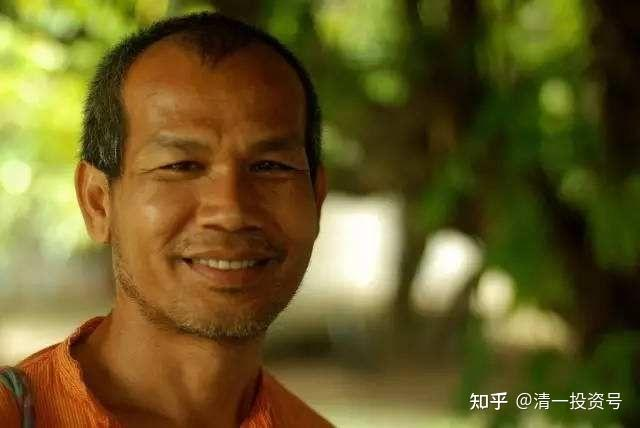
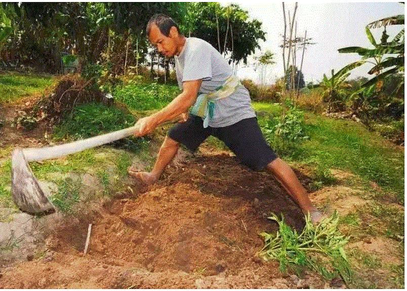
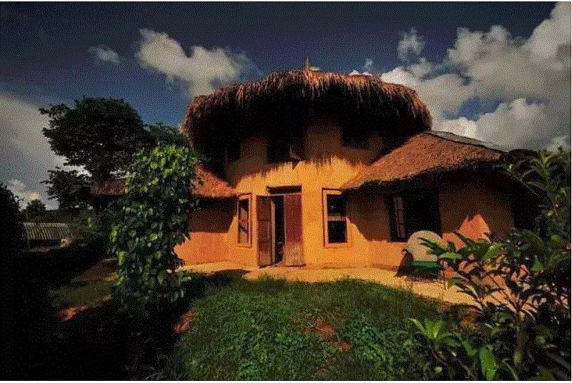

原专栏**135篇（副篇）.TED演讲：生活很简单，为什么我们把它变得如此艰难？**

演讲者：Jon Jandai

有句话我想与我生活中的每一个人分享，这句话就是：生活很简单,它是如此简单又有趣。

以前我不是这么想的。当我在曼谷的时候，我感到生活很艰难，很复杂。

我出生在泰国东部一个贫困的小乡村。在我小的时候，一切都是那么有趣那么简单。但是后来出现了电视机，很多人来到了这个村子，他们说：你很穷，你应该去追求一个成功的生活，你应该去曼谷去追求成功的生活。

于是，我感到很糟糕，我就觉得自己很穷，我就觉得自己应该去曼谷。

当我去到曼谷，那里并不有趣。你需要学很多东西，很努力地工作，然后才能获得成功。我工作很努力，每天至少工作8个小时，但我每餐只能吃到一碗面，或是多摩菜炒饭或类似的食物。我和很多人一起睡在一个环境很差的、很小的房间，里面非常闷热。我开始思考很多东西。

我这么努力工作，为什么我的生活还是如此艰难呢？我生产了很多东西，但是我得到的却不足以生活，一定是哪里出问题了。我努力学习，我努力在大学里学东西。但大学里的学习非常艰难，因为它很无聊。

我看到大学里每个专业的课程，大部分都是破坏性的知识，大学里没有教给我建设性的知识。如果你学习建筑或者工程专业，意味着你将破坏更多的东西。这些人的工作越繁忙，就越多的山林被破坏，昭披耶盆地的大好土地，会被越来越多的混凝土所覆盖，我们会破坏得更多。如果是类似农业这样的专业，意味着我们要学习如何下毒，去毒害土地和水，学习破坏一切。

我觉得我们做的每件事都是那么复杂，那么艰难。我们人为制造了很多困难。生活太艰难了，我觉得很失望。我开始思考。为什么要到曼谷来？

我记得在我小的时候，没人会一天工作八个小时。大家每天只工作两小时，每年只工作两个月。一个月种大米，一个月收割大米。其他时间都是空闲的，一年有十个月闲置时间。这就是为什么泰国有那么多的节日。每个月都有节日，因为他们有那么多的自由时间。白天的时候每个人都会睡午觉。现在即使在老挝，你可以去老挝看看。人们在午饭后也会睡觉，睡醒之后他们就闲聊——你的女婿怎么样，你的妻子、儿媳妇如何如何——人们有很多的时间。

因为他们有这么多的时间，他们就可以从容地做回自己；当他们有时间做回自己，他们就有时间了解自己，就可以看到自己这一生想要的是什么。很多人发现他们想要幸福，想要爱，想要享受生活，于是人们看到了生命中的许多美丽。他们用各种各样的方式来展现美丽，有些人喜欢雕刻刀柄，很漂亮；他们编的篮子很好看。但是现在没人做这些事情了，再也没有人会做这些了，人们到处都在使用塑料制成的东西。

所以，我觉得肯定哪里出问题了。我不能再用现在这种方式生活下去。于是，我决定从大学退学，回到家乡。

当我回到家乡，我开始过上我记忆中小时候的生活方式。我每年只工作两个月，就收获了四吨大米。我一家六口人，一年吃不到半吨大米。我们还可以卖出一些大米。我挖了两个鱼塘，里面的鱼足够我们吃一整年。我还弄了一个小菜园，不到半英亩。我每天花15分钟打理菜园，里面种了三十多种蔬菜，六口人根本吃不完。我们还可以拿到市场去卖，还能有一些收入。我觉得这太轻松了，为什么要去曼谷呢？辛苦工作七年还总吃不饱。在这里我每年工作两个月，每天花15分钟时间，就可以养活六口人。太轻松了。

以前我觉得像我这样的笨人，在学校里从没取得过好成绩，肯定连栋房子都买不起。比我聪明的那些人，**每年都在班级里排名第一的那些人，他们有一份好工作，也需要工作30年才能买一栋房子**。而我没有读完大学，怎么可能拥有一栋房子呢？像我这样只接受基础教育的人是没有希望的。

但当我开始用老方法盖房子——我每天花两个小时从早上5点到早上7点，每天两个小时——三个月之后，我有了一座房子。我的一个朋友，他是班上最聪明的学生，他也花了三个月盖起自己的房子，但他不得不负债，要偿还债务30年。和他相比，我多了29年10个月的自由时间。所以我觉得生活很简单。我从未想过这么容易地盖起一座房子。于是我继续盖房子，每年至少盖一座。现在我没有钱，但是我有很多房子。我的问题就是常想着：今晚要在哪个房子里睡觉。

所以房子不是问题，谁都能盖房子。学校里13岁的孩子们，他们把砖块拼在一起就有了一座房子，一个月之后他们就有了一个图书馆。孩子们可以盖房子，老奶奶也可以给自己盖一个小棚屋，很多人都可以盖房子。所以这很简单，如果你不相信，你去试试看。

接下来的另一个东西是衣服。我觉得自己很穷，长得也不帅气。我试图穿的像别人一样，像电影明星一样，让我自己更好看。我存了一个月的钱，买了一件牛仔裤。我穿上它，左看看右看看，照着镜子。再怎么看我还是那个我，**最贵的裤子也改变不了我的生活**。我觉得自己疯了：为什么我要买它？花一个月的积蓄买一条裤子？它改变不了我！

我更深入的思考。我们为什么要追求时尚？因为我们去追求时尚，所以永远追不上，永远在追，在后面，所以不要追，就用你自己有的东西。所以从那以后一直到现在，20年来我再也没有买过衣服。我所有的衣服都是别人剩下的。人们来拜访我，他们走的时候给我留下很多衣服。我现在有成堆的衣服。当人们看到我穿的衣服很旧，就会送我更多的衣服。所以我现在的烦恼就是——我需要经常把衣服送给别人。

因此，很简单，当我不再买衣服，我领悟到——不仅仅是衣服还有生活中其他的一些事情——我明白，我买一些东西，是因为我喜欢它，还是因为我需要它。如果是因为我喜欢它，就说明我错了。想通这一点，我觉得更自由了。

最后一个问题是，如果我生病了该怎么办？开始的时候我很担心，因为当时我没有钱。但是我开始更深入地思考：生病很正常，并不是一件坏事。**生病是在提醒我们在生活中做错了某些事情，所以我们才会生病。所以生病的时候，我需要停下来反省自己，仔细思考哪里做错了。**我学会用水来疗愈自己，用大自然的资源来疗愈自己，用一些最基础的知识来疗愈自己。

所以，这四个东西，我全部自给自足。我觉得这很简单，我感到自由轻松。我觉得不需要为任何事情担心，我不再害怕。我可以做自己想做的事情。以前我很害怕，很多事情不能做。但是现在我很自由，我觉得自己是地球上独一无二的人，我再也不需要去模仿任何人——唯我独尊。这么想事情很简单，很轻松。

后来我开始思考：当我在曼谷的时候，我感觉生活一片黑暗。或许很多人和我的感觉一样。所以我们在清迈建立了个地方叫Pun Pun，主要的目的是拯救种子，去收集种子。因为种子就是食物，食物就是生命。没有种子，就没有生命；没有种子，就没有自由；没有种子，就没有幸福。你的生命是依赖万物的。所以拯救种子是非常重要的，这就是为什么我们要拯救种子。这就是Pun Pun建立的主要目的。

第二个目的是建立学习中心。我们希望有一个可以学习的地方,学习如何让生活变得轻松，因为我们学习到的东西总是让我们的生活变得艰难，变得复杂、艰难。我们怎样让生活变得简单呢？其实生活一点都不难。但是我们已经不知道怎样让生活变得简单了，我们总是把它搞得复杂，所以我们需要学习如何相处。我们以前学到的是把自己与周围一切隔断联系完全独立，仅仅依赖金钱而不需要依赖其他人。但是现在为了幸福，我们必须回归自我，与自己连接，与他人连接，让心灵与身体真正地连接，这样我们就能获得幸福。生活很简单。

从开始到现在，我了解到四个基本需要——食物、住房、衣服、药物——它们必须足够便宜可以让所有人轻易获得，这才是文明；如果人们很难得到这四样东西，就是不文明。那么我们看看身边的一切，每一样东西都很难得到，我觉得现在是人类历史上最原始、最不文明的时代。有那么多的人从大学毕业，世界上有那么多大学，有那么多聪明的人，但是生活却越来越艰难。我们把它弄得这么艰难是为了谁？我们现在艰难工作为了谁？我觉得一切都错了，这不正常。我只想让一切恢复正常，变成一个正常的人，和动物一样。

鸟儿用一两天筑成一个巢，老鼠一个晚上就可以挖个洞。但是像我们这样聪明的人类，却要花30年才能有一个房子，还有很多人不敢奢望这辈子能有一个房子。这是错的！

为什么我们要这样摧毁自己的力量，破坏自己的能力呢？

我觉得自己受够了不正常的生活方式，现在我要回归正常。

人们觉得我不是正常的人，是个疯子。但我并不在意，因为这不是我的错，他们要这样想是他们的错。我现在的生活简单又轻松，我很满足，人们爱怎么想都可以。我只能控制我自己。我能做的就是改变自己的想法，控制自己的想法。现在我的想法简单又轻松，我很满足。

任何人都有一个选择，他们都可以做出选择。选择轻松还是艰难完全取决于你自己。