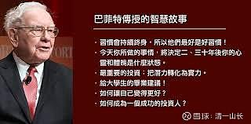

原专栏**137.股神之心与穷困之心：财富奥秘研究**

[清一山长2021年4月3日](http://link.zhihu.com/?target=https%3A//xueqiu.com/9310099567/column)

**股神，就一定有一颗股神之心。亏本，就一定拥有一颗赔钱之心！**

佛家说：心生，种种法生。心灭，种种法灭。你们肯定不懂，甚至说佛家是乱说的。不然，你天天心里都想要钱，为啥就是要不到？

其实，佛家此言，不是宗教，而是对宇宙运行机制的描述，是真的！你们说的此心不是彼心。佛家所云之心，是你的“真心”。而你想要钱之心，是你的“妄心”。**妄心只能得到妄想，而真心，才可以创造真实的存在。**

真心无好坏，真心，就是“真实的心”，就是“真实的自己”。真心，可以是财富之心，创造财富的结果。真心，也可以是“穷人之心”，创造穷人的命运。

我今年新开的【**新财富心理行为学**】，就是研究“财富之心”的课程，就是把学生的“穷人之心”改造成“财富之心”、“股神之心”。这才是创富的真正核心所在，而不是看我示范操作某个K线图。

这个课程是免费的，但不对外开放，仅限新教育圈内的教育人，有兴趣研究心理和行为学的教师和家长们参加，目的是了解人与人的心理行为模式，学习“读心术”。我们可以读“平庸之心”，并将其转化为“精英之心”。读心术自然也可以把穷人之心，转化为股神之心。先有了股神之心，才有可能慢慢地变成股神。没有此心，再努力也是白费的。

由于很多新教育人也想赚钱，怎么办？我就开设了9天的财富课程，专门研究财富心理行为学，找出学员的匮乏之心，帮助学员变得更富裕。

这世界上，一样的外在条件，为啥一些人就是穷？一些人就是富？同样是买一样的股票，为啥一些人就是赔钱？另外一些人总是赚钱？我的新财富课程的目标，就是解开这个致富的奥秘：怎样才能拥有财富之心？**你只有拥有了财富之心，才能在现实中拥有财富。如果你拥有的真心是穷人之心，你再努力，也注定是穷人！甚至更惨。如果你拥有的真心是“反财富之心”，你现有的财富，都会离开，你可能会破产。**

很多富二代，拥有的心就是破产之心。我的商学院，就是教这些富二代，改掉破产之心，换成财富之心的。这很难，但目前看来家长对教育的结果还是很满意的。学生学了四年，今年毕业了，有商学院的家长，想捐款2000万给新教育建校，表达感谢，被我拒绝了，我说现在还不需要，我还能拿出钱来建校，让他们把这笔钱拿着买中国建筑等股票。我说五年后，这笔钱应该可以变成4000万甚至更多。等赚多了，就拿利润部分来捐一栋楼好了。

**财富，其实是一种能量，它只跟相同频率的心灵共振。富裕之人，必有富裕之心。**所以，解析财富之心，用巴菲特作案例，是最恰当不过的了。

**巴菲特的难得之处，不是他致富了。很多人都富裕过，但能够坚持富裕的人很少。为什么？因为很多人有钱之后，就忘记了富裕之心。**我们学校有很多有钱人的孩子，跟父母差距太大了。为啥？父母都不知道把自己最好的宝藏教给孩子，反而把“穷人之心”教给了孩子，这种家庭，自然富不过三代。很多家庭，往往只是富裕过一时而已。这就是心变了，你的财富地位就变了。

巴菲特更难得的，不仅仅是创富之心，更重要的是他“不忘初心”——他90多年一直坚持当初让他致富的心不变。所以，解析巴菲特的股神之心，就成为本次新财富课的核心内容。

具体内容，我就不讲了。讲出来太复杂，你也不相信，说不定还黑我。我就只把给学员的作业发上来，你们看能吸收多少吧！核心的要素，全在这里面了，你真的读懂了，就能拥有财富之心。读不懂，就算了，打工去吧！

我的课程，学员必须写作业，不然不能上课。学员最怕我让写作业，因为写完作业，我的点评就是骂他们的作业：什么地方写得不好，什么地方全是错的。因此，我“骂人”就是上课。但是，学员的作业被骂多了，出去就被人捧：“你思维好好喔！”

古人说：“ 想要人前得意，就必须人后受苦。”今日学堂学生们各种靓丽表现的背后，是学生们汗水和泪水换来的！这就是阴阳！想要在掌声中，鲜花中舒舒服服地成长为精英人才？这只是家长们的痴心妄想。以为“**有钱就能堆出好孩子**”？这是违反天道的。因为很多学员，并不是天才，思维中有很多错误和缺陷。我不指出来，他们一辈子都改不掉。**我的课程，用不客气的思维逻辑分析，让新教育圈成为中国最有文化，最有思想的圈子。**

课前作业示范：

原文链接[【“股神”巴菲特】全网最全合集(共24集)。强烈推荐、受益匪浅！](http://link.zhihu.com/?target=https%3A//www.bilibili.com/video/BV1qK4y1p7wG)

哔哩哔哩[网页链接](http://link.zhihu.com/?target=https%3A//www.bilibili.com/video/BV1qK4y1p7wG/%3Fspm_id_from%3D333.788.recommend_more_video.0)

[https：//www.bilibili.com/video/BV1qK4y1p7wG](http://link.zhihu.com/?target=https%3A//www.bilibili.com/video/BV1qK4y1p7wG)

课前作业一：**巴菲特每天吃垃圾食品却没有健康问题，您模仿他这样饮食行不行？为啥有些居士吃素后身体更差了？**

作业二：**巴菲特每天都吃麦当劳汉堡，为啥他数十年都不厌烦？为啥他不换换口味？请找出他这样做的原因。这对我们有何启示？他的这种行为背后的心理因素是什么？这跟他赚大钱有无关系？你能否拿出一个从模仿他的“心”出发的方案，来安排你的日常饮食？**

作业三：**请根据采访中的信息，列出巴菲特的健康价值观排序。根据重要性，列出一二三来。**

作业四：**根据访谈中的信息，在股市崩盘，市场大跌的时候（比如他的伯克希尔哈撒韦公司，股票多次大跌50%以上），巴菲特当时的心理状态是咋样的？你如果遇到相同的情况，心理状况是怎样的？**

作业五：**巴菲特建议学生“把智商卖掉20～30是什么意思”？巴菲特认为股市赚钱最重要的要素是什么？请根据访谈内容，列出巴菲特的投资素质的价值排序来。以及找出你怎样做，才能符合巴菲特的赚钱素质要求。**

作业六：**股市获利的最大敌人，就是贪婪之心和恐惧之心。你怎样才能消除这两种心？你能看出来巴菲特是怎样做的吗？如果你找不到方法，你就不可能消除这两种心，你就与金融财富没有缘分。**

作业七：**巴菲特举的棒球案例，说明了他的投资原则。您知道他的这种投资原则和投资方式是什么吗？请写出这种关键的投资原则！以及找出普通股民为何会与这种投资原则相反的方式去操作？巴菲特的行为与普通股民的行为差别，代表他们的内心想法有何原则不同？**

作业八：**巴菲特重仓投资苹果公司，自己却没有使用智能手机和电脑。这说明了什么心？有人重仓酒股，就去喝这种酒，还鼓励别人去买这种酒，自己也送朋友这种酒，还号称是巴菲特的信徒。这两种行为的内心世界区别是什么？这说明股神的心灵模式有何不同？**

作业九：**作为一个热爱阅读的人，巴菲特读了很多书。为什么他说，直到读了《聪明的投资者》，他才发现了一种说得通的投资哲学？这对你学习和教育选择的启发是什么？**

作业十：**Jane：“董事会觉得你就值年薪10万美金？”。这句问话背后，提问者的财富价值观和心理思维是什么？巴菲特对这个问题的回答，代表他的财富价值观，以及财富心理是什么？这和一般人的财富思维，有何重大的差异？有无可能，这就是一般人永远无法成为巴菲特的原因？**

作业十一：**“财富并不能向下流动，钱基本都向富人流动。”这是一个事实，你认为这个事实背后的核心原因是什么？是不是政府的经济政策更有利于富人？对穷人不公平？**

作业十二：**你认为什么才是富裕？巴菲特又是怎样来定义富裕的？**

作业十三：**你认为巴菲特把钱委托给比尔·盖茨，背后的心理因素是什么？巴菲特给12岁小孩发工资这段对答，彼此的心理因素是什么？**

作业十四：**您的观察力测试：请对巴菲特的表弟弗雷德的心理和个性做一番分析。刻画出他是一个什么样的人？他的心理个性、行为特征是什么？**

作业十五：**巴菲特想让“老师”一词出现在他的墓志铭上，是什么样的心理和行为标志？这与他赚了大钱有无关系？**

作业十六：**假如你像巴菲特一样，坐拥5000亿资产。您现在90岁了，请你来安排这笔钱的使用方式。并说明你为啥这样安排？要实现什么目的？**

看了我列出的以上作业，我相信你们就知道：为什么清一大学的学生，会比一般大学的学生更厉害？你也理解了为啥很多人学巴菲特学不了？因为你们很多人，根本就提不出以上问题来，也回答不了这些问题。我可以继续根据本文，提出多一倍的问题来，我在讲课的时候，会涉及更多的这类问题。这说明：我完全理解了巴菲特访谈的内容，不然我不可能提出这些问题。

你们无法提出问题，甚至面对提出的问题无法回答，就说明：你们的思考和理解能力太差了。因为，**中国的学校根本就不教真正的理解力，不教思考力，只让你记住答案。所以很多好东西，好材料，你们读了也白读。**我的学校，我的老师们，只是靠讲别人的好东西给学生，就成了大名。我们不需要自己去创造什么知识体系出来，只把你们应该读懂的东西教给你们，这实在是现代教育的笑话。其实高深的东西，我还没讲呢！

**“股神”巴菲特访谈录**

如果有一个人能被称为现代的商业传奇人物，那么这个人肯定就是亿万富翁沃伦·巴菲特。巴菲特到底都喜欢些什么呢？我倒是发现了一点，他喜欢快餐食品。
巴菲特：“奥马哈的‘高级餐厅’就是这了。”
如果你够幸运，能够被亿万富翁巴菲特邀请共进午餐。
巴菲特：“双层汉堡加腌黄瓜”。
Jane：“双层汉堡加腌黄瓜吗？只加腌黄瓜？”
巴菲特：“太普通了吗?”
Jane：“不，你可真前卫。”
还得加杯奶昔。
巴菲特：“Jane，你跟着我，你的饮食习惯会一落千丈的。”
这就是巴菲特长寿、快乐的秘诀。
巴菲特：“**如果我想活得更久，我得吃得像个6岁小孩。我就是这样做的，很有用哦！**”
除此之外，还有一点。
巴菲特：“**最重要的是，如果你的工作是你所热爱的，这肯定能让你延多几年寿命，比做仰卧起坐还管用，我是这么想的。**”
Jane：“你也有过特别难受的时候吗？”
巴菲特：“也不是很多，如果市场状况不好，这就是我们的机会，所以股市其实也没有让我特别难受。”

股市对巴菲特来说就像是个游戏，巴菲特在伯克希尔·哈撒韦公司，作为主席、董事长以及CEO，我们只能展示出公司所持有的其中一些股票。1970年，伯克希尔也上市了，上市价格为40美金一股。
Jane：“现在股价是多少？”
巴菲特：“大概是27万美金一股。”
Jane：“每股?”
巴菲特：“是的。”
巴菲特目前的净身家价值830亿美金，他被认为是史上最成功的投资家。他表示投资也不是什么难事。
巴菲特：“我告诉学生们，如果你智商150，来做这一行，你可以卖掉20或者30给别人，因为你并不需要这么高的智商，但你需要稳定的情绪。当市场最盛时，得能抑制自己的恐惧和贪婪，你得有自己的见解，忽略其他人的声音，但你真的不需要有多聪明的头脑。”
这其实和打棒球很像。
巴菲特：“我站在那里手握棒球棒，如果投球手扔的球特别高，高出界了的话，我就会持续等下去。”
Jane：“整个体育馆的人都在看着你哦！”
巴菲特：“对，他们有时会大喊，挥棒啊！”
Jane：“如果你的棒挥空了的话，那可就是头条了啊！”
巴菲特：“哈哈！是的，我有过几次头条了，可能不止几次吧！但无论如何，我知道我想要哪种球，我想要那种正中央的，速度慢点的那种球。”
巴菲特的财富都是一点点累积起来的，从7岁开始。
巴菲特：“我的祖父有个杂货店，他会将6瓶可乐以25美分的价格卖给我，然后我就走街串巷以5美分一瓶的价格兜售。”
Jane：“所以你能赚多少呢？”
巴菲特：“20%的利润。”
他还做过送报童。
Jane：“没人能够通过送报纸致富，对吧？”
巴菲特：“我送了50万份报纸，每份报纸能赚1美分，所以我总共赚了5000美金。我还有个弹球机的生意，我还帮人给车打蜡，同时我还卖邮票，我做了好多种生意。”
Jane：“你那时有长远计划吗？”
巴菲特：“我只是觉得做这些小生意很有趣，同时用这些赚来的钱去买股票。我读了上百种书，其中有一本叫做《聪明的投资者》，本杰明·格雷厄姆所著，这本书改变了我的命运。”
Jane：“为什么？”
巴菲特：“我终于找到一门讲得通的哲学。”
Jane：“你能用我听得懂的方式总结一下吗？”
巴菲特：“它说股票只是生意的一部分，如果你买到好生意的股票，有人帮你在好好的经营它，而这些人既可靠，又聪明，如果以合适的价格买入的话，你肯定能赚大钱。”
伯克希尔投入了大量资金，200亿投在苹果上。
Jane：“你有智能手机吗?”
巴菲特：“我没有。”
Jane：“是没带，还是根本就没有？”
巴菲特：“我没有智能手机，我不需要这种突然流行的东西，我也从不基于突然的风声，操作买入卖出，我会观察一个公司几年。我大概一年前左右买入了苹果的股票，其实我已经观察过他们很久了。”
Jane：“但想想看，如果你不花那么多时间去观察他们，可能会赚更多钱呢？”
巴菲特：“这也是大实话，常常有人提醒我这个事实。”
Jane：“所以你怎么回应？”
巴菲特：“我就说，我也犯错误的呀！”

即便在最混乱的时候，巴菲特也能保持乐观，被称为“奥马哈先知”的他，表示永远也不要做空美国。
巴菲特：“美国有7500万间房子，2.6亿辆车子，还有宽广的公路，优质的大学以及优秀的医疗中心。”

坐落于奥马哈市，投资3.23亿美元建设的尖端癌症医疗研究中心，是世上唯一写着巴菲特名字的建筑，但不是沃伦·巴菲特的巴菲特，建筑全名：弗雷德与帕梅拉·巴菲特癌症中心。帕梅拉·巴菲特是牵头的捐赠人，
帕梅拉·巴菲特：“我是世上最幸运的女孩，我们想做的都能做到。”

60年前，巴菲特与妻子苏西，雇佣了当时12岁的帕梅拉·巴特灵照顾小孩。
帕梅拉：“初次见他时他24岁，身穿卡其色上衣和T恤。”
巴菲特：“我当时刚在睡房旁边的一个小房间睡醒。”
Jane：“他们给的薪酬怎样？”
帕梅拉：“他们给得很大方。”
Jane：“具体怎样？时薪50美分吗？”
帕梅拉：“大概25美分。”
巴菲特：“如果是我妻子决定薪酬，可能会付的比我更多。”

几年后，沃伦·巴菲特看到了一个联姻机会，并给他表弟弗雷德打了电话。
巴菲特：“我说给他找了个姑娘，然后他们就发展了起来。”

弗雷德也是个精明的投资人。
巴菲特：“他在60年代小额投资了我的合营公司，伯克希尔·哈撒韦就是其中的成果。”
帕梅拉：“说弗雷德擅长抓住机遇，都已经是保守的评价了。”

二十世纪六十年代在巴菲特的合营公司里投资1万美元，到了今天就值9亿美元。弗雷德·帕梅拉夫妇积累了不少财富，然后悲剧就降临了，1997年弗雷德·巴菲特因肾癌病逝。
帕梅拉：“我看着癌症中心名称上他的名字，这代表着他对奥马哈市的爱，对他人的关心。”

沃伦·巴菲特之妻苏西，活跃于社会活动中，正是她给了帕梅拉捐资医院的灵感。
帕梅拉：“苏西她对我的一生有深远的影响，她深信人心向善。”
Jane：“你说过，她打开了你的心扉，打开了你的双眼。”
帕梅拉：“我觉得她先打开我的心扉，再打开我的双眼。”

2004年，苏西离世后，沃伦·巴菲特决定捐出他所有的财产。
Jane：“苏西使你成为人道主义者。”
巴菲特：“她在很多方面改变了我。”

巴菲特已经向比尔与梅琳达·盖茨基金会捐献了310亿美金，尽管巴菲特是赚钱天才，但他却不那么擅长把钱花出去，他仍住在1958年买的房子里。
Jane：“你还住在你的第一间屋子里吗？”
巴菲特：“对，而且我住的很开心。”

他的私人飞机是他唯一的奢侈品。他说，他将来想和他的飞机葬在一起。
巴菲特：“我的余生就像其他年薪10万美金的人一样。”

这也刚好是他在伯克希尔·哈撒韦的工资。
Jane：“你的年薪是多少？”
巴菲特：“10万美金。”
Jane：“就这么多？”
巴菲特：“对。”
Jane：“董事会觉得你就值年薪10万美金？”
巴菲特：“差不多，我也没详细问过他们，哈哈哈！金钱对我用处不大，所以我把钱都捐了，钱对其他人用处更大。美国真的很棒，我一生中得到了各种机遇，因为我有美国商业在背后给我做支持，美国表现得真的很精彩，纵观全国，我们的人均投资回报在稳步上升，虽然我不喜欢过去30年内投资回报的分布，福布斯400在1982年总资产达920亿或930亿，而现在他们的资产总值2.4万亿，它们的财富总量是以前的25倍。”
Jane：“福布斯400就是400个最富的人。”
巴菲特：“财富并不能向下流动，钱基本都向富人流动，情况已经严重到人们怀疑我们的税收政策，在全球范围内竞争力不足，我想他们错了。”
Jane：“有观点说，减少向企业征税，就能减轻企业负担并推动经济发展。”
巴菲特：“美国经济近年来表现相当优秀，市场上现金充足，债券价格也很便宜，

美国经济发展条件相当好，将来一段时间美国都不会出现大问题，我们的目标应是确保3.25亿美国人，每个人都过得足够好。”

纵观美国历史，像巴菲特般成功的人，并不多，他年仅21岁就定下目标要致富，他也比他定下的目标更成功。如今87岁的巴菲特重新定义了“富人”这一概念。
巴菲特：“**富裕的程度，其实更多的是看有多少人喜欢你，看你关心的人有多少是喜欢你的。**”
帕梅拉：“懂了吧？这就是个好老师，说得很正确。我年轻时在他们身边也悟出了这个道理。”
**巴菲特想让“老师”一词出现在墓志铭上。**

