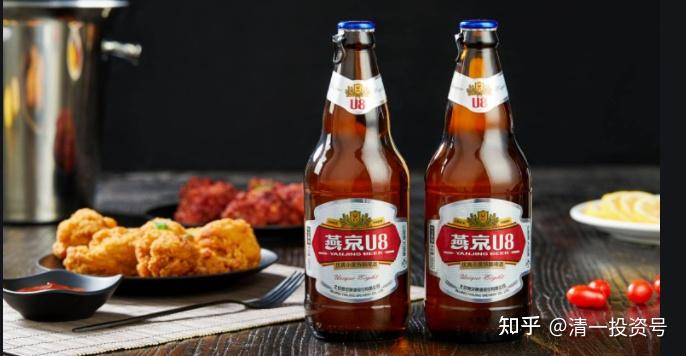
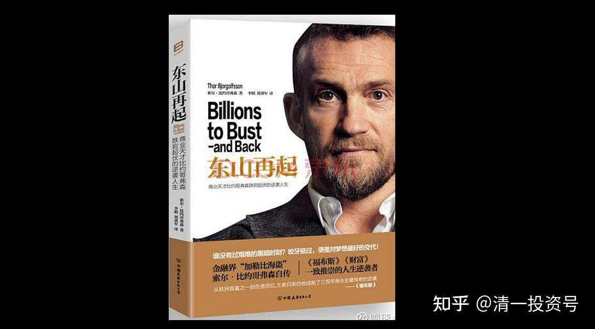

原专栏[225篇.燕京啤酒的持有逻辑：我的可口可乐](http://link.zhihu.com/?target=https%3A//xueqiu.com/9310099567/201800971)

清一山长 2021年11月1日

[$燕京啤酒(SZ000729)$](http://link.zhihu.com/?target=http%3A//xueqiu.com/S/SZ000729) [$青岛啤酒(SH600600)$](http://link.zhihu.com/?target=http%3A//xueqiu.com/S/SH600600)推荐一本书给大家：让大家知道啤酒竞争多么的激烈。我正在看这本书——【东山再起】《东山再起-商业天才比约哥弗森跌宕起伏的逆袭人生》。

他的第一桶金，是在俄罗斯经营啤酒厂，并成功地卖给了喜力啤酒，赚了数千万美元。但在俄罗斯经营啤酒，不是一般人能做的。看他书中的故事就知道了。原文“2000年一月，我们的对手，嘉士伯公司所属波罗的海饮料集团，其副主管威斯曼被暗杀。后来的副经理阿斯兰别克，乔切夫遭到暗杀”。还有一个竞争对手：圣彼得堡啤酒厂也被烧为灰烬。他自己，也是其他竞争者的威胁对象。所以，本人当年每天在身上，随时带着5万的美金，准备给来杀他的杀手谈条件。据说这笔钱，相当于当时行情10倍给杀手干活的身价。他想用这笔钱，来收买可能来杀他的杀手。他很幸运，得到了俄罗斯黑道大佬的保护，逃过一劫。他的对手的啤酒公司的老板，与6个保镖一起，遇到持机关枪和火箭筒的枪手袭击。老板的双腿被榴弹炸掉，入院后90分钟就死了。他最初，在商界开始起家的钱，做实业，就是这样做起来的。看看多艰难？比我们做股票艰难多了。

我当年做生意，也是一路跟红黑两道斗法斗过来的。输了就再也没有机会了。可以说，当年就真是拿命换的钱。第一桶金，真的很不容易！不是你好好做生意就行了。你做好了，多少人都想干掉你！

我在武汉的时候，就知道原来的中德啤酒，是怎样被当地的啤酒厂给干掉的。当时的中德啤酒，是武汉第一家国外引进的啤酒企业，我们当年大学的时候都爱喝的。质量很好，纯德国品质。后来当地企业做啤酒了。为了争夺渠道，当地啤酒厂动用了黑帮，打压中德啤酒的市场，很快就夺走了中德啤酒的市场，这家公司只能倒闭了。我们后来就再也喝不到中德啤酒了。顾客至上？没有的事情。给你啥，你就喝啥吧！喜欢不喜欢，送到你身边你非喜欢不可。

我在武汉，朋友做餐饮的。啤酒进入有流量的餐厅，也是黑帮人物控制的。是不能随便进场的，要取得入场许可，要花费不少钱。当然，厂家会支持这种进场费。因为要抢占市场。

所以，我知道啤酒的销售，背后的猫腻很多，恐怕远比白酒的市场更黑。只是很多年来很多大厂都在通过价格战抢占市场，所以看起来这行业挺苦的。价格战的目的，长期的战争，已经让各种地方的土霸王啤酒厂陷入困境，纷纷破产。你们看兰州黄河、西藏啤酒这样的地方小厂，日子多难过就知道了。

但我知道：一旦价格战结束，啤酒的美好时光就会到来。啤酒会成为相当于可口可乐一样的常销品。我认为：燕京啤酒会成为赢家的，他的进取精神相当的不错。当然，大赢家可能是华润。这是一家杀价，抢市场都非常厉害的啤酒企业。武汉的啤酒市场，其实主要是华润抢走了。用的手段，跟俄罗斯的也差不多，红黑两道的力量都参与了（我正好是知道武汉餐饮业酒水市场的人）。

华润原来抢市场的手法极为强悍，燕京的确不是对手。但我发现：现在的电商时代，燕京做得很不错，绕过了华润们用巨大代价换来的渠道壁垒。而且，国家的严厉管制，也让原来的野蛮生长模式无法继续。所以，啤酒的拼杀时代快结束了。燕京原来步步退让的局面，很可能会彻底的转换。现在的销售策略也很有效，也许，燕京会成为未来的黑马。不过，就算不成，依然做灰马也没关系。反正现价，就已经是15年不涨的股价了，有啥风险呢？我这种投资，是不可能输掉了，所以我才敢个重资压上。输了无非就是不赚钱，但赢了呢？很可能创造我的投资历史记录！

我认为我很幸运，可以很简单地在键盘上敲敲字码，就赚到了大把啤酒的钱。但现场争斗多激烈，这些员工，可能拿命换来的市场，却为我轻松地创造利润。燕京啤酒十年不涨，其实燕京的股价，只有15年前的6成，现价仅仅是15年来的低价期间。我买入有啥担心的？巴菲特的可口可乐，也是15年不涨，老头也没想卖掉呢！卖掉了，就没有他今天的故事了。所以，我会学会耐心的守候，守候燕京花开的日子。

将来，有一天，就算燕京啤酒涨了，我大约会卖掉几百万股，把融资仓位卖掉。但剩下的，我估计不会卖的。我永远会持有很多啤酒股，作为我的主要仓位的。希望未来15年都依然持有，作为收藏品，留下来慢慢的品酒。

这就是我的燕京啤酒持有逻辑。很感谢珠江啤酒、惠泉啤酒给我带来的好运气。原来做这两只啤酒的十大，都让我获得了很好的收益。唯独燕京啤酒虐我多日，有可能千日不涨。但也正因为燕京就是不涨，我才会把其他两只啤酒的本利，甚至白酒的本利，全都转投了燕京，才持有这么多。所以，涨了有涨了的福气。没有涨，有没有涨的好处。燕京你爱涨不涨的，我也毫不在意。反正只要15年后我想卖的时候，你涨起来就得了。我不在乎这两年你怎么弄的。我相信：主力的资金成本没有我低，回报期待比我高，我就耐心等吧！有首歌不是唱“千年等一回”吗？我们至少等千日吧？或者千周？