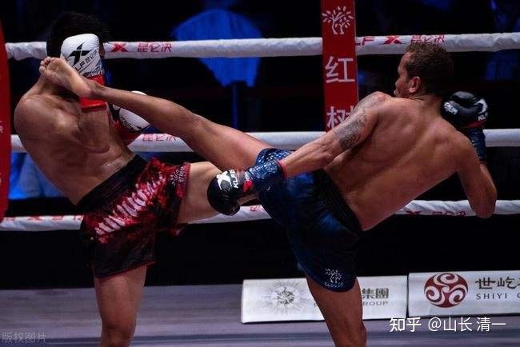

**清一实战太极，是一家私人拳馆。成立和训练时间两年半。目标是用太极格斗，去与现代各种格斗擂台实战，验证太极的实战能力。由于国内没有多少实战机会，目前只能转战泰国来开打实战，泰国可能是全世界举办正规拳赛最多的国家来实战。虽然有赌拳，但泰国的武术比赛，比国内的潜规则少得多。更能够真实地反应太极的实战能力。当然，来了泰国，练柔弱太极的人，也自然要跟泰拳硬碰硬了。看最终是柔柔的太极站着呢，还是躺下了。泰拳是否一如既往的站着藐视中国传统武术？等打完后，大家就知道了。三个月内，我们就有实战比赛的视频上传。未来，这里将成为连续的比赛视频的展现，不是一场比赛的胜负，而是从零开打的一系列的赛事，直到仑披尼的泰拳冠军赛。我们将参加泰拳的全系列比赛。不拿泰国的泰拳实战冠军，我们就不会罢休的！我们不是用泰拳来打，我们只是用泰拳规则来打。内核是实战太极。 **

以下是记录这次训练和比赛的正文记录文章之一：

泰拳左架拳手，会用前手作为虚招，点晃，扰乱，或者用于伸直抵住对方，控制距离使用。为后手，后腿（中低扫）制造攻击机会。也用于防守对方的右侧的攻击，或者对付扫腿，抱腿等使用。正常的泰拳拳手对攻，由于双方技术相近，就只能是双方护拼。你踢我一个低扫腿，我提前腿左膝防守，接下来马上也还你一个后腿的扫腿。双方加力互攻，就看谁的承受打击能力强了。

如果实战太极，也用这种类似的对攻技术来打，就太low了。而且这种打法，对身体的抗击打能力要求极高，而且容易造成后续的永久伤害。还有一个缺点----练和打，都特别的费力。拳手这样强烈的拼三局实战下来，基本就累瘫了。

太极是右架（所谓的反架）。一般来说，是左利者才会用这种拳架。但太极的原则是----强侧置前。所以，我们的小拳手在对攻中，往往前手能轻易的击中对方头部，对方还大惑不解----怎么这样子，就打过来了？原因一个就是：泰拳的前手，几乎不用于攻击，主要用于防守。所以，他们对于前手的防御意识不够。第二个就是发力模式了。太极的前手，如果长长的伸手在前面，泰拳拳手也有这种动作，但这种动作是不能打人的，必须收回来才能打人。而我们的小拳手，根本就不用回手蓄力，手一抖就打出去了，所以，他们根本就没有防守意识就中招了。

不过，太极拳并不能用这种技术来击败泰拳。因为首先拳手会很快明白过来，必须对这种前手做防守。第二就是:泰拳的裁判准则，是不太重视拳击攻击的。用拳攻击，除非特别强有力的，很明显的大幅度的攻击，否则不太能够得分。因为裁判会判断这种极其快速的探拳“毫无力量”，只是骚扰，不能算分的。除非你把对手就这样打KO了，不然打了也白打。所以，泰拳手往往不重视拳的攻击，更着重练腿击技术和肘膝技术。如果太极不能够在腿肘膝上赢过泰拳，光靠拳法，是不太可能取得胜利的，至少在拳台上是这样的。带上拳套的攻击，要一拳把对手打KO，其实是很难的。职业拳击，都要拼12回合才分胜负呢（我听着都累，真变成体能比赛了）。

实战太极对付泰拳手的招数方法：只能以攻对攻！无论泰拳手以何种方法攻击（拳或者腿），我们都要以攻对攻。对方此时的攻击（左式），基本上只有三个路线。一个是前腿的正蹬腿，以及前腿的摆腿，目标是我们的前腿右侧的大腿，或者肋骨部位。一开始就发高扫，击头部的可能性不大，但也不得不防。第二种可能的攻击路线，就是泰拳手前脚虚晃，然后转体，发出后手重拳，攻击你的中线和头部。第三种攻击，就是虚晃之后，转体发出很重的后扫腿，攻击你的左边的身体和大腿部位，当然，也可能高扫打你的头部。

这一侧，就有三种攻击路线，九种攻击变化。太极该怎样应对？----都只需要一种方法，就够了。

就是：在对方发动攻击的同时，前腿小步向对方的左侧（外侧）上步，身子跟随前移，前手做出攻击对方头部，或者防守的动作（看情况使用）。后腿跟随前足一起启动，最快速度用正蹬腿，直击对方的中线（腹部，胸部或者下巴），这才是太极的正确主攻方向。泰拳也有这种攻击手法，但用的是后扫腿，直击对手的肋部或者头部。太极也可以用这种扫腿，但我觉得效率低下，速度满了，不如正蹬更快，更简洁。太极正蹬之后落地，此时转为用右手，或者右腿连续攻击。重击，直到对方倒下，或者退开，远离格斗圈，或者搂抱被裁判拉开才停止。这个过程中，对手除了发动最初的攻击外，其他时点，都处在被两面环绕的不断夹击中，基本不可能有还手的机会。这就是典型的内家拳攻击法（不招不架，只是一下。犯了招架，就是十下）。

这种方式，就是身子走对方的攻击死角。对于左架的拳手来说，左外则，就是他们的攻击死角。我们遇到对手的攻击，都往这个方向走步，是最安全的。对手的任何攻击，都会落空。这也是对手最不舒服的位置，因为他最容易受到我们前手的侧攻。一般拳手，一看我们换位，都会本能地转身来调整面对的角度。但他这一转身，无论是否出手来反攻，他面对的都正好是我们拳手后腿正在展开的正面攻击（后直拳，后蹬腿或者提膝攻击，看距离而定），而且是正面的“迎击”效果。一旦被打上，很容易造成严重的伤害。所以，机灵一点的拳手，只能先退开，再组织下一次攻击。如果泰拳手真想要硬上，除非速度比我们的拳手更快，否则是根本没有机会的。而拼速度，并不是泰拳选手的优势。所以，泰拳选手实战中遇到我们的选手，可能会很有顾虑，不太敢随便进攻，因为一进攻就要挨打（上次的视频，泰拳小伙子很不愿意进攻，总在外面绕，就是前面几次进攻都被打回去了，逃得快才没吃亏）。我教孩子们的应对方式，就是步步为营，不断小步逼近，迫使对方先出手。然后一轮急攻。不主动急攻的结果，就是因为追着打，如果对手很灵活，会很耗费体能。不如等对方进攻的时候做反击，这样体能保持是最好的。

这个效果，你想脑补一下的话，大约就是我本文题图中图片的样子。不过太极拳手的距离，会比图片中的更近一些。图片中的这个攻击，有点像是点腿。这种腿击的攻击力量不够强大。我们的后腿正蹬出击，对手至少要退几步才行，不太可能站在原地不动。这种打击，造成对手的身体位移，泰拳裁判才会给分。中国散打，由于只要打上部位了，位移不位移的，都算得分点。这就是散打和泰拳的重大差别。各位就知道为何练泰拳的拳手，都拼命的狂练重击技术了？泰国的沙袋，我看都是超重的大个。靶师的主要任务，也是强化拳手的打击力量。而不是速度。可我们实际使用的拳击袋，是细长的水袋，重量差别巨大。甚至会用两个小小的足球大的沙袋来打拳。因为我们要练的力量，与泰拳是很不一样的。所以使用沙袋的要求，打法，也是不一样的。中国散打，现在似乎也在学泰拳的做法，也使用大而沉重的沙袋，来每天练习攻击力了。两者的趋同性正在加强。

上面说了左架，自然各位也知道如何对付右架拳手了？就是你面对对手的攻击，以及你自己的出击，移动方向肯定是对手的右侧了。然后助攻是左手，左脚。真正的主攻手，是右手以及右脚，全力攻击对方的正面部位（中线）。而你的人，此时不在他的正面。他不好同步发动攻击，不会形成互攻的场面。他对此只能干瞪眼---要么快速转身应对，要么退开，调整好位置重新开始进攻，大家再来一次.

还有一点，我在泰拳馆看拳手的训练，以及看泰拳的实战视频，我发现泰拳手似乎不太重视侧身战法。他们的三宫步，往往偏向重心放在两足的中线，更像正面站立一些。甚至双方内围对攻的时候，还要求两人要面对面的站立。而我要求拳手是一旦进入内围战，一只脚是必须插进对方的两腿中间位置的。泰拳教练不断纠正她们的“错误”，说这样站很危险，很容易摔倒。站姿不稳定。但我们的小拳手很调皮，就让他们来摔，泰拳手往往发现很难摔动她们。只有几个冠军男拳手，才偶尔能得逞。但也很难实现。由于双方性别和重量级都不是一个级别的。其他普通拳手基本上不可能实现摔倒她们的任务。我相信她们将来上拳台的对手，不会是泰拳男性冠军这样很强能力的拳手。但相反的是：我们的这个动作，极易造成对方的失衡。我们的拳手，常常轻易就可以摔翻比她们更重量级的选手，包括男拳手。

泰拳这个站立方式，三宫步，我理解是为了方便他们双手和双腿的轮换出击。但有一得，必有一失：他们这样站位，中部是完全暴露出来的，很容易被我们拳手的后腿拳和腿正面中线攻击所击中。我们小拳手在泰拳馆的模拟实战中，已经应验了这个结论。特别是我教孩子们使用的太极变线腿攻法，在启动的时候，用的是后鞭腿的起步动作。对方的防守动作，就是抬起右膝来防守。但我们拳手身子往右边一划，后腿就变正蹬腿，直接踏上对方的中门，后脚跟就直接抵到对方的心窝部位了。泰拳教练马上说：你们这样做不对，要用脚前掌部位打，不能用脚跟----孩子问为啥？回答是：泰拳都是这样打的。用脚跟不科学。孩子回来问我：正蹬应该用足前掌，还是整体全足部位，还是后跟打人？我说：都对。都可以。只是作用的对象不一样，用的足部位置就不一样。用前足掌打人，是低位攻击的腿法，主要是中国的戳脚门善于使用。练的好的，一个前脚掌铲击。就可以把人的小腿打断。我就见过一个女的，靠墙放了几块砖头，一脚过去，砖头的上部全碎了（说中华武术不能打的，你去接一腿试试看？）。我让孩子们感受了一下实际效果，用前脚掌轻踢了一下她们的小腿，都痛的快跳起来了。看起来是轻轻的一踢击，其实很重的。不过，这种腿法，对泰拳不适用，因为对泰拳的小腿攻击是不算分的。这种攻击，只能作为辅助攻击，扰乱对方后，为其他的攻击开路。至于高一点的，打击对手腹部的正蹬腿，打击部位是跟自己腰平齐的位置，用的就是“全脚掌打击”，要求是击中的同时，发出震动力来。一出手，对方必须击退几步才算功夫。只是点一下，推动对方一下，不算啥功夫，还浪费自己的体力去做动作。至于用脚跟的方式，就是古人说的“穿心脚”了。打击目标是对方的心窝以上部位。这时候，使用的打击部位，就是脚跟。这对对手的打击是最重的，因为脚跟直接连接小腿胫骨，没有缓冲，打击的力量最大，也最痛，因为泰拳比赛。双方是光脚格斗的。如果脚跟正好打在对手的心窝部位，往往会造成对方马上失去比赛的能力。如果打击点再高一点，用脚跟打击对方的下巴部位。古人就叫做“舔腿”，或者“朝天蹬”。这种腿法，日常可以练，但尽量不用，因为对手比较容易抓住你的腿。但对泰拳就可以用。因为泰拳的格斗规则，就算被对手抓住你的腿，摔你一跤，你也不用担心。因为摔倒是不扣分的。但散打摔倒就被扣两分，相当于大腿有效击中的两倍奖励。你踢中了对方得一分，被摔倒了，扣两分。一算就知道不划算。而泰拳得分规则是：你踢中了头部，有一分。你被摔倒了，却不一定扣分。因为未必就算对方的有效击打。这样光算账，都值得一搏了。何况这种腿法，如果真打上了下巴，很容易造成对方的KO。所以----我让孩子们这段时间，就着重练习这种腿法。而且要练出“变线蹬踢高腿法”来，让对手防不胜防。看你出腿，以为是扫腿，被打中才知道---是后腿正蹬高踢。已经晚了。。。。

话又说回来：到底是中国散打的摔倒多扣分的机制？还是泰拳的摔倒不扣分机制？更接近实战要求呢？我认为中国的散打标准更接近实战的要求。在擂台上摔倒对手，对对手其实真没啥伤害的，如果在硬地上摔倒对手，很可能会造成对手受伤，甚至严重受伤。传统太极就有“舜子投井”的打法，把人腿撩起来。头冲下的撞在地上去。你说这种手法，不比你踢过十腿还狠毒？只是现在格斗场上，这样打累死人，却没啥实在的好处。不如多踢对方几脚得分高。所以，擂台实战，与街头实战，是不一样的。当然了，如果是泰拳高手街斗，一般人怎么打都打不赢的。不可能像中国的武术冠军（套路），跟街头流氓打还输得惨惨的。我看干脆取消武术的名号，该叫中华武舞，可能就没有争议了。

*把这个图片中的左鞭腿，脑补成饶过对方手臂防线的正蹬腿，击打对手的脸部，这就是我文中说的打法了。*

接下来，大家肯定有一个疑问：这也是我们的小拳手问我的问题。我教的这种太极实战打法，打起来很漂亮，也很容易打上对方，很实用。但为啥泰拳的实战拳场上，很少人用这种打法？它有什么问题吗？

没错，现在的泰拳，一直处在强对抗中。一旦出现有效的打法，大家都会去练的。如果几乎没人来练这种腿法，一定是这种练法，有啥缺点。不能说就是泰国人傻，不知道这种腿法。

实际上，今天我说的这种腿法，用泰拳技术，其实是不如鞭腿好用的。所以属于被淘汰，边缘化的冷门技术。泰拳教练们都不重点教的腿法。虽然他们也教正蹬腿，但主要是用来保持格斗距离，防住对手膝击等使用的。但并没有作为一个特别的攻击腿法，来刻意训练打击力。泰拳手们，每天刻意训练的攻击腿法，就是你们看到的播求的训练视频：快速有力的连续中高扫腿十几个，击打沙袋，或者靶师。练起来很累。但由于这是泰拳的主要攻击腿法，当然要狂练。上场双方也习惯用这种腿法互相狂踢，很有节奏的踢。而拳馆的观众们，会全体跟着击打的节奏喊叫，很有泰国味道的吆喝，大家都很兴奋。

这种“中线正蹬攻击腿法”的最大弱点是什么？其实是---发不出力量来。第二个缺点是：招式的转换会比较困难。如果击不中，要转换别的攻击，或者击中之后，没有打击效果，很容易导致对方连续反击，而自己没有太多的备用方案使用。所以：显然是不好使用的一种无价值腿法。

用泰拳的训练方式（跟头棍，硬汉训练），练不出来的东西，比如“发不出有打击力量的攻击力来”，我们的小拳手在泰拳馆也试过了，发现这些拳手发出来的正蹬腿，第一是速度很慢，预兆很强。而且---真的没有强大的打击力量，小拳手说---只是你把你推开。也就是说，泰拳的这种腿法，只能拦阻进攻，但无法造成对手的伤害。但泰拳练不出来的力量，未必太极就练不出来。正蹬发力，对我们的太极小拳手来说，这就不是事了。不就是由于启动肢体距离不足，没有身形的转动，造成发力和转换困难？换招不容易吗？只要把身体练到软下来，想要发力，换力，就不要用肢体的力量，启用人体的丹田中心来发力，不就行了吗？我给孩子们示范了单腿不落地，连续高中低的三个高度的正蹬，以及变化为侧蹬，以及变成内钩腿，外摆腿的动作，都可以发出脆快的力量，令人很痛。但泰拳选手做不了这种动作的，看上去像是杂技。为啥？因为发力的方式不同。泰拳的发力，是杠杆力，需要距离，扭转身体肢体的发力。有启动的速度，加速的过程，最后形成打击，就像枪弹一样打击。但太极的发力，更像炮弹一样，不用是惯性来打击你，而是落到打击点之后，再爆炸发力，摧毁目标。只要没有学会这种发力，只会比划太极动作，都是假的太极，都是传武骗子。真太极是啥?就是核心的发力技术不一样，不是招式动作不一样。太极拳， 可以模仿天下所有拳招来比赛，但核心依然是太极的。

今天，讲一个泰拳馆里面，我们拳手练拳的故事。最近拳馆新来了一个已经打了100多场的女拳手，跟太极小拳手对练，双方练到内围战的时候，不禁大叫起来跟教练嚷嚷：教练，教练，她们的力量好大。教练安慰她：没关系的，她们刚来，只是力量大一点而已。泰拳技术都不懂的，正在慢慢学。我们的小拳手后来问我：为啥觉得这些女拳手力量都好差，双方一接手，还没用力，她们就站不稳了？上次跟泰拳女子冠军的小姐姐练内围，也是很容易就破掉她的双手防守圈，她根本就防不住我们的内围攻击。不过两小孩，对付男性的泰拳冠军，就觉得对方的力量很大，很难攻进去。可以强硬地支住她们的手。不让进入内围。我教了她如何攻破这种力量更强大的选手，方法也不难----用太极滚手，就进去了。对手只要是靠力气硬撑的，都不怕。太极怕软，不怕硬。但对手防不住，不会说自己的技术不好，只会惊讶：你们的力气怎么这么大？因为他用了全力都抵不住，就像上述的女拳手吓得叫起来一样。其实，这不是力气大小的问题，这是太极的接手化劲功夫。

不过，为了防止对方有想法，我告诉两孩子：内围战不要主动出手攻击，主要做防守。了解对方的内围技术，让她们攻不进来，就够了。不要逞能，打到她们也不好。我们也没必要秀啥本事，不需要去教会她们的。我们是来学习的，不是来教学的。以后他们如果想学，可以自己来找我们学，我们才不送货上门呢。

两孩子说：泰国人肯定不会找我们学拳的，说泰国人很会洗脑：每天不同的几个教练，都告诉她们: 泰拳是全世界最厉害的格斗技术。她们心里肯定不服呀，但也不能反驳。因为两孩子见识过更高明的技术。但你人在别人的拳馆里面练拳，当然不能说啥了。我说：他们这样说，其实也没错的，因为目前为止，还没有其他像样的挑战对手综合能力强过泰拳。中国拳种就更别说了，百年来都是打败仗的历史。民国时期， 香港的拳手，都组团来与泰国拳手们交过手的。但全都是大败而回的历史。不堪回首。日本的武术界，刚开始与泰拳接触，来打实战比赛，也是大败而回。一些日本拳手还被踢断了肋骨，手臂等，但日本这个民族与中国不同，输了就输了，回去好好研究对策，拿出了一些有效的应对方案，以及一些新拳种出现了，包括合气道的创立。现在国际上很有名气的日式踢拳，其实根源是泰国的泰拳的模仿秀。这就是日本K1的比赛。但日式踢拳，跟泰拳比技术也不够全面。中国是最近十几年，不到20年，才系统开始研究和推行实战格斗的。所以，中国的散打还远远比不上日本的踢拳比赛。更不用说更泰拳比了。所以，泰国人这样说泰拳的地位，你们不要认为是吹牛，别人真有吹的资本。你们要真心同意对方，因为他们说的是真实的历史事实-----除非你们将来打出来了，你们改变了历史。将来如果你们用太极技术，跟泰拳兼容却高于泰拳的技术，拿到了仑披尼拳馆的冠军，而且你们还跨级别拿三五个级别的冠军（每个重量级，都有一个泰拳的年度冠军），而且我们武道馆，还可以成批的生产出击败泰拳选手的队伍，我们的一出场，他们就会失败，不得不来学习和研究我们的技术，他们这时候，才会承认中国还有更高级的格斗术存在。现在----你们还是老老实实的学习和训练自己，一切用以后的赛场成绩来说话。

不过，两孩子表示在泰拳馆训练很痛苦：现在拳馆的教练很喜欢她们，估计希望两个月后就培养她们去打正式的比赛了。老板已经说了：她们现在已经具备上场打比赛的实力，只是动作技术不好看，要训练好一点，所以，让几个当冠军的泰拳教练们，要每天都“抓紧教会”纠正她们错误，学会“正宗”的泰拳技术。说她们打拳的样子很不好看，还不是泰拳的风格，连拳和腿都出不直。所以要好好学泰拳的基础。还有一次，孩子们练拳的时候，打了一个抖劲出来，女子泰拳冠军马上就大叫：不行不行，你不能这样打的，实在是太难看了，应该这样打的。孩子们很郁闷地跟我比了一个泰拳的僵直动作给我看。我笑死了，我说: 她们觉得你们练的跟她们不一样，肯定是练错了，肯定会说难看的，就像你们也不觉得泰拳很优美一样（泰国人总说他们的泰拳特别美）。而你们会认为太极的动作才很优美，她们觉得丑死了。但孩子们觉得：泰拳的训练，要求，和我教她们的技术要领完全相反。练多了都怕练坏了习惯，不练吧？教练又很热情。我说：你们就继续认认真真的“划水泰拳”。多了解泰拳的优点， 你们认为难以对付的地方。去适应和思考，多了解泰拳。下周，我去泰拳馆跟老板谈一谈，告诉老板：以后就不要管我们的技术动作是否标准的问题，承认我们外国人学泰拳学的就是“不正宗"，我们接受这个结果。请他只提供与泰拳冠军的对练训练，以及纠正她们上擂台会犯规的不正确打法。因为她们都没打过真正的实战。请拳馆帮助我们的孩子做好打泰拳的实战比赛准备，安排好比赛就行了。不然，我不出场与教练谈，一直让两孩子们在两个拳学理念对立体系中纠结，也不是事儿。