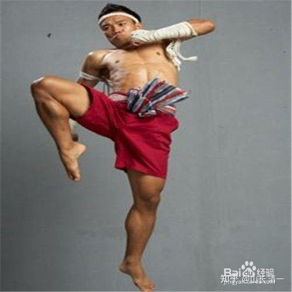
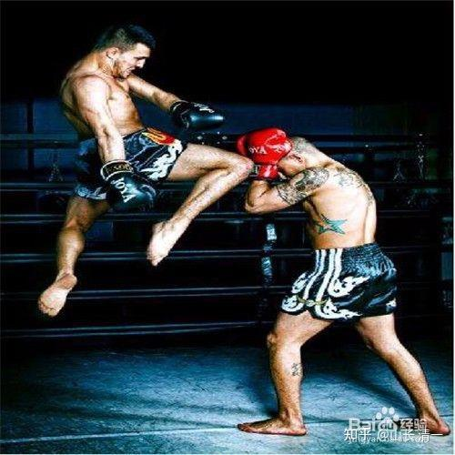

*泰拳膝击的应对方式*

图片中，就是泰拳膝击的标准动作。这个动作是空击。实战击打，有两种方式。一种是抓住你的头部和脖子用劲拉，同时用膝盖顶击（所谓的锢颈顶膝）。一般人很难对付。一种是在遇到攻击，害怕和退后的时候，泰拳手会跳起来，用飞膝打击你。这种攻击的强度，让很多中国拳手闻之色变，纷纷避让三分。觉得跟泰拳打很容易受伤。事实上，的确有很多拳手对抗中伤残的案例。

仔细研究：泰拳的这个动作可能有啥问题？各位观察膝击的时候，会看到脚背是绷紧的。其实拳手的全身都是紧绷的。泰拳的动作都特别的消耗体力，所以一般打三局就停了。最多有打五局的。我的太极小拳手，在泰拳馆练习的时候，由于我教的膝击，脚背是平的。准确地说，脚指头是上翘的。这个微小的细节差异，就说明太极拳手和泰拳的发力方式很不一样。不信你试试看，像泰拳一样绷紧脚尖顶膝，与像太极一样翘起脚指头顶膝，差别有多大？身体动作完全不一样的。太极顶膝，全身是放松的，不会像泰拳手一样全身紧绷，所以不费力。但攻击效果并不差。还可以连续发出很多快速的膝击。我让小拳手们用内围技术，试着防住我的膝击。结果是完全无效，我可以换各种角度击到她们的肋部，腹部，而且----她们说击打比泰拳手的要痛一些。主要是她们控不住我的劲，而且太极发的是透劲，贴到你身上才发。之前根本就不发劲。而她们在控住泰拳手的劲之后，就算膝击的动作到位，也不会造成啥伤害了。所以，各位看泰拳比赛的时候，双方拼膝击很凶猛，其实造成的伤害并不大。我认为可能泰拳的扫腿，才是真正威力最强大，最有效的武器。内围战，对付不熟悉的人倒是效果良好。双方都懂内围战的话，其实也就没啥了，基本就是僵持的局面。

泰拳教练回答我们的小拳手的疑问：为啥必须要绷紧脚尖？因为这样才能发力。他认为我们的小拳手脚尖不绷直，是发不出力量来的。是无效攻击。这话是真的---一般人，可能不注意这个细节。你的脚尖翘起来之后，其实多数人是发不出来力量的。而泰拳的这种崩紧发力，可以激发全身的劲，转腰，扭胯，身体后仰，就可以向上，向前，发出很大的力量。唯一的缺点是：速度慢了。但泰拳的核心要义，就是慢不是问题，只要有强大的打击力就行。中国的武术，是“手快”打“手慢”。绝对不能接受慢（太极的慢，是假像。太极其实是天下致快的拳术）。 对付泰拳，就必须用我们的优势来破解对方的优势，让泰拳的威力无法发挥，就赢了。

我的小拳手表示：的确，她按照泰拳师的指点，这样顶膝的时候，速度慢了很多。怎么也提不起速度来。而且全身必须紧绷，觉得很别扭。

另外一个明显的缺点，就是这种泰拳膝击，只善于正面直膝攻击，不善于侧面膝击。因为这个动作，只能向前攻击，不能向左右方向攻击。左右膝部攻击的发力方式，与泰拳直膝攻击的模式，是完全不一样的。习惯了直膝攻击的泰拳手，不适应其他的膝法并不奇怪。可太极就不一样，可以直膝攻击，也可以做左右扣膝攻击。具有更大的宽容度。还可以膝击变正蹬。

我说的只是理论，但小拳手告诉我：的确如此。虽然规则上，泰拳没有限制你只能正面膝击。任何方向的膝击都是可以的。但泰拳选手们，很少使用侧膝来攻击的，也没有攻击的力量，反而会导致自己站不稳。所以他们基本不采用这样的技术。都是都是专心发展正面直接攻击技术。他们自己说：侧膝很不好用，所以自己一般不用，专注于正面攻击。对我们的小拳手更喜欢练习侧面膝击，表示有些不解。友好地提示了她们实战用不出来的，也没有力量。不如不用。

了解了泰拳的膝击优势。要应对起来也就很简单了：避其实，击其虚。

首先就是站姿抱架：泰拳的三宫步，偏于正面站立，给膝击的选手有了攻击目标---中线。我们的太极选手，对敌采取侧向站姿，这样正面就没啥攻击点。就尽可能避免了被直膝击中的概率。但膝击，往往发生在内围战上，所以我们的内围技术，与必须与泰拳选手不一样，必输侧立。这是可以专门对付泰拳技术的内围技术。太极的技术，肯定是泰国人普遍不能适应的，新的对象和打法。至少需要重新学习和调整打法。估计只有我们“出名”之后，才有泰拳手针对性的练习，找出其他有效的对抗和攻击方式。

泰拳的内围技术，练习的要求，是双方都要正面站立。互相顶在一起。太极拳手则要求双方侧面站立，右步必须要插入对方的双足之间。对方一动，只要感受到对方有用力的迹象（听劲），我们根本不管对方怎样攻击，马上往前（或者向对方的左后，右后方向）攻击性前进，一小步可以了。再利用手上，肘部等不同方向，不断的缠绕，进攻来反击。对方动越多，被打的机会就越大。这个技术，基本上就化解了对方的膝击可能。关键点：就是必须每一步就步步紧逼，不能留腾挪的空间给对方。泰拳这种需要拉开空间来攻击，发膝击的技术，就无法施展了。

如果被抱住了颈部（泰拳手的招牌动作）。应对方式，就是千万不要用力顶抗。这种顶抗的力量，就正好给了泰拳手正面顶膝的机会。只能采用太极的技术，一种是双手棚劲，向前向上开，让对方站立不稳退步，自动退出来。另外一种应对方式，就是左右移步，转体。打出风摆杨柳的动作，破坏对方重心，同时解脱对方的缠绕，还同时对对方的头胸部进行打击（拳，肘，膝等）。还有，在被抱住的时候，如果无法摆脱，为了自身安全，必须提前腿膝来防守，可以成功阻截对手的大力直膝击打。也让胸腹部远离了对方的攻击距离，不至于对自己造成伤害。此时还可以乘机用弹腿，来抖击对方的腹部，或者铲击攻击对方的下肢内侧部位，造成一定的伤害。

对方如果努力推开我们，在被推开的同时，正好控手，起膝，起腿，用穿心脚直击对方的胸腹部。这就是“打死不后退，后退必打人”的太极招数。不然你只求解脱，被对方追着补拳，补腿，就麻烦了。一失先机，就处处被动挨打。

*泰拳飞膝----远距离攻击手段。挨打后如果退步，失去防守，最容易被追击，导致重大伤害。*

对付泰拳膝击，比如上图中的右膝攻击，还有一种方式，就是以肘破膝。侧身站立，用双肘护住自己要害，向对手的左前方向冲击前进。一方面，可以破掉对方的膝击发动距离。另一方面，如果形成了错位攻击，我们攻击对方的左侧，甚至是中线迎击，可以给对方造成严重的打击。 基本上，遇到对手攻击的时候，太极拳手的要求，都是向前寸步攻击。这是非常有效的方式。昨天在对抗练习的时候，我们的小拳手，看到对方（泰拳冠军）扫腿上来了， 就马上向前上步攻击，结果对方马上就倒地了，还有点莫名其妙的，不知道用了啥招数就倒下了。因为一般人的正常反应，是面对很重的攻击时，会害怕和后退。这时候，就造成了对方连续攻击，飞腿，飞膝的机会。但如果你往前进半步，同步进行攻击，对方的发力距离就被控住了，无法发力，扫腿就算打到你身上，也没啥力量了。而且对手的平衡，也被你破坏掉。我方只需要很小的一点力量，就可以把他们击倒。所以，与常人思维反向做，就是太极（老子云：反者道之动）。

最后，说个小笑话：你们觉得泰拳上面的顶膝动作很美吗？泰拳教练，认为泰拳是很美的，估计是一种力量美学。我教的小拳手，顶膝发力，是抬膝到位之后，身子一抖发力。结果泰拳冠军小姐姐看到，就着急了：你千万不要这样打，太丑了。我们的小孩一脸的蒙？打拳还要别人觉得好看吗？我能打倒你不就行了？

各位：你们认为呢？什么动作才美？中国古人认为：西施捧心很美。泰国人觉得：上面泰拳中，恶狠狠的样子很美。您呢？