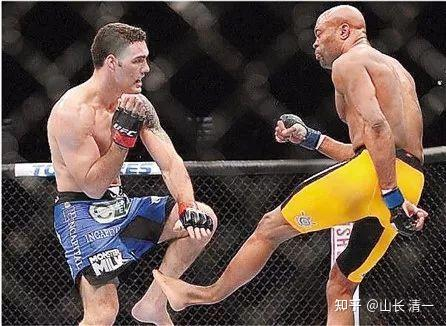
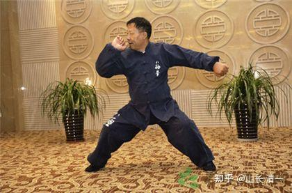

** 前几年，媒体上大量报道：咏春高手大战散打冠军，结果被踢断肋骨。据说早期的日本和中国武术，跟泰拳比试的时候，常常被踢断肋骨而输掉比赛。网上输入泰拳扫腿，各种踢断肋骨，甚至自己踢断自己小腿的报道都很多。这种泰扫腿法有多凶猛，你们看这些报道就知道了。一腿出去，踢在对方膝盖上，能把自己小腿踢断的腿法，用了多大的劲？你们自己算吧！UFC的蜘蛛人，就是在实战中一个泰扫过去，踢在对方最坚硬的膝盖上，当场胫骨断裂。下图是另外一场比赛，照片清晰地抓拍到了小腿胫骨断裂的样子。是不是看上去就恐怖？**

** 想看看泰拳的扫腿功夫，可以看这个链接的视频。当场扫腿把对手打得站不起来，用担架抬下去的案例太多了。 **[泰拳必杀技，低扫踢的威力，拳手直接被踢瘸在擂台之上](https://link.zhihu.com/?target=https%3A//haokan.baidu.com/v%3Fpd%3Dwisenatural%26vid%3D5462096720549788265)

** 不过这并不能说明泰拳的格斗技术，就超过了中国武术或者日本武术。而是现在练传武的，基本上没有练对抗，更没有专门的抗击打训练，光练招式技术了。这种人根本就不能上擂台。就算功夫练得不错，刚开始还可以打几下，时间一拖长，就肯定出问题，因为现代擂台赛，难免会被对手击中。但只要被击中几次，就会丧失战斗力。所以，你技术好也没用。在泰国我们就听外国人评价中国武术“技术更好，速度也很快，但力量不够”。所以，我认为这就是中国传统武术，至今没有走上现代格斗舞台的核心原因：基本的场上功夫就不匹配。**

** 泰拳与我们的传统武术不同。人家是从小打比赛打出来的身体，特别耐打。一些泰国小孩，四五岁就参加泰拳比赛，一路打到20多岁，比赛经验和实战能力都很超强。某与播求齐名的泰拳高手，据说参加的第一场泰拳比赛才四岁多，拿到了20泰铢的比赛奖金。全国到处都是的拳台上，年龄才七八岁的小孩，就经常搏击在拳台上。我们在泰国训练的拳馆，里面的冠军20多岁，也是几岁就开打了。所以，非常适应这种打法。**

** 我们很好奇：泰拳的抗击打力是怎样练出来的？当他看到我们的小拳手用棒子敲打各位部位身体的时候，说：不需要这样“自虐”的，我们也趁机问：泰拳扫腿这么强大的威力，你们是怎样练出防守力来的？说也没咋练抗击打力，就是实战打多了，就自然不怕打了。刚开始打完比赛，会受伤，会有点疼，但慢慢就习惯了，就不疼了。也不怕打了。所以，让我们的小拳手没必要急着去练抗击打。多打比赛，以后自然就行了。**

** 话说得轻巧：万一刚打几场，就被踢断肋骨，以后恐怕就无法上场了。因为就算接上了骨头，也更容易再次被踢断。中间需要的休养时间太长了。赛场生涯可能从此就中断。所以，为了防止出现被踢断肋骨之类的事件，“爆头”就更要防止了，我用了三个方案来对付泰扫。**

** 第一是技术层面上，专门针对性训练。泰拳是至刚的拳术，想要刚上面强过它，有点不现实。所以，就必须用太极的“以天下之至柔，驰骋天下之至刚”。打法上，强调以柔克刚，以直破横的技术。在空间和时间差上，与泰拳扫腿的威力发挥的场合要错位，尽量不要双方硬碰硬。否则，我们就算赢了，也是惨胜。玩太极的，强调道法自然，不玩这种硬碰硬的功夫。要以巧破力。实际上我已经教了孩子们卸力的方法，我打她们的时候，已经可以自动卸力了。练出这种反应，就肯定不会被打断骨头的。只是会倒退几步。泰拳是以被击打后移位的程度来判断打击有效性的。所以，泰拳手为了不丢分，会采取硬抗的方式来对付泰扫。但我要求孩子们用灵活的身法步法来打，不要担心被扣分的问题。不要面子要里子，你打退我一次，我打退你几次，你还是赢的。所以，不要搞泰拳的步步为营，稳扎稳打，我们打游击战。要想身体不吃亏， 脚步就要多动才行。**

** 第二：面对泰扫攻击，不被动防守，实行攻防合一，以攻对攻的战术。绝对不站在原位，被动防守泰扫。也绝对禁止用手臂去格挡泰扫。欧美选手不熟悉泰拳的这种扫腿威力，习惯用手臂去防守，经常导致手臂被打断的事故。你想想：能够把自己的胫骨都击断的泰扫，你去用手臂防守阻隔，不是找死吗？我们用进步提膝防卫泰扫，在加上进步正蹬腿发动后发制人的攻击，阻截对方强大的扫腿。这样就不至于在对方擅长的领域，和对方强势对攻了。**

** 第三：用我们更加擅长的太极内围战，来破解泰扫的威力。用膝击和肘拳，来发动主要的攻击。摆脱泰扫的威胁。其实泰拳手也不是所有人都擅长内围战的。但几乎所有人都擅长扫腿。因为这是泰拳最基础的技能。也是泰拳最强调的技能。**

** 不过。就算以上三条都指导到位了，拳手不一定练到位，实战不一定就能做到。所以：还必须做好挨打的准备。我们的拳手，也要强化练习腹部和肋部的抗击打力练习。我一个好朋友，分享了我一个很好用的传统武术练法，是练丹田内功，内壮的方式，可以很快强化小腹部的抗击打能力。我根据泰国的情况，改造了一下练法，让孩子们试验去练习，结果发现效果好到不可思议：刚开始练习第一天，孩子们就反应给我：在练的时候，不断的放屁和打嗝。饿的特别快（一般是上午练基本功，下午练实战技术）。练了一个月不到，今天上午，我去检查了一下孩子们小腹部练的情况，发现已经很充实了。腹部的筋膜已经腾起，跟一般人完全不一样了。我试着踢了几脚，见两人都没啥反应。只是身体会退后几步，会自然消力，但腹部没啥不舒服的感觉，身体也不受打击的影响。**

** 不过，孩子们也表示：虽然现在腹部练功的效果良好，也去拳馆接受过泰拳男拳手的膝击试验，完全可以抵偿泰拳直膝的冲击。但目前，腰部两边的肋骨防守还不行。她们摸过泰拳冠军的身体，发现腹部比她们更结实。另外，两侧的腰部和肋骨，也有明显的肌肉群，显然就是练家子。而一般的泰拳手就没有这些肌肉群。或者不明显。而两孩子两侧目前都没有肌肉群，肋骨很清晰。一旦被泰扫打上肯定会有问题。她们问过泰拳手是如何练出侧面肌肉群来的？说是他们身上的腹部肌肉和两侧肌肉，都是练仰卧起坐来的。侧面的肌肉，就是练侧部起来的仰卧起坐。我觉得：这方法不太靠谱，练出来的肌肉群很死，不好运用。两孩子也反馈：的确这些拳手双臂，以及背部的肌肉，都特别的硬，摸上去像一块铁一样。我们的小拳手，原来两手臂的肌肉也是硬的。但用了武当派的拍打法之后，两手臂的肌肉意外的变软了，但崩起来更硬，弹性更强，出拳速度也比原来更快了。反映了内家拳说的"肌肉练死了“不是假话。练泰拳太久的人，是没法练太极的。肌肉群都不支持。太极人的胳臂很细，肌肉很软，但打起来很强。弹性很好，关键是：可以发出不同方向的力量。泰拳的练习方式，基本上专注于一个方向。一旦变化位置方向，就无法发力了。所以，我们要在他们不擅长的地方来跟他们决战，而不是去硬拼泰拳的优势。 **

** 腹部内壮解决了，但肋骨防守的问题，依然没有解决。其实，中国传统练习身体的抗击打方式有很多，传统八极拳的撞树功就不错，各位可以看看这个链接，这功夫不简单。**[https://www.baidu.com/link?url=hs8ddl9Ke4F7gK9_O8dlbDRnHTaDZ-yjW_MOrG6xstUmZJcK3_tiz82YirIaaU2OfCNBS9H-LOEOFmaBO079J_&wd=&eqid=a6310b900008e58c0000000662091fd7](https://link.zhihu.com/?target=https%3A//www.baidu.com/link%3Furl%3Dhs8ddl9Ke4F7gK9_O8dlbDRnHTaDZ-yjW_MOrG6xstUmZJcK3_tiz82YirIaaU2OfCNBS9H-LOEOFmaBO079J_%26wd%3D%26eqid%3Da6310b900008e58c0000000662091fd7)

如果你踏实去练这种功夫，肯定练出来不会比泰拳的抗击打能力差。我把八极拳撞树功改造了一下，为了符合太极灵动的特点，就不去撞树了，而是两人踩着音乐的节奏，步法轻灵的换步，互相对练。不仅仅练抗击打，而要把这种功夫，结合太极实战招数，练成自己攻防一体的大杀器，拳起人飞。具体的练法，现在就不公开了，等以后打赢了，再告诉大家。我们可不想没上场自己的作战计划，所有的技术特点，就全公开出来。也许，泰国人会有人关注我们这个号的（当然，这是开玩笑）。但我相信：将来我们大赢以后，泰国人会拼命来研究我们的拳技术的。到底是咋赢的？因为这种技术太不一样了，完全克制了泰拳的发挥。泰拳的商业化很重，赢才是王者他们不会保守到不接受比他们更先进的拳法的。就看练不练得出来了。也许---以后的泰拳也会融入我们的清一派打法吧？

她们日常练功的音乐，这里倒是可以公开一下：每天早上，她们是用西班牙的佛罗门戈音乐陪伴一起练功的。节奏非常的欢快和鲜明。这里说明一下：中国人练拳，是没有音乐的。但泰国人拳场里面练拳，全程都配音乐，当然是他们的泰国音乐。我们觉得吵闹不堪，但他们自得其乐。别小看这种习惯，泰国的拳场，比赛的时候都放一种很特别的音乐。泰国拳手很善于通过音乐来掌握节奏，控制比赛，但外国拳手认为拳就是拳，不知道拳外的文化背景，才是核心要领。比如外国拳手也来打泰拳，但他们比赛前，都不跳泰国特有的拜师舞。但我是玩音乐，也懂心理学的人。我知道拳师舞蹈对泰国拳手很重要，是一种非常重要的心理放松剂。也是赛前热身的良好手段。所以这个仪式，不是啥宗教意图，而有非常强烈的实用意义。所以，我让太极小拳手们，将来进场，在泰拳手跳拜师舞的时候，也要跳舞----就跳我们的太极拳舞好了。玩玩套路。虽然套路根本就不是用来打的，但用来赛前热身。倒是一个不错的工具。所以，将来你们会看到很奇葩的景象：泰国的拳场上，一方严肃认真的跳泰拳舞，另一方则轻松舒展大方的跳太极武。泰国观众，估计已经看惯了外国拳手显得有点很不合时的，甚至很无聊的等着看拳师舞结束后开打。估计会是第一次看见外国人跳太极舞的。但为了将来适应赛场，现在就必须在音乐的陪伴下练拳。

*八极拳：铁山靠！*