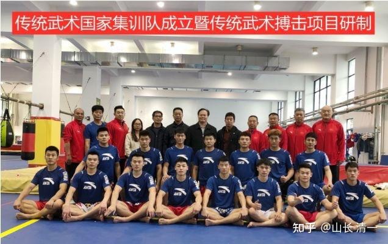
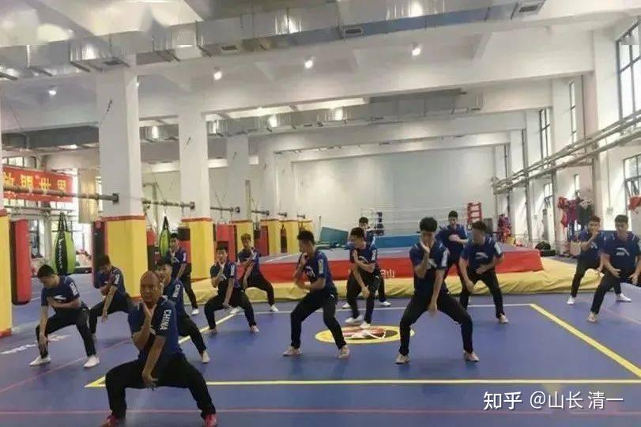

*传武国家集训队成立（2020年11月，南京）*

据说，中国国家体育总局，也在操心传武不能实战的问题，因为这“国粹”被打脸严重，实在撑不下去了。就专门成立了【传武国家集训队】，想要重振传武雄风。

我也是看不过去，这么多年，传武被这些白吃饭的传武大师们，践踏成这样。所以，差不多比他们早一年左右，我就自己拿钱来，开创了【清一武道馆】，专练太极实战。目标是去世界现代格斗赛场上，为传武挣一点最基本的面子。目前20来个年轻人在跟我练大家认为最没实战价值的拳---太极！

这一百多年，太极的实战能力，国人们就只在电影和小说中见过，只在大师的吹嘘中见过，但无论中国还是国外的赛场上，就没见过真正的太极实战。各位就别拿韩飞龙这种人，来说“太极格斗”了。他练的技术体系，发力方式，都不是太极。而是现代格斗。他拜入陈家沟，就是一个投名状，并不是陈家沟太极训练出来的实战选手。陈家沟练的东西，是【太极套路+散打】。如果陈家沟真有懂实战太极的人，也不会被东东虐得这么惨。已经被公开的指名叫骂了。但陈家沟的太极大师们，修养却很好，一声不吭的忍着。难道忘了陈家沟的祖先“太极无敌拳”的名号了？“犯者立扑”的实战效果了？不去打丫的东东，怎么能出这口恶气？

不过呢，如果真心想要弘扬传武，把传武的实战精神在现代赛场上实实在在的打出来，就像是格雷西挑战全世界的格斗手，弘扬巴西柔术一样。您认为：是国家集全国之力来创办的【正宗国字号传武集训队】会成功呢？还是我这一个从来没有上过擂台，没有系统练过武术，没有任何武林背景的文人，一直在教书的书生，自己凭一时的意气，来创办的一个私人小武馆，更有希望呢？

您还可以把这问题往大了想：如果想要创办一所超过世界名校的大学，中国应该举全国之力，来集中全国的精英来创办世界水平的大学呢？还是一个民间的私学先生说：要击败世界名校更靠谱？

我猜：没有人会投票支持“一个人的武林”，或者“一个人的大学”吧？

可我：必须支持这“一个人”。因为我不支持，就没人支持他了。一个人的大学，其实已经办成功了。清一大学每年招生数十人。对象只是15-16岁的学生，必须拿美国18岁的高考优等生的成绩才能进来，成绩要求是世界前50名大学的标准。起码入学标准上，我这一个人的大学，已经是“世界知名大学水准”了。甚至一些已经考取海外名校的侨生，也放弃海外名校来读只发私人文凭的【清一大学】了。当然，为了吸引优质生源，来清一大学上学，是“全奖入读”，连生活费都免了。您可以认为：这些人可能是没饭吃了，来我们这吃白饭的。

话说：文无第一，武无第二。作为清一大学武术和国学专业的【清一武道馆】，武馆的投资人，总教练，以及唯一的教练，都是我一个人。现在中国体育总局，组建了国家队。各位要投票的话，您会投我一票吗？看样子没希望吧？

不过，当年中央国术馆没有办成的事情（弘扬国术），我就不相信现在交给【国家体育总局】，现在我国很有钱，就能办成这个事情了。过去这几十年他们办了啥？不就搞成了中国特色的【套路武术】吗？除了这个，我不相信他们还会玩“传武实战格斗”。就算玩格斗，我看他们也只会花钱请洋人来玩海外格斗。因为他们就没有自己的东西，就是有钱。买买买，就成为他们最自然的选项了。挺像一百多年前，我们是世界第一富裕国家。大量花钱买军舰一样，因为就可以强军了。结果这些军舰，后来都成了送给日本人的礼物。

国术，是买不来的。你可以拼凑格斗技术，但国术，就只能在中国武术哲学的土壤里长出来。靠西洋格斗技术和格斗哲学，绝对不是国术。就算同样的动作，但国术用出来，本质上是不一样的。有点像是说不清，道不明的“内功：，你知道它存在，却无法证明。就像人的思维一样，你知道她存在，就无法“看见”。

我在网上搜索了一下这个“传武实战国家队"的信息。目前除了成立当天的报道外，一个新信息都没有。保密吗？按道理：当年成立队伍的时候，就应该有一个规划：什么时候，要干什么。预算， 时间需要多长等等。就像盖建筑，先必须有设计图吧？不能边走边“研究”。起码需要有方向才有可能，不是凭“爱国热情”就行了。

我两年多前，成立清一武道馆的时候。就明确说了时间表：我需要用3年，最多5年的时间，就去冲击现代格斗的冠军。今年已经进入第三年了，正在备战，对战号称五百年不败的泰拳。第一战时间上应该在两个月之内。我对队员的要求是：三年训练期满，如果发现没有冲击格斗冠军的潜力，就退役。如果所有人都没希望，就全馆解散，我们认输，不再玩传武了。目前泰国的泰拳馆，正在安排我们的实战比赛。老板说：由于我们是新人，新加入，至少需要两个月时间，才能给我们排上正式的比赛。不过在场下的训练赛中，我们的拳手已经表现出了强大的实力。我认为最终赢得比赛是毫无悬念的。小拳手也在抓紧时间备战，每天抓住泰拳男冠军做训练，了解泰拳的攻防技法。每天跟我交流不解之处。然后用我们的技法针对性地破解泰拳的攻击力。实力上，孩子们每天都在进步中。信心每一天都在增强。

而现在，中国的不缺金钱的传武国家队，传武梦之队，现在正在哪里？在进行什么特别的训练？正在备战何种格斗？备战的方向是什么？泰拳？日本踢拳？还是MMA?，我们一点消息也没有查到。 我认为：这个任务，很可能已经失败了。难说这个传武国家队，已经解散了。中国就是这样的------很多事情，都是有头无尾。没设计图，变烂尾楼了。

我看了上面的国家传武格斗队的照片，12个教师爷，来带15个队员。我就知道这事成不了。因为让一大堆人来负责，就是谁都不负责。不知道该听谁的。站在中间的一群人，就不像武者，像当官的人。主教练没地位，怎么练？怎么打？实战中，要打出来传武的风格，必须要有强烈的个性和特点。必须别人说错的，你也坚持下去（当然，你必须有足够深入的武道思想，知道自己坚持的是什么，还需要知己知彼）。我们在泰国拳馆里面训练。就是知彼的训练。结果，泰国人天天说我们的孩子练错了，哪里都不对。出拳的方法不对，出腿的方法不对。身体的动作也不对。这么多人，还是泰拳的冠军，金腰带，来“指导”孩子们到底练啥是对的？你有底气坚持自己的练法吗？指挥的人多了，孩子们就乱套了，结果啥都练不出来了。

所以：很多时候，所谓的集体智慧，就是集体愚昧。中国的武术界，就是不尊重个人的创造力。国家体育总局不放权。啥事都要管，练套路动作怎样才“标准”，也要制定出来。带来的后果，自然就是全民一个标准---僵死的标准。而泰拳就不一样，是在实战中打出来的技术体系。训练中，每个拳馆都有自己的特点，有些擅长远距离腿击，有些擅长内围技术。有些专攻拳法。但赢率高的技术，别家都一起来学，最终，大家都会自动调整，吸收一些新的技法。所以现在泰拳馆训练的方式，技术，招数，和古泰拳是很不一样的。泰国也有一些人，对现代泰拳很不满意。这一批人， 就现在坚持玩古泰拳。也举办不戴拳套的古泰拳比赛，也有人看。所以，技术体系就是这样在实战中完善了。而国家体育总局的这些官员们，第一时间就要求“设计出传武技术标准系统”来。就绝对是闭门造车。

实战会自动调整成最有效的模式，这个道理应该很基本。现在这家拳馆的泰拳手，从开始嘲笑我们的动作“不好看”，没有泰拳直和帅气。甚至直言:太难看了。 但由于实战对练中，每天都会被我们孩子大量击中。而他们的“先进泰拳技术”，却很难有效击中我们的孩子。所以。一些泰拳手，已经开始悄悄学习我们孩子的打法了。只是孩子们告诉我： 他们模仿我们的动作就很可笑，总是发不出力量来。因为任何武学体系，最核心的是发力技术，这才是武术的特色，是中国武术存在千年的基本功。这个发力的哲学不改变，你模仿我们的动作没用。就像是你们练太极的动作，练什么24式，108式等等，其实都是没用的-----除非你会太极的发力方式。这些动作就会发挥非常强大的攻击性。小拳手们前两年在干嘛？就是一直在坚持练太极的发力技术，现在也还在继续每天坚持练。没有这个底子，这些太极攻防动作，就是上泰拳台去找抽的。

比如，我们就放弃了泰拳手们攻击时最喜欢采用的，也是泰拳最强大的攻击手段：泰扫。[泰拳必杀技，低扫踢的威力，拳手直接被踢瘸在擂台之上](http://link.zhihu.com/?target=https%3A//haokan.baidu.com/v%3Fpd%3Dwisenatural%26vid%3D5462096720549788265)

看看这个链接中的视频，你就知道泰扫的威力，以及使用的强度和频率了。基本上，这是泰拳最重要的攻击手段。其次就是内围肘膝了，拳法相对并不重要。我们拳手要跟泰拳手决战，我居然决定放弃了用泰拳中最核心的攻击技术，是不是有点傻？难道等着挨打吗？

才不是呢：因为太极格斗的技术中，使用泰扫，并无啥特别的优势。我们会采用比泰扫更重，更快的腿法来攻击对手。而且我们的攻击，还是攻防合一的：当我们使用这个技术的时候，泰扫就根本无法发挥作用了。所以，显然我们应该采用这个对我们来说有百利而无一害的攻防技术。干嘛去使用风险很大的泰扫？

在目前去泰拳馆的实战练习中，已经证明了我们的技术路径是有效的。女孩们就算是跟泰拳的冠军拳手们对练，对手也基本上无法使用泰扫来进行有效攻击。反而在使用过程中，被我们更加轻灵，快捷的腿法后发先至，被提前击中胸腹部。一个善于使用扫腿的泰拳手，在实战练习的时候，面对我们的小拳手，一边后退一边说：我怎么都不敢出腿扫她们了？当然不敢，因为我们的攻击时机，就是你一出腿就上步打你。他前面被打过几次迎击，觉得只要他一开动扫踢，就是找打。当然就不敢抬腿乱踢了。

后来，几个泰拳手就开始模仿我们孩子的独特腿法，我们的孩子也不藏私，给他们示范了我们的腿法----中国传统武术的穿心脚。这虽然看起来很简单，很轻巧。但泰拳手们打出来，就是很难看，很别扭。孩子们问我：为啥泰拳扫腿很漂亮的这些拳手，学着用我们的主攻腿法来实战，就变很难看了？身体动作一点都不协调，站都站不稳的样子。就算打上了也没力气。

我说:两种腿法的发力要领是不一样的。泰拳手要学会你们的腿法，就必须放弃原来的发力方式。但真改了，他们原有的技术就全部失效。泰拳能够发挥扫腿的威力，就在于他们的发力方式可以做到又重，又快的扫腿。但这种发力方式，用来发我们的穿心腿，速度又慢，又没有力量。所以泰拳不是不知道这种腿法动作，而是基本上弃用了他们难以发挥威力的技术动作。 并不作为训练的重点，只是作为拦截腿法来使用。所以，是格斗擂台的需要，催生了技术体系的训练。

泰国人什么时候会放弃自己的扫踢体系吗？我认为目前肯定不会的，直到有一天，一批一批采用我们穿心腿技术的拳手，不断击败泰拳的扫腿高手们，他们才会设法改变技术。发展出另外一套对付我们这种腿法的格斗技术来，目前，他们是绝对不肯放弃的。只会认为你们出例外。因为他对付其他人依然有效。但将来我们的孩子拿到越来越多的胜率，泰国拳师们，一定会来研究我们的打法，练法的。最终，就必须学习和使用我们的技术体系----必须学太极。也许，将来的某一天，泰拳很可能因为我们的队员的实战优越性，而改变现有的技术。这就是世界武术发展的必然历史，是在实战攻防中不断升华的。

我的研究还发现：穿心腿对泰拳的威胁，比对散打的威胁更大。因为这似乎是泰拳德语歌重大漏洞。为了防范强大的左右扫腿，泰拳的三宫步不是侧身，而是偏于正面站立。这就不可避免的暴露了中线打击区域。但由于泰拳的技术，直接攻击中线的招数并不多，所以他们没有这个压力来改变这种站位。而散打就必须顾忌这种暴露中线的站姿，所以这两个格斗体系，还是有点不一样的。但也正因为这样，所以散打选手被泰扫打击也是最惨的。有点“恐泰症”。一得必有一时。我只是说明：我们的小拳手将来与散打选手打的话，不会完全照搬对付泰拳的技术动作的。正面攻击突防的“穿心腿”，基本上会被其他更有效的打击方式代替。

但中国国家体育总局的这些“专业官员”，似乎根本就不知道这一点。中国的武术界，不管是民间还是官方的，对于传武的知识和理解，都局限在“招式”上。其实。传武和现代格斗的区别，根本就不是招式，而是：发力技术不一样！也因为发力体系不一样，所以中华传统武术，有很多看上去很像“花拳绣腿”的东西，特别是太极----你会核心发力，这些招数，就是实战很有效的高难度的招数。不会发力体系，这些招数就是体操。

希望本文让中国的传武人，以及爱好者，关注者。都放下对“招数，动作”的关注和追逐，而去研究传武最宝贵的核心技术----发力体系吧！

*这就是传武国家队的训练：比动作？一看就知道传武被玩残废了。*

以上这张图片，就是这个【国家传武队】我唯一看到的一张训练照。懂格斗的人一看，就知道这样子训练是瞎胡闹。因为：你上了擂台上，这个动作除了练挨打之外，没啥价值。重心移动不灵，变招不灵，发力----如此僵直的身体，怎么发出有效的攻击力？这样的【沉腰跨马式】动作，如果你是骑在马上拿着刀枪作战，问题倒是不大。但只是站在擂台上格斗呢！这样子站立，就算只是“过度动作”，你躲闪，移动和启动的速度，就慢了很多。笨如牛。你这个动作的蓄力发力也极为不流畅。所以，上了擂台，注定就只剩下挨打的份了。

再看教练：教练这个动作，做的还算“扎实”。就算打人打不了（我猜没谁会傻到站在他正面前去挨打的。至少从侧面进攻会更舒服，他的攻击死角）。估计他一旦被攻击的时候，还是能够站得稳的。但看看弟子们的姿势----别扭不？很多人看样子就是站都站不稳的样子。拳手们这样子擂台上一站？就把对下吓跑了？所以，在我看来：国家传武格斗队，真的就是个劳民伤财的笑话！我估计：跟一些人忽悠传武小粉丝的方法是一样一样的：跟着我，一起练套路，我们老祖宗的传统套路，你跟着慢慢练，你练了一千遍，就自然会打了。 不是说：太极十年不出门吗？我们就要闭门造车。

我估计：这个国家传武队，估计要等十年才能上擂台了。还不能确定是不是雷雷第二？ 保国第三？