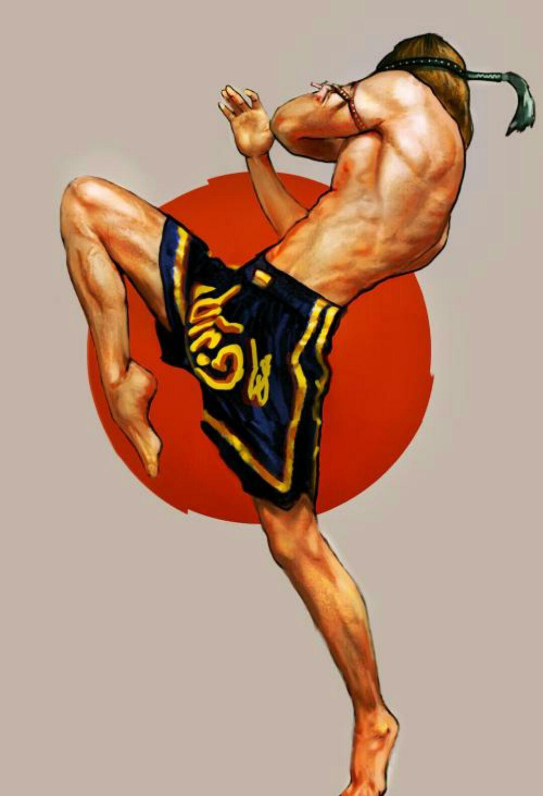

哲学思维，其实非常能够帮助一个人获得更美好的人生。很多现实中的问题，本质上就是一个“哲学价值观”的问题。如果你善于提问的话，基本上就很容易得到答案，你的生活，事业，就会活得很自在，也不容易陷入矛盾和遗憾，争论中。可惜人们往往不愿意学习哲学，不愿意思考。只愿意行动，然后，出现了现实的结果，又说这不是我想要的。

比如下面这个问题。就涉及了价值观的冲突：

问题1：如果我想要夺取泰拳冠军，拿到金腰带，我到底应该去一个泰拳冠军开的拳馆，而且已经培养出泰拳冠军的地方，去开始学习呢？还是去找一家新开的，据说是专门研究泰拳弱点，能够以柔克刚，更轻松地击败泰拳，但现在，还没有啥成功案例的太极实战拳馆呢？

VS对比问题

问题2：如果我想要用去实战擂台上拿到泰拳冠军的方式，来实现我自己人生更大的价值。我应该去一个已经培养出泰拳冠军的泰拳馆去学习泰拳呢？还是去找一家，据说专门研究泰拳的弱点，能够以柔克刚，更轻松地击败泰拳，但现在，还没有成功案例的太极拳馆呢？

如果你认为这两个问题和答案都一样的话，只能说你的思维能力不够。无法辨析提问的细节区别。其实，这两个问题的“正确答案”，是完全相反的。而且，这两个问题，适合的人群，也是完全不一样的。本质是，就是一个你想做追随者，还是做一个创新者的问题。做追随者，显然更稳当，更容易成功。做创新者，很可能失败，但万一成功的话，得到的回报率，也是做“追随者”永远也无法想象的。所以， 不同的追求，就成为你不同选择的价值观。

第一个问题的答案，如果你的核心目标是要得到泰拳冠军这个头衔，毫无疑问，最正确，风险最低，最不会绕路的方式，就是去追寻先辈的脚步-----去曾经培养出冠军的泰拳馆学习和提升自己。其他的选择，都可以直接无视。为啥？如果泰拳历史500年不败。就证明在世界格斗历史上，泰拳的地位是很稳当的。这是一个实战拳种，以擂台胜负来判高低。每年都有很多人在实际练习泰拳对抗，所有的拳手都在研究如何才能击败对手。所以，理论上如果有更有效的打法和技术，就一定会被人研究出来，实践出来，擂台上用出来的。而且如果真的实战效果更好，更有效，就会流行开来，大家都会开始模仿，最终形成新的“动态平衡”。所以，如果是现在已经定型的，大家都在学习的泰拳技术和招式，就是泰拳几百年来积累下来的，证明在擂台上取胜的最有效招数和训练方法。其他不太容易取得胜利的花样招数，就已经经过长期的历史和擂台实战的不断检验，被淘汰掉了。你不需要重新用个人的经验再去检验一次。所以，现在各家泰拳馆采用的训练手段， 肯定是最实用的，最有效的。事实上，现在的每个地区，曼谷还是清迈，每家泰拳馆，甚至在国外开设的泰拳馆，训练的内容，方法，技术，程序，都是非常相似的，互相之间没有啥原则性的区别，泰拳是一种非常公开的拳艺，基本上没有啥奥秘可言。据说古泰拳有些与现代泰拳不同的招式，但玩的人很少。所以，你只需要找到一家过去成功培养出冠军的拳馆，按照原来的设计图走下去，成功的概率就很高。如果你的努力，天赋和运气都不错的话，迟早，你就会拿到泰拳冠军的。这，就是拿泰拳冠军最正常，最自然的路。

至于另外一家，号称是可以击败泰拳的新太极拳馆，其实理论上来分析，是不太可能成功的。如果真的有啥可以在擂台实战中用出来的，比现有泰拳更有效的招数动作，功法，肯定早就被千万名泰拳先行者研究出来了。如果要改用新的格斗体系来取胜一个古老的，还不断在进步的拳种，难度太高，几乎不太可能。所以，为了保险，就不需要要冒险，不要走歪路，跟随现在成功者的路径。坚持下去就行了。别去尝试新路，因为失败的可能性是99%以上。

泰国很多职业拳手，就是把泰拳当做一个职业，可以脱离无聊的平庸的打工生活，所以流血流汗，也愿意冒险去学泰拳，打泰拳。他们知道:只要付出，就一定有回报。对于没有什么就业机会的下层泰国人来说，这是一条保证人生可以比一般人略好的道路。但你让他们冒险来学一种努力未必有回报的新技术？用新的方式，技术和新的训练思维来打泰拳？比如学中国的太极拳？绝对没门。估计你脑子不正常，才来学太极呢！追求可靠性高的话，根本就不需要考虑。

但第二个问题，需要解决的内涵，就不一样了：因为----**第二个问题的重点，并不是“要拿泰拳冠军”，而是“要用拿泰拳冠军的方式，来实现更大的人生价值”**。打泰拳，只是他实现这种价值的目标之一，他也可以去做其他事情来实现这一点。选泰拳，可以是泰拳更具有代表性。比如比中国散打更能够有说服力。所以，由于自己的人生目标已经变化了，这一次的目标，是要超越凡俗，去创造出一种新的人生和可能。所以，正确的答案，就一起跟随变化了。这第二个问题的答案，就是：你绝对应该去这家实战太极拳馆练习，设法取得泰拳冠军。比去泰拳馆练拳拿泰拳冠军更有价值。

为啥这样说？

因为：如果你的目标，并不是想成为一名职业拳手，并不想用打拳来作为谋生的手段。打泰拳，甚至练武术，也只是你实现有价值的人生目标的一种方式。你选去一家泰拳馆刻苦训练，去拿一个泰拳冠军，就是很不明智的。因为：你的目标不是混一个饭碗，而是要实现一个理想。你去一家专业的泰拳馆训练，学泰拳技术，你学得再好，无非也只是成千上万的泰拳从业者之一。就算你有一天，拿到了泰拳冠军的称号，你的人生价值，也就是一个普通的泰拳职业拳手。区别只是名气大一些，小一些，收入多一些，少一些罢了。你最多，就是成为播求一样的泰拳明星，在拳台上，有机会征战多年，赚不少钱。让别人能够记住你10年，20年的。只要你退役了，你很快就被人遗忘了。因为每年都有新的明星出现。你只是成千上万的泰拳从业者一员。您从事泰拳，最终成功获得的只是一个职业，失败了，连一份职业都谈不上。成功了也只是一种跟别人去工厂打工，也差不多的生活罢了。所以，你去泰拳馆学习去拿泰拳冠军，跟你选择是过一种其他人也过的生活和职业，没有什么不同。

但如果你去一家太极实战拳馆，目标是要获得泰拳冠军，结局就完全不一样了。因为历史上，五百年不败的泰拳，已经出过无数的泰拳冠军。各种人，甚至中国人，也有人拿到过泰拳的冠军，所以泰拳冠军并不稀奇。（有人说泰拳手也失败过，外国人也击败过泰拳，不能说明泰拳不败，这是错误的。我们学泰拳，击败了泰拳手，也是泰拳的成功，不是“中国拳的成功”，也许是某个中国人的成功。只有中国的拳种，在相同的竞争标准评价下，击败了泰国的拳，才能说泰拳败给某某拳了）。比如，中南海保镖李建文，击败过俄罗斯武士。网络上都传他的视频。他的确是武林高手，但本质上他和中华武术没有多大关系。他是在俄罗斯留学的时候学的拳击等，在俄罗斯就拿了拳击冠军，长期教拳击。其实他是代表现代格斗的。硬要把他拉来作为“中华武术”的代表人物，有点死要面子瞎吹牛。一些武术人士学过一点传武，但看他是不是传武人，就看他是否使用传统的理论和体系。如果不是，就跟泰国人因为我们去过泰拳馆学习，就硬要说我们取胜的拳法，是泰国原产的。这就不客观了。

但可惜的是：世界范围内，还从来没有出现中国武术战胜泰拳的历史，甚至从来没有记录，说明在正规的国际比赛中，中华武术战胜过现代格斗。虽然中国已经有拳击的拳王，以及泰拳格斗，K1格斗，MMA格斗，甚至UFC格斗的金腰带出现，但这些拳手，并不是用中国的技术来获胜的。都是学的现代格斗技术。只能说明中国拳手是“虚心跟国际接轨，学习”的人。但并不能因为这些人是中国人，就说：中国武术赢了。这是两个概念。中国人可以使用苹果手机，甚至制造出苹果手机。但谁要说苹果手机就是“中国的企业”，这就太阿Q了。

太极拳，更是一种全世界公认为没有实战技击能力的拳种。很多人只认为太极只是一种健身操。只在传说中电影中，小说中，才有人认为太极是有实战能力的。所以，今天如果有一点点可能性，如果可以用太极的技术来击败泰拳，你都应该去这家太极拳馆去。起码拿三年时间来验证一下可能性，知道你发现不可能为止。如果这家拳馆还没有创造出什么成功的记录，你就不应该去吗？其实你就更应该去了。因为，也许你就是未来创造世界纪录的人。因为有一天，假如他们真的用太极技术战胜了泰拳，你获得的，绝对不是一个“普通拳师”的荣誉，而是“一代宗师”的荣誉。就如同当年的杨露禅，开创了太极走向大众的名誉一样，他就成了传奇人物。其实早在他出来打遍京城无敌手之前，太极拳早已存在，只是人们都不知道罢了。他让中国人知道了，他就是中国的英雄。你用太极在世界擂台赛公开地击败了各路外国人，你就是中国人的英雄。你必然会成为中国传武以及太极文化的荣誉代表。因为你帮助中国人圆了一个太极梦。你用太极击败了五百年不败的泰拳，你当然就成了中国人心中的太极英雄。你最终收获的荣誉，甚至财富，都是一个普通的泰拳冠军无法相比的。你的光荣，将不会随着时光而消失。你会被后人们记住和纪念你的创造。就像泰拳崇拜和尊重的前辈，甚至传说是泰拳创造者的乃克侬东一样。也许他真实的技术水平，未必比现在的拳王更高。但他当年的创造，捍卫了泰国人的荣誉，所以已经成为了一个文化符号。这就是作为一派拳技术的创新者风险，和与风险相应的超额回报其实是对等的。

所以，你去学一种别人不知道的，全新的太极格斗技术，来击败了泰拳，你当然能够让人生实现了更大的价值。甚至于：你不仅仅会成为中国人的英雄，你也会成为泰国人，甚至全世界泰拳格斗界的明星：因为如果其他国家的人，看到你用完全不一样的技术，击败了他们心中的明星。如果这种事情不断发生，他们一定会要找你学习新的技术。如果事实证明：你的技术更高的话，泰拳选手都要来找你学习。才能更容易取胜。因此，就算在泰国，你也是炙手可热的人物。因此，就是有很大失败的可能，但只有有一线可能，都应该去努力尝试的。说不定，就成了呢？

您说: 有这么大的好处？我可以打着太极拳的名号，去偷偷的学习泰拳技术，最后努力拿到泰拳冠军，假装是太极拳赢了，不就可以获得这种名誉了吗？

这就是陈家沟在玩的东西：他们练的太极套路，只是练练给你看的。是出来玩品味的东西。号称练太极的人，上擂台之前，他们真实演练的，还是散打的技术体系。日常训练中，也完全是按照散打的技术和要求来练习的。我去过陈家沟，也专门去看过他们的太极武校，知道他们是咋训练出来的“功夫”。所以：要说陈家沟的人能打，我们还是可以相信的。但要说他们练的是实战太极？你依然相信的话就太傻了。他们只是穿了一件太极的衣服，在玩散打的比赛罢了。在真实的格斗技术体系上，跟太极其实没有啥本质联系。大约没有啥格斗界的外国人，会因为陈家沟的人打拳成功了，就去跟他们学擂台格斗技术的。去了也会很失望的。

如果你号称是太极拳馆，你想要战胜泰拳，就必须采用太极的核心技法原则，用与泰拳完全不同的方式来训练。就像我们一样，每天用跟着音乐“跳舞”的方式来练拳。跟泰拳的虎虎生风的练拳方式完全不一样。因为：如果用泰拳完全一样的训练方式来训练，你就是泰拳。无论打着什么名义来打实战，你依然是泰拳选手。这绝对不是赛前热身的时候，你穿上一套太极服，场上练练太极套路，就算太极格斗了。这样子，你就算赢了，也不是太极，而是泰拳。因为你骨子里面的格斗系统，是泰拳的格斗原则和体系，你是用泰拳技术取得胜利的。你必须用一种完全不同的格斗思路来比赛，然后赢了，你才有资格称你是“太极格斗”，用日本的说法，我们要打的比赛就是“异种格斗”。只是我们选的对象是泰拳罢了。日本一直在推行一种在相同的格斗规则下，用不同的格斗技术来互相比试的比赛。也许这种探索，可以保留更多的各派武道的特色。

那么：如果太极拳手上泰拳擂台，用泰拳的规则来打。怎样才能看得出来是太极格斗？而不是泰拳呢？如果是一样的规则，双方打起来，不就差不多吗？其实真不一样。同样的出拳，尽管拳头打在脸上的效果是相同的。但如果你是通过转腰，转胯，摆臂出拳发力的，与你身子并不转动，也不用收手，就能出拳来打人，这肯定是两套不同的发力体系。行家一看，就知道是不同的。

行家一眼就可以看出不同格斗技术的差异。比如业余爱好者， 看日本的踢拳比赛，你会觉得跟泰拳比赛也差不多。但一些行家，一眼就可以看出；有些选手是泰拳的风格和打法，而另一些选手是欧式的打法，另一些是日式的打法。比如播求，他就不是纯泰的打法，他学习了更多的日式踢拳打法，技术比一般泰国拳手更全面。如果太极选手上场，专业人士一看到，可能认不出你是什么风格（打起来绝对不是慢悠悠的太极套路的样子）。但行家肯定会发现：我们采用了泰拳手通常不采用的招数，以及不同的进攻防守思路来打拳。只要一眼就看出来与泰拳非常不一样。

就像上次我发出来的的视频中。男拳手出扫腿被击倒了。他站起来说的第一句话，就是问小拳手---中国功夫吗？因为泰拳里面，是没有这种打法的。外人看，只是被打倒了而已，没啥稀奇的。因为泰拳也能打倒人。但怎样打倒对手，就是一个技术差异了。

所以，到底选手是用泰拳技术，还是用踢拳技术，或者拳击技术来打，行家都可以看出差别。太极技术，将与所有的现代格斗技术体系都不一样。我们用拳的方式不一样，用腿的方式也不一样，移动的方式也不一样。所以，一旦上场，就会被专业人员关注到，是一种“非常奇怪的打法”。所以会很快传开----一种新的格斗技术，正在击败我们的泰拳手。据说是太极?

泰拳的训练师们，都已经发现了我们小拳手跟泰拳技术明显不一样的地方。首先认为我们的动作“全是错的”，总是似是而非的样子。有一段时间，全体教练和拳手，看我们小拳手练打人靶的时候都认真盯着，一看打的不像泰拳的动作，就一起说：又练错了。因为他们觉得这种打法太怪异了。还说他们观察的我们拳手的很不专业的笑话：1：出拳的时候手臂伸不直。2：居然会双手同时出拳。3：出手进攻后不退回到原地，直接往前走。4：遇到对手攻击时，就“疯狂的”往前冲，而不是后退。5：预备式不是三宫步，而是前后步子拉开，斜着站立。6：出拳的时候，身子没有转动迹象（这往往是初学者不会转体发力的低水平发力标志）。7：我们出腿的时候，身子保持直挺状态，而不是泰拳一样有身子后仰，有转身，转体的助力动作等等。8：我们的扫腿身体没有挺直，不会发力。所以，他们的共同结论就是：我们打的拳很丑，很不正规。初学者，毛病多。

*图中就是很美的泰拳-----用我们的观点来看，全身绷紧发力， 又累，发力效果还不好。比不过太极的膝击。*

拳馆馆长还苦口婆心的劝诫小拳手们：你们来学泰拳，就要学会最美的泰拳。你们要好好练，手要伸直，拳要舒展。打得不好看，会让别人认为我们没有教好。所以，他每天都非常认真的纠正她们的动作。小拳手对此也很郁闷。我教她们对泰国人说：我们是外国人，练泰拳，肯定没有泰国人练的好看（泰拳的审美观，是刚强有力的动作才“美”，我们的小拳手打拳，总是柔柔的样子，一打就收手，身体一直不绷紧，看起来就很不美）。所以，如果我们没有打出“好看的泰拳”，只能说明是我们没有学好，不是泰拳教练没教好。

不过，小拳手也比较调皮，说：如果我们打拳的样子，虽然不好看，但能够打赢，是不是也行？教练哭笑不得，说打赢了，当然也可以不好看。但你们这样打拳，应该不会赢的。泰拳要打得动作都漂亮，才会有力气，裁判也才会给高分。你们这种拳， 是打不出力量来的，所以会输掉。小拳手们问我：裁判的审美问题怎么解决？想要泰国的裁判，接受中国的太极动作才美，我认为基本不可能。所以，我告诉小拳手：格斗擂台有一个最基本的美学原则，就是打完比赛后，两个人中，有一个是站着的，有一个是躺着的。站着的这个人，就最美！躺着的人，长得再漂亮，也不美！

我听说过：在泰国，外国拳手上台打泰拳的话，只要不把泰国的拳手打KO，就算实际上技术是处于上风的，但结果基本上都会判泰拳手赢（好像中国也是这样，只要选手没有干趴下，基本上赢面大过外国选手）。因为泰国人还是很“爱国”的，喜欢看外国人被泰国人击败。据说曼谷的仑披尼职业赛，要更加公平一些。

太极的优势，就是会使用被泰拳放弃的一些技术来实战。比如泰拳师傅教我们的小拳手要注意保护两侧，对我们的站位表示“不科学”，认为不能最有效地保护两侧。但我们的拳手表示：泰拳的这个站位，中间是暴露出来的，不是也很危险吗？结果泰拳老师告诉她们：不用担心，虽然中线有弱点，但别人一般不会进攻中线，因为是发不出力量来的，关键是要防住两边的攻击（主要是扫腿）。的确，泰拳的中路进攻招数，的确又慢，又没有力量。而且还会遇到来自两侧的打击。泰拳正蹬腿的力量，的确就很有限。我们的小拳手说：就像是被推了一下，没啥大的威胁。不像扫腿很厉害。似乎泰拳正蹬腿的主要作用，就是阻止对方前进，实战中没有太大的进攻意义。中国散打的正面蹬腿，如果击中是给分的，至于打击的力度大小，不是裁判的重要标准。所以中国散打使用这个技术会更多一些。而泰拳是不看你是否击中，而是看你是否给对方造成了较重的打击力，两者的判分原则不一样。因此，泰拳基本上就不太重视中间的没有力量的攻击，因为打不出力量来。实战中，泰拳对于正面的重袭，往往是采用向对手的侧面上方滑步上前，然后用中高扫腿来袭击对手的胸部和头部，进行中线进攻。但对攻击方来说，依然是“侧面进攻”的路数。泰拳的侧面进攻速度和力量，都是很强悍的。所以泰拳训练中，基本上不太重视中路的攻击技术练习。

我就告诉小拳手，知道我为啥教你们：实战中，你们要重点攻击泰拳手的中路，中盘了吗？因为这是他们的弱点，很容易中招。而如果你们模仿泰拳，从两侧发动攻击，基本上他们对两侧的防卫会很好，抗击打能力也不错。所以属于低效，费力不讨好的传统攻击。双方比的就是功力，你们肯定比不过从8岁就开始练泰拳的这些对手。而你们如果专注于中路攻击，就击中了大多数泰拳手的弱点。这其实就是中国古拳经强调的攻防手段：*脚踏中门抢地位,就是神仙也难防。*中路抢攻，是传统拳的一贯思维。像泰国这样专攻“边路进攻”的，不太符合中国传统武术的风格（八卦倒是走边路的）。

当然，这是理论，你还需要做出来才算。关键是中路攻击，必须是快速而且强有力的攻击，甚至要获得相当于泰拳手“边路进攻”的威力，你才有资格可以用中路进攻来跟他们进行对拼。中国传武练习者往往只是“点到为止”的练招数，只练了动作，没有练最核心的发力，所以是不能上泰拳擂台的。实际上，中路起腿攻击中方的胸腹部，的确有两个很严重的缺点：第一是出击的速度慢，很容易被人防守和接住，反而自己被控制。另外就是很难发力，只是蹭对方一下的话，没啥用处自己还容易遭到反攻，所以这种技法被泰拳放弃一点也不奇怪。

我们的小拳手，中路发力的速度如何呢？泰拳手们一起试练的时候，对我们小拳手的中路起腿攻击，都有抄腿的动作，想要抓住小拳手的进攻腿。但我们的拳手基本上没有被抓到过，就算是泰拳冠军拳手也抓不住。因为我们的起脚很快，收腿也很快。但是----由于不发力，也测试不出到底是否有攻击力。如果是实战，如果我们的小拳手出腿是带发力的。泰拳手们根本就没有接腿，抄腿的机会。我要求的出腿袭击，必须让对方的身体移位，重心被打动，如何还有能力去做其他技术动作？

理论是理论，她们出腿，有没有威力呢？前一天，靶师让小拳手训练一下打中路的正蹬腿（原来一直只训练两边的扫腿）。由于靶师身上，带着厚厚的正面护具。我们的小拳手，也就不客气的直接发力打出正踢腿。结果壮实的靶师被打到连退数步。然后很吃惊地说：你们的正蹬腿，咋这么大的力量？的确拳馆里面的泰拳男子冠军，也无法踢出这种力量。但他们的扫腿力量真的很大，被击中是很难站稳的，很容易受伤。

我给孩子们的交代就是：我们用正面穿心腿跟扫腿对抗，只要能踢到泰国人倒下去，也一样很美。没必要去学他们的扫腿技术。我们虽然也有从两侧攻击的腿法，只是与泰拳的扫腿是不一样的，我要求的侧扫腿法，是脚趾向上的侧扫。泰扫，散打的鞭腿，是脚趾向内的。因此，显然两种腿法的打击力量也不一样，身体动作也不一样。客观地说，我们这种出腿的速度会更快，但泰扫的力量会更大。但我们的攻击目标，不是大腿外侧，而是其他部位。比如大腿，小腿的内侧等。所以不需要像泰扫一样的大力两。但对于速度的要求更高。这就是发力要领不同，导致的实战招数和技术不同。所以，一旦拳场上的行家，看见一个人可以用正蹬对付侧扫，以及看到我们发扫腿的时候，身体不向后倾，就知道核心技能不一样。这种动作，正常情况下，是无法发力的。但如果看到我们的对手会被扫到站不稳，他们就知道这种“中式扫腿”是带力量的，不是比的动作秀。如果我们赢了，自然知道我们的技术高级。当然，如果我们输了，就是一场笑话---我们采用了被泰国人抛弃的无效技术。不过，看热闹的认为都差不多，无论谁输赢。都是踢腿而已。但看门道的，一定会知道发力方式不一样。如果我们的拳手攻击很有效，不断取胜，他们就会开始研究：这一定用了不同的格斗哲学原则。有可能改变泰拳的训练方式。

当然。这只是这其中一个小小动作的区别，还有其他很原则的打法区别。刚才已经说了8个被泰拳手们攻击“难看”的动作，其实都是我们的关键技术。我们的小拳手，每天训练的任务其实很简单；跟泰国人练泰扫一样，我们把【中国兔子蹬】认真练出来就足够对付泰扫了。其他技术，内围战技术，也是采用我们中式的太极缠绕技术，不是泰国的技术。但目前看来很有效，打残酷的内围战，泰拳手也占不到我们小拳手的便宜，他们经常会被我们的肘膝打到。当然，我们的武器库，并不是只有这么一两招。这不够对付500年不败的泰拳的。其实这两种拳的核心区别就是：泰拳如山，刚猛过人。太极如水，灵活超人。所以，两大拳种对抗，我们拳手的步法，身法，一旦练出来之后，肯定会胜过泰拳手。因为“山不转水转”。至于实战结果，能不能击败泰拳手？就看以后的比赛吧。疫情导致很多比赛都不能正常举行。很遗憾。

中国传武宝库里面，还有很多有效的技术，遗憾的是：没有人去好好练出来。国人一窝蜂都跟学国外格斗术了。作为传人，我们其实不需要去创造啥新玩意，能够把祖宗的本事好好消化，重新发挥出来，就等于“再度创造”了。