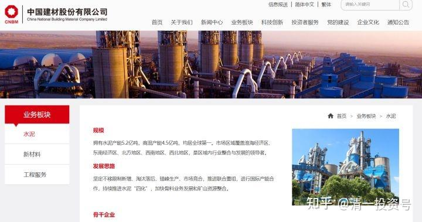
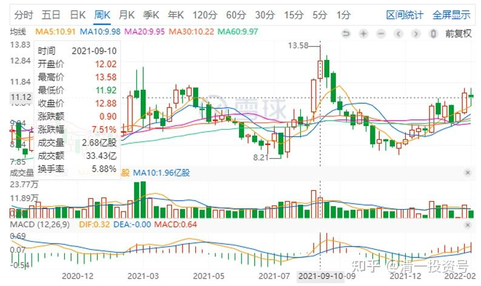
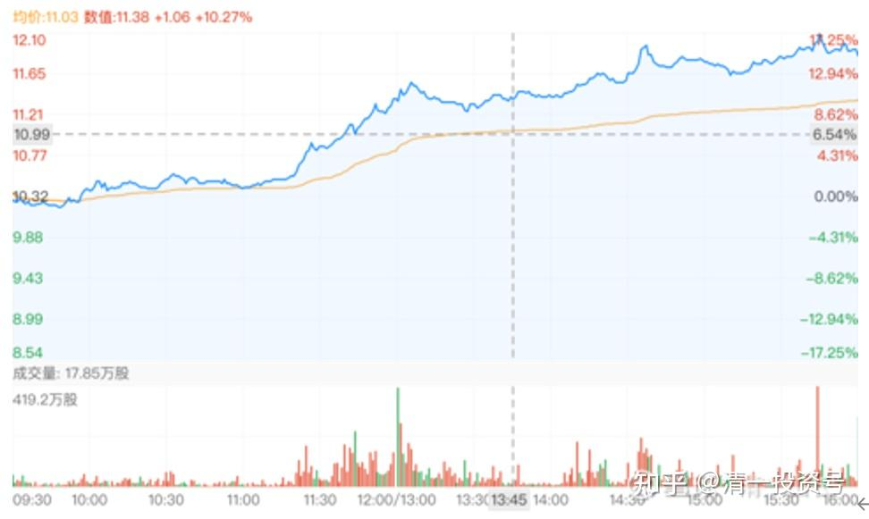
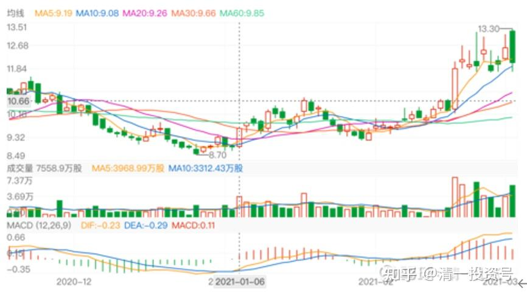
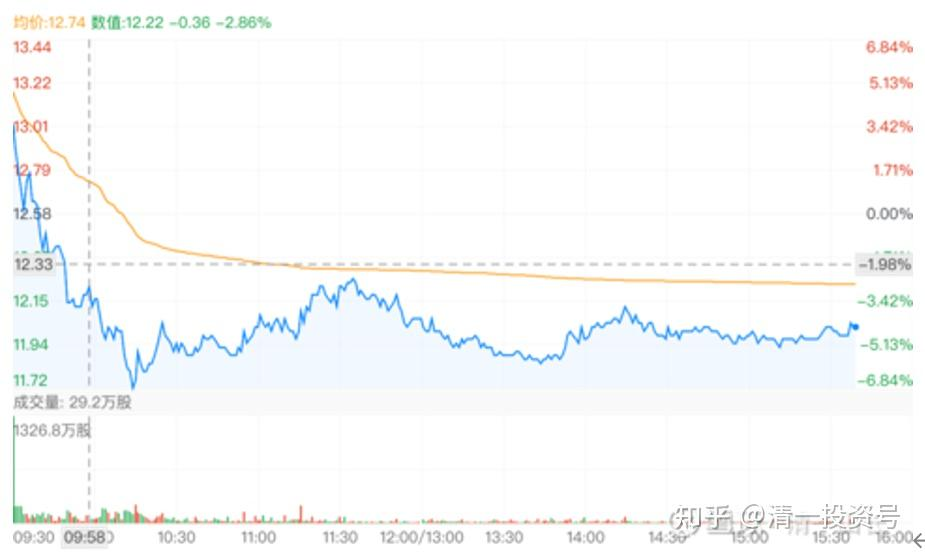

**15篇.这就是我持有中国建材的逻辑**

清一山长 2021年9月10日

**一、引子**

**[价值学习笔记](http://link.zhihu.com/?target=https%3A//xueqiu.com/7664480424%2522%2520%255Ct%2520%2522_blank)** [发布于2021-09-08 11:04](http://link.zhihu.com/?target=https%3A//xueqiu.com/7664480424/197057653)

[https://xueqiu.com/7664480424/197057653](http://link.zhihu.com/?target=https%3A//xueqiu.com/7664480424/197057653)

[$中国建材(03323)$](http://link.zhihu.com/?target=http%3A//xueqiu.com/S/03323)

中建材：今年还能有600亿现金流吗？

21年的利润，我先算你120亿，折旧算140亿，这两样合计，能贡献260亿现金流。

今年要想达到600亿现金流的话，差额就还有300多亿。

那么，剩下的这300多亿，你们打算从哪里把这笔钱弄出来？

呵呵，我倒要看看，谁能补得上窟窿？

**二、正文**

[清一山长](http://link.zhihu.com/?target=https%3A//xueqiu.com/9310099567) [2021-09-10 20:56](http://link.zhihu.com/?target=https%3A//xueqiu.com/9310099567/197395936) 评论：

这里吵得一塌糊涂的，有意思。

其实，我认为可以理解为：**中国建材进入水泥市场，不是靠技术实力啥的，他其实是玩的财技，空手套实业。**他和海螺不同，并不是干实业的出身，从水泥行业一步一个脚印的干起来。但他看到了水泥市场的前景，只要社会还要建设，就离不开水泥，但水泥市场中国竞争过于激烈，所以不赚钱（利润只是国外的10%），价格只是一半。他就利用自己的融资优势，贷款来买下这些生意惨淡的“低效资产”，原来的水泥老板们加盟之后，也可以赚钱了，当然也愿意卖股份给他。所以——中国建材就是借此快速进入水泥市场，并快速成为海螺水泥的强大竞争对手。而不是自己慢慢的去建厂，去市场竞争，而是**用资金优势直接切入了市场，用区域垄断优势，快速提高了销售价格，获得了利润。**

我们可以理解为：**建材是用1900亿的低成本资金，买来了一个年利润100-300亿的市场**（看你们喜欢怎么算利润了，我就毛估估）。如果利息（财务费用）只是5亿，他就大发了。我算他就每年60亿的利息（按利率3.1%算）。就知道：时间是站在中国建材一边的，一旦全部还掉贷款，中国建材每年300亿的利润，你给多少钱？只有800亿的市值吗？

而且，**中国建材不仅仅是水泥。**他家的水泥，作价卖给天山是多少钱？比现有的市值还多30%。说明他的水泥资产是真实的，市场认它这个价值。可以说，按照天山股份的价格来算，现在的中国建材都不止这个市值。**别说她还有其他新材料业务了**，这个价值又咋算？

当然，中国建材这样玩财技（用资金买断市场），一般人是不可能做到的。因为你拿钱给原来的企业老板，老板看你赚钱了，马上投钱再开一家来赚钱，你就为人做嫁衣了，会玩死自己的（产能过剩）。但他有国家的背景，限产能的政策、出清产能政策。所以：**他低息贷款买来的，是一堆现金牛。而且未来稳定发展**。这才是他的高明之处。

至于贴主看好海螺，也没错。海螺肯定是行业的王者。**但世界上，没有什么你对就是别人错了的，可能双方都对。**如果所有人都跟买建材的人一样看好建材，建材也不是现在的价格了。前两年居然跌到5元，说明跟贴主一样悲观看法，认为中国建材做假帐，不然怎么可能有这个价！

至于我：我更看好中国建材。如有三百亿潜在的利润（算上折旧部分），我的投资就是不亏的。800亿的市值咋不行？供给侧的持续抓紧，对她就是利润上升的保障。万一真有稳定的600亿现金流，持有她就赚死了。至少再涨一倍吧？新材料也再打开未来十年的发展空间。所以，**他可能比主业水泥的海螺更有成长性。**

**这就是我持有中国建材的逻辑！**

[清一山长](http://link.zhihu.com/?target=https%3A//xueqiu.com/9310099567) [2021-09-11 23:00](http://link.zhihu.com/?target=https%3A//xueqiu.com/9310099567/197454053)：

再补充几句：**其实中国建材是占了海螺打拼30年市场的便宜。**

**海螺是用实力硬拼，靠过硬的管理水平、品质，以及更低的成本，一直打压行业的价格，硬生生地挤压了其他水泥厂的生存空间，让很多水泥厂都活在亏损边缘，苦不堪言。**而海螺却可以赚钱，薄利占有市场，小对手一家一家的倒下。如果海螺坚决维持薄利销售，这些低效水泥厂家，就只能慢慢地死掉。因为没赚到钱，也没法升级设备，更没法降低成本，也得不到银行支持，恶性循环。海螺过去20多年，就是这种策略，打败了大把的对手。

如果没有中国建材介入，海螺就是一家独大了。实际上，除了中国建材，也没有其他对手有这个能力整合这群乌合之众。但中国建材出手整合市场，挽救这些散兵游勇之后，海螺也没脾气，只能接受未来的水泥双强局面。最近几年，她就专心赚钱算了，不再想大打出手，一统江山了。**中国建材用大笔的低息资金，加上国家政府力量的背后推动，拿下了一个永续经营的建材市场，实在是太划算了。**

**其实，啤酒行业就很像水泥行业。**每个企业都活得苦巴巴的，都在比只要活下去就行，谁都不敢多赚钱，导致中国啤酒的价格，居然是泰国啤酒价格的一半不到。**是全世界最低价的啤酒。就像是中国的水泥，是全世界最低价的水泥一样**。这个时候，介入市场的成本是最低的。各家企业要的是份额，死也不放手，利润表只好很难看了。相信未来的啤酒市场，也会和水泥一样：**巨头一旦分割市场完毕，停手不再战的话，随便提一点价格，利润一下子就上来了。**今年下半年，水泥的产量下降会很严重，但企业的利润上升会很明显。所以，现在押注水泥，应该是一个好时点。押注中国建材，赢面更大。**不过涨了不少，我就不跟了。也不推荐他，你们就随意。**

**博弈解读：**目前海螺的企业产品成本、费用管理都更有优势。如果水泥价格下降，对海螺的影响，远没有中国建材的影响更大。但相反的是：如果水泥价格上涨，由于成本已经锁定了，中国建材的利润增幅，会明显大于海螺的利润增幅的。

**还有：我怀疑国家会用水泥的供应量，作为工具，来调控房地产的供给侧。**因为如果供应量过大，地产市场容易过热。如果强制减少供应量，造成人为的供求不足，不仅仅可以让房地产公司的投资额大幅下降，也有助于稳定供应，相当于制造了市场饥饿，对长久的房地产供应有好处。所以，下半年压减高耗能的规模，是符合中央“有质量的发展”的精神。**原来中国的地产企业习惯上量、上杠杆、快速拿地、快速交房的习惯，会彻底改了。**你想上，都上不了速度。因为没有材料给你用。

**下半年，大量的资金，会从房地产行业溢出来的。去哪里呢？你们自己想吧！想到了，你就赚死了！收获季节恐怕就在眼前。**

**三、附录——2021年中国建材操作及评论**

**1. 不离不弃**

[正合奇胜天舒](http://link.zhihu.com/?target=https%3A//xueqiu.com/7315353232) 来自[2020-11-05 15:02](http://link.zhihu.com/?target=https%3A//xueqiu.com/7315353232/162561024)

[【中国建材完成建仓】](http://link.zhihu.com/?target=https%3A//xueqiu.com/7315353232/162561024)[https://xueqiu.com/7315353232/162561024](http://link.zhihu.com/?target=https%3A//xueqiu.com/7315353232/162561024)

[清一山长](http://link.zhihu.com/?target=https%3A//xueqiu.com/9310099567) 2021-01-05 18:25

欢迎正合君加入中国建材阵营[干杯]，我们在同一条战壕继续做战友。当年在3元买入恒大后，一直看到您的坚守和分享。可惜我早早退出了恒大，依然看到您的坚守和顽强。现在我打算在建材上，学您坚守对待恒大的态度——不弃不离。因为中国建材只有一个，我认为，恒大这种地产公司有很多个[笑]。且我对他造汽车等各种情怀都很不解。不懂，就不做了。

**2. 9.78元买入中国建材**

[清一山长](http://link.zhihu.com/?target=https%3A//xueqiu.com/9310099567) 2021-02-05 15:56

[$白云山(00874)$](http://link.zhihu.com/?target=http%3A//xueqiu.com/S/00874) 今天买入了一些白云山。买入价19.34元。买入原因，是股价处于8年来的低位。资金是7.98元卖掉了小部分中国宏桥腾出来的资金。这个股应该还会涨，目前已经是上市以来的次高位，仅次于五年来大涨的那一次了。这是我的长期持股。白云山买入后，计划也是长持股，计划持有五年。

另外，**还买了9.78元的中国建材。**从技术形态来看，此股不如白云山靠谱。白云山的安全边际似乎更高一些。我原来5元价位买入过一批建材。不过，这个股由于这几年大额的资金减值计提已经完成，**现金流非常高。**有可能有爆发的题材，所以，现价还是追买一点吧。

**3. 当日自选股涨幅第一**

[清一山长](http://link.zhihu.com/?target=https%3A//xueqiu.com/9310099567) 2021-02-19 18:09

[$中国建材(03323)$](http://link.zhihu.com/?target=http%3A//xueqiu.com/S/03323) 一下起来这么多，我还没买够呢[捂脸]。逼我停手吗？今天的自选股涨幅第一，就是你！不开心。

**4. 没到20元不打算出手**

[清一山长](http://link.zhihu.com/?target=https%3A//xueqiu.com/9310099567) 2021-03-03 15:41

[$中国建材(03323)$](http://link.zhihu.com/?target=http%3A//xueqiu.com/S/03323) 近期有大资金进入。昨天、今天的走势，有点像资金出货。但我不相信这个价位会出货。基本面不配合。我是“价值投机派”。两个指标都要看的。所以，我认为今天是洗盘。

港股A股化，被资金看上的港股，也好涨疯掉吗？港股有做空机制，会不会不一样？

就看吧。**反正中国建材，没到20元钱，也没打算出手的。**

**5. 耐心持有**

[正合奇胜天舒](http://link.zhihu.com/?target=https%3A//xueqiu.com/7315353232) 来自雪球[修改于2021-11-30 12:50](http://link.zhihu.com/?target=https%3A//xueqiu.com/7315353232/177897948%2522%2520%255Ct%2520%2522_blank)

【中国建材的利润为什么将高增长？】

[https://xueqiu.com/7315353232/177897948](http://link.zhihu.com/?target=https%3A//xueqiu.com/7315353232/177897948)

[清一山长](http://link.zhihu.com/?target=https%3A//xueqiu.com/9310099567) 2021-04-26 20:41 评论上贴

我刚打赏了这篇帖子 ¥66.66，也推荐给你。军座总结整理的很好[鼓鼓掌]。很早之前，中国恒大分别之后，很荣幸现在再度与军长汇合在中国建材上（早已买入了）。希望这一次，能够学您的耐心，坚持的更久一点。尽量拿满十年。[笑]

**6．13元的宏桥换10元的中国建材**

[清一山长](http://link.zhihu.com/?target=https%3A//xueqiu.com/9310099567) 2021-08-27 20:08

[$中国建材(03323)$](http://link.zhihu.com/?target=http%3A//xueqiu.com/S/03323)

**我前期一直在用涨过10元的中国宏桥换3323，虽然最高价有用13元换10元3323的。**但换股以后，账面上其实一直没占便宜，甚至还吃亏。因为前段时间3323居然跌过换股价。我一直认为3323在藏利润。从净现金流量上看出来的。还有各种扣除。一旦有一天释放利润，这股就是一个现金奶牛。她就该走上牛途了，我认为她比海螺的价值更高，值得长期持有。今天中报利润大涨47%，下周肯定要大涨了。只能停手了[哭泣]。（难说见利好就跌？那我再多换一点[笑]）。

幸亏现在还有中国中铁可以换。用一系列的好股来跑接力赛，比（一股作气）要好得多[大笑]。现在的中国中铁，比2013—2014的最低估值还低。用涨了几倍的其他股去换，肯定不吃亏[加油]。

感谢伟大的中国和伟大的中国人民。奇迹创造者！[加油]

**7. 只买低估，不买白马**

[清一山长](http://link.zhihu.com/?target=https%3A//xueqiu.com/9310099567) 2021-08-27 20:19

**对比:为啥我说3323比海螺水泥好？**

同样是中报，海螺营业额上升，但利润下降快10%了，一副艰苦奋斗的样子，对比之下，中国建材营业利润两位数高增长，怎么不比海螺好？可惜海螺2000多亿市值，中国建材才800亿多港币，差距巨大。**我一向只买低估的，不买白马，**嫌贵。[大笑]

**8. 看现金流，看负债的利息高低**

[价值学习笔记](http://link.zhihu.com/?target=https%3A//xueqiu.com/7664480424) 来自雪球[修改于2021-09-06 13:42](http://link.zhihu.com/?target=https%3A//xueqiu.com/7664480424/196823840)

[https://xueqiu.com/7664480424/196823840](http://link.zhihu.com/?target=https%3A//xueqiu.com/7664480424/196823840)

[$中国建材(03323)$](http://link.zhihu.com/?target=http%3A//xueqiu.com/S/03323)

中建材欠银行借款是1900亿，每年挣120亿，这帐，股东不吃不喝，也得15年才还得清了。

这每年能挣上120亿，还得是国家经济好，要是周期底部，不但不能挣钱还账，搞不好还要继续借钱才能过日子。

这要是高科技行业，也就算了，先咬咬牙欠点钱，然后一把挣回来。

中建材这企业倒好，欠一屁股债，还是属于收入不稳定的夕阳周期股，你们这些股东，都是图啥啊。真服了你们这些中建材的股东了。

[风二中st](http://link.zhihu.com/?target=http%3A//xueqiu.com/n/%25E9%25A3%258E%25E4%25BA%258C%25E4%25B8%25ADst) 回复 价值学习笔记:

1900亿是合并负债。120亿利润是归母。
既然合并，就统一口径，比如看现金流，600多亿，这才是真实的挣钱能力。
现在不买，回头建材现金流超过1000亿的时候再买？

[清一山长](http://link.zhihu.com/?target=https%3A//xueqiu.com/9310099567) [2021-09-06 17:35](http://link.zhihu.com/?target=https%3A//xueqiu.com/9310099567/196862044) 回复风二中st：

**看现金流是个好办法。还看负债的利息高低。**这代表银行专业人士对企业营业能力做了评估的。买的资产有价值，借钱越多，企业越有发展价值。呆会计才死算数字。