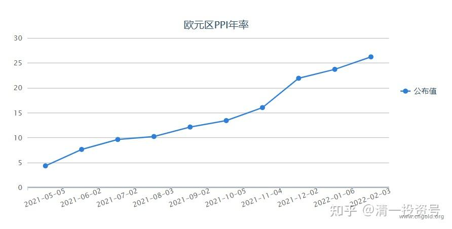
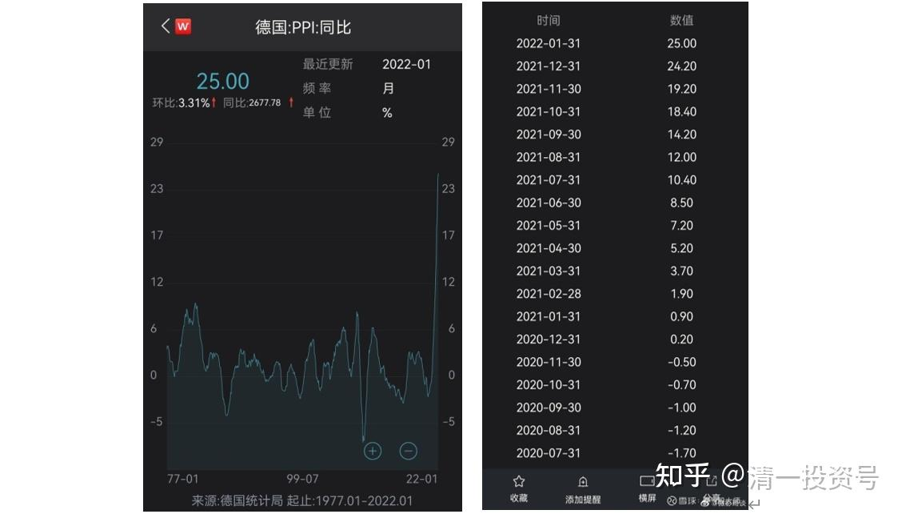
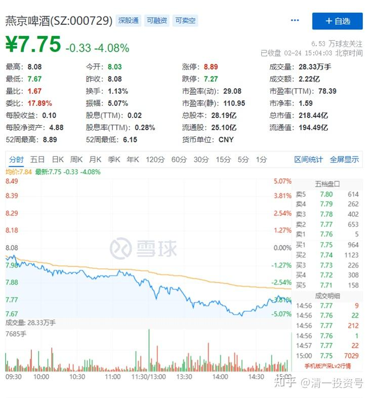
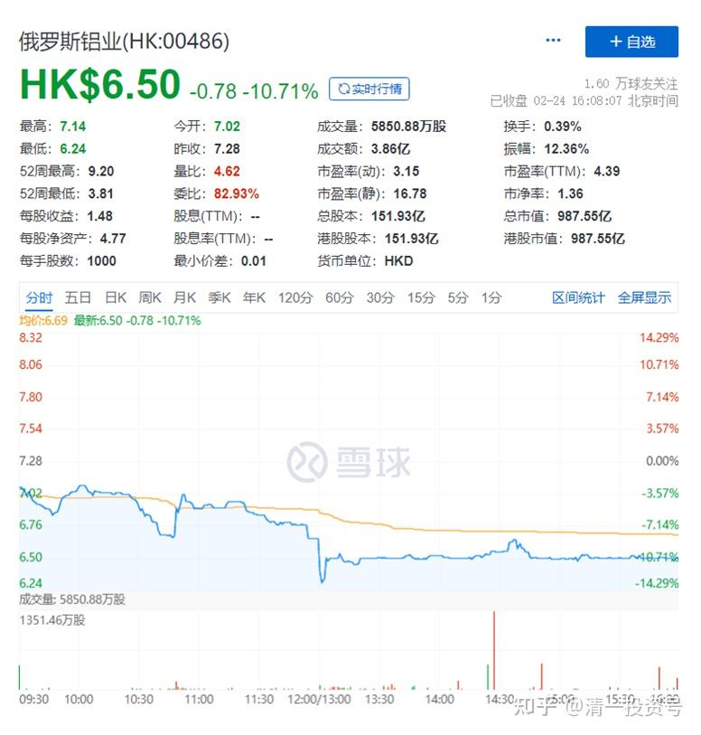

*图片来源：http://calendar.cngold.org/content/324536.htm*

**5篇. 德国及欧元区19国PPI 高位传递的信息**

山长 清一2022年2月24日

德国1月份的PPI高达25%——是图形可见的1977年以来最高，欧元区19国的PPI也是在26%的高位。

*图片来源：https://xueqiu.com/4164685232/212260418*

我猜测这主要是由于价格翻倍的天然气和电力等能源价格推动的。全球都可能面临十年未见的持续通胀压力。
这个时候，持有现金肯定是最傻的。大家需要去买一些保值的东西——我认为能源，金属（铝、钢、有色）等，都是可以持有的标的。因为这些东西自动抗通胀。

现在欧洲是经济危机，物价涨幅这么高，所以这些国家都去挑起俄罗斯和乌克兰来打仗，转移国内矛盾，找理由说：这样子都怪打仗带来的结果。【如果乌克兰表示不加入北约就没事了，这就是多年前欧美与俄罗斯达成的协议。但欧美一再去挑动底线，乌克兰又特别配合，主动进攻东乌，所以俄罗斯不得不反击】。但受益人，却是西方的政客和金融大鳄们、军火大鳄们。百姓们受罪也无话可说，和平已经是万幸了。

不过，按道理，俄乌开战，至少中国的铝业、钢铁业，都是占便宜的。全世界对中国的依赖更大。非交战国的经济，都会受到战争的刺激而走好。没想到今天A股还跌了，昨天我卖了10万股中国宏桥，钱还没用上，看样子今天可以补仓了。昨天其实8元多，卖了几万股前段时间7.43元补进来的燕京，只是想对冲掉低位补的股票，没想到今天燕京又跌了，可惜就是走少了。盘面成交量不大，不好走。

**一句话：低位不怕跌，敢补仓；高位不贪心，敢平仓**。**长期下来，持仓成本就越来越低了**。中国宏桥目前只有不到300万股持仓，只有高峰期的一半。但都是负成本持仓这么大的仓位，看了就高兴。**跌了就加仓，涨了就当现金储备用，来买没有涨的同质股（我喜欢资源股换资源股，酒股换酒股，越换越多）**。

俄铝准备等坏消息（制裁）将来进一步发酵的时候，计划继续买入一些。很遗憾9元多没有出货，不然现在成本就很低了，也是负成本了，才2元拿的货[滴汗]。

**附录：相关报道**

《俄乌危机推动镍价上破25,000美元》

[https://mp.weixin.qq.com/s/yaqh2AGjhhPvHT6PySDStg](http://link.zhihu.com/?target=https%3A//mp.weixin.qq.com/s/yaqh2AGjhhPvHT6PySDStg)

《俄、乌因素对大宗商品的供应影响》

[https://mp.weixin.qq.com/s/Tq1SfZARf5qH0QjBO2P72A](http://link.zhihu.com/?target=https%3A//mp.weixin.qq.com/s/Tq1SfZARf5qH0QjBO2P72A)

《俄乌局势对大宗商品市场的影响有哪些？（内含事件脉络）》

[https://mp.weixin.qq.com/s/WYar_LegigHFbJt9nKQUXg](http://link.zhihu.com/?target=https%3A//mp.weixin.qq.com/s/WYar_LegigHFbJt9nKQUXg)