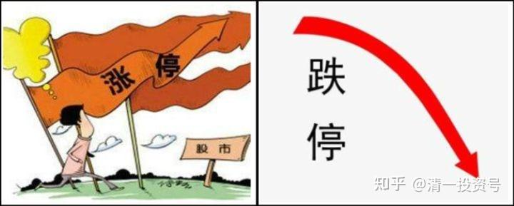
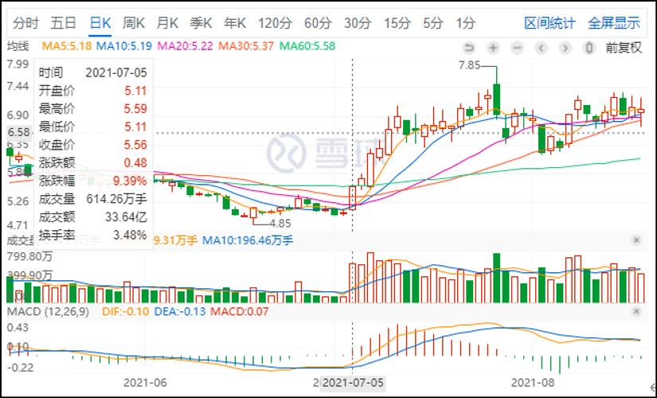
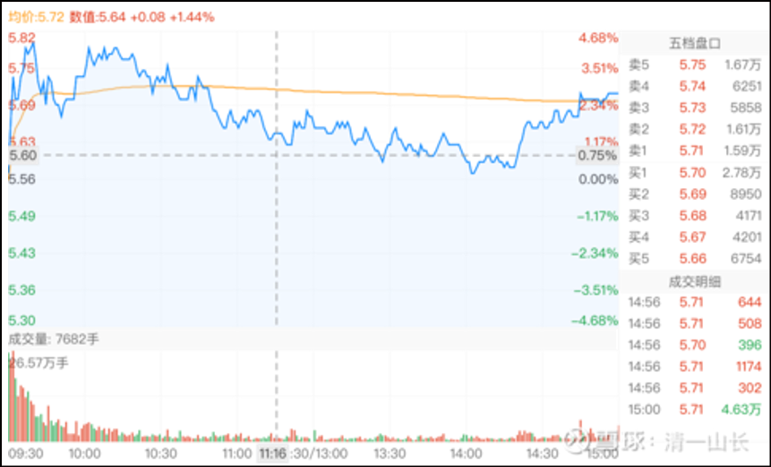
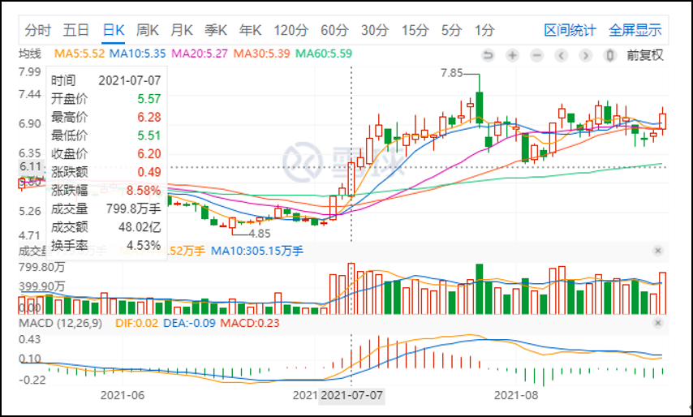
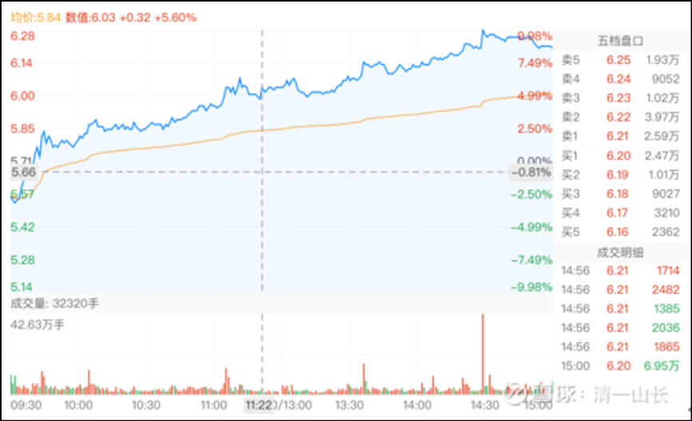
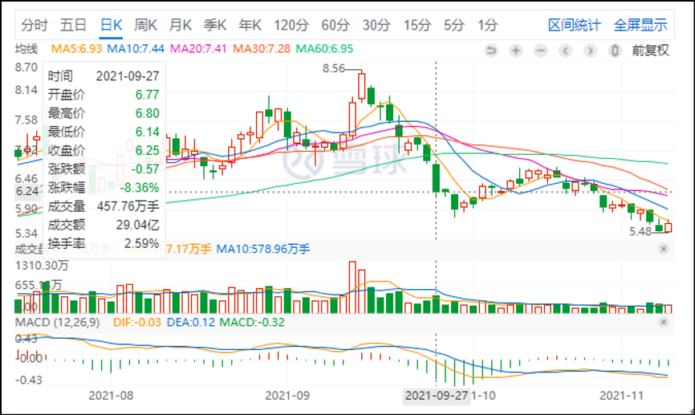
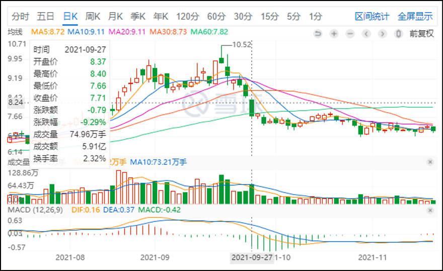
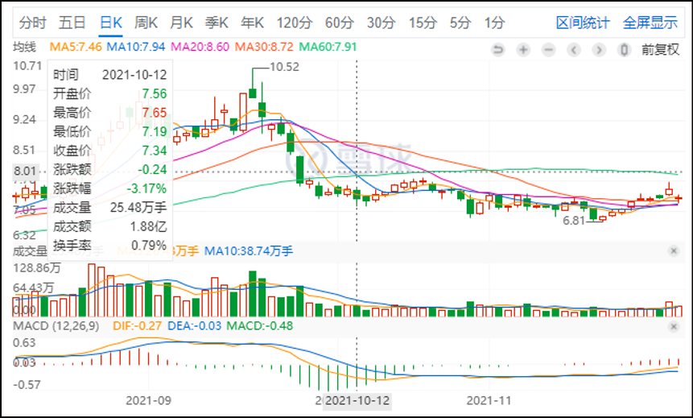

18篇. 有色金属系列之二——洛阳钼业&金钼股份：从涨停到跌停，重回买点

清一山长 2021年7月-10月

**1. 诱多还是诱空**

[清一山长](http://link.zhihu.com/?target=https%3A//xueqiu.com/9310099567) [2021-07-05 13:49](http://link.zhihu.com/?target=https%3A//xueqiu.com/9310099567/188894668)

*洛阳钼业(SH603993） 2021-07-05*

[$洛阳钼业(SH603993)$](http://link.zhihu.com/?target=http%3A//xueqiu.com/S/SH603993)我乌鸦嘴，就再说几句，谁让你不让我买的[加油]。

今天其实**拉涨停很容易的，直接拉就行了**，非要摆出一个蛮困难的样子，有两种可能
**第一种是诱多：**告诉你，我大量要货，你们有多少都卖给我，我以后要大涨的。

**第二种是诱空：**你看，涨不上去，抛压严重，我实力不济，拉不上去。你们聪明人就快跑，赚了涨停价够意思了。

到底是哪一种可能？诱多，诱空？我也不知道。只是知道肯定是引诱。看这架势，我倒是想再买过几百万。但是：**不是还有底部没涨的股吗？别人都在抢，就给别人算了**，我手上有余钱，就去买别的还没涨的股票去。拯救失足股票，就别吊死在涨停的股上了。这涨停版的好处，就留给你们挣了！我不跟你们抢[大笑]。

[清一山长](http://link.zhihu.com/?target=https%3A//xueqiu.com/9310099567) [2021-07-05 14:14](http://link.zhihu.com/?target=https%3A//xueqiu.com/9310099567/188899358)

惠泉啤酒，最近一次的涨停，就是干净利落的拉上去，死死封住涨停。但是：第二天冲高回落，成交量大增，然后一步一步的下跌。远远低于涨停价，只能说**涨停是幌子，是忽悠人进场的，第二天放量就派发了**。

[洛阳钼业](http://link.zhihu.com/?target=https%3A//xueqiu.com/S/SH603993)后市想咋走？真不知道，但应该跟惠泉啤酒的走势不一样。因为目标就不一样，其实，主力现在走的话，也获利不高。如果确认要调整的话，现在离场，找机会再度买入也很正常。但人性就是:**如果今天走了，跌不多，是不会再次进场的。所以就算回调，很可能不会再度买入。你就被T飞了**。[大笑]

**2. 股性已经激发起来**

[清一山长](http://link.zhihu.com/?target=https%3A//xueqiu.com/9310099567) [2021-07-06 17:17](http://link.zhihu.com/?target=https%3A//xueqiu.com/9310099567/189553778)

[$XD洛阳钼(SH603993)$](http://link.zhihu.com/?target=http%3A//xueqiu.com/S/SH603993)今天成交与昨天差不多，放巨量成交，两天60多亿了。没有看出主力撤退痕迹，**总体看股性已经激发起来，未来看高一线**。昨天涨停不走的策略看来是对的，我的买入成本是5.06元。可惜持仓太少，没有到百万股级。赚钱有限。今天已经没有勇气继续买入，就买了一个股价还停留在2013年的股票。但最近8年，这家企业的内在价值已经大大提高了。股息也比洛阳高得多。算了，我就还是买保险一点的股票，涨是看不到希望，但跌我认为也跌不下去了。**洛阳现在买入，是右侧投资行为，我有点难以接受。**小资金可以这样玩，我就算了。不冒险。

*洛阳钼业(SH603993）2021-07-06*

**3. 超级强势，主力抢筹**

[清一山长](http://link.zhihu.com/?target=https%3A//xueqiu.com/9310099567) [2021-07-07 17:35](http://link.zhihu.com/?target=https%3A//xueqiu.com/9310099567/189678956)

*洛阳钼业(SH603993 2021-07-07*

[$洛阳钼业(SH603993)$](http://link.zhihu.com/?target=http%3A//xueqiu.com/S/SH603993)今日走势盘后解析。不知道出了啥消息，一点不带回调的涨了20多个点。洛阳钼业显然这一次，是一次大级别的趋势反转走势，不像是游资暴动。**今天的走势超级强势。资金涌入48亿。最高的一单是42.63万手，4千多万股，一笔就吃完了。可见主力抢筹多主动，多厉害。**盘中就完成调整了。

从盘面走势上说，明天继续上涨的可能性较大。**但从风险上说，连涨三日，特别今天成交量巨大，回调压力也是很大的，也接近压力位6.48元**。但我猜想：恐怕这个压力位，不构成啥真正的压力。万一今天抢盘的人就不想出售换钱呢?可能他们就是钱多多。不需要回笼资金。难说，这股也成了赛道呢？如果是游资快速进出的，当然会回调，如果是群狼上阵，难说会一路向上。

当然，正常情况下，明天是要回踩的。但现在似乎不能用正常思路来看了，明天继续观察看。

对我来说，反正持股不多，就40W。涨多少也没赚啥钱。就淡定的看演戏吧。跌了也无所谓的。反正都是捡来的钱。**敢跌回原地，起码买过M级再说。[大笑]**

*洛阳钼业(SH603993）*

[清一山长](http://link.zhihu.com/?target=https%3A//xueqiu.com/9310099567) [2021-07-08 20:31](http://link.zhihu.com/?target=https%3A//xueqiu.com/9310099567/189844118)

[$洛阳钼业(SH603993)$](http://link.zhihu.com/?target=http%3A//xueqiu.com/S/SH603993)

A股流通市值，仅30%左右。最近四天，成交已经破了15%，成交量已经156亿。上一轮这样涨，是去年12月，从5元涨到了7元多，最高日成交75亿，上涨超过50%空间。成交量也极大。现在一天才40多亿，好像没有放天量。这一次会怎样走呢？模仿上一次吗？我就不知道了。

戒除贪心，今天6.32卖掉一半股票。只留了20万。补入了另一家矿业公司。**如果真的喜欢洛阳钼业，现在可以去买入才4元多人民币的H股，没必要舍不得。**似乎港股的涨幅，与A股基本差不多。但价格低得多。长期价值投资的话，还得选港股。[大笑]

**4. 妖股的范例**

[清一山长](http://link.zhihu.com/?target=https%3A//xueqiu.com/9310099567%2522%2520%255Ct%2520%2522_blank)[2021-09-02 15:30](http://link.zhihu.com/?target=https%3A//xueqiu.com/9310099567/196485070)

[$碧水源(SZ300070)$](http://link.zhihu.com/?target=http%3A//xueqiu.com/S/SZ300070%2522%2520%255Ct%2520%2522_blank) 这个股，历史最高10PB。所以，快1PB买进来，安全度很高。有风的话，就变妖。[大笑]

[清一山长](http://link.zhihu.com/?target=https%3A//xueqiu.com/9310099567)[2021-09-02 15:26](http://link.zhihu.com/?target=https%3A//xueqiu.com/9310099567/196484260)

[$碧水源(SZ300070)$](http://link.zhihu.com/?target=http%3A//xueqiu.com/S/SZ300070) 碧水源：今天偶然看一眼，发现涨了快20%了。这个股，是我的赌博股。**就是看K线，看技术，我看懂了，属于未来的赢面很大，近期可能启动，而且启动后涨幅会比较大的股。但基本面表现不佳，长期被市场抛弃，一般人不会买的股。这种股的好处，就是来钱快，比中国建筑这种基本面很好的股，要容易赚快钱一些。坏处就是：不小心会踩雷。而且长期持有也没有股息和业绩来保底。前段时间，我买的洛阳钼业，金钼股份等，就是这样看技术面走向特别好，所以买进的。涨了50%就想出掉了**。

看到了碧水源破7元，手法上是有人有意的破位，成交量其实也不大。明显就是有主力介入挖坑的迹象。所以，我就乘机陆续买进了。买了还不少，1.01M。算是凑个【101斑点狗】的数好玩，因为我不喜欢整数。账上还有多的现金，就拿去买中国中铁，以及少量的分红7%的银行股，当现金存起来准备过冬用。有机会机继续出来再打游击。比如：如果惠泉啤酒继续下跌的话，也许我就重新当回二大。现在他不死不活的样子， 就不用理他。明显没人关照的样子，买进去，不知道要等多久才会涨。现在进去划不来。不如等看，有人开始挖坑了，再进场，就像碧水源一样，明显是长期冷漠之后的挖坑行为，现在进场的收益最大（涨势需要的时间最短）。今天开账户看看，居然碧水源还涨了不少（中建当然涨得更多，但已经超仓了，就不下手了）。

**不过不建议大家追涨我买的这些小股票，这种股，基本上都是妖股，与妖共舞，随时会被吃掉的。**我自己都没把握的，就自己玩玩，当赌博一样。随时准备跳车逃生。全亏光了都不影响我的财富状况。当然，涨一倍也添不了啥大钱，就是检验我看盘技术的用意，顺便赚赚小钱。好处是：比去澳门赌场的赢面大得多，可控性强。而且还特别的锻炼思维能力，看盘能力，就这好处了。看这个股，能够给我多少好处，应该不会低于两只钼业这样的被控盘股票。

**5. 跌停，重回买点**

清一山长 [2021-09-25 19:53](http://link.zhihu.com/?target=https%3A//xueqiu.com/9310099567/198755734%2522%2520%255Ct%2520%2522_blank)

[$金钼股份(SH601958)$](http://link.zhihu.com/?target=http%3A//xueqiu.com/S/SH601958) 看样子9元多全跑光是对的。我还以为要冲11呢。踏空了就算了。现在又跌了，还能买吗？我又犹豫了。中国猛踩刹车，就是一副“给世界打小工？我不干”了架势。玩不好，就被老板炒掉工作，换人。玩好了呢？老板加工资，中国靠技术配套制造实力获取更多的利益。这是一步险棋，但不得不走。国内的通胀，已经是难免的了。

涨价好，全世界，大家都少买一点东西，免得真的太浪费了。经济萧条，也是必然的。

清一山长 [2021-09-27 13:37](http://link.zhihu.com/?target=https%3A//xueqiu.com/9310099567/198882462)

*洛阳钼业(SH603993） 2021-09-27*

*金钼股份(SH601958) 2021-09-27*

[$洛阳钼业(SH603993)$](http://link.zhihu.com/?target=http%3A//xueqiu.com/S/SH603993)

还有金钼股份，两只股，今天居然都往跌停方向砸盘，毫无犹豫的样子，实在想不到。我很庆幸早就跑光了，洛阳是7元多跑光的，金钼股份是9元多跑光的。抛光后，两个股居然继续大涨，我以为已经踏空了，放过了大牛股。但我也不在意，本来我买入有色就是投机的，投机成功，当然我就走了，换了现金股，等机会再说。买入时，我感觉会有一波有色行情的。趋势有利于有色。看看股票价格也在相对的底部徘徊，还开始拉升，买入价格安全。没想到这么快，居然就涨了。涨了，当然就走了。这段时间却突然转向，两个股都突然大跌，实在不可思议。

现在该重新买入吗？我不入地狱谁入地狱？算了吧。如果知道是地狱，干嘛要去地狱呆着？目前走势，不太像大牛股的涨势回踩动作。洛阳股的前面几次回踩，倒是典型的涨势回调的动作，非常明显。最近这十来天的走势，根本不像股票的正常回调洗盘，倒像是主力紧急出逃的样子。目前所有的技术指标全部走坏。而且走势急不可待，显然持筹人很急于出逃。如果主力要走长期的涨势，要维护盘面的话，是不能这样走的。今天的回调，已经破了6月份以来的回调底部。数学上说，是卖出者最佳的回补仓位的机会。但趋势上说，还不能这样胡乱冲进去。跌势未尽的样子。

幸运一点的话，今天会像**8月3日一样，属于冲跌停震仓吸货手法**。这一天成交35亿，非常的成功。今天也吸引了很多人这样猜想洛阳的下一步走势，今天赶快追买，说不定都是前段时间踏空的原持有者。但我想：万一这一次，并不是震仓回调，只是基本面变化后的下杀逻辑下跌的中继线位置，就现在买进去，恐怕会被套牢很久的，需要等下一个周期了。

个人以为：**很可能是出现了严重的长期上涨逻辑已经不再存在，才导致现在的双杀局面。**由于中央最近一个月的出手压制产能，明显看出在控制和打击大宗商品的上涨，且出台的措施极为严厉，可以说是史无前例的。不惜自伤，也要伤人的拼死打法。可知未来的效果也必将是史无前例的。有可能会出现钢铁产能严厉控制之后的铁矿石走势，下跌绵绵无尽头。我猜测机构在这样的政策巨变之时，绝对不敢贸然拉升。反而更希望明哲保身。所以近期是不可能拉升的。甚至担心后市有问题，会出掉相当部分头寸，以策安全。如果我的判断正确，很长一段时间，这两只股都没有涨升的希望。**所以：我现在就不买入了，继续等等，除非进一步下跌，跌过头了的话，我就来救救市场，搏一把看看。如果只是现在的价格，主力依然有利润拿的，不亏。**

当然，国家的策论是短期还是长期不好说。如果不知道，不如继续观望。等看清楚再说。没看清就涨了，是自己没本事拿这种钱。就去买别的看得清楚的股好了。

清一山长 [2021-10-12 18:09](http://link.zhihu.com/?target=https%3A//xueqiu.com/9310099567/199922812)

*金钼股份(SH601958) 2021-10-12*

[$金钼股份(SH601958)$](http://link.zhihu.com/?target=http%3A//xueqiu.com/S/SH601958)

又回到我的买点了？以为卖飞了的股[哭泣]。9元多跑掉的。

研究了一下十大股东，发现证金汇金是2015年年中成为第二大，第三大股东的。收盘价格是最低10.53，最高价格15.49。证金去年年底就开始走，今年一季报走光。二季报汇金也消失了。离开的价格是5～6元。绝对亏本生意，真的在救市。不过他们走了，说明这个价格不需要救了，结果刚走完，三季度就来了一拨行情，突破了10元。存心不让两金公司赚钱。现在的价格如何？我看最低跌到6元区域吧？可能会有20%的跌幅。但涨起来，超过10元也不奇怪。所以，算是值博率还过得去。**我可以考虑补回我卖掉的头寸。如果跌回6元，就加仓多买一点。现在先锁定卖出的利润，为第一原则。**该从现金股里面换钱出来干活了[加油]。

（标题为编者所加）

参考链接：

[清一投资号：17篇.有色金属系列之一——铝业00486](https://zhuanlan.zhihu.com/p/473944106)（整理文）