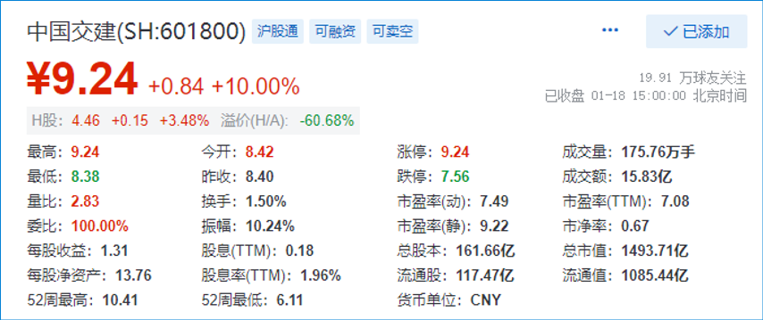
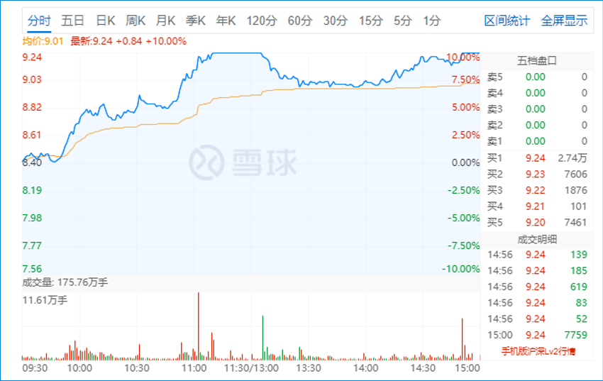
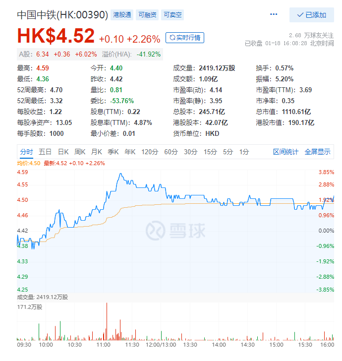

8篇.建筑的股性正在激活中

清一山长 2022年1月18日

*中国交建 2022-01-18*

建筑股今天有发疯，中国交建居然今天还冲涨停，不可思议。我都看不懂了，这段时间建筑在玩什么把戏？**似乎建筑的股性正在激活中，背后一定有大资金关注。**看样子，今年建筑股终于不用继续坐冷板凳了，不用再等三年五年了。

我本轮最先买入的中国建筑没赚多少钱，最后买入的中国中铁倒赚了20%。让我很感叹：中国中铁，是我看徐志私募清盘之后，才开始去关注和研究的。他单吊这一只股三年，导致成立的私募基金清盘。我就好奇了：到底是什么股，值得他如此倾心单恋三年？我原来还以为他买的是中国建筑呢！没想到是中国中铁。研究一段时间后，发现她具有中国建筑不具备的优点，而且估值更低。安全度一样高。所以就果断买入大几百万股，正好买在底部了（我在港股3.6左右开始大量买入的）。所以——**市场最悲惨的时候，就是你应该最积极行动的时候；别人熬不住的时候，你要再坚持一把，比别人多一口气就好。**

感谢徐志等前浪的探索和坚守，也感谢我自己——低位敢于大仓位买入（听起来很容易，其实要做到很难。因为低位的时候，鬼消息实在太多了，弄到你都以为公司会破产了，拿着现金都不敢买，我还是卖中国宏桥的钱来买的）。

比如现在，融创中国已经很低了，我赚了几百万，就是不敢再投入。我账上还有也是赚了数百万的雅居乐，股价比我当初买入的价格还腰斩了一半，价格上是很想买入的，估值是也是低得不可思议，但行动上我真不敢买入。还有一个内房股，PE居然只有0.5倍了，跌惨了。敢买吗？不敢！因为我不能肯定它们一定不会破产。**但中国中铁我就敢买。因为肯定不会破产，每年还有10%的成长空间呢（股权激励保障是7%以上）。绩优加上成长，我敢于低位下重注。**

