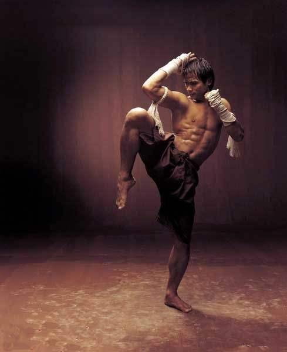

*泰拳的提膝攻击*

上的图片是泰拳的提膝动作，这一招应该主要是内围战中的提膝攻击的手法。看起来很漂亮吧？充满了力量感。

我们的小拳手，提膝训练是每天的必修项目。我们拳派，是可以不练扫腿，但每天的提膝，是必须数百次，上千次的。与泰拳相比，我们的提膝要求，以及要领动作，要“难看”很多。首先是

1：太极提膝，支撑腿的膝盖，是不能挺直的，必须弯着一点。

2：提膝的时候，全身都不许用力，不能绷紧全身。只能在最后迎击撞上的一瞬间，用哼哈劲快速发一下劲。然后马上放松。所以要像跳舞一样来练习动作，不能强调发力。也不能每次都发力。可以做动作，只需要偶尔发力就行了。

3：图片中，泰拳手的脚跟是落地的，属于全脚掌支撑。 这样有利于站稳和发力。我们的拳手，提膝的要求，是脚掌受力支撑，脚跟是不能落地的，必须要提起来！腿还要弯着，身子就必须一起跟着收着了，其实身子是向前倾斜的。古说就是“团着”的。因为我们不强调站稳发力，我们不站稳，甚至在空中移动的时候，也照样能发力（看看猴子就是这样的）。而泰拳是完全“放开”的架势。

4：太极膝法，练习的时候，膝盖冲击出来的力量，是不向前的。提膝攻击的力点和目标，是自己的两肩，要用力去击打肩膀位置。我们这种动作，叫练身体的“合劲”：去撞击两肩，就是练大腿提膝的交叉合劲。（打的时候随意，想攻哪儿都可以放开攻）。这样从外形上看起来，就是脚跟是提起来的，大腿弯是弯着的，腰也弯的，身子是扭转的，手是圈手，是抱住自己的头面的收缩的动作。用古拳经的话来说，是“合劲一个蛋”。就是学一个鸡蛋一样的屈身（团身）的动作，一点也不开扬。跟泰拳相比，这种动作，的确“很难看”，怪不得泰拳女拳手，看我们的孩子练习这种动作，就嚷嚷出来“你们这样练丑死了”。我们孩子很懵：我咋觉得挺好看的？练拳像跳舞一样？是的，自己练像跳舞，别人看就是四不像。

5：有合当然有开劲了。我们提膝的目的，不完全是攻击（也可以用于攻击）。而是“攻防合一”，用合劲消解对方的攻击，或者用合劲的主动攻击，破掉对方的防守势之后，这个抬起膝盖的腿，不落地就要快速地发动攻击！两个动作，连在一起。就是一开一合，完成一个“太极阴阳起落腿”。一旦下落，另一个脚就要同时抬起来（功和防）。所以，一旦开启，可能就是双脚翻飞，双足不断起落。练起来，真的就是像是跳舞一样，一起一伏的。手臂也一收一展的。我认为还是比较好看的。当然，别人怎么看就算了。我们也不管。只要能打人就够了。

6：如果是近距离作战，提膝二次攻击后，落地也不能空落，必须带攻击的步伐，动作才落，提高每一个动作的效率，不浪费任何一个动作。实战中，往往就是用“踩踏”的攻击手段攻击对方的下盘部位。古代的要求是踩踏对手的足弓和脚趾头。小拳手问泰拳擂台是否能这样干？馆长说，规则是不禁止的，但是一般不会用。（我想是这种招式太阴毒了，防不胜防。这个踩踏的力量很大，在平地上用会把对手的足弓踩断的，就让一个人终身残废了，有点违反泰拳武德的意思。所以擂台格斗作为一个体育项目，不支持这种手法很正常。我奇怪的是规则上居然没有禁止。散打规则是禁止的。

最后透露一点比武的秘诀给你们：你们看上面的照片中，泰拳的提膝攻击，很吓人吧？很多人不敢去打泰拳，就是怕泰拳的钢腿，硬膝，刀肘。上面的图面，你看了觉得威力很大。不过对于懂行的人来说，泰拳这种攻击有很大的弱点，要破掉其实很容易：就是你往前走一步就行了，让他好好的打去，看啥效果？你仔细看就知道，如果泰拳手在做这个动作的时候，你往前冲一步，会是什么结果？他自己的力量，就把自己冲倒下了。如果不想倒的话，就只能赶快放弃攻击，回退防守。

不过，大多数菜鸟，看到泰拳手提膝攻击，是不敢往前冲的，反而要不吓傻了，站在原地。要不就赶快退后。站在原地，你就像他天天打的沙袋一样，你就必须结结实实的接上这一膝盖（想想都觉得很痛）。退后吗？-----就更惨了。因为一旦你退后了，接下来的就是泰拳著名的杀招---飞膝。不仅是用膝盖攻击，还加上了你提供的距离，对方助跑的加速度，一起打到你身上，你就只有被KO的份了。这时候，你来硬接的话，骨头被打断都不稀奇的。很多中国武师，原来去跟泰拳打，就是不知道一上场对付刚猛的泰拳，根本就“不能退”，一退就彻底完蛋。往前一步生，退后一步，就是找死。

泰拳最强的地方，就是最弱的地方，灯下黑。所以，要对付泰拳提膝攻击，最好方式，就是提膝，曲肘，护好自己的全身关键部位，不断向前攻击。你想象一下:用我上面介绍的我们拳手练习的方法，如果用来对付泰拳， 就是你一旦发动攻击，想要提膝，或者扫腿等攻击我。我也提膝，曲肘，团身， 迎上去，跟你硬碰。膝盖对膝盖，谁也不吃亏（总比我肋骨去接招好吧？）。了不起双方互相损伤。但泰拳手接完这一招，下一招就要吃亏---因为泰拳手攻击完后，就是放下膝盖的惯性。而我们的拳手，提膝之后是不放回地下的的---马上一脚就全力攻击出去了，时间上大约有0.3秒的延迟。所以，泰拳手想要不吃亏，只能抓紧我们的拳手，进入内围战。想退后，就会被我们连续的飞腿，飞膝追击着打（别以为太极就不会飞膝飞腿）。一旦进入内围，就只能双方拼内围战技术了：我相信太极的贴身战法，拳肘膝一起施加出去，要比泰拳的内围战技术上更有优势。只要拳手练出来就行了。所以---我们会很欢迎泰拳手与我们拼内围的。