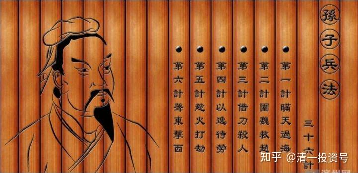
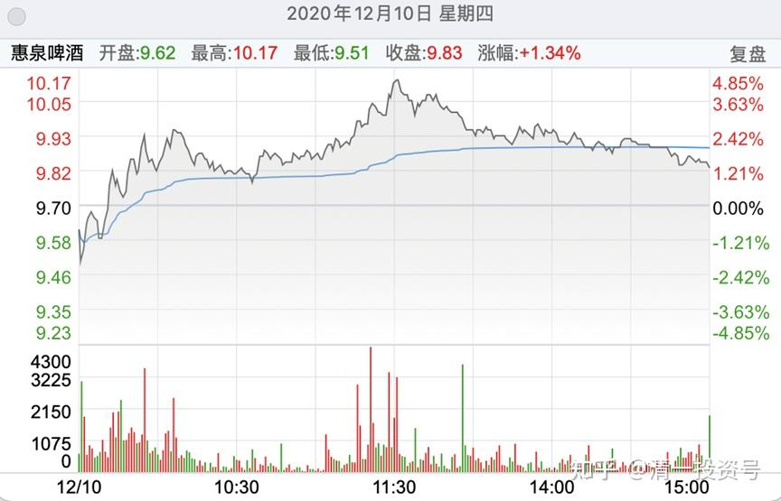
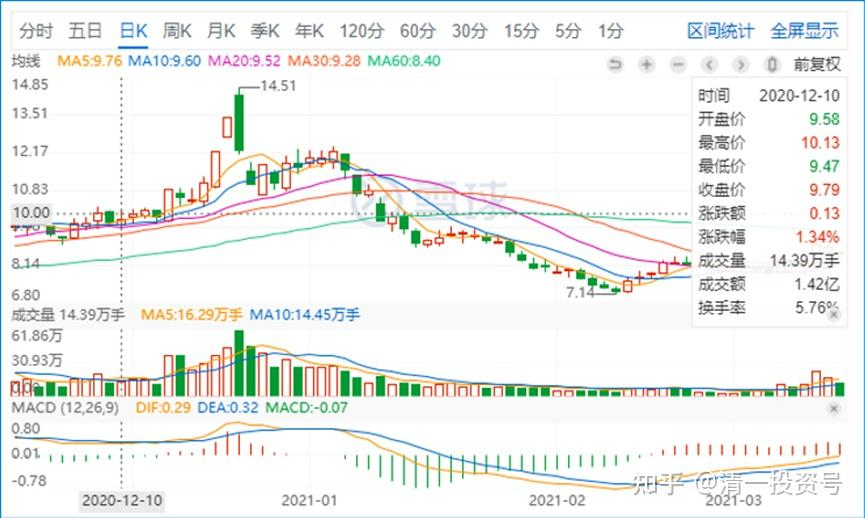
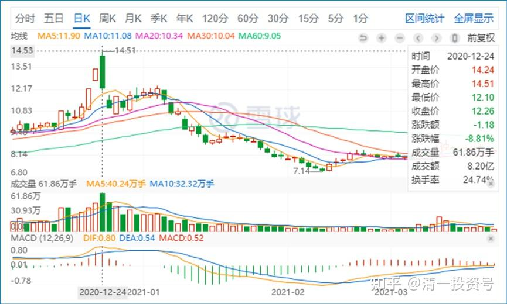
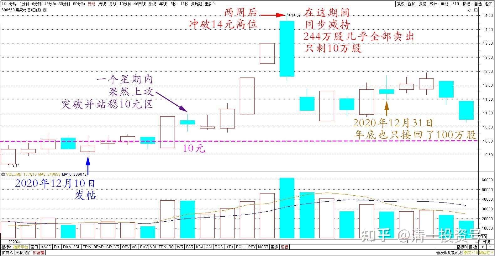
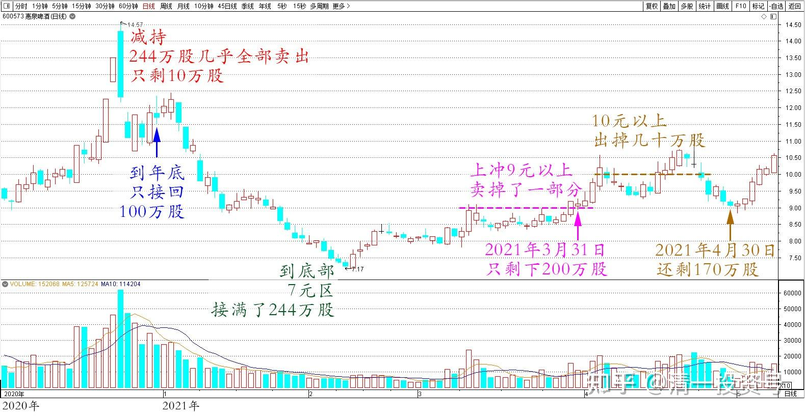
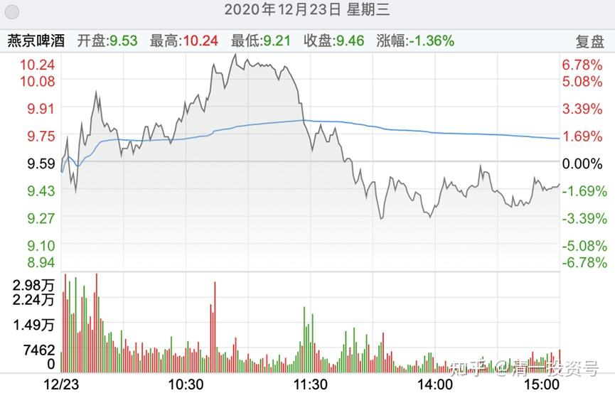
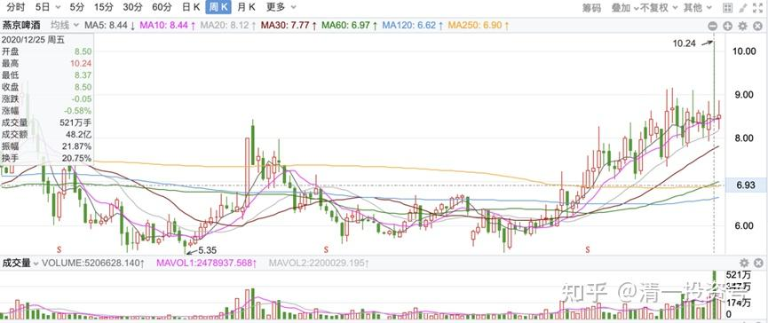
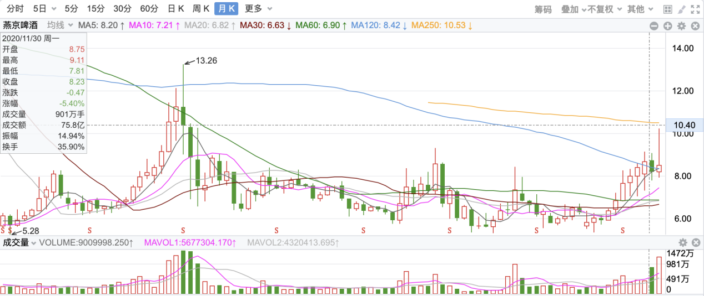
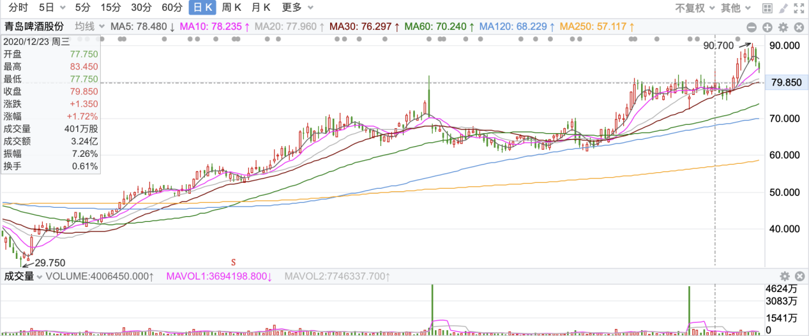

2篇.庄家入住操盘四个阶段

一、庄家入住操盘四个阶段

清一山长 2020-12-10

*惠泉啤酒 2020年12月10日*

$惠泉啤酒(SH600573)$

睡了一觉起来，看已经收市了。既然跌回来了，我就说呗，谁让你跌回来的，别怪我搅你的局。

惠泉主力很聪明：他也最怕散户把筹码都给他了。其实他现在已经不想要筹码了。所以都在做T。每天拉高一点就走低一点。在不增加资金成本的情况下慢慢走高（甚至我猜测，会不会是规定操盘手，**每天在不增加持股数量的情况下进行拉升工作，每天拉高买入了多少股，就要卖出相应的多少股**）。所以，盘面上看，这几天都是上午拉升，下午出货。这种坐庄的，实力不会很大，但绝对很聪明。他们会在有利的时段，做出各种冲高动作，来引诱看盘技术好的右侧交易者入局。因为我是左侧交易者，所以这一套对我无用。但是右侧交易者，很容易上他的当。其实，也不是上他的当了，而是跟他一起坐庄[大笑]。

*惠泉2020年12月12日前后日线图及10元区*

**10元，是一个敏感价位。**你们很多人，一定在想：只要惠泉过了10元，或者多一点，过了10.50元，我就全卖掉，以后就不玩了。庄家最不愿意你们这样想。因为，如果你们都不玩了，都把筹码交给他了，他咋办？所以，他要找一批人，愿意认同10元是底，不是顶的人，一起走下一场。你们这些我从底部带出来的人，不是他的菜。你们都想甩锅。甚至有人还问：山长10元以上不说话，是不是全出了？庄家如果不知道你心里的这种小九九，怎么坐庄？[大笑]所以，庄家才不会现在急于冲击10元，他要找到一批10元敢买股票的人进来，所以，

他会主动示范拉到10元上方，告诉你10元其实不可怕。不过，您相信了，进去了，他就说我们一起来坚守，就会派发股票给你拿着，让你习惯这个价格。

等习惯这个价格的人多了，他才会发起进一步的攻击。所以呢，10元上方你拿了，也别着急。您不是把自己当主力了吗？就像个主力的样子一起坐庄好了！[俏皮]。

主力会不断拉到10元以上，让你解套。但不让你盈利。然后反复示范。

直到大家都知道：10元就是一张纸嘛！都想10元以上买入了，主力才会发起下一步的进攻。

主力现在还没有逃跑的迹象，所以10元应该不是顶。但10元区他要玩多久？我不知道。但我认为不会太久了。因为玩的时间也蛮长了，成交也淡了很多。昨天、今天，明显缩量了。

对我来说，10以上买不买？当然会买——只是主力要先做示范：他先买我更高价位卖出去的股，我才会考虑在10元上方重新买进。否则我就是不买高价货。也就是说，**我的策略跟主力一样的，不要股，也不拿股换钱，我持有，做做波段。**

另外，**告诉各位什么时候有危险：某天高位的成交量放大，就是主力要跑了。**

**现在的主力，是不要钱，也不要股。**（目前这样做T，我从量上来观察，赚不了啥钱。因为低位买入的钱，要拿去弥补高位拉高买入的亏空，所以主力现在其实目标不是赚钱，而是吸引人气，共同参与）。这就比昨天说的傻庄高明多了。是真在坐庄。

我说过：庄家入住，

**第一阶段，是买货，收集筹码阶段**，这段时间，主力只要股，不要钱，账面亏损累累也不在乎，只要账上股票数目在增加，他就满意了。这时候，股票要尽量不引人注意，还要利空消息到处散发。

**第二阶段，是拉升，吸引人气，吸引注意力。**这时候要时不时弄出什么涨停板来吸引人。可以大跌，但不能破位，不能真出货（其实出货也赚不到啥钱）。

**第三阶段，是制造盈利效应：快来买我的股，会赚钱的。**套住也不怕，最多一周就解套。惠泉就是现在这个阶段。让你看懂了盘面，跟随他的节奏来震荡拉升，庄散共赢，大家机会都差不多，这时段做T，利润最好，也是最有利小散做T的。安全度相对也高，不至于深套。会让你觉得在惠泉上赚钱很容易，你都“看懂”了庄家的节奏。不断地赚个不亦乐乎。主力其实也乐见其成，他就算白白打工，账上也没赚钱，也没降低每股的成本，但总的持仓市值，是在慢慢增加的。这一阶段，主力不要钱，也不要股。只要保持住上升势头，只要人气旺盛就好。

**第四阶段，就是主力不要股，只要钱的阶段。**主力的任务，就是在维持住股价的情况下，尽量把筹码派发给散户。由于散户持股心态不稳，股价会慢慢的破位，散户以为主力还会像第三阶段一样，破位的时候就出来猛一把拉上去？所以跌多一点，散户会蜂拥而来买票，甚至把别的票都卖掉来买。主力正好借机大把派发出去，相对的低位也可以放量（这种情况最危险）。

**最后，等主力派完货了。也不一定马上跌。**如果这个股操盘技术很高的话，就会继续上涨一段时间，然后——上涨乏力。慢慢小散发现：主力似乎已经消失了？最聪明的小散，开始赶快跑掉。有可能赚的比庄家还多（比例上）。后知后觉的小散，也慢慢觉得不对，开始跑路，股价就越跌越多。这就是俗称的“多杀多”。原来都是一伙的，现在互相踩踏。

**现在的惠泉，是第三阶段的开启。**主力没有离开，所以大家放心玩。什么时候走？就别指望我告诉您了。如果您就看不见主力动向，就自己摸摸肚子，吃够了就离开。别恋战。即使您只吃到了鱼身（中部），卖掉后继续涨，您也别后悔。这不是您的能力圈，赚不到这钱的。如果您能够看得清，就等主力起身离座的时候，您再跟随走。这肯定是最高潮的阶段（顶部），您就从鱼头吃到了鱼尾，大牛人一个。

什么时候是顶？什么价格是顶？谁告诉您，他就是骗子。惠泉的顶，可以是100亿，甚至更多。但也可能是30亿，反正我确定不是25亿。底部就是15亿。这个区间，都有可能。**关键决定的人，是主力认为什么时候是顶。**如果他认为30亿就是顶，您就得跟着走，别跟主力去争辩——100亿，200亿才是顶[大笑]。您不服的话，自己拿钱来顶上去？您拿10个亿来，我帮您顶到100亿去？200亿都可以（筹码都给你了，想多少就是多少）。其实我已经透露了底：**惠泉的主力，资金不到10亿。真有10亿，早买光了。估计是3-5个亿。**[俏皮]

二、从高位14元回到低位7元的操作过程

清一山长2021-05-01 16:28

*惠泉2020年12月24日冲顶前后日线图*

回过头来看此文（编者注：上述帖子）：

可以说神准！我发布此帖后，一个星期内，惠泉果然就上攻，突破并站稳了10元区。

**两周后，冲破14元的高位。我也在这期间，同步减持。**把你们三季报看到的244万股存量，几乎全部卖出了。只剩10万股看戏。随后惠泉开启了漫长的回调。

我的错误，就是过早开始接回来（10元上方就开始了接回）。不过由于接回的速度不快，年底也只接回了100万股。你们已经看到年报的持仓了。大多数，是今年一季度接回的。

*惠泉啤酒2020年12月日线图*

**到底部的时候，7元区，接满了244万股。**

**上冲9元以上，卖掉了一部分。**导致3月31日只剩下200万股。这就是我整个的操作。

**现在账上还剩下170万多股。因为10元以上出掉几十万股**。

*惠泉啤酒2020年12月～2021年5月日线图*

**我是边涨边出的。由于没有涨停，所以我没法大量出清。如果有涨停出现，可能我就一单丢出去了。**惠泉一直稳步上涨，就没有丢。目前是负成本持有。以后涨跌随意，再跌下去，会考虑买入。7元都见过，现在9元，有啥好担忧的。[大笑]

三、燕京的二阶段，惠泉的三阶段

清一山长 2020-12-23 15:34

$燕京啤酒(SZ000729)$ 今天的燕京走势，是不是让大家失望了？冲高不成，大幅回落。是吗？别这么短视。你打开周线图，月线图看看，是什么走势？

周线图：妥妥的慢牛走势！

*燕京2020-12-23前，周线图*

再看月线图，是不是大牛股的架势？[大笑]

*燕京2020-12-23前，月线图*

**懂看图的，一眼就知道：燕京是一座金矿。未来的空间很大！而且时间会很长。**刚打开我的一个老账户看看，这个账户我很少操作的。发现其中的燕京仓位，已经贡献了超过千万的利润。燕京的总利润，目前已经是所有股的第一了。主要得益于燕京总是不涨。要是像珠江、惠泉一样涨，估计我也拿不住了。我的这个老账户，持有的燕京并不多，也就300多万股。账户的总市值，也新高了。“中国牛”还没来呢！我计划做一点调仓的工作，准备“中国牛”的到来。这个账户里面，我还买得有青岛啤酒港股，是26元买进的[大笑]。一直放着不动。

*青岛啤酒 2020年12月23日前，日线图*

所以我手上有四家啤酒公司。为啥10元之前，这些股走得艰难痛苦的样子，不断磨叽？上一个台阶都很不容易？为什么10元后就会畅快地拉升？好像脱离了地心引力的作用？就像惠泉的示范一样？涨停，再涨停，都不需要换手一样？

**因为10元之前，是主力与散户博弈，双方斗智斗勇，各不相让。**

**10元以后，就是庄家已经控盘，散户的目标已经凝聚，关键是共同看好未来。**以后的路，就是庄散一起跳舞，双方合作共进，一起高歌猛进猛拉涨停，大家都大赚特赚。10元之后，您再用10元前的老思路来炒股做T，就不行了。这些过于精明的散户，主力分分钟就把你甩下车的，换一批胆子大，胃口大的散户一起吃肉了。当然，吃到最后的人要负责买单！

**第四阶段，就是庄家要钱不要货。**不计成本出货了。**现在的燕京，依然在第二阶段，惠泉已经进入美好的第三阶段了。**庄散共赢阶段。趁燕京还没过10元，我就透露这点秘密给你们。未来的燕京，什么时候走向二阶段末位，开启三阶段了？**就是出现涨停，就是二阶段末尾了**。**不断涨停，像惠泉一样，就是第三阶段了。**你们慢慢熬吧！[大笑]

你们想象一下：**如果燕京一直连个像样的涨停都没有，却也走到了10元上下。惠泉用了多少个涨停才来到10元的？未来燕京的空间，相比惠泉，是大？是小？**你们就去好好琢磨一下吧！不管你们怎么想，我会一路陪着你们的，原来的老人，知道我说过一些什么。

燕京的新人进来，连我说啥都不知道的。他们只关心涨停，不关心投资逻辑！**他们只吃第三阶段的痛快饭，不愿意熬过艰难的第一和第二阶段。其实他们赚的也是小钱。从第一阶段走起来的人，才是赚大钱的。**