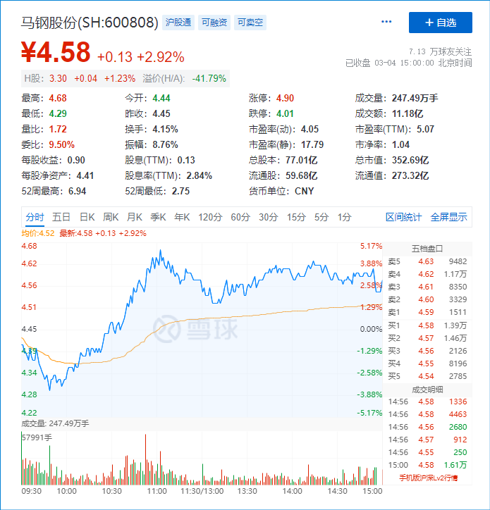
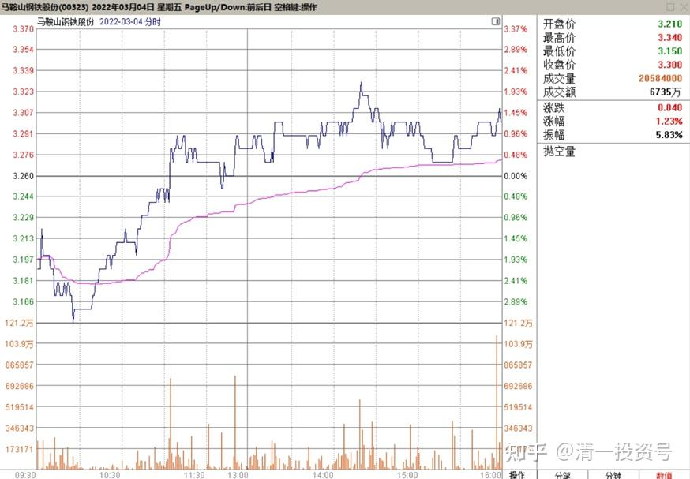
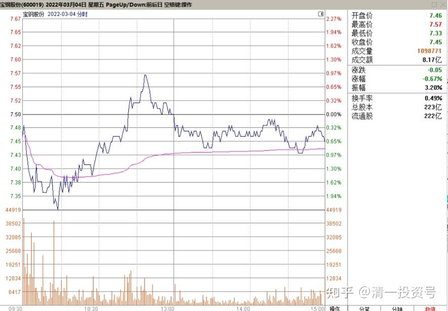
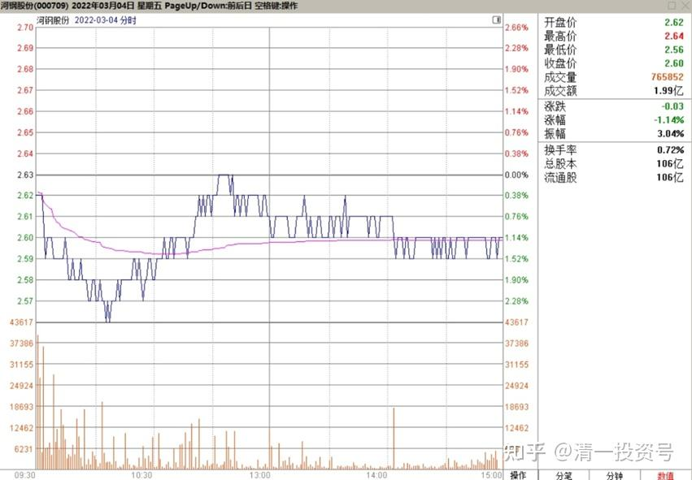
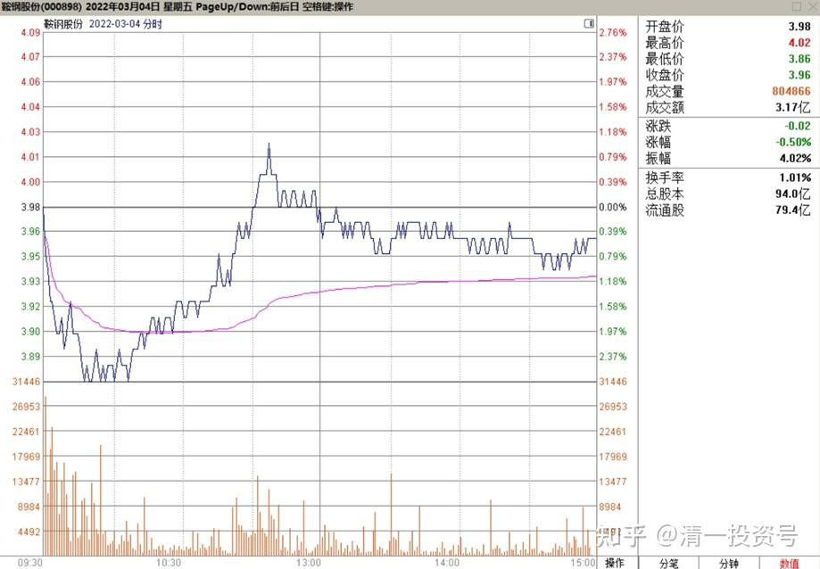
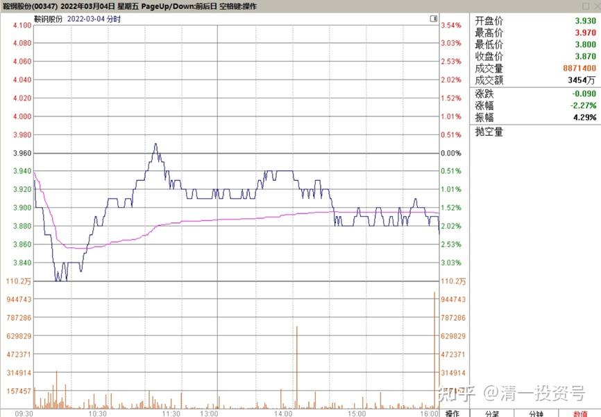
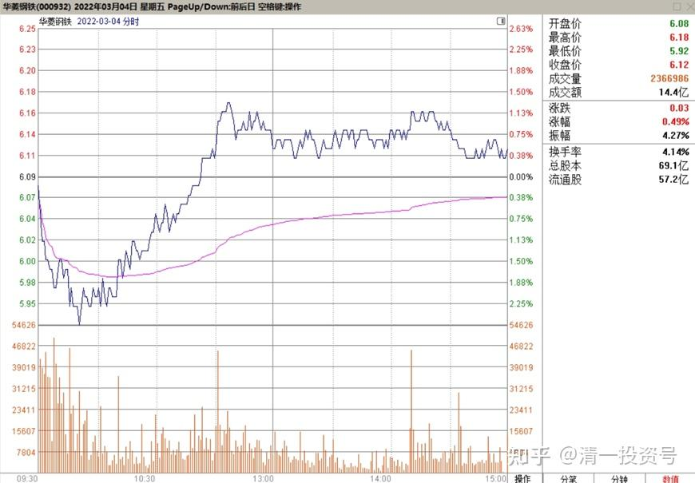
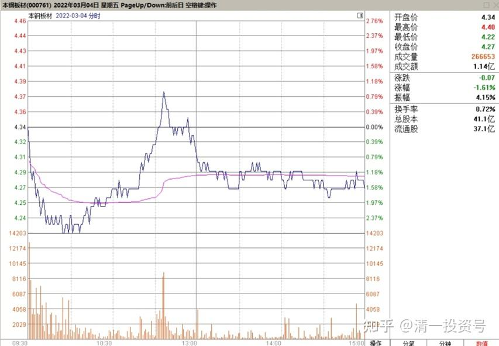
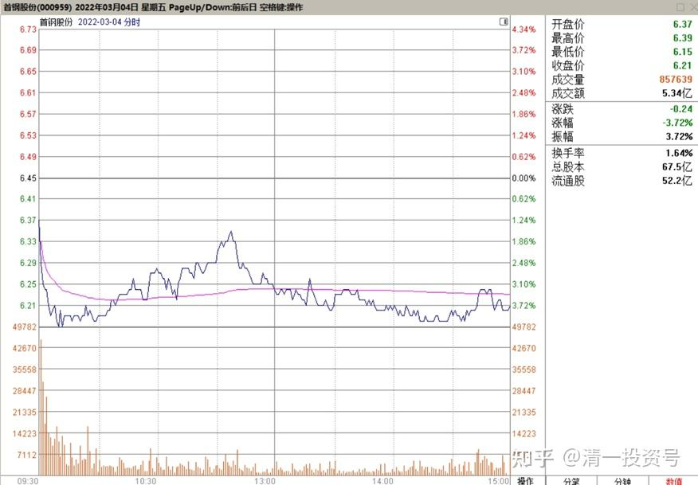
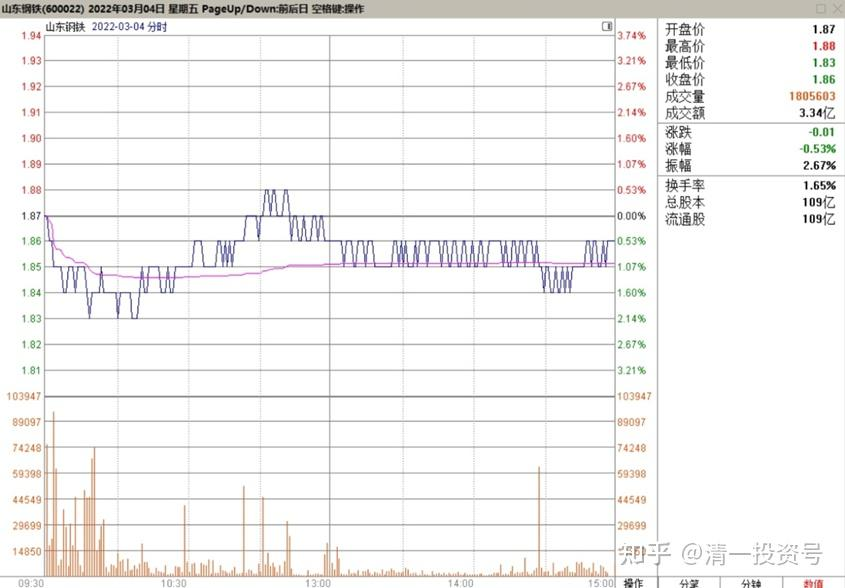

10篇.有色钢铁今年肯定会有一波

清一山长 2022年3月4日

今天开盘，钢铁股快速下跌。我正在纳闷：钢铁没有跌的理由呀？很快就看到钢铁涨上来了。马钢开盘就下跌了3个多点，现在涨了快5个点，上午的震荡幅度接近9%了。其他钢铁股都出现了这种异常的动静，只是幅度没有马钢这么明显。这说明：**有大量外围资金正在进入钢铁板块，而且进仓的动作很急迫，通过盘中调整的方式来抢货，而不是按日、按周来调整。**这很可能是前期的赛道股撤出的资金进来了。这种进货的动作，不像燕京不紧不慢的（燕京今年也是杀到了8元整数，又拉回来的，一样是属于上涨中继状态）。所以，估计这一回又被我判断对了——**有色、钢铁，今年肯定会有一波的**。我们慢慢等[大笑]

**附录：各个钢铁股票在2022年3月4日的走势和交易情况**

*马钢股份 2022-03-04*

*马鞍山钢铁股份H 2022-03-04*

*宝钢股份 2022-03-04*

*河钢股份 2022-03-04*

*鞍钢股份2022-03-04*

*鞍钢股份H 2022-03-04*

*华菱钢铁 2022-03-04*

*本钢板材 2022-03-04*

*首钢钢铁 2022-03-04*

*山东钢铁 2022-03-04*