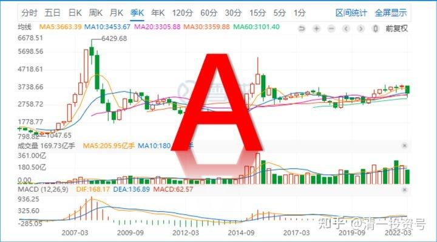

**22篇.【股灾来了怎么办】系列之二**

**清一山长 2020年**

**三、资金量和胆量成反比**

清一山长2020-03-17 15:12

$纽约梅隆银行(BK)$ 想抄巴菲特的底吗？今天买我就好了。7来年的最低价（持股者——一夜回到7年前），今天还会继续跌吗？前一天的尾盘卖出，可以多赚14.5%。不敢笑A股，我们一起看看美股的笑话，大家轻松些。一想到股神也套牢，我们心中就没这么沮丧了[大笑]。积极的心态，才可以迎来积极的账户。

清一山长 2020-03-17 17：29：26

【“股神”巴菲特的股票投资组合近一个月蒸发800亿美元】根据知名美股网站GuruFocus的计算，自2月19日美股开始堕入熊市以来，“股神”巴菲特的股票投资组合已经损失约802亿美元，跌幅为32%。其中，巴菲特的前三大持仓苹果公司（NASDAQ:AAPL）、美国银行（NYSE:BAC）和可口可乐公司（NYSE:KO）分别亏损199.5亿美元、132亿美元和58亿美元。今年迄今，巴菲特投资组合的市值下跌713亿美元，跌幅为29%。同期，标普500指数下跌了26%。

——怎么没说去年年底，巴菲特就拿着1200亿现金等着抄底？[俏皮] 如果他3万点也不卖的这些股，肯定是非卖品。现在两万点肯定更不卖了。他亏啥了？**想一股没少。他一股没亏！**是你们认为他亏了800亿[大笑]

A如魅窗帘布艺13:回复@清一山长:

请问山长，今天中建破5了以目前的形式看可以入手了吗？

清一山长 2020-03-19 12：30回复A如魅窗帘布艺13:

我明天开买中国建筑！如果中建真的破五的话，我至少买进一百万股。如果再跌，就再买一百万股[加油]。万一破四就买500万股。不知道这样对延缓中建的下跌有没有用[俏皮]

明天才开买的逻辑：今天全球疫情新增一万五千左右。美国接近三千新增了，正在快速爆发期，下周数字注定越来越高。两周前我就在内部说了，美国一定会爆发疫情的。其他国家，包括泰国也会（泰国会轻一些，会最早恢复）。这种疫情蔓延，会给全球带来毁灭性的经济打击！

美股昨天反弹的一千多点，昨天全都跌回去了，说明美股真的很弱了，已经救不过来了。美国政府的利息已经降到零，这种利好，都没有让市场有任何反应。这些市道，都会带来巨大的恐慌，这是远远超出一般人理解的。也许我明天可以买一点恐慌盘，如果明天继续大跌的话，今天我决定管住手，不出手。周末也许会出来救市的信息。但可能下周，才会出现真正的低点。（也许下周比本周更凄惨，球友们要做好准备），我当然希望下周普天同庆。**但我一向的习惯是：对市场抱有最大的敬畏！**这是我27年在中国股市活下来的保命绝招！

得市场者得天下:回复 清一山长:

老师，给我们讲一下这次美股大跌的真实原因及后期影响吧！

清一山长 2020-03-19 12:42 回复得市场者得天下:

这还用问？美股会跌，就是因为它涨太多了。

**A股未来会比美股涨得好，就是因为A股现在跌得太惨了。**

你以为要问美联储才知道呀？[俏皮]

煮的:回复@清一山长:

山长，美国是否会在这次疫情中暂时放弃对中国的贸易战？

清一山长 2020-03-19 14:29 回复@ 煮的

别做梦了，只要能够打垮中国人，美国啥都肯干。跌下去怕什么，就是假的数字罢了。贸易能够帮助中国人赚到真金白银，怎么可能休战？只可能换一种方式来打。别以为它会对中国友好，等全世界它都友好过来了，也轮不到中国。

美国人跟它最恨的塔利班都签了停战协议，伊朗丢它几十个导弹，也忍住就是不动手，假装没事，尽量从中东退出来。要干啥？您不觉得可怕吗？它难道要跟中国友好？您做大梦吧！这就是要跟中国打一场的节奏。

不过，这一次世界级的金融危机爆发，可能会让美国人不愿意开仗。美国如果继续牛下去，一定会开仗的。所以，感谢这次金融危机，救了中国。至于国际贸易——算了吧。能不打仗，大家能活下去，就不错了。

清一山长 2020-03-19 12:56

$兴业银行(SH601166)$

好怀念原来持有2M兴业的日子。但也更庆幸一秒钟就卖出1M兴业的2018年美股的假跌。当时看到美股一跌一天，次日兴业居然还大涨过19元，赶快跑掉。结果第二天就被人嘲笑我跑早了[哭泣]

今天真想买回来，但真心不敢动。我坚持明天再看看。还有——现在满眼的便宜货，太多了。买谁呢？15元的兴业很好，但也不是最便宜的。

清一山长 2020-03-21 15:52

道琼斯指数(.DJI)

认真地观看美股这段时间的走势，看美股反弹的频率，都只是“一日游”，第二天就接着大跌，而且反弹的力度越来越小。最强的是3月13日，前一天跌了两千多点，来了个接近两千点大的大反弹，看上去很有力度。可是接下来却大跌2997点，然后每一天的反弹，都被后一天更大的跌幅吞没。昨天已经创造了最低收盘价。这种走势，是最摧毁信心的。这个周末，很多持股人在惊慌和恐惧中度过，都在等着下周含泪大抛售。我看下周是美股艰难的一周。

全世界的众多资金都在夺路而逃，会创造什么样的疯狂景象呢？**这种疯狂逃命的世道下，上杠杆多可怕你可以想象。**这根本就没有理由可以讲。连多年稳定分红8-10%的股票，都会30-40%的狂跌。我看巴菲特持股，今年也跌了37%，你就算是上了杠杆买巴菲特的股票，也同样是找死。股神也保佑不了你。**我相信这时候老巴的唯一动作，就是不动，低位绝对不卖给你。**但用了杠杆，你就不得不最低位卖掉优质的股票。所以，老巴的话，还是要听的。特别对我这样有点投机意识的人，价值投机派。双刃剑，更锋利，也更容易割伤自己（如果你确认是底部，用融资可以获得更大的利益，如2014年的我。现在呢？不知道，今天我的胆子，比2014年相比要小得多，因为资金量要大得多。**看来，资金并不是人的胆，恐怕资金量与胆量成反比**）[为什么]

林中云梯:回复清一山长:

校长，为什么不是做多的力量在逐渐增强呢？我看您发的上篇帖子里，那个链接的报告发布时间是3月13日，也就是说这一周甚至上周的的行情都是受这篇报告影响过的。昨天的指数虽然相比前一天创出了新低，但是并没有相对大前天更低，看上去更像一个短期内的二买，所以下周一就很关键，如果没有新低或者略微新低后大幅拉回，是不是就可以乐观一点了？

清一山长 2020-03-21 15：57回复 林中云梯:

这份报告需要消化——原来没人信的。现在和下周，将看到疫情新增不断的高涨，各国政府纷纷出台封城，封国，就会相信这份报告，而且会过分悲观，夺路而逃。只想拿钱在手里活命。这样，就造成了最大的踩踏。所以我估计下周会出低点。但不排除未来会有更低的低点。

特别在叠加中国政府可能救市的行为之后，走势如何很难判断。**所以，下周我敢于买进，但也充分做好了买进就被埋的准备！**

四、这就是国运——未来不再属于欧美国家

清一山长 2020-03-21 16:03

下周美股是多杀多的局面。我看成交量一直很大。多方的资金也在拼命抗击空方。但节节败退。多方鏖战多日，一看势头不对，也会选择夺路而逃，造成惨烈的多杀多局面。可能出现成交稀少而跌幅巨大的局面，就是前期抢反弹的多方基本上阵亡了。这时候，反而空方力竭，慢慢就止跌了。然后开始慢慢的、稳定的上涨。现在的急切上涨，不是真正的多方，是投机强反弹的多方。一旦看清市场不对，就会变为空方。

清一山长 2020-04-06 18:09

$德意志银行(DB)$

2008年，从100多元的高位跌落后，就再也没有恢复了，最近美股十年的上涨，也没见它涨。现在居然跌到五元多了。

**这就是国运——未来不再属于欧美国家。**

汇丰控股，也会走上这条路吗？慢慢的用十几年时间，让股东慢慢地失去耐心，一点点地掉下来，让股价也走到5元？

100元的时候，成交很少的。说明大家都当宝拿着，不松手，以为可以上200元。跌到很多年，到了2015-16年，跌到20元左右，股东们才醒过来了——德银不行了，赶快走。这几年成交都在放大。新韭菜一看便宜了，出现了多年不见的超低价，开始接手买入，结果一路套下来，本金只剩25%。用了杠杆的，爆仓几次了。

**所以，投资不是买古董，不要在衰退的行业投入哪怕一分钱。发现行业不行，趋势不对，多亏也得走。**

清一山长 2020-05-28 06:45

$道琼斯指数(.DJI)$

昨夜美股又涨了？今天A股大盘又没希望了。大盘股今天也没有机会涨了，小股会热闹一阵。A股正在释放强烈的信号：不跟美股走。你涨我就跌，你崩盘我就上天，美股是A股的反向指标。这个挂钩，最让美股难受了。

**A股的低位盘整，迟早有一天会让美股“丢人献丑”的！这一天也是吸引国际投资转向中国的开始。**

清一山长 2020-06-04 23:20

今天泰国股市，也疯了一样狂涨。比我持有的啤酒股涨得还疯。我持有的四家泰国银行股，今天最低的都涨了12.96%.这四家银行是BBL、KTB、KBANK，还有SCB，都是我在两个多月前买的，目前都涨了30%左右。今天的泰国地产股也狂涨，一只很有名的地产股，清迈有很多楼盘就是它开发的，居然跌倒了十年最低价，股息率都超过10%了。所以我一直买买买，持有一千多万股。主要就是相信这家公司，如果1997年都没垮，现在应该也不会垮。艰难时刻，与公司共度，三年应该就缓过来了，有股息不会赔的。结果今天一天就涨了14%。涨幅最高的一只地产股，从三泰铢多买入，现在加上分红，已经6泰铢多了。赚了70%。泰股跌起来很疯，涨起来也很疯。

我拿了这些货，是准备过长期苦日子的，都是高息股。来泰国，原来一直当冤大头的，只会给泰国人送钱。没想到进入股市才两三个月，很快就狂欢起来，我有点不适应，第一次赚泰国人的钱，觉得泰国人太疯了，准备逢高逐步的减仓，拿着资金，等待下半年出现坏消息。主要是现在美股高走，我拿涨了很多的股票在手上不放心。**将来美股跌惨了，泰国小弟绝对跟跌。我最好趁赚钱的时候先走一步，**不过买入这些股，都花了我一个多月的时间，卖出也要花不少时间的，真烦人，刚买完想睡觉等两年的，都不让人歇息[俏皮]。

有人邀请我六月底回国跟清粉们沟通交流，希望我讲点什么。我想今年也没什么新的内容讲给大家听，财富方面，该讲的去年已经讲了。要不今年拿一个单元的时间，出来讲讲【泰国的股市投资心得、要点、落地方案】，也介绍一些泰国值得信任的公司。我看雪球似乎没人研究泰国股市和泰国的企业，至少按照我的观点，泰国是值得投资的，未来会有机会。收益率长远来看，应该还不错。也许对国内的朋友开启思路有帮助。我希望带一批中国人，去外国收智商税去。泰国人脑子我认为不够灵光，认死理。股市上的收益不错，比去泰国开店、骗游客要划算多了，体面多了。值得大家一试。

参考链接：

[清一投资号：21篇.【股灾来了怎么办】系列之一](https://zhuanlan.zhihu.com/p/481788728)（整理文）

[清一投资号：23篇.【股灾来了怎么办】系列之三](https://zhuanlan.zhihu.com/p/483024400)（整理文）

[清一投资号：24篇.【股灾来了怎么办】系列之四](https://zhuanlan.zhihu.com/p/484791228)（整理文）

[清一投资号：25篇.【股灾来了怎么办】系列之五](https://zhuanlan.zhihu.com/p/487164089)（整理文）