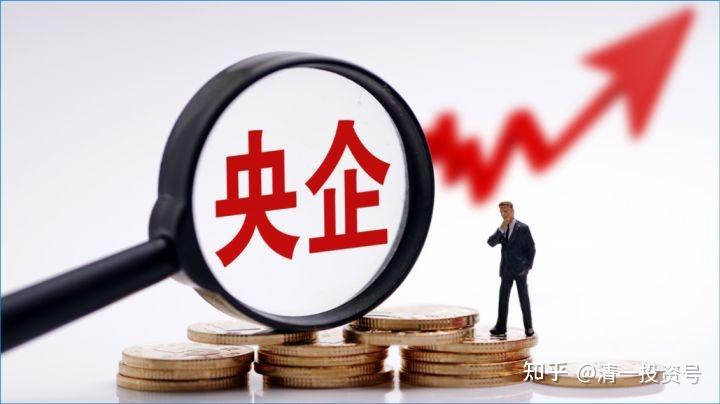
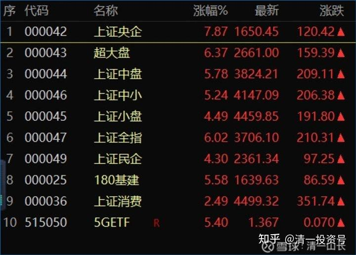

**23篇.股灾来了怎么办】系列之三**

**清一山长 2020年**

**五、未来的走势，我认为会比疫情刚开始恐慌的结果更糟糕**

清一山长 2020-06-06 11:15

$道琼斯指数(.DJI)$ 全世界都在把老百姓当傻瓜吗？疫情叠加国际封锁，对经济的影响巨大。美股居然涨到去年11月的高位了，你要跟着一起疯吗？还是远离一点市场？巴菲特闹了大笑话，他的达美航空四十多元买，20元卖，亏了一大笔钱。但昨天的达美，最高达37元了。股神都看走眼，了不起的市场先生。

下周，泰国股市铁定上涨。一旦价格超过疫情前的价格，我铁定卖。昨天已经清仓了一只地产股LPN，3.67泰铢买进，每股拿了1.5铢的红利，现在价格5.2铢，差不多翻倍，已经超过了疫情前的股价，果断清仓了。留下现金，慢慢等市场从狂热到低落的情绪，再择机买入。我可以在泰国等三年才入市，还可以再等两年。反正赚到的钱已经可以在泰国过几年了。

A股会涨吗？我估计不会。**因为美股疯狂的时候，A股必须保持一点理性，大盘股压盘都要压的。**假如跟着美股疯，跟美国的节奏，就上美国人的当了。当然，各种小股票，肯定会好好发挥一下的。继续看世界的热闹。

清一山长 2020-06-07 12:56

今天答案出来了：美股大幅上涨，是非农就业数据超预期的原因。不仅失业人数没上升，就业人数居然还上涨了，额外提供了几百万个岗位。这种缺乏常识的数据，居然会在美国出台，实在不可思议。我根本不相信美国5月份的就业会大幅增加。恢复最好的中国，都不得不鼓励大家摆地摊去了，就是为挽救就业出的最无奈的下策。美国情况比中国差多了，居然跟中国相反，强劲恢复？骗鬼吗？鬼才相信！

结果就是：有点头脑的人，开始质疑数据的真假。据CNBC报道，多位经济学家对美国劳工统计局的就业数据提出质疑。宏观经济学伊恩·谢泼德森在一份研究报告中写道，劳工统计局的月度就业报告与其他数据相抵触是一个“谜”。

今天，解谜了。美国劳工部劳工统计局声明承认数据存在误差。

昨天，劳工统计局官网发布的每月的就业报告显示，由于“分层抽样”错误和数据收集的错误等原因，此前的数据可能将失业率低估了3.1个百分点。

这也就是说，“正确”的美国官方失业率将达到16.4%，这比4月公布的失业数字还要惊人！

您相信这帮官老爷只是“算错了”吗？我是绝对不相信的。我认为这个完全违背常识的数据的出台，而且影响到了股市大涨，是有意弄出来的。今天出来“认错”，也是早就准备好的套路，他们已经实现了想要实现的目的。大把的金钱已经捞到手里去了。

比如，这一次疫情的突然爆发，没有料到，**利益集团明显是被套牢了，他们没有巴菲特的勇气去面对。但他们有权利可以去使用，**他们知道现在和未来的情况都很糟糕，但可以利用一个错误的数据，市场开始转变的数据，去引导瞎了眼的民众跟风乐观。只要一两天就够他们收割了。**航空股每天成交超过100%这种数据，是典型的的出货手法，这就是中国的拉高出货，自己全身而退。**只是美国权贵可以做到让全世界来买单。够牛，比中国的庄家牛多了，这就是收割傻瓜，全世界给美国交智商税。

**既然权贵们要用这种非常极端的手法来偷跑，未来有多糟糕，您就可以自由想象了。**别指望劳工部给你准确的数据，我们用模糊的正确，就知道今年的日子肯定不好过，上市公司的报表肯定不好看。如果能够找到好看一点的报表的公司，也可以被整体拖累下跌。这就是未来的走势，我认为会比疫情刚开始恐慌的结果更糟糕。

**六、跟美股脱钩，等美股崩**

清一山长 2020-06-12 10:13

道琼斯指数(.DJI)

一天就把两个星期的涨幅全跌掉了，真厉害。我始终不明白美股涨的逻辑是什么，也很奇怪有人会跟。**这个世界，不会思考的代价的确太高。**这一轮世界经济的大波动，很多没有脑力的，原来靠跟风过得不错的人，现在将把原来吃进的全吐出来了，很多小资们会破产的。

**美股跌了，A股才有机会。美股如果开启“跌跌不休”的模式，A股就会慢慢地稳住了，并开始上升。**国家控股的大盘蓝筹估计会首先企稳并缓步上行。美股涨，这些股就会压盘。不让A股跟着疯，特别是现在的国际环境不好，跟着跑，只会被美股趁机割韭菜。2015年A股疯了一回，就是被美国人搞了鬼。**2015年以来的金融政策，就是跟美股脱钩，等美股崩。**这样，A股在低位，就会吸引从美股撤退来的全球资金。所以一旦A股出现上攻，就会打下来，只让你低位震荡，蓄积上攻能量，而且不停的IPO，扩大市场盘子，根本不怕A股涨不动。这些措施，就是让A股在低位，等美股冲高崩盘。

没想到面对疫情和国内动乱的美股，居然还拿出吃奶的力气，拉出准备创新高的架势，什么“巴菲特错了，航空股大涨”。特斯拉超过1000元美金，市值惊人，各种新高消息不断，好像美股就是超人一样不需要考虑地心引力，基本上就是找死的节奏。中国人只要远远地看美股疯狂就够了，千万别进去。现在大跌，会不会还会挣扎一段时间？再演一出绝地反转的大戏？不知道，我还以为要下半年才有机会呢！这几天卖出泰股腾出来的大量资金，也许很快又再度派上用场了？（泰股绝对跟美股跳舞）这都是我自己的预期，不一定是对的。因为大领导也不会听我的[俏皮]。你们该干啥还干啥吧！

清一山长 2020-06-12 15:11

$上证指数(SH000001)

**上证走势，今天用2700个亿的资金，来说了一句特别大气的话：美股跌惨了又咋的？一天跌掉1861点。但我大中华帝国，就是不跟！我们自己玩自己的，不跟你玩。**不过，今天拉红盘，也太不给美国人面子了。所以象征性的跟跌一个点算了，意思意思[大笑]。今天中建跌破五元，大手买入，纪念美股大跌。

巴菲特说：看好美国未来，千万不要做空美国股票。

我说：看好中国未来，千万不要做空中国建筑[俏皮]。

清一山长 2020-06-28 19:18

$道琼斯指数(.DJI)$ 周五狂跌，把上次1800点大跌以后的反弹全跌光了。周一全球动荡是必然的了。居然相信这个背景下美股依然会继续创新高，也是脑子想得太美了，太脱离现实了。现在这个时候，学巴菲特的样子最靠谱——**持有大量现金不动，等着看美股表演。**

清一山长 2020-07-06 19:57

上证指数(SH000001)

一天大涨180点，牛市真来了！？看样子倒是牛市的样子，也可能是真的牛市来了。而且，**我虽然一直不看好现在的牛市行情，也没有踏空本轮行情。而是满仓，带了不到20%的杠杆**（买的中建，因为看它创下了五年估值新低，觉得融资买入也很划算，低杠杆也不算冒险，算是抄了一个黄金底）。

所以，申明一下，我没有酸葡萄心理。今天的货币基金，收益率大涨，很多超过10%年化的。为啥？大量资金离开避险地，抢占制高点。上面的图形，显示出来：**央企涨幅最多，超大盘表现最好。这显然是“上面的意思”，大家可以开涨了。**看样子，今年下半年，又要重复2014年的行情了——大家小心“满仓踏空”这个词。这几年，上面的意思，一直是：不许涨，只许盘。美股高企，涨了也和美股一起向下跌落吗？还是专门反向而行？

想象一下，某一天美股大跌一千八百点的时候，我大A股相反一天涨180点（就像今天这样），不是挺解气的吗？**我一直在等这一天，所以低位一直在布局，不敢空仓，还告诉人：现在的股市，又回到2013～2014年上半年的时段了，机会特别好。**可是，美股依然在高位磨叽，A股现在就按捺不住，率先拉涨，跟全球反向而行，难道思路变化了吗？不怕美股大跌，估值上升后的A股拉不住也跟跌咋办？上面有办法对付了？或者判断：美股这一两年崩不了，我A股先走一轮“独立行情”再说？

不过，我个人判断：未来很可能是与2014年下半年相似的“结构性牛市”，不可能是普涨的，鸡犬升天的牛市。很可能是再度出现“满仓套牢””、“满仓踏空”的2014年哀嚎的局面。**大蓝筹、央企，会是这一轮的主力。**一旦美股崩盘，央企我们还是有办法控制住的，不至于大崩溃。小股如果本来就没有涨啥，跌也跌不到哪里去。所以——**到时候再去拉小股票，维持住A股，让真正的牛市开启。**同时，大蓝筹、央企估值高高在上，拒绝下跌，就给海外从美股撤退回来的避险基金提供接盘，时机正好（**海外资金要买，只会买大蓝筹、大企业，不会买什么创业板小股票的**）。不然现在就让外资来买地板价的大蓝筹，不是割了中国人的韭菜吗？不如先涨一轮再说，就算是涨了一段的大蓝筹，分红和利润，也比美国欧洲的零利率，负利率强多了，外资们依然会愿意大量买入的。如果是这样的思路，就好玩了。中国人将来也可以割洋人的韭菜了。

如果我判断正确，各位就要注意买什么品种了。以今天的题图为标准，涨幅大的，就是代表未来趋势的。右侧人该上了。至于我咋办？如果我是右侧，借钱都要打满低估值的大蓝筹。不过，我改邪归正了。另外，我对自己的判断也不自信，不知道是不是真的。如果确定是真的，才能这样干。万一我错了呢？所以，还是守住自己的一亩三分地吧！我很幸运，今年坐拥比2014年多了十倍还多的股票。这一轮风口，市场会再一次给我与2015年相似的回报吗？

清一山长 2020-07-06 21:59

道琼斯指数(.DJI)，开盘涨了400点，收盘就明天再看了。美国这一次居然跟涨中国？不怕胀死吗？妙！美股越涨，我看以后局面越难以收拾。不涨呢？也不行；跌下去很难办，可能当场玩完。这局面，真好玩。高处不胜寒，真不容易。

参考链接：

[清一投资号：21篇.【股灾来了怎么办】系列之一](https://zhuanlan.zhihu.com/p/481788728)（整理文）

[清一投资号：22篇.【股灾来了怎么办】系列之二](https://zhuanlan.zhihu.com/p/482419070)（整理文）

[清一投资号：24篇.【股灾来了怎么办】系列之四](https://zhuanlan.zhihu.com/p/484791228)（整理文）

[清一投资号：25篇.【股灾来了怎么办】系列之五](https://zhuanlan.zhihu.com/p/487164089)（整理文）