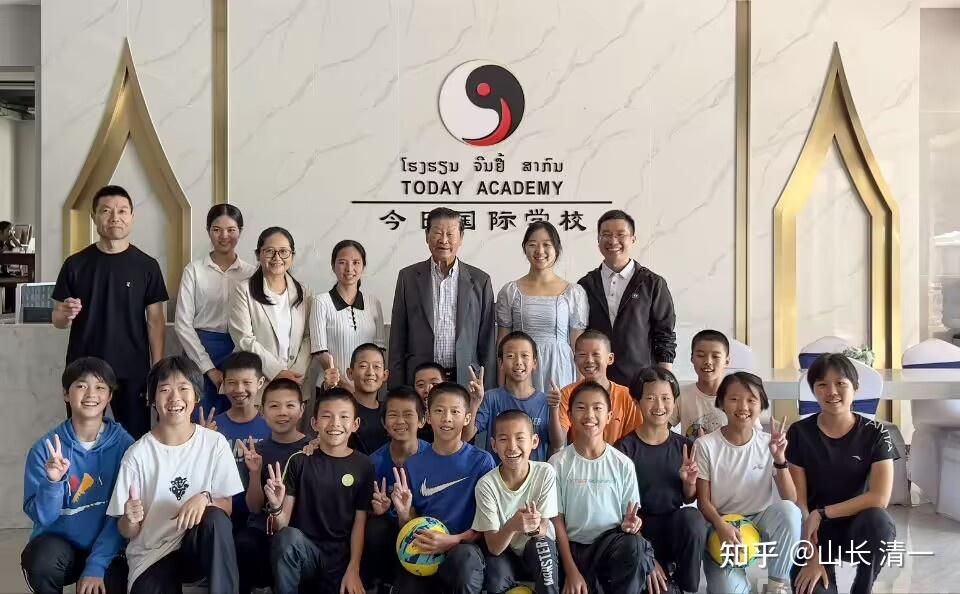
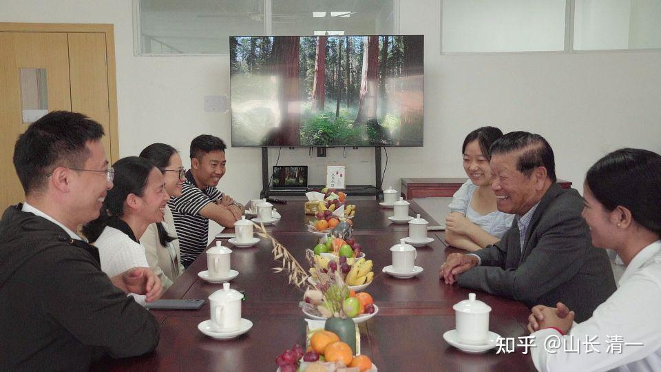
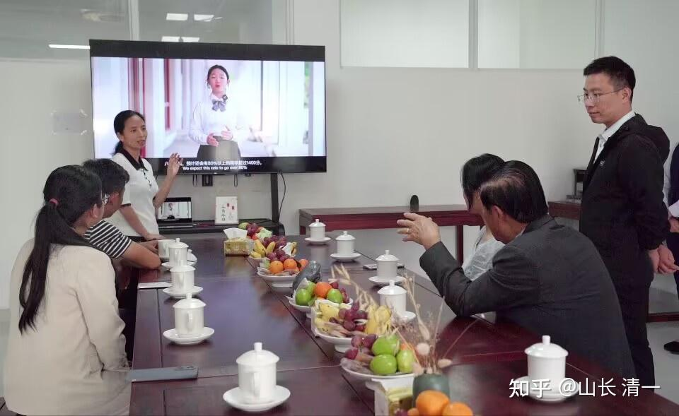
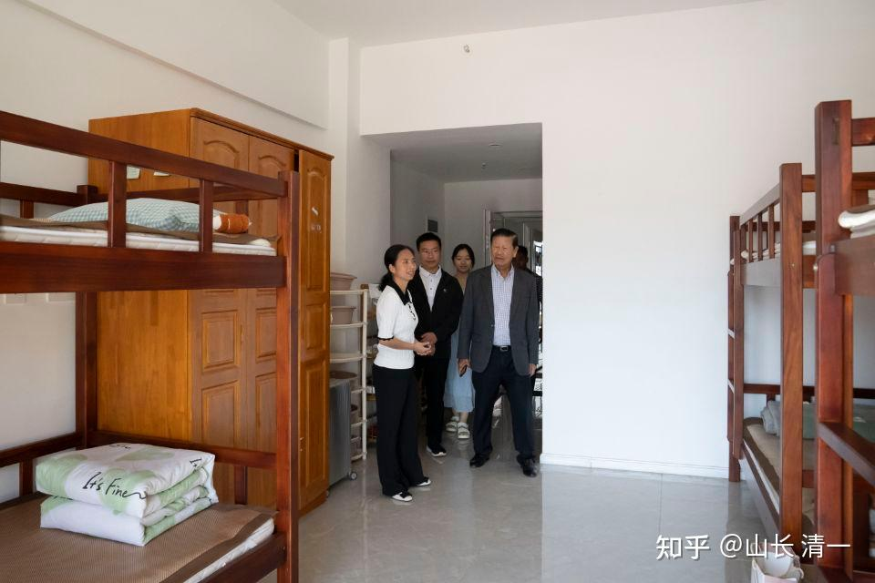
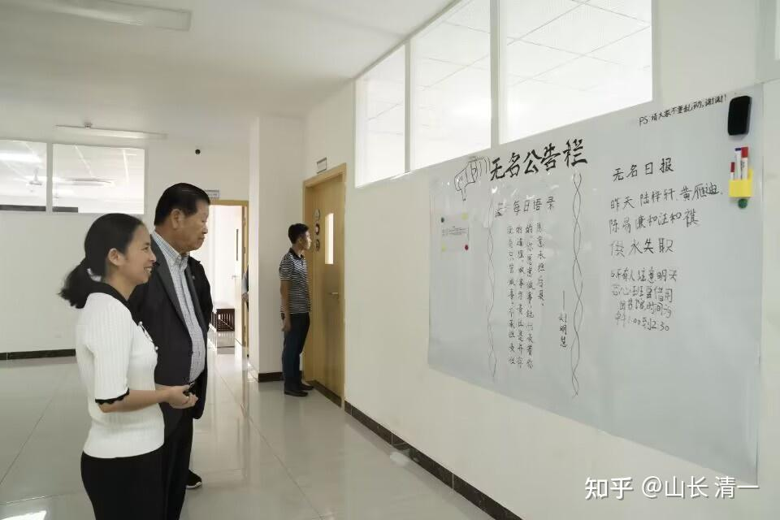
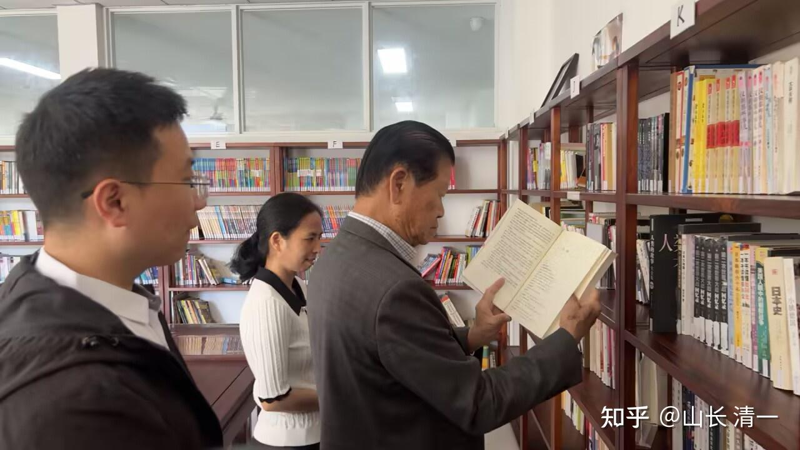

下面是今日钱莉校长和赵刚校长，昨天发出的内部报道消息：

今天上午，老挝前副总理宋沙瓦阁下在随行保镖和海城工作人员的陪同下，到磨丁的今日国际学校参观访问。海城工作人员向我们介绍，磨丁经济特区原来就是宋总理签字跟中国合作的项目，老先生是老挝的政治世家，即使是已经退休了，也喜欢到处走一走，一直在关心老挝的发展和建设问题！因此，大家依然都很敬重他。宋总理表示他最初是从詹老师（山长大学同学）的介绍中，了解到我们学校的情况的，一直想实地来看看我们这所特别的学校。所以这次来磨丁，希望我们能给他好好介绍一下学校的教学成果和特色。如果教学方式的确很先进的话，也希望看有可能推广到老挝的其他地方！

我们首先带着宋总理到教学区转了转，看到教室里都是多媒体设备，不仅有大电视，学生们还人手一台电脑，宋总理也很好奇我们是怎么开展教学的，究竟采用了什么特别的方式。我们随即向他介绍了新教育的不同：一是充分利用互联网的资源，学习内容的选择比传统灵活很多，也更符合学生的兴趣。比如学习数学，我们就会采用可汗学院，这是全世界公认最好的数学学习系统，网站上也有大量互动的设计，学生们的接受度就很高；二是建立学生的学习动力；我们从来不逼孩子学习，而是让孩子自己想要学习、喜欢学习。所以，老师的任务不是教知识，而是帮助孩子建立学习愿望和目标，组织孩子们学习，帮助他们解决困难。中间的学习过程，就让孩子们自己当家作主，自己发挥和掌控。在这种教学模式之下，教学效率特别高，三年就能学完美国十二年的课程。而且，教学效果也远超国际学校，学生15岁就能参加美国高考，90%都能取得1400分，相当于全球前7%的成绩。宋总理虽然年近八旬，但理解力很强，对我们的教学创新高度赞赏。表示这么好的教育都没人知道，希望我们在老挝多多宣传，可以让更多的人了解！我们也邀请他到教室看看，但宋总理很低调，表示不想打扰孩子们的正常安排，大家一起在门外看看就好。在参观的过程中，宋总理也很注重学校的细节。比如会认真关注图书馆里的课外书，时不时会拿起来翻看，发现我们给学生们提供的书籍天文地理社科无所不包，内容很全面；也会在走廊公告栏旁驻足停留，仔细阅读上面的信息，看到学校在日常中把责任意识传递给孩子的举动，也觉得这种教育方式很好。

接下来，我们便在办公室一起座谈交流，通过B站视频来向宋总理详细介绍三年突破十二年美国课程的教育项目。看到学生们开朗阳光的气质、落落大方的举止，宋总理很是喜欢。对于这些学生在初中年龄就取得了靓丽的美国高考成绩，感到很不可思议。特别是，在这里没有传统意义上的差生，就算是最后一名，也超越了80%的国际考生。另外，对于50%的学生能够取到前1%的成绩，可以达到哈佛耶鲁等世界顶尖名校对申请者的学术成绩要求，更是感到震惊。还特别询问到：老挝教育部原来有没有派人来学习过？他回去后，要向教育部的人好好介绍一下，让他们到学校来参观学习。老挝的教育太落后，完全跟不上国际发展，但按照我们的方式就可以赶超国际水平。还开玩笑地说，按照这种学习效率，中国超过美国不用100年，20年就够了！

老人家虽然汉语很好，但也很注意了解调查我们介绍的教学细节。他发现小徐公主会老挝语之后，就特别用老挝语来跟她交流。问她是哪里人，家庭条件怎么样？平时是怎样学习的？学校是怎样给她经济上，和学习生活上帮助的？因此，看得出是一个重视细节，重视事实调查的官员。不是只听介绍的！

在谈笑风生中，时间过得很快。宋总理表示百闻不如一见，不虚此行。以后有机会，他就常住磨丁一段时间，看看我们四个月突破外语是如何实现的。离别之际，我们也邀请宋总理一起合影留念。这时，也刚好碰到了一群准备上楼上课的孩子。宋总理慈爱地看着孩子们，用中文跟大家打招呼，邀请他们一起过来拍照。孩子们很意外，也很开心地一起参与进来

*与部分师生合影*

*前副总理在会议室和钱校长，赵校长交流*

付总理旁边两个女孩，是担任翻译的中国小公主翻译和老挝大学毕业生翻译（现在均为今日国际学校的教师）

*钱校长在介绍今日国际学校的示范班教学模式*

*前总理在参观学生宿舍。认为学生生活条件很好*

*在教室外面查看学生的状况*

*总理通晓中文，在图书馆查看书籍*