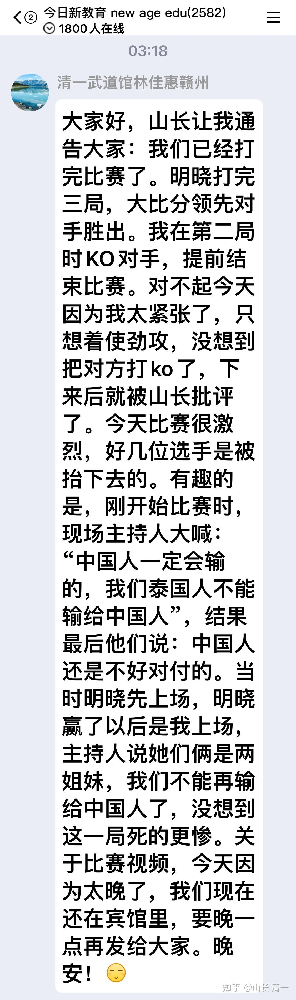
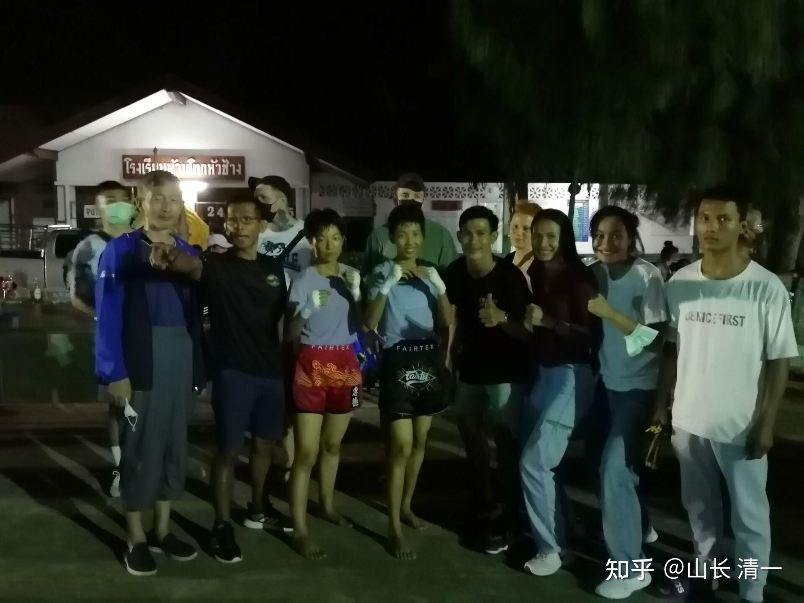

*当天晚上三点钟才公开发出的战报。*

视频一 明晓初战泰拳视频，无删节版。【昨晚的泰拳赛，没想到非常的激烈，我方第二场TKO泰国对手，因为被裁判及时叫停。虽然对手明显受了伤，但没有当场倒下。但后来的好几场比赛，场上拳手是被抬下去的（我没看完拳赛就走了，我就看到了三个拳手，在拳台上被击倒昏迷后抬下去），所以，人家泰国人比赛，是真打实战。对内很不客气，对外战，当然也不客气的。怪不得香港的传武挑战者，两批人去了泰国，全都是是KO的结果。赛前，我用“中国标准”来要求我方拳手，让她们尽量不出杀手，别KO对方。看来我太天真了。从现场来看，泰国是赛场越血腥，现场就越激动。泰国是崇拜英雄的国家。我们国家是同情弱者的国家。两国文化，真心很不相同。如果我方拳手，不是实力明显超越对手，有可能昨天被KO昏迷的，就是我们的拳手了。泰国人场上，真心是很不客气。

[!\[image\](images/img_002.jpg)

清一木兰-明晓 的泰拳首战 https://www.zhihu.com/video/1491149692934823936](http://link.zhihu.com/?target=https%3A//www.zhihu.com/video/1491149692934823936)

格斗界的拳手，都喜欢用一个非常酷的名字，来作为自己“字号”，如“魔裟斗”，“格斗沙皇”，“铁血战士”：以及中国的“鬼脚七”，“威震天”等等。不过我更喜欢泰国的“白莲花”---播求的字号，平和吉祥多了。我们作为专业格斗武馆，拳手们当然也要有自己的代表字号。不过，我们也不想起个吓人的名字，比如“红都女魔”，“中华鬼王”之类。我们的女拳手，都统一叫【清一木兰】。英文是【SAMURAI MULAN】。我想现在全世界都知道是啥意思---拜迪士尼的电影广泛介绍。我相信未来，是【清一木兰】（女拳手）以及【清一武士】（男拳手）连胜泰拳手的时代。泰拳五百年不败的历史，正在被清一太极拳手们终结进行中。总有一天，要让泰国拳手，甚至全世界的拳手，听到自己的对手是“清一木兰”，心情都会陡然变差----这意味着他们几乎没有获胜的可能。但我们会尽量虐的优雅一点的。我希望在压倒性优势的情况下，我们也尽量不KO对手，这需要我们的拳手必须有更高的技术，更高的德行才能做到----就是在对手已经出现KO迹象的时候放弃攻击。而全世界的赛场格斗原则，都是在对手出现KO迹象的时候（反应变慢），就全力猛攻。

对了，忘记申明了：这两位小拳手，都是新教育的“三语学霸”。拥有三个国家语言能力，且三语都相当于母语水平。英语水平超过北外毕业生，泰语水平超过任何大学泰语专业的毕业生。她们在泰国生活交往，会被当地人误以为是本国人，不会怀疑她们是外国人。中文水平不好说，不好量化，但大多数中文系大学生肯定不是对手。现在两人是两年多前开始练拳，进入清一武道馆玩职业格斗。从今天实战看下来，泰国的正宗泰拳手，应该也不是她们的对手。她们的个人综合优势很明显。未来，是她们的不断赛场取得胜利的历史，今天仅仅是开始。

本次明晓初战的对手，是一个已经打过多场实战比赛的“老拳手”了。这女拳手应该很强悍，赛场的作风很泼辣，很能承受打击。的确是强手，应该是对方拳馆的主力女选手，明显比当天的其他泰国女拳手顽强得多。可惜：她太藐视中国人了。主办方现场登记双方比赛的时候，发现明晓是首次参赛，就不肯安排上场比赛了。多次强调：原来安排的这个对手是打过多场比赛的老手，让她认真考虑，是不是放弃比赛？（我觉得主办方应该知道这个泰方拳手的实力，怕虐一个新手造成严重后果，不合适。特别是泰方人认为：中国人，不经打，不是泰国人的对手，更别提新手参战了，怕出事。但明晓现场一直明确表示：没关系，她不怕，愿意参加与老手的比赛。但主办方，依然不敢决定这件事情。最后是电话联系了安排明晓来参赛的泰拳馆的老板，确认是否放弃掉这场比赛？反正就是顾虑重重的。但因为我提前跟这个拳馆的馆长说过，让他尽量安排强手来打。我可以接受我的拳手失败的。不要求首战就一定取胜。为表达诚意，我还特别的表示：如果他选出的拳手击败了我的弟子，我还会额外的给钱给馆长（因为让泰方给一个刚去他的拳馆才一个多月的新手安排比赛，有点不合理，他希望下半年再安排的）。我强调说：从失败中，孩子们可以学到更多的东西。所以馆长知道我的态度，就跟主办方再度确认，我们可以打。这样，主办方才安排明晓跟这个泰拳手对战的。我猜主办方认为：既然我们坚持要打，出了事情他们也没有责任。我方的拳馆泰国队友们，其实也很担心我们孩子的首战。赛前都在问我们的小拳手：如果这一次擂台失败了，会不会哭？我方拳手显然没有准备好“哭”这件事。昨天是泰拳手该哭的日子吧？

实际上，从实战视频中，大家可以看到:这个女拳手作风的确很强悍。作战很顽强，整场的拼杀很激烈，明明受伤了也强撑到底。一般选手遇到她是不幸。可惜，她这次遇到的是清一派的拳手。就算是第一战，也够她受的，她只能收获自己“完败”的结局。另外，我看到教练对她很宠爱，她比赛的时候，教练非常的关心，一直在场外大喊大叫的比划等等，给她支招。但下一场，她的同门师妹上台与佳惠比赛，教练却只是在台下也不关心比赛的进程。只在最后叫停的时候，上台来让裁判停止，似乎不太关心她的胜负。假如佳惠在上次击倒对方之后，对方晕乎乎的站起来，这时候抓紧时间补上一拳，她这师妹，就只能躺着下去了。裁判和教练显然都不管关心后来的一个泰国拳手。比较之下，前者在拳馆的地位，就很显然了。

赛后我才知道：这个女拳手，在赛前双方拳手见面的时候，表现非常的无礼。对明晓的主动打招呼，是极度冷漠，不理不睬的。这跟我们熟悉的【微笑之国】的泰国人基本礼仪，完全不顾，实在是过分。不知道是她看不起中国人，还是老拳手看不起初战的拳手？觉得自己跟新手打掉份？或者两者兼有？我也不知道。

大家看第一场比赛：正常情况，双方拳手赛前要友好的碰碰拳套，然后拉开距离，在开始打。当场上裁判要双方拳手碰拳开始的时候，明晓主动伸手碰拳，但泰国拳手（蓝衣蓝裤者）根本不理，马上就是一个低扫袭击。赛后，她也不理对手，连象征性的“友好分手”都没有。这都是完全违背拳台礼仪，是很无理和极度敌意的表现。赛后，我们可以理解她，说输了比赛心情不好，特别是输给一个新手太丢人。哪么她赛前的举止呢？这样做是啥理由？根本就不尊重对手。你要说她就是一个不懂礼貌的粗人，女汉子？但你看视频中，她第一个上场之后，跟每个方向的裁判都分别行礼，看起来真是“懂事之极”的乖女生。场上的主持，也是对她“青眼有加”。我们的女生都懂泰语，就听到主持在大广播里面说：下面她的对手，来自中国，是练中国功夫的拳手。中国人肯定不是我们泰国拳手的对手，她一定会输的。我们泰国的拳手才是最厉害的。

但这个傲慢自大的女泰拳手，第一回合就遭到了沉重打击：她的几次扫腿进攻，被明晓提膝化解之后，她就知道对手不好对付了。明晓继续进攻，靠近对方后，连续两次膝击对手腹部。但很快被裁判拉开。视频中非常明显的看到：泰国拳手有弯腰护痛的动作。显然明晓的打击让她感到很痛苦。但她真的很顽强，很快调整过来，装的没事的样子。但裁判很“贴心”的，中间两次介入他们双方，尽量让她多有一点时间去缓过气来。她很聪明的进入内围战，抱住对方缓缓节奏，避免状态不好被连续攻击。也因为中国人普遍怕内围战。但结果却发现：泰拳手丝毫不占便宜。对攻中，反而被明晓多次膝击。她无奈只能改变战术，使劲把推明晓到拳台边缘，试图卡住明晓不能动作。被裁判分开后，她打算用泰拳的绝杀：泰扫来攻击明晓。结果明晓不躲不闪，一个前腿正蹬，直接把她打退两步（其实这一腿不太符合我的要求，我的要求是左腿支撑小跳半步，拉近距离后，用前腿正蹬）。如果这样子被击中，就不是倒退两步的问题了。有可能当场就站不直了---或者至少要连退五步。不知明晓是执行我赛前交代她：打一场就当练习赛，别太凶了。别第一回合就把人KO了。我们打一还一，不占便宜，不吃亏即可（其实这样最终结果一定是赢的，因为对方一定有打不中的时候，比如这一次）。所以明晓此时并未发力猛攻，没有用“连环踢”主动进攻策略来摧毁对手。但这一腿，肯定很疼，让她开始变成“防守模式”，不太自负了，也不太敢主动进攻了。接下来明晓一个后腿窝心脚，对方因当时正好侧身，没有被打实，但显然受到一点惊吓。明显狂傲的气势下来了，觉得这新手很难对付。接下来，她右脸挨了明晓一个后手摆拳。泰国拳手看势头不对，有点不知所措，为防止明晓的进一步进攻，就有赶快死抱住明晓不放（这说明她的比赛经验的确很丰富，跟后一个拳手相比老到多了），裁判也“贴心”的让她紧紧抱住对手的时间，多于正常的情况，让她有机会缓过气来。5分22秒，泰拳手又想扫踢，结果明晓的反应超快。对手刚一动，腿还没有踢出来，明晓的后腿正蹬就上去了，她的腹部被结结实实的踢中一脚，身形被立即停止。我猜这一腿力道不轻。后面又被明晓近距离一膝击中腹部。泰国拳手在负痛之下，为自救，又再次紧紧的抱住明晓，让自己缓过气来（老拳手，很有经验）。但由于毫无技术动作，应该马上被裁判分开的。按道理，明晓此时也应该用摔法来对付这种捆绑。对手一摔就倒了。但居然明晓很被动的，没用摔法来对付她，而是不动。赛后我问她：为何没有用摔法来对付对方？ 答：虽然她使劲抱住她。但明晓认为她的这种行为，毫无攻击价值，是白费力气，所以就不理她，让她耗费体力去。自己正好节省体能，跟她玩消耗战。所以就没做啥摆脱动作，随动对方（这就是没有经验，没有觉察到对方利用靠在她身上的时间，来恢复刚才的打击）。也说明对手的顽强和聪明。此时第一局结束铃响起来，拯救了这个泰国选手。这一局，她应该是完全打蒙了。没想到一个“新手”如此难对付，完全被动挨打（如果你们仔细看视频，会发现整场比赛，泰拳手对明晓的身体，连一次有效攻击都没有做到。其实不仅仅第一局，整场下来明晓躯体头部，对方没有一次有效攻击动作，看上去凌厉的腿上，膝盖攻击，也全被明晓轻易化解。所以，这是一次压倒性的对抗，泰拳手完全没机会。做到了内家拳“在自己绝对安全的构架下进攻”的基本格斗原则）。

明晓结束后跟我说：第一局结束后，她觉得等待的时间超长，不是间隔的一分钟。觉得停下来的时间，比比赛的时间更长。我当时也觉得：中间休息时间似乎有点长，但没看表。这一次，我拿到视频，看了一下时间，第一局结束的时间，是5：40秒。但第二局开局的铃声，是7:00开始，的确多了半分钟左右。之后再次开赛的时间，是7:25秒，差不多两分钟了。是不是对方需要多一点时间缓一缓呢？裁判贴心多给了一些时间。实际上我认为泰国女拳手这一局，她吃了大约5个正踢腿的有效攻击，其中两次是迎击。以及多个膝击，应该比较惨。的确需要多缓一缓时间。主办方也适当的多给一点时间。所以双方的缠抱分开，也慢悠悠的。但后一场，佳惠的比赛，由于缠抱内围，佳惠的攻击很厉害，明显对泰国拳手不利，所以很快就被裁判拉开。第二局中的的KO，是佳惠击中对手头部，泰拳手马上晕眩。双方再次接触佳惠准备攻击的时候，裁判马上过来分开，避免了当场KO。对方的教练当时也在喊停比赛。不然再坚持下去，这拳手就真的爬不起来了。所以，可以看出来：泰国裁判还是有点“偏心”的。当然，实力差距过大，裁判是否偏心，也改变不了结局。我听说过：在泰国打泰拳，外国选手如果不是明显超越泰国选手的话，甚至没有KO泰国选手，都会判泰国选手赢的。我觉得有点偏心很正常，但明晓的比赛，也没有KO对方，还是判了我方胜，应该还算公平，不至于太偏心。

不过，实际上明晓的对手，是第三局结束的铃声救了她，不然也会被KO了。我们先解说第二局：第二局开局的战法，泰国拳手完全改了上一局的拳风：不再用扫踢，不再用吃亏的远距离攻击，而是拼命的去贴近对方，用内围战来打。我估计是对方拳手的教练，看到了远攻是我方的长项，速度力量都跟不上。所以让她改变战术，用内围战来解决问题。估计是看到明晓在上一局，面对泰拳手的缠抱，似乎没有啥特别的反应，以为我们的拳手不太会内围战（很多中国拳手怕泰拳的内围战，拳肘膝全上，不小心就被KO）。这个战术，显然被我方的泰国教练看出来了。后来艾拉公主告诉我：对方的教练大喊，要他的拳手往前冲，抱住对方。我方的泰国教练，大叫，还比手势，让明晓要推开她，保持距离来作战。我看视频中，对方的教练很着急，喊叫和手势，都是让她接近对手，扑上去抱住对方的示范。明晓一直在缠抱中打得比较消极，因为按照我教她的内围技术，她是可以轻易解决掉这女拳手的。拳馆练习中，男拳手都常常被她摔翻的。我事后问她原因：她说，不是才第二局吗？不想太快打击她。而且她的抱住攻击，也没啥威力，她就一样就消极对待，让她无法有效进攻就行了。因为她记住我事先说的：别打太狠了，结果---显得太温柔了。

第三局，是最后一局了。由于对手在前两局都输了，第三局必须搬回来，甚至必须KO对手才能反转了。所以，你们看到第三局一上场最激烈，双方开始猛攻。但对方的一系列猛攻，可以说完全无效，攻势完全被化解，泰拳手处理不讨好，在进攻中，不仅仅没有打到我们的拳手，自己身上，脑袋上中了不少拳。而且，她的体能拼议论过后，也似乎快耗尽的样子，后来就继续采用缠抱技术来拖延时间。按道理，打三局，也不至于累成这样。明晓跟我说:她打完比赛，都还没出汗呢。觉得怎么一下就结束了。场上看反应，明晓虽然消极一点，但反应速度是很快的，所以的确体力保持完好。但对手明显打不动的样子，身形都变形了。我估计是比赛中对手中招较多，受伤对体能的消耗是最大的。最后，双方在对手发起却后继乏力的一场猛攻互拼中结束，泰拳手一直在努力搬回局面。却连续挨了几个膝击，她似乎累到直不起腰来。我看对方的头部，胸部对低下来，完全暴露在对手的核心攻击力量面前。明晓这时候明显有点困惑了：此时，自己一膝盖上去，就是对方的脑袋，脸部，会不会太残忍？而对手显然已经失去正常的反应能力，站都站不稳了。马上就要KO了。此时结束的铃声响起，救了这个泰拳手，也救了纠结的明晓。但我看到不可思议的局面：泰方女拳手，居然摇摇晃晃的，路都走不稳了。她跑到明晓的角落要水喝？怎么会这样？是不是已经打昏了头，都不知道自己的角落在哪里了？这个给她喝水的光头泰国人教练，是明晓方拳馆的一个男拳手的父亲，原来也是拳手，他一起跟过来做赛场服务的。不过艾拉提醒我，可能是泰拳手的礼节，赛后要去感谢对方的拳手和教练。如果真是这样，我方的拳手泰国教练，为啥没有教这个礼节呢？

明晓首场比赛的解说，就写到这里，希望能够帮助你们解决问题。说个笑话：昨天我这个真正的师父，是远远的看比赛，根本没有到拳台的近处。我也不想影响比赛过程，只看弟子们的表现，输赢都无所谓，回去再总结经验教训。但与对方教练在场上手舞足蹈，大喊大叫相比，我也太“无为”了。实际上，我知道：只有在双方实力差不多的情况下，教练的临场指导才有意义。如果实力差距大了，教练再操心也没法的。我知道我方小拳手的实力超过泰方，正常发挥，我根本就不操心，远远的看戏就行了。我不认为我不介入就会输，所以我不操心。虽然昨天比赛，跟我要求的相比，还有不小的距离，孩子们只打出了三四成的水准，还有很大的进步空间。

第二场是【清一木兰 佳惠】的比赛视频。视频上传：

[!\[image\](images/img_003.jpg)

清一木兰 佳惠的泰拳首战视频 https://www.zhihu.com/video/1491159672711757824](http://link.zhihu.com/?target=https%3A//www.zhihu.com/video/1491159672711757824)

佳惠的比赛就没啥难懂的了，一边倒的比赛。虽然这场比赛一开始，泰方解说员嚷嚷：这一局，不能再输给中国人了。我们一定要赢回来。但这个上场的女孩，似乎是看到了队友，她们拳馆的高手，在上一场比赛的惨样子（她们是同一个拳队的）。所以上场开始，就有点畏畏缩缩的，不像上一个女拳手一样骄狂。虽然第一个拳手，在场上会死撑着。但到了场下，一定会告诉队友：这个中国拳手肯定是骗人的，她肯定不是新手，因为她太会打了。还不知练了啥功夫，力量特别大，腿脚都很硬，碰上去很痛的，我多处都被磕伤了（我跟这两孩子训练中是对碰过的，有一次对攻，出脚碰在一起，结果我的小腿痛死了，第二天看都青紫了。我跑去问孩子：昨天跟我碰的一脚，有啥结果？我以为也差不多。因为我的硬度也不是太差的。小拳手却告诉：我当时有点痛，一下子就没事了，我只能倒霉。这两孩子，这几个月踢断了我们院子里的十几颗芭蕉树，我当然比不了她们的硬度，我没练这个抗击打力）。所以，主力拳手失败的经验，肯定让她非常的谨慎，尽量避战。因为她得到的消息，是明晓佳惠是两姐妹。所以，两人的功夫应该差不多。这个心理阴影---导致她一上场就很谨慎，很保守的样子。主动进攻犹犹豫豫的。但由于我教的弟子，是只要对方一动，管她真假，管她打哪里，立马就攻击对方的弱点。结果她犹豫不决的出手，就一样会遭遇严格执行我“教条主义”的佳惠一轮快速的反击。下来后，我们问她干嘛自己的优势明显，对方不断逃避，你还死命攻击对方？佳惠有点蒙，说：场上她觉得，都是她在攻击我，我才马上回击的。不知道她这么不耐打，不小心就KO了。她下场后，才记得我教的原则：对方狠，你要比她还狠。但对方很弱，怕你了，你就吓吓她玩。自己跳跳拳舞，用一点夸张的，吓人的动作玩，这样场面效果很好看，但放对方一马：接近后用跌法，让她多摔几跤就行了。虽然看上去狼狈，但不伤人。后来佳惠自己看视频，也特别不好意思：说原来都是自己在追着对方打。对方比个动作，做做样子，她就连环拳冲上去了。对方都要吓死了。6分35秒，我看到泰国拳手被三个连续重拳击倒（你们没看到佳惠的发力动作吧？看上去像是轻拳，快拳，没啥力量的。但你看对方被击中后倒下去的加速度，你就知道是重拳打出去的）。虽然这拳手爬起来了，其实已经失去了正常的反应，动作变缓慢了。只是勉强撑着。这就导致了她注定要被KO了。（别以为太极格斗手不会用拳，我们的训练体系，是拳，肘，膝，腿，都可全方位无死角攻击，没有弱项的），佳惠攻击时候，不敢用肘，怕把对方破相了，算是她善心强。

泰国女拳手站起来后，晕乎乎的，已经失去正常反应能力，我奇怪对方教练怎么不赶快停止比赛？再比下毫无希望，马上就要KO了。但佳惠此时也奇怪地停止了进攻。她显然还没有意识到：对方此时已经不行了。如果是泰国拳手，看对手这样子，马上就会疯狂的补拳，让对方彻底倒下。但她毫无经验，也没有这么狠心，但也真心不是觉得对方不行了，自己就停手不打了。她只是恪守我教的原则：人不犯我，我不犯人。看别人既然认输了，也不主动出手攻击我了，我就也不打她了。所以，估计当时所有懂行的人，都在想：这个中国拳手，怎么突然就不进攻了？泰国观众也在大叫，打呀，冲上去打呀？他们就是不怕事儿大，管她是谁，泰国人被打翻了他们也高兴（怪不得昨晚这么多KO的拳手）。此时，总算泰方的教练赶来了，爬上拳台叫停。这一次算是很及时，不然佳惠再来一拳，她就真的需要抬下去了。后来，佳惠一直有些后悔，觉得自己把别人打坏了。认为是自己可能赛前误导了对手，让对方轻视自己了。因为当时双方见面时，对方问她练泰拳练多久了？她说练了一个多月。当时对方像看外星人一样看她。可能是觉得：才练一个多月就敢上场，不怕死吗？她认为可能对方轻敌，才被KO。应该告诉对方：自己之前练了两年多的中国功夫。但我说：泰国的广播里面都在嚷嚷，你们两人是练中国功夫的。而且，刚才明晓把她们的主力队员都打残了。你认为：她会轻敌吗？她只是被你们两吓坏罢了。

好了，我的点评就结束了。昨晚我直到3点过，才找到宾馆睡下来，因为昨晚打完后家很晚了。找了多家旅馆，居然不接待我们。多数是客满，有一家是找茬为难（非要护照，不要驾驶证登记，给她孩子们带的护照，又说年龄不够18岁不能登记）。所以我现在才发出视频。你们自己看吧，原始视频。从头到尾无剪辑。

*昨天的首战参赛团队合影。*

以下是群内的部分清粉发言：

钟熙媛妈妈 06:08:21

佳惠，明晓的首战告捷意义非凡，打破了泰拳500年不败的神话，也打破了“中国传武不能实战”的困局，开创了传武走向世界的先河。山长的谋定而后动，未思胜先虑败，也让我们再次领略了道家的高超智慧是如何变不可能为可能，创造奇迹的。祝贺清一木兰时代开启，祝福公主班的孩子们能继续创造一代人的奇迹[表情][表情]

190413仲雷东营 05:20:05

起床第一件事先看两位木兰公主的比赛情况，结果如山长赛前判断。记得19年江湖课时，山长说要用3-5年培养出太极世界冠军，这是我们不敢想的，但这又是山长所说，因此对此一直怀着兴奋的期待，用老师的话说，梦想是用来实现的，万一实现了呢[表情]如今已迈出坚实一步，山长用真太极证明了老祖宗的智慧，证明了中国的底蕴，用体制语言是迈出了历史性的一步[表情]。也让我们感受和见识了真太极，山长已用智慧改变了我们很多家庭的命运，期待我们的新教育用教育、武术、医学改变更多家庭乃至国运，让我们在有生之年见证受人尊重、自由行走在地球上的中国人[表情][表情][表情][表情][表情][表情]

BO220唐若闲 05:58:34

激动人心的捷报

了不起的清一木兰们[表情][表情][表情]

前几天自立学堂来了一位新生，这位新生的爸爸说他之所以选择新教育，一是看了山长的博文，认可山长的教育理念，二是他自己练了七年泰拳，对很多泰拳的冠军都很熟悉，看山长对武道馆学生的指导，完全找准了泰拳的弱点（他说了很多理由，我记不住），他说他完全相信山长指导的这些学生一定会做到打败泰拳[表情]

外行看热闹，内行看门道！

祝福两位木兰首战告捷/烟花/烟花/烟花

BO578诸文英 04:14:23 明晓打完三局，大比分领先对手胜出。佳惠在第二局时KO对手，提前结束比赛。听到这个消息，内心无比激动和骄傲，真为孩子们高兴，为孩子们在武学路上有明师指导庆幸。结果自然而来，我看见它来自一种文化的自信，思维的力量，唯有“有责任有担当有智慧踏实努力”的人才能做出来。感恩山长和新教育平台，让我们有机会看到中华传武展示出来的魅力！

1271董建村淄博爸爸 23:08:55

刚看了佳惠的比赛，太精彩了，拳法太过彪悍犀利，对方毫无还手之力。不过，过早暴露实力，一定会引起后面选手的高度重视，后面的比赛一定要多加防范

0741陈静思天门 23:12:08

[表情]正准备说的 一下子暴露了 后面比赛还有那么多 张老师还是不要太仔细点评了

山长 清一 23:30:39

@1271董建村淄博爸爸 【过早暴露实力，一定会引起后面选手的高度重视，后面的比赛一定要多加防范】。[表情][表情][表情]。你太小心了，谢谢你对孩子们的关心。实话实说，我不担心你说的这个问题。如果我担心，就是说泰国有厉害的拳手，会击败她们。这样她们拿啥真本事，来取泰拳世界冠军的头衔？就凭偷偷摸摸的吗？你们没看昨天我根本不去拳台上指导吗？而是悠悠的在远处看？为啥明晓根本不在意对手是谁?厉害不厉害？因为我知道泰国人是输定了，我们根本就不用研究现在的对手，不用关注具体的战术，只管按照设计好的模式，去实战打出来就行了。我们只是需要时间，来证明我们的实力，不需要运气。因为：现在泰国能够战胜她们的泰拳女拳手，还没生出来呢。我们的技术是降维打击，泰国人就算是冠军出马，也对付不了这两女孩的。泰拳其实是很残酷的比赛，昨天几个孩子都表示：自己是第一次亲眼现场看见KO，昏迷，被抬下去。觉得现场看跟视频看完全不一样，都有点吃惊。也很为这些人难过。其实，我也是第一次亲眼看见人当场被击倒昏迷，我第一次看泰拳实战，是在清迈古城，旅游区打给游客看的。一个KO都没有，上去的泰拳手，我看就是慢悠悠的打来打去的，完全忽悠人。还花了我几千泰铢的门票钱（700泰铢一人）。昨天的比赛，是泰国人自己玩的真实比赛，有赌拳的，真实性很强。没有人打假拳的。也没啥外国游客。现场的确很残酷，难道我就不怕？难道我没研究好我们失败可能，怎么敢让这些女孩上去打比赛？真不担心被KO？我拿她们的生命危险去赌博吗？其实，我真还一点都不担心她们会出事。为啥？因为目前泰国人的泰拳技术，是基本上打不到她们的。更别说重拳了。你仔细看视频，昨天两人都一拳未中（指对方的有效击打）。这是太极技术的胜利。另外，第一次打，为啥我没检验过实战，我也不担心结果？难道全靠理论？不是的。是因为她们现在的拳馆，有一堆泰拳冠军。两个女子冠军，都跟两女女孩对练过。我也去看过这两个泰拳女子冠军的日常训练和备战，很了解她们的力量速度，优点缺点。要看过实战演练等等，实话说:泰国女子冠军，不是这两个木兰的对手。孩子们也知道，她们本人可能不知道（但她们不会承认的）。因为我要求两孩子不要给本馆的泰国人难堪，不要打她们，示弱。不然关系难以维持。她们日常也不跟女子冠军玩对练的，因为太差了。两孩子每天对练的对手，都是泰拳的男子冠军，一般男拳手，也不是两女孩的对手。所以，我知道她们水准在何处。昨天的第一战，实力是不对等的。佳惠下来就说了：跟她打第一战的女孩，肯定留下了严重的心理阴影，觉得一个新拳手，外国人都可以把她打得这么惨，可能打怕了，会彻底放弃泰拳。等以后她去看电视，发现她是泰国冠军的时候，就会醒悟过来：今天败给她不丢人[表情][表情][表情]。简单说：现在这两孩子都已经具有了泰拳女子冠军的实力，我才让她们开启第一战的。其实，我比你们想象的保守。这是道家的玩法：先胜而后战！！！！。所以，结果是可以预测的。你们别担心！