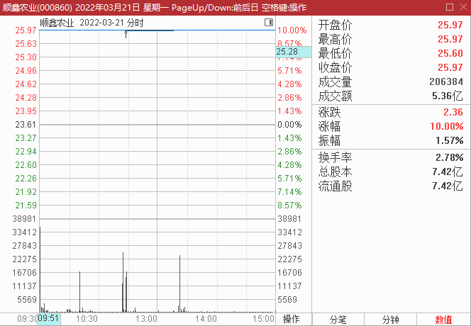
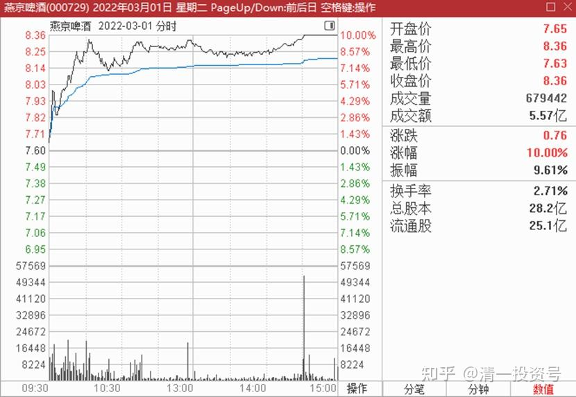
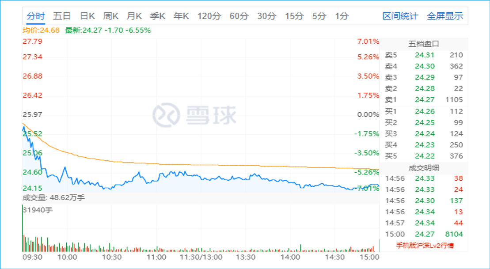
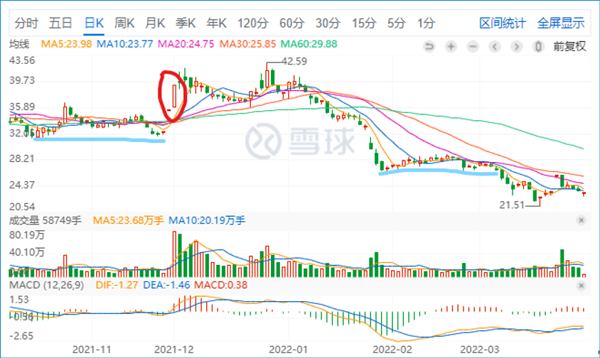

12篇.看盘心理学——博弈学的智慧

清一山长 2022年3月22日

**一、看盘心理学——博弈学的智慧**

山长 清一2022-3-22 14:00:15

*（顺鑫农业 2022-03-21 涨停日）*

昨天顺鑫农业开盘就涨停，我一看就觉得是骗人的。**开盘涨停，往往有实质性的反转消息，一旦涨停，也会继续涨停下去的。但顺鑫农业现在没啥特别的好事，白酒行业反转可能性不大。**

我本来观察顺鑫，是准备接近20元左右，就重新入手的，比如21元左右就开始买。但一看它昨天涨停：就觉得水太深了，20元，肯定不是它的底。因为底部拉涨停出货，不能说明主力拿到了货物，只能说明主力手中的货不少，想出，出不掉，才会冒险这样拉涨停，激活人气来出手。绝对不是低位拿到的筹码，是巨亏之后的自救行情。

正因为主力并不想要更多的货，所以开盘就拉涨停，就是作秀的。中间两度破涨停，要么就是被聪明的对手倒出去了一些货（我要手上有货，大概率赶快倒给主力，至少倒一半）。要么是自己卖给跟风盘的，乘机涨停板出货。

但——是真是假，其实我昨天也不好说清楚。

*（燕京啤酒 2022-03-01涨停日）*

因为，燕京8.36元的涨停（3月1日），看起来太真了，真到我都相信了，以为从此反转了。所以我只卖了少少的一点货出去。如果当初燕京是一大早就开盘涨停的，我基本上要卖掉一半的。可是——**燕京这种“真涨停”，盘中一直鼓励别人卖货的涨停，最终是证明依然是假的，是出千骗人的。**所以——防不胜防。要说清楚真假太难了。

*（顺鑫农业 2022-03-22）*

今天专门来看看顺鑫农业，结果跌了不少。开盘就下跌，然后跌6%左右护住盘面，显然主力不想打下价格来（不像燕京，打压起来连续破位，让人心凉）。**所以结论就是：顺鑫农业，最近一年就别指望了。20元以上也别指望了，只会随波逐流的，不可能产生独立行情。**我一年内不会介入，除非出现大的破位。可能有时间观察两年，看它的牛栏山是否会受到“标注”的影响销量。如果不影响，未来还是可以买的。【以上看盘心理学，分享给大家】

**二、长期趋势已经走坏，不敢介入**

山长 清一2022－3－22 16:24:22

*（顺鑫农业 2021-12 连续两日涨停）*

去年12月，顺鑫农业有过一次连续两日的涨停，从30元左右的股低谷，拉到了40元左右。后续与现在的惠泉差不多，高位横盘。然后，**如果会看盘的话，就知道从今年开市起，场内资金就一直在流出。**顺鑫也毫无抵抗地从40元一线，跌破了30元的上一期的“底线防卫”。

历史也会重复，现在发生的，就是一次对于20元底线挑战的“强烈反抗”，但烈度相比上一轮30～40元周期的连续两日涨停，这一次是一日游。很快就会跌回原位。（今天抢反弹的被套资金，大概率明天就会出逃，今天是被T+1锁定了）。

**所以，我认为长期趋势已经走坏。估计是酒品标注法规，不让牛栏山打擦边球，损坏了这个酒企业的长期趋势。**场内的长期基金和机构，都在跑路。现在才跑的，是后知后觉者，实力不够，所以才跑得这么难看，连装样子都不装了（各位看去年12月的顺鑫走势，大有“我要再来一波”的牛气。）装得很像，忽悠了不少顺鑫的粉丝进入。说实话，当初接近30元我也动了买入的心思，还没动手就涨了，但我不肯追涨，觉得放过去了算了。没想到现在要面对20元保卫战了。这就是中国的股市。

顺鑫作为我第一只赚钱超过千万的酒业企业，我还是很有感情的。但现在，也只能看了，不敢介入。如果当初相信“长期主义，拿上十年不放”，现在也是收获惨淡，勉强跑赢银行利息[滴汗]。

**在中国，我认为懂一些看盘知识，懂得博弈学，还是很有效的。**

