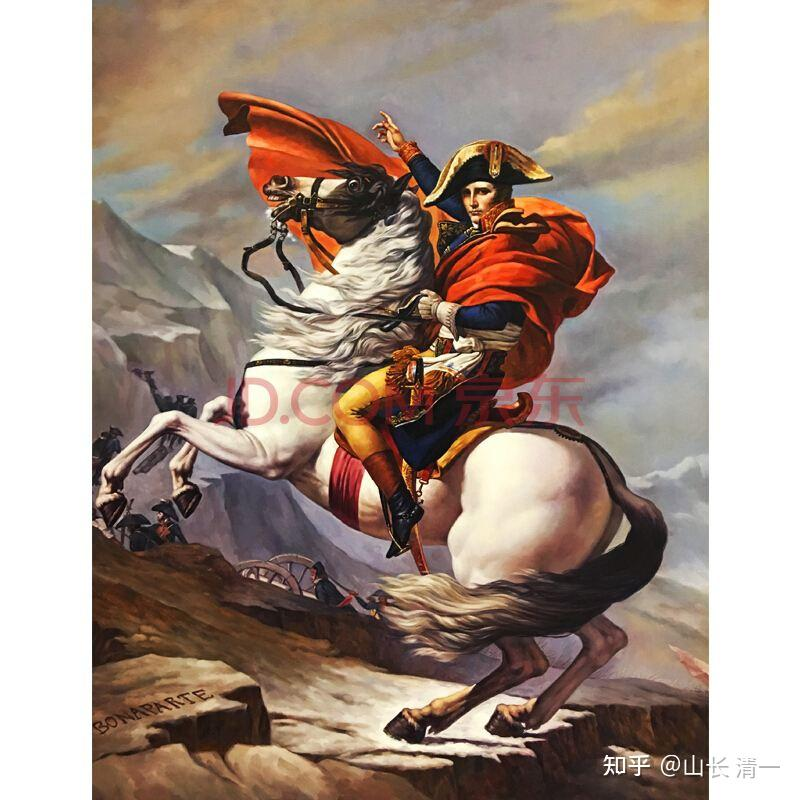
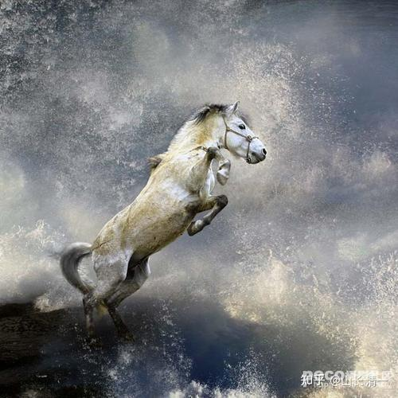

说实话，这种说法，很像“神棍”说的话，忽悠人的。比如什么“闪电五连鞭”这样的传武怪招，已经成了全国的笑话。如果理性地去看，泰拳五百年历史，每天都在实战，积累了多少的实战经验？有啥有效的招数，数百年来泰拳师，居然不去研究？以及在实战中使用出来？对他们来说，赢是很重要的。不会放弃有效的招数不用的。凭啥你一个中国人，就敢说:从古人传武系统中拿一招出来，就赢了五百年的泰拳？如果真有这么简单的事情，为啥这些专业人不去做？

再说一句我真心的实话：我也非常的不理解，为啥就没人来做？明明很多中国武术的招数，真的可破掉泰拳的，练好了就能轻松击败泰拳的。就像是学外语，我也不明白：这种容易的东西，三年就可以学完12年的课程，怎么全世界这么多的专家，就没有人来做。

为啥中国这么多年来，中国上千万的“专业武林人士”，都在不断的神话泰拳？膜拜泰拳？而不是去认真研究泰拳的优劣？研究如何用中国功夫克制泰拳？击败泰拳？你们中华武士们，难道都是吃干饭的吗？中华老祖宗，留下的东西真心够多了。你们捡一点起来，就够用了。只要好好用一招出来，就足够你们“名利双收”了。干嘛一个个还像舔狗一样，到处去舔泰拳的神勇？K1的精彩？跆拳道的威风？自己败了也不找原因，反而喊出了“泰拳五百年不败”这样的口号。国人现在还到处找人学泰拳？中国练散打的一些拳手们，打了败仗，就把来泰国留学“正宗泰拳”作为“强化技术”的选项？以泰拳为荣？这群人，真没出息。丢了老祖宗的宝贝，捧着金饭碗要饭吃。如此儿孙后代，你们对得起列祖列宗吗？

一招胜人，武术上根本就不奇怪的。拳击不就是只有三拳吗？只要你的直拳打得好，足够快，也就够用了。不是每个人非要勾拳，摆拳技术全面的。用直拳KO的人难道少了吗？王八拳，不也是一拳吗？很多人一上阵打架。都一个动作--双方都是王八拳互拼。有啥奇怪的？半步崩拳打天下，你以为是传说，我相信是真事。

我说的不是传说，不是故事：传武实战中一些有效的招式，的确可以做到一招胜过泰拳，这是我们已经实证过了的事实：我们小拳手，此次战胜泰拳，如果懂行的人看了，就知道：我们其实，主要也只练了一招就赢了---中国武术的穿心腿。也就是你们说的“正蹬”，“正踢”。练好这一腿，就足够战胜泰拳了。由于我们这一招，泰拳手的王牌招数---强大的扫腿，就根本出不来了。泰拳进攻技术对我们无效。最终台上就只能被动挨打。

当然，这一腿，我们的小拳手，现在用得还不是太好，还有很大的改进空间。起码连环踢，还没有用出来。正因为这样，中间还有空挡期，所以给了对方出拳，和打内围的机会。如果她们真的用好了“这一脚”，泰拳手面对他们的时候，就只能干瞪眼，根本就出不了手，也近不了身。只要敢上来，就肯定挨踢。我们基本上就毫无风险的赢了泰拳手，不用担心被KO，被打成寿星脸的可能性。其他的泰拳技术，你不会对付，也没关系了。会了，只要勉强能够应付泰拳的内围，也就可以过关了。关键是把自己的核心技术，抓好，用好，就行了。

事实上，我们的小拳手，已经做到了在拳馆的训练对抗中，让泰拳的男拳冠军，都无法顺利施展扫腿的地步，基本上，成功地“废掉了”泰拳的扫腿功夫，也就解除了格斗中对我方最大的威胁。只是我们的攻击力还有限，无法给泰拳手造成快速而有力的杀伤性打击，快速KO对手。但这一天，也快了，一年内孩子们的打击力就出来了。至于拳法，其他的攻击手段， 泰拳手其实不擅长，力量不大，所以不用担心。播求这些善于拳法的拳手，实际上是日本风格的，不是本土泰拳的风格。当然，一些泰拳手，为了提升拳法水平，也会去练拳击的。但拳击对我们的威胁并不大，容易防住。

实际上，研究一下穿心腿，就发现：不管你出任何招数来进攻我，我都可以不理睬你到处用啥招数，不需要见招撤招。我只要死死的盯住你的腹部，一靠近我，一进入攻击距离。我就提膝防卫，接着出腿专踢你的腹部。只要练出又快，又准，又有力量的正踢腿，光这一招，真就够用了。你试着想一下：擂台上比赛，我这样做，你还有啥本事，有啥招数，可以接近我？你只能去研究如何防守，“抄腿”技术了。可惜：这个技术泰拳没有。而且，有了也不好用。你来抄腿，我踢高一点，就把你脑袋当球踢了。而且你敢低头来抱腿，我就用拳，用肘来打你的头部。这样，你的应对方式是风险很大，收益很小。而我们：就算被你抄腿了，被摔一跤，这个风险，在泰拳的擂台上，几乎就是“零风险”。因为----摔倒在地，泰拳是不扣分的，你也不能乘机进攻（虽然我们也不怕地面战）。在散打规则上，摔倒对手还有得分的价值。但在泰拳，踢拳比赛上，根本就不在意摔倒。因为这两个赛事，强调对对手的打击力度来判优劣。凡是无法造成伤害的格斗招式，就是被裁判忽略的，一些典型的摔法还被判为违规（背摔等）。摔倒在水泥地上很倒霉，但摔倒在擂台上，没人会摔晕掉吧？但会被在擂台上被打晕。这就是规则不同，导致的技术路径选择不一样。中国传武中，是没有扫腿这一招的，鞭腿，是散打模仿泰拳，踢拳创立的“新功夫”。为啥？因为在真实的格斗中，鞭腿是一个赔本的买卖。只有在擂台上对攻，才有一些价值。而泰拳，把扫腿的价值，发挥到了极致（这个道理，很多人不知道，具体以后再说了）

我们小拳手的实战视频中，你已经看到了：泰拳选手，从来没有抄腿成功，甚至没有出现抄腿的动作。我们的拳手，更没有被泰拳选手摔倒过一次。因为这种中低腿法，不能用手接，只能用脚来接防，这是格斗的常识。泰拳选手唯一想出来的应对方式，就是冲上去，抱住我们拳手，用内围战来解决问题。虽然我们不怕内围（**因为太极拳，就是内围战的祖宗**）。但如果硬性要求“一招制胜”，要求只能用踢腿一招来赢，我们就只需不断踢出正蹬，连环的正踢腿，就真的足够战胜泰拳手了。要不信，下次上擂台的时候，我要孩子们，这一局，就限定只用一招正踢的方式，其他格斗技术都不用。你看她们够对付泰拳手不？绝对是够的，就是场面太单调，不太好看！但要赢下比赛，是足够的了。

就这一招，简单吗？简单！不就是正前方踢出去一脚吗？好像谁都会呀？

难吗？也真难。别说一般人，就是不会踢这一腿。张伟丽，乔安娜，都不会有效地踢这一脚。这说明了看起来简简单单的这一招，用出来的难度，超过了你们的想象。

如果真的很简单，泰拳也早就有人练出这个技术，也会有人把这个技术当做主要格斗技术来使用。只是泰国拳手，外家拳的拳手，他们来练这个技术，有天然的障碍：他们的武术格斗系统是不支持，不兼容的。如果以泰拳的基本发力技术，来踢出正蹬腿，首先是速度慢（比扫腿慢），第二就是发不出力量， 只有大腿屈伸的力量，可以把人“推开”，但完全不足以给对手造成实质性的打击。只能用正蹬暂时阻止对方的攻击。还容易造成自己身体失衡，换劲缓慢，还会被抓腿反击击倒等等。所以，泰拳手，基本上放弃了这个技术的。只是偶尔作为一个辅助的招数练练玩，不是他们的主攻手段。也正因为如此，大多数泰拳手，也不太会防守这个技术。他们的传统的三宫步，甚至把自己的中线腹部要害，都直接地暴露出来，就是一副【谅你也打不了我，打到了也不在意】的姿势。我注意到佳惠打的这一局比赛。泰国的女拳手格斗姿势已经变掉了，因为被正蹬打怕了，所以一直用侧身的姿势来躲攻击，不敢暴露正面。虽然这样可以避免腹部被直接攻击，但糟糕的是：泰拳手平时学的泰式武功，全都是在三宫步的状态下练习的。她这样学我们“侧面站立”，就导致她连出招都不会了。就像没学拳的人一样: 武功全废了。所以，场面上就自然只能被动挨打了。

我们用这个传武的技术招数---穿心脚，就是抓住了泰拳手的“死穴”。一招鲜，吃遍天。因为中国传武内家拳，踢出正蹬腿的发力方式，与泰拳，外家拳都不同。我们这样打，是可以打出力量的， 也可以速度很快，至少比扫腿快得多。我们可以在看到你出扫腿之后，再出正蹬。我虽然后发，一定会先至！你们在明晓的实战比赛中，已经看到几次明晓用正蹬，破掉对手的扫腿。而且是打了一个迎击，给对方造成了一定的伤害。让对方出扫腿有顾忌，所以攻击就少了很多。

说这一招难，难在何处？这招，打出来倒是不难：但要学会什么时候打？掌握这个出腿的时机，难度就高得多了。特别是要打出力度来，打到对方畏惧你这一腿的威胁，想尽量的躲开你的一腿，就更难了。很多人会打这一腿，但出不了力，有形无力。这个技术就没用了。要能踢中对方，需要长期的对抗训练才能实现。而且：还必须有良好的补位手段：如果踢空了咋办?所以必须有“连环踢”的本事，可以不断的踢下去：一招，两招，三招。还有，要能有效的击中对方，还必须学会移动中进攻---进步踢。必须在进步的同时，踢出来，换步踢拳。这样一要求，你发现：你不会正蹬了。因为移动中进攻出拳，出腿，是大多数泰拳手都不会的技术。其实外家拳都不会这个技术。因为外家拳，都是玩阵地战的。他们需要在两腿支撑的条件下发力。移动就是两脚一实一虚，他们此时无法发力。而太极，玩的是如水---游击战。强调在移动中发力进攻，单重发力。这样来看，学这一招？也不容易吧？你试试看如何在单足站立的情况下，发出有力量的打击，你就知道难度了。等你学会了“这一招”，太极拳就算入门了，懂得“分阴阳”了。就算太极的格斗技术“得其一二”了。当然，这水平，就可以胜泰拳了。

我猜你肯定知道：中国武术队员，特别是是套路选手，基本上都可以踢出漂亮的正蹬腿。他们只是面对泰拳手，面对实战，他们这一脚，就踢不出来罢了。主要就是有形，无力。我们的孩子，打泰拳，也没用啥神功，怪招的。就是把这个中华武术中，很普通的穿心腿，正蹬，练到了实用的地步，可以在赛场上，与泰拳冠军对抗，这就算及格了。

中华武术宝库中，能够用一招，就击败泰拳的技术还有很多，不止这一招。我就拿几样来说一说：

一：八极拳的马步顶肘。这一招极其凶猛。一旦你练到能够像正蹬一样用出来，泰拳的所有进攻招式，就完全施展不出来了， 只有等着挨打的份。以下转的八极拳顶肘视频，夸张了一点，不少是武术电影的镜头。实战没这么好看的。但：这一招，要用来对付泰拳，真的很实用。如果我要被迫跟泰拳手打一场生死战，我不会用上述的正蹬腿了。我必然会选择的格斗招式，就是用这个----顶心肘来打泰拳，还有连环肘。【太极也有肘法的，发力原理，跟八极的差不多，要配合身法步法更多，更复杂。一般人更学不会了】。但外人，一般都没见过太极的肘法，我就不多说了。有时对练中，我开玩笑，用肘法（太极滚肘）来攻击小拳手们，很快对手就都只有一个动作——--紧紧的抱着头，蹲下去不动了。因为实在没法防，到处都是肘。这里，我只用八极的顶肘视频来做示范，因为网上实在找不到太极的滚肘示范。似乎很多人不知道太极肘法的。

你说：为啥我的小拳手，不学这招肘法去对付泰拳？说实话，不是不能，是不想。我们在泰国，是想用打泰拳来交泰国朋友的。可不想用打拳来树敌一大片。由于这个技术太过凶猛了，一用就伤人，结果不太好。我虽然也会教孩子们。但却不让她们上拳台上去用。除非被别人打急了，别人要KO你了，你为了护身，才能使出来。这个肘法，一旦真在赛场上打出来，恐怕泰拳手多少根肋骨，都要被打断的。泰拳手一旦发现你会这样用肘法攻击，斗志全无，一般就只会躲着你了，不敢跟你打的。就像我们的第二场比赛一样：被正踢踢到没办法的泰拳对手，拳台上到处躲，根本就不敢跟你拼扫腿，硬刚了。因为刚不过，只能认输。据说，八极拳的老拳师，练这个顶肘的招式，是每天几公里，都一步一步的顶肘，顶完一路几公里。你要有这个勤奋劲，也才能练出随心所欲，防不胜防的八极顶肘吧。所谓的硬派功夫，都是这样练出来，才不是现在的套路运动员，花拳绣腿的。光顾好看了。

[古武八极拳，顶心肘，铁山靠，文有太极安天下，武有八极定乾坤！_哔哩哔哩_bilibili](http://link.zhihu.com/?target=https%3A//www.bilibili.com/video/BV1f64y1T7xL/%3Fspm_id_from%3Dtrigger_reload)

第二个：我认为还有些一招就能完全克制泰拳手的拳种，是形意拳。由于形意拳走的路线，是“强攻中门”。而中门，正好是泰拳防守最弱的地方。因此：形意门的很多招式，都可以用来打到泰拳没脾气。要说泰拳的天然对手是谁：我认为就是形意门了。按道理，形意门也有很多高手的。传说，历史上，形意拳也是镖行的主力。太极拳只是“传说中能打”，但百年来，就没有人见过能打的太极拳手。但形意，大家还是公认能打的。冬瓜骂太极派，骂得难听死了，直言所有练太极的人，全都是骗子。可是太极门居然一个人也没出来找他算账的，可见他骂的有道理，这一派，真没啥人了。但冬瓜就不骂形意拳。为啥：都知道形意有人能打。过去北京最能打的拳，就是“意拳”，来源也是形意。为啥偌大的中国，现在都没有形意派的人，来把泰拳给收拾了？如果形意借泰拳这个已经是世界有名的拳种，打赢了泰拳，“一举扬名天下知”。从此形意走向世界，不就名利双收吗？何至于现在这么“式微”的样子。

要我选一招，练了之后就能对付泰拳的形意拳吗?我会选【熊形】，或者是【鹰熊合形】。视频中的这老拳师，能不能真打，我不知道。我只知道：这一招很实用，应该是能打的。真练好了，就可以让泰拳手连滚带爬，一点胜率也没有，泰拳的标志性招式都出不来的。当然，前提是“练好了”。要我来教的话，大约也需要三年左右来泡这一招，大约就可以真的用了。光比个动作，打得再好看，也没用的。套路运动员，可以演电影，但上不了擂台。我虽然懂得怎样用这一招，但我是太极门的，就不去抢这个形意的风头了。我练出来也不好看，不正宗。你们有谁，想捍卫形意们荣誉的武林豪杰，不妨一试。

形意很多功夫，招式，都是可以实用的。甚至一招劈拳打好了， 也够破泰拳的了。不是说“半步崩拳打天下”吗？真有用的。练出半步崩拳，绝对可以击败泰拳。练习的时间，一样给我也是三年就够了。给你多少年才够？我就不知道了，反正百年来，形意也没有人来打现代格斗，为传武正名的。我就不知道形意门，现在还有啥能打，懂打的豪杰？可以来专门打外国人，为中华武术争光的？除了传说中的李存义这些人之外？

[形意拳十二形——熊形（鹰熊斗志）](http://link.zhihu.com/?target=https%3A//haokan.baidu.com/v%3Fpd%3Dwisenatural%26vid%3D17675997675301845673)

第三个：我认为可以实用到击败泰拳的拳种，招式，是【劈挂拳】。练好了，泰拳手一出腿，你一劈下去，他就只能倒下了。你只管练出来连环打击的力量就够了。（速度上，我看很多人练的都不错，挺快的。就是力量没有练出来，还有拳感，实战的距离感，对抗的意识没出来，这需要练的）。泰拳手其实非常不适应快节奏的攻击。只是：你的攻击，光快没有用，得有杀伤力才行。

第四个：绵张短打拳。这个的实用价值，就不用多提了吧？戚继光的书里，都写过的。中国古代真正能打的少数几个拳之一。似乎中国现在知道的人不多。

第五个：梅花螳螂拳。这家拳派的功夫其实不错的。注重实战。你真能用出来了，遇到泰拳这样，身法不灵便的对手，也只能连滚带爬了。

其他还有很多流派，光用这些门派的核心招牌技术，都能打泰拳了。但一点是不可避免的：要真练出来，而不是比个架式。至少每个门派的招牌技术，就是这个门派的“看家功夫”，比如太极的“金刚三大对”，形意的五行拳等等。你都必须至少针对性的练两三年，才能入门。如果你们只是练套路，练一辈子拳也没用的。只能拿来做表演。

如果各派传武大师们，真懂功夫的人，想通过“打泰”来扬名天下，我们愿意提供帮助。我们愿意帮你彻底弄清泰拳的优劣特点，训练模式，让你做到心中有数。还可以找到优秀的泰拳手，帮你们来练实战对抗，检验好自己的技术后，再上台实战。大家都是中华武林人，真心传承中华武术，我会支持你们的。至于一般的嘴炮，就滚远点。

** 第二部分：我们的太极拳手，只会一招穿心腿克制泰拳吗？**当然还有其他招数了，我们慢慢练出来。今天， 我教孩子们的，就是要用太极的拳招，来赢泰拳。也是【一招制天下】的招数：太极野马分鬃！希望下一次实战格斗中，就用出来。

我百度了一下：发现大师们“传授”的野马分鬃的练法，用法，就是一本正经的胡说八道。都是一群假大师。完全没明白【野马分鬃】的打法含义，一群骗子。你们自行百度看吧，看了真生气！

比如这个大师的是这样描述了：对方以拳掌进击或拿抓我左掌，我即以转体趁势引进，化其来势，并以右掌从左臂下突然进击，攻入对方腋下，同时上右步，以掤靠之劲使对方跌倒。【崔毅士】

杨振铎：这位杨无敌的后人，看他传授的野马分鬃的实战用法，我笑死了。祖宗的东西明显已经丢了。怪不得江湖上叫他“杨白菜”，真心不会打，只会表演套路。他说出来的东西，特别的外行。写出来的东西，实战中根本就用不上，只能用于慢动作的表演。看得出：他完全就没有真正的实战格斗经验，说话一点“格斗感”都没有。可他这派的“正宗传人”，徒子徒孙特别的众多，不知有谁真的上过擂台了?用这招击败了对手的？

** 杨：【设对方以右弓步用右拳向我右侧背后击来，我速向右后转身，用右手粘住对方腕，如果对方用劲，我即势用左手握住对方右手腕，同时上右脚成[弓步](http://link.zhihu.com/?target=https%3A//baike.baidu.com/item/%25E5%25BC%2593%25E6%25AD%25A5)，以右小臂向对方右腋下用[掤劲](http://link.zhihu.com/?target=https%3A//baike.baidu.com/item/%25E6%258E%25A4%25E5%258A%25B2/1608309)击去，其中内含撅意。**

** 设对方仍以以上同样位置，采用同样的方法，我可用右手握其手腕，上左腿，以左小臂向对方右腋下用掤劲击之。如对方以左拳向我击来，我可按以上动作对称应用。】**

打过实战的人就知道：上面这种“描述”，根本就无法使用，只能平时用在徒弟身上演练了。因为真正的实战中，出手是很快的。你的大脑，根本就反应不过来。不可能“见招撤招”的。特别是【用左手握住对方的腕】。别说擂台上你带了拳套。实战中徒手比武，我看你们谁能“握住对方的手”？在慢慢的上步，近身，把对手弄翻掉？只能让徒弟不能动，被你慢慢的击倒。

这一招，重点词汇，1是【野马】，2是【分鬃】。取其意，这一招，明显就是让你像“野马一样的狂暴和力量感十足，让对手无可抵抗】的打出去的招数。【分鬃】，古书上写【奋鬃】。是指马在扬蹄的时候，鬃毛奋张的样子。一看这招式的名目，就是“激动人心”的场面。这一招，你一出手，就要像野马奋蹄一样，用前足（前手）高高的举起，用身子带动力量，沉重地砸向敌人。你试想一下：你们面对一匹这样的“野马”，谁敢去挡在它面前不动？谁挡，谁倒霉。

*拿破仑油画：马的“奋鬃”样子*

*太极的象形取意，野马分鬃要打出这样的势才对*

实战是这样的用的吗？也真的是。太极的象形取意，不是指动作，而是指意思：野马分鬃要打出上面图片中的野马奔腾的架势，这样才对。马的两个前腿，就是人的一个前手，和一个前脚（注意，不是两个手）。要随时准备从上到下的扑击，踩踏对手。这一招的重点，是“身子运化”。要把身子脊椎运动的纵向力量，用前手，前足一起带动打出击。手以弧线，往前，从左往右的打上前去（右手在前者）。目标是对手，无论是手，臂，头，胸等，都不管不顾，像是马踩人一样，不管三七二十一，给我统统的“践踏出去”，打到哪儿就算哪儿。这才是本招的真意，真势。

我用这一招来打人，小拳手们一接手，都是连退几步。而且出手很吓人，势头很凶猛。这才是真正的太极野马分鬃----别以为太极就只会温柔。这一招，练的时候，轻轻柔柔的，像是慢动作。一打起来，整个身体扑上来，像是惊马奔腾，也像是老虎扑击。这才是真正的太极拳【野马分鬃】。小拳手挨打后，反应过来了：老师，好像这一招有两个发劲，一个刚接手，就把她们的攻击或者防守圈的劲给化掉了。一个是接下来，把她身体打出去退后数步的力量。我说：不止两个劲，中间还有无数的变劲。卡住哪儿算哪儿，卡住就发劲。还有脚上跟随一起，也是变化无方的。一有机会，就用力踏向对手的胸腹。手脚一起到（手脚齐到方为真）。

如果用这一招对付泰拳手，也不管对方出啥招，出拳也好，出腿也好，扫踢也好，直拳也好。只要对方一动手开始攻击，我方就快速的腾起，前脚提膝，前手画弧，向前直扑出去。如果对手聪明一点，会赶快退步，我方继续换步，继续身子腾起来，龙马腾跃，进行身拳一体，向前扑打，踩踏式攻击。这样不断循环下去，直到对手被击垮为止（记得太极拳论中说的---太极者，如长江大河，源源不绝）。如果对方此时是攻击状态，比如出扫腿攻击我方，场面就更倒霉了。面对迎面而上的，从上而下的迎击之下，对方肯定是一招就仰面倒下，毫无招架的机会。这就是古拳经说的“不招不架，只是一下”，只需一出手，就够打翻你了。如果【犯了招架，就是十下】呢？就是如果你退步，接住了我的攻击，我没踏上你，你溜走了，我就追击前进，马上给你来十下连续攻击，把对手打垮为止。这才是真太极格斗！真正的【野马分鬃】。

你们见了我说的分析，就让这些百度上的【名门正派，各种太极大师】见鬼去吧，忽悠信徒多少年了。该让真太极出山了。希望大家真的练出符合古人要求的“野马劲”来，而不是一个个的“洋白菜”，只会顶着老祖宗【杨无敌】的名字忽悠人。太对不起祖宗了。还不如李存义的后人，现在老老实实的种地，承认自己不会拳。起码不卖祖宗的名誉来换钱。

小拳手们，也正在练这一招。希望将来在泰拳的赛场上用出来。好看不好看不说。能用就好了。拳是用来打的。不是用来看的。也不是用来比美的。【说明 我是昨天早上教她们这一招的，让她们晚上去拳馆，跟泰拳手们对练的时候用一下，看能否用出来。结果今天我遇到两小拳手，高高兴兴地说：我昨天教的野马分鬃，真的太好用了。对练中，一出手，就把比自己体重大不少的泰国男拳手打倒在地下了。这两孩子，看样子太极的基础不错，练一天新招就能用了】。

借用泰拳教练批评我们小拳手的话：他看拳场上，我们小拳手的出拳进退方式，非常“不泰国”。实在看不下去，就批评：你们是来练泰拳的，不是来练兔子拳的。小拳手笑嘻嘻的回答：兔子拳也好呀？能赢就行了吗？弄得一直想把小拳手们“学习正宗泰拳”的老教练直摇头，对此哭笑不得。

孩子们现在，已经拒绝了泰拳靶师们每天必练的“喂招打靶”了，这是泰拳训练中最重要的项目。我们宁愿自己去打沙袋玩都更好。因为要去跟靶师的节奏，动作，都必须用泰拳风格来打，实在破坏我们内在的和谐。靶师的训练过程，对我们来说，最大的价值，就是：站在擂台上，千万别像靶师一样站着挨打。没有护具，你会被泰拳手打的很惨的。势大力猛，看起来很吓人。我看很多中国武术人士，看了泰拳的靶师训练，往往吓坏了。觉得这泰拳太能打了，自愧不如。其实：你别去站在靶师的位置上，另外不断移动不给对手舒服打的机会，不就好了？泰拳手此时，根本就不知道怎样发力了。只有等你打他了。避其精锐，都不知道。怎么去打泰拳？

孩子们对于靶师的对抗方式，就是看泰拳的冠军们打靶师，然后自己去想自己在场上对手的位置上，如何去对应泰拳手的攻击，让对手无法发挥自己的打击力量，打不出来效果（模拟）。这种场面看多了，泰国人上擂台，会怎么打拳，小拳手闭眼都知道了。泰拳手的节奏，我们了然于心。而我们的动作，优劣，泰拳手就完全蒙的，谁赢谁输，不是必然的结果吗？

转一个泰拳靶师的训练视频，看是否能吓坏你们？

[泰国第一靶师GAE与泰拳王苏波邦最新训练视频（二）](http://link.zhihu.com/?target=https%3A//haokan.baidu.com/v%3Fpd%3Dwisenatural%26vid%3D1069748821681629420)