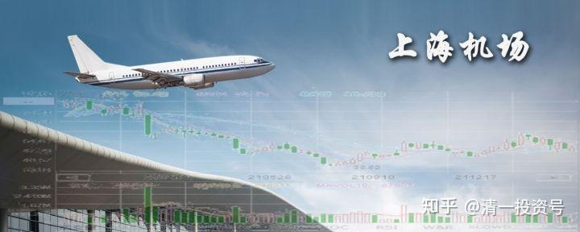

27篇.我不买上海机场的理由（二）

清一山长 2021年2月～5月

**四、上机VS其他公司**

[清一山长](http://link.zhihu.com/?target=https%3A//xueqiu.com/9310099567) 2021-02-01 16:45

[$上海机场(SH600009)$](http://link.zhihu.com/?target=http%3A//xueqiu.com/S/SH600009) 还真不明白80元买上机的理由何在？基金重仓股，股价也有维持不住的时候。今年给这么长的时间高价卖出，已经是很够意思了。小散就是不卖，非要买。明明地板上有很多廉价的好股就是不要，最终不就是找抽的吗？

**我想：80元的上海机场，再好也比不过6-7元的华侨城A吧？后者十年的roe平均值是20%，还不够高吗？干嘛非扎堆买机场？**

看到昨天的成交30多亿，今天才几个亿，明天再来一个跌停毫无意外。

最惨的，是靠机场吃饭，全部身家都压到机场、高端酒店投资上的人，甚至高杠杆压上去赌命的人，贪婪的代价，应该就是今年的狂亏，把一生赚到的钱都亏光吧？大概率这一生是翻不过来的了。

清迈有很多酒店低价拍卖，曼谷一些原来房价一万、两万的高级酒店，现价700-800泰铢。原来玩文旅项目大赚其钱的人，今年会有很多人破产的。世事无常。我们能做的，就是尽量让自己不会因为经济的无法预测而赔掉全部身家！再也起不来。

**所以：别赌！千万不要有赌性！**

[舒缓](http://link.zhihu.com/?target=http%3A//xueqiu.com/n/%25E8%2588%2592%25E7%25BC%2593)回复[清一山长](http://link.zhihu.com/?target=http%3A//xueqiu.com/n/%25E6%25B8%2585%25E4%25B8%2580%25E5%25B1%25B1%25E9%2595%25BF)：

我记忆中山长在股价二十多时关注过上海机场，我还买了一点点，了解不多小利走了。疫情航空股不好，我就说嘛，机场能不受影响？股价在低位，这种中短期可以忽略，准备长期持有，在这么高的位置，还买入，我是理解不了。

**[清一山长](http://link.zhihu.com/?target=https%3A//xueqiu.com/9310099567)** 2021-02-01 18:36 回复[舒缓](http://link.zhihu.com/?target=http%3A//xueqiu.com/n/%25E8%2588%2592%25E7%25BC%2593)：

20年前，我就看好上海机场。我父亲当年退休了，想找点事情做，我就说：买了上海机场，吃股息，啥事不干就行。每年定投吃股息。还拿了一万元做开户资金，让老父亲自己去管理账户。当时的复权价，才3元左右。不过，老父亲觉得炒股不是好事，如果他真坚持下来，这20多年赚到的钱，要比他一辈子工作赚到的钱多得多！

[神山宁水佑投资](http://link.zhihu.com/?target=http%3A//xueqiu.com/n/%25E7%25A5%259E%25E5%25B1%25B1%25E5%25AE%2581%25E6%25B0%25B4%25E4%25BD%2591%25E6%258A%2595%25E8%25B5%2584)回复[清一山长](http://link.zhihu.com/?target=http%3A//xueqiu.com/n/%25E6%25B8%2585%25E4%25B8%2580%25E5%25B1%25B1%25E9%2595%25BF)：

再怎么样，买上机赚钱的人也比买华侨城赚钱的人多。

[清一山长](http://link.zhihu.com/?target=https%3A//xueqiu.com/9310099567) 2021-02-01 18:38 回复[神山宁水佑投资](http://link.zhihu.com/?target=http%3A//xueqiu.com/n/%25E7%25A5%259E%25E5%25B1%25B1%25E5%25AE%2581%25E6%25B0%25B4%25E4%25BD%2591%25E6%258A%2595%25E8%25B5%2584)：

再怎么样，70元以上买上机的人，肯定比6-7元买华侨城的人赔得多的多！买了华侨城、中国建筑，最惨无非是不赚钱。但这个价格买机场？恐怕不是赚钱的问题，也不是不赚钱这么简单的！[大笑]

[TradingPlan](http://link.zhihu.com/?target=http%3A//xueqiu.com/n/TradingPlan)回复[清一山长](http://link.zhihu.com/?target=http%3A//xueqiu.com/n/%25E6%25B8%2585%25E4%25B8%2580%25E5%25B1%25B1%25E9%2595%25BF):

山长评价一下 [$中国中免(SH601888)$](http://link.zhihu.com/?target=http%3A//xueqiu.com/S/SH601888) 吧

[清一山长](http://link.zhihu.com/?target=https%3A//xueqiu.com/9310099567) 2021-02-01 18:44 回复[TradingPlan](http://link.zhihu.com/?target=http%3A//xueqiu.com/n/TradingPlan)：

中国中免和中国中车，谁更有技术含量？谁更有市场前景？原来的中车，炒到40元还真心不高。

免税？啥玩意！现在多少东西要免税？指望国家让利给你捧红一家比中国中车贵十倍的企业？您认为可能吗？免税，就能代表“厉害了，我的国”吗？[得意]

[佛性苦行僧](http://link.zhihu.com/?target=http%3A//xueqiu.com/n/%25E4%25BD%259B%25E6%2580%25A7%25E8%258B%25A6%25E8%25A1%258C%25E5%2583%25A7)回复[清一山长](http://link.zhihu.com/?target=http%3A//xueqiu.com/n/%25E6%25B8%2585%25E4%25B8%2580%25E5%25B1%25B1%25E9%2595%25BF)：

很认同你很多看法，上海机场可能不够便宜，但是中国中车价格也绝对不低估，要说中国中车是核心资产，有技术吧我认，确实是国家技术龙头，但是要说它能像上海机场那样涨个10年，在此打一个很大问号，从中国中车财务报表和管理费用各项费用包括核心指标ROE来看，这是一家讲情怀的公司，它的存在并不是回报股东，当然中国中车它也不是市场经济，以前南北双车拼杀了很多年，是国家意志大于个人的公司，而我为啥不看好它，是因为我以前接触过中国中车中最好的资产南车时代，谈公司治理体系管理上，这并不是一家企业文化比较现代化的优秀公司，更多是国企行政官腔式管理，当然也没看到股权激励机制，公司死气沉沉，就拿中国建筑来说，它是一家市场化的央企，管理层够好，公司有股权激励，财务指标和ROE，包括各项管理费用都不错，如果确实讲爱国情怀啊，中国建筑确实比不过中国中车，对此我很想反问您，中国中车除了爱国情怀，核心资产外，还有什么值得坚持？

[清一山长](http://link.zhihu.com/?target=https%3A//xueqiu.com/9310099567) 2021-02-02 11:32 回复[佛性苦行僧](http://link.zhihu.com/?target=http%3A//xueqiu.com/n/%25E4%25BD%259B%25E6%2580%25A7%25E8%258B%25A6%25E8%25A1%258C%25E5%2583%25A7)：

我其实买的中建比中车要多得多。中车买的还是港股，才2元多人民币，最近才买入的。您认为：2元多的中车，难道就没有值得与5元的中建一样坚持的地方吗？[微笑]。14年我还买了5元的北车呢。后来赚了不少跑掉了。中车是当时的上机？

[清一山长](http://link.zhihu.com/?target=https%3A//xueqiu.com/9310099567) 2021-02-02 15:52

[$中国中免(SH601888)$](http://link.zhihu.com/?target=http%3A//xueqiu.com/S/SH601888)

挺神经的。让我来评估的话，上海机场怎样都应该比这家商场有价值。市值居然差5倍，上机还跌停[捂脸]。当然，现价我上机肯定不买的，再跌再说。现价买中国建筑要靠谱得多。一家世界第一的世界级建筑公司，居然不如一家在机场开店的销售公司，真是天大的笑话！这市值，恐怕比它卖的货色的公司都贵吧？一家卖面包的公司，比做面包的公司更值钱？[疑问]

一个免税店，等于6-7个中国中车的市值。哪里讲理去！我要有持股，马上就卖掉。涨到500也不后悔。**但我也不敢做空中免**，说不定真的会涨到2000元去，做“中茅”了。

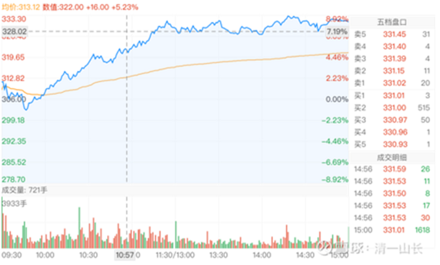

[*不媛](http://link.zhihu.com/?target=http%3A//xueqiu.com/n/%25E6%259E%2597%25E4%25B8%258D%25E5%25AA%259B)回复[清一山长](http://link.zhihu.com/?target=http%3A//xueqiu.com/n/%25E6%25B8%2585%25E4%25B8%2580%25E5%25B1%25B1%25E9%2595%25BF):

山长为什么做空上机？

[清一山长](http://link.zhihu.com/?target=https%3A//xueqiu.com/9310099567) 2021-05-10 16:54 回复[*不媛](http://link.zhihu.com/?target=http%3A//xueqiu.com/n/%25E6%259E%2597%25E4%25B8%258D%25E5%25AA%259B)：

谁说我做空上海机场了？你才做空上机呢！你们全家都做空上机[大笑]。

我只是表达观察和思考罢了！

**我不做空，也不唱空。更不唱多**。我管不了市场先生的定价。**涨了不关我事，再跌，我也不买上机的**。我就买中国建筑，就买燕京啤酒。上机就算跌到10元我也不买，恐怕会把中国建筑带崩，要跌到2元了。燕京啤酒难说要跌到4元。我还是买中国建筑、燕京啤酒。我才不要上机呢！[得意]

**五、上机的技术分析**

[清一山长](http://link.zhihu.com/?target=https%3A//xueqiu.com/9310099567) 2021-02-02 13:22

[$上海机场(SH600009)$](http://link.zhihu.com/?target=http%3A//xueqiu.com/S/SH600009) 今天压盘的跌停单，比昨天更多，达80多万手。抱团股，跌起来就这样，出都出不去。看你们小散还敢进去。赚就赚几个点。十几个点，一跌就几十个点。关键是走不掉！连散户都走不掉。昨天我的发言，就预测要继续跌。但你知道了都没用的，因为今天你依然走不掉。等你终于走掉的时候，可能又要回头了。[捂脸]

所以，记住老话：**人多的地方不要去！提防踩踏事故！**

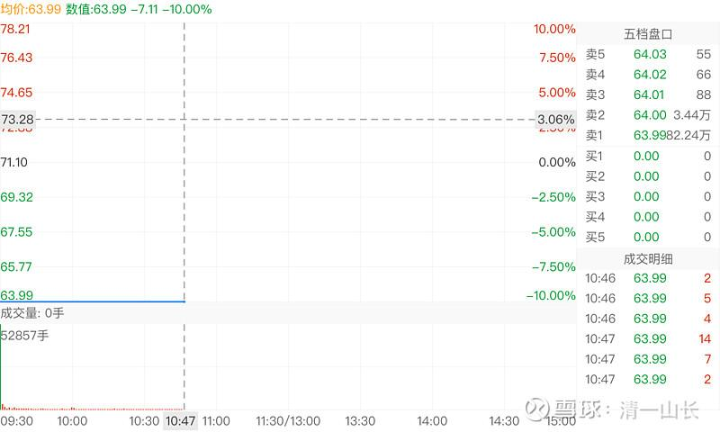

[清一山长](http://link.zhihu.com/?target=https%3A//xueqiu.com/9310099567) 2021-02-02 13:48

[$上海机场(SH600009)$](http://link.zhihu.com/?target=http%3A//xueqiu.com/S/SH600009) 看图说话。仔细看了上机的图，每次到了80元附近就往下掉，今年已经玩了五次了。说明主力资金拉上80元就开卖，并没有真想拉上去的意图。但也不想低价卖，就每次跌到60多又护盘进入。所以个人以为：主力资金去年应该基本上走掉了。最新一次破80，周成交100多亿。然后是现在的无量下跌。

其实**无量下跌是很恐怖的——说明没有买盘**。那么，原来70-80元的买盘，每天都有几十亿。为何一夜之间消失了？看起来买气汹涌的股，怎么会一夜之间买家就消失了？大家可以多想想，是不是市场突然明白了：上机的确是好股，但真不值这么多钱。或者更加糟糕的是：**原来的买盘可能就是假的，是为了吸引你跟风进来的。**这样就麻烦了。

明天再跌一次，就达到疫情底了，会在疫情底止住吗？按道理（技术上看），上机应该在50元左右就止住下跌的。至少会有一个反弹，如果停不下来，就麻烦了。

如果中免的利润想象空间被终止了，上机就等于像是一个高速公路差不多的股，估值会跟高速股看齐吗？我们继续看吧。

说明：**我观察上机的表演，不是为了买入**（当然，真跌惨了，跌出安全边际了，也是可以考虑的），**主要是观察这种热门股的走势，熟悉中国的金融市场状况**。上机比中国建筑的市值要低，长期成交远远高于中国建筑，肯定有一个指标是不正常的。多观察，以后就更加心中有数，见怪不怪了。

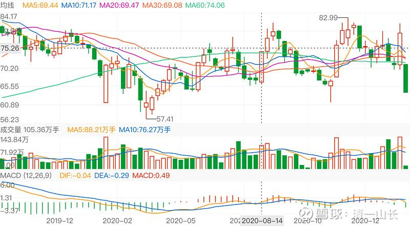

[清一山长](http://link.zhihu.com/?target=https%3A//xueqiu.com/9310099567) 2021-02-03 13:18

[$上海机场(SH600009)$](http://link.zhihu.com/?target=http%3A//xueqiu.com/S/SH600009) 今天居然就开板了。说明——预后很不良。也说明：有急于自救的资金。不过，今天一上午就砸进来快一百亿元，也只走出这个图形，走得实在太难看，所以，未来还很不妙。看样子，跌破50元也没有什么奇怪的。

不过，**上海机场，毕竟是一块优质资产，拿着会输时间、输机会，但不输钱**。不用太害怕。**虽然这样说，我现在是不会买上机的，只会通过看热闹来增长见识，学教训**。要出钱的话，我宁肯买不到5元的中国建筑。**上机涨到一百二十元，与中建涨到10元，谁更容易呢？**

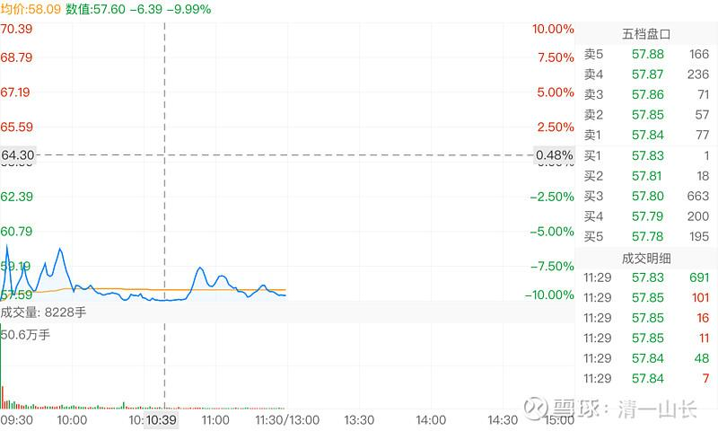

[清一山长](http://link.zhihu.com/?target=https%3A//xueqiu.com/9310099567) 2021-02-03 15:21

[$上海机场(SH600009)$](http://link.zhihu.com/?target=http%3A//xueqiu.com/S/SH600009)

从年线上，很明显看出19年上机大涨，但成交并没放大。去年不涨不跌，只是震荡盘面。但成交快速放大，成交量三倍多市值。所以，该走的已经走了。现在的大跌，套住的是谁呢？是吃饱了还不肯走的人吗？还是饿极了冲进来的人？

**[清一山长](http://link.zhihu.com/?target=https%3A//xueqiu.com/9310099567)** [2021-06-28 18:40](http://link.zhihu.com/?target=https%3A//xueqiu.com/9310099567/187656097%2522%2520%255Ct%2520%2522_blank)

[$上海机场(SH600009)$](http://link.zhihu.com/?target=http%3A//xueqiu.com/S/SH600009)

**一个比中国建筑的市值还要少一多半的股票，昨天成交40多亿。换手超过8%。**今天继续下跌，我认为这次上涨，耗尽了上机的多方力量，未来走势很不乐观。感觉是骗线的样子。今天成交17亿，依然是一些不死心的多方在接盘吧？何必和一个机场过不去。老老实实的做生意，不比玩啥概念更好吗？**概念（免税），能带来多少额外收入？这些收入都是不确定的，一个政策变化就没了**。

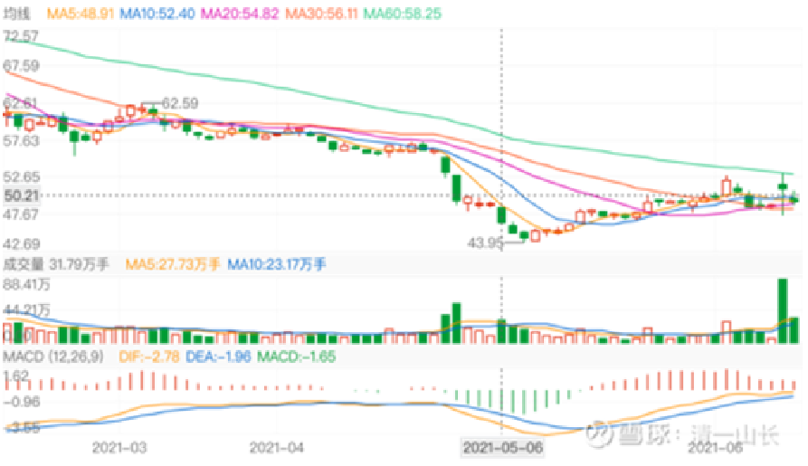

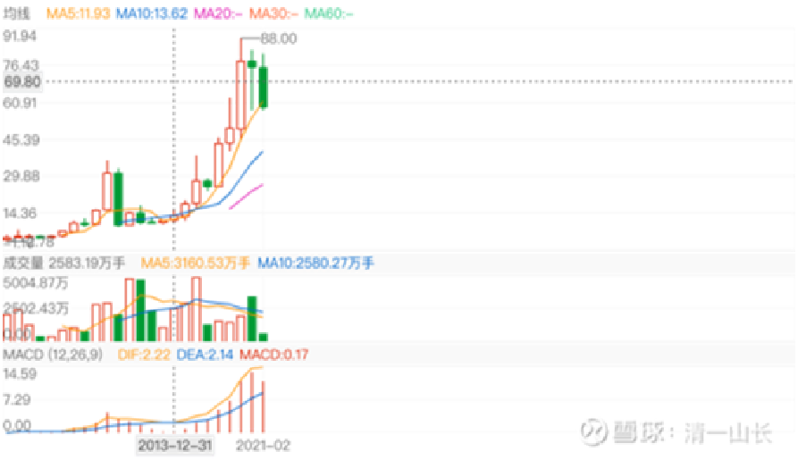

[清一山长](http://link.zhihu.com/?target=https%3A//xueqiu.com/9310099567) [2021-06-29 15:34](http://link.zhihu.com/?target=https%3A//xueqiu.com/9310099567/187567087)

[$上海机场(SH600009)$](http://link.zhihu.com/?target=http%3A//xueqiu.com/S/SH600009)

昨天跌3个多点，成交17亿。今天又跌3个多点，成交12.5亿，同样跌幅，接盘却越来越弱。说明卖盘强势。三天前的大涨4个多点，成交的40多亿，的确是骗线的。

我看深圳机场的ROE，也才5个点。上海倒是超过15个点（2019年）。但如果只是一个机场，卖价3个多PB，这有点贵了，除非算上中免的利润收益。否则，只算机场资本的话，就算是1PB，也很贵的。所以，机场似乎不是啥好的投资项目。不如投水电股更靠谱。傻瓜都能管的企业，时间帮你赚钱。华为这样的公司，缺点就是必须不断吸引聪明人，做聪明事，万一犯傻，就挂掉了。**机场和水电，高速公路等，就不用担心这个问题。傻瓜当总经理都一样做。相对而言，消费品也比较好，不需要啥高技术。**

[清一山长](http://link.zhihu.com/?target=https%3A//xueqiu.com/9310099567) 2021-04-26 10:08

$上海机场(SH600009)$ 这个模式，就**是【杀逻辑】**，原有的估值方式失效。 [流汗]

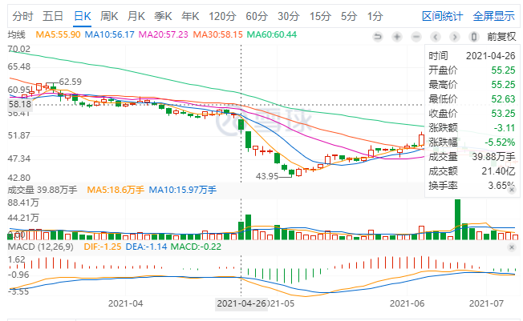

*上海机场2021-04-26*

[清一山长](http://link.zhihu.com/?target=https%3A//xueqiu.com/9310099567) 2021-04-28 09:45

[$上海机场(SH600009)$](http://link.zhihu.com/?target=http%3A//xueqiu.com/S/SH600009)

**技术分析：月线图上，已经跌到19年年初的位置了。正常情况下，这是一个支撑位置，应该会有反弹。**不过现在的情况应该很不正常。

**首先是基本面不正常，**上海机场的国际航班，今年内恢复的可能性不大。

**第二是成交量显示的危险**：上一次的支撑位置和压力位，18年到19年的，成交其实很少。可以说，主力没有卖出行为。筹码锁定良好。现在同样的位置，成交量很大。有人在不断地亏本跑路，当然，也有人不断接盘。但观察下来，散户接盘比较多。因为他们对上海机场过去灌的迷魂汤很有效，依然认可当初的逻辑。寄希望于疫情消失后就恢复原状。我看难：疫情一是难以短期消失，中国只会继续严防死守。二是：疫情消失，上机也不会恢复原来的盛况。上机的老总跟中免签约，已经说明市场逻辑改变了。现在还想好事？我看太不理智。所以，我认为是机构撤退，散户买入的。所以——未来可能会有反弹，但只是反弹而已，不是洗盘。从17年走上了的这波翻倍行情，成交都不大。原有的大主力都是长期持仓，现在就算杀逻辑，止损卖出，都是有利润的。散户跟进时间短，应该都是赔本的。

当然，上海机场，作为免税天堂的逻辑终止了。但作为机场的逻辑还在。跌也跌不到多惨，最多跌回17年的平台。死拿五年，也许估值推动又涨上去了（我担心：也许五年内国际航班都开不了。因为疫苗没用。病毒不断变异），这种极端情况下，会让持有者抓狂的。希望不至于（我被困在泰国，其实很想正常回国，看看老人家，以及朋友们。我可不希望疫情隔绝了，五年回不来）。

**我就动动嘴巴，我不持有上机**，就20多年前买过。我不对判断的结果负责。刚看到：500万炒股的下岗程序员居然高位抢了上机，还全仓了[大哭]。正在叫苦：说走在死亡的边缘！天天发文。我半年前劝他买入中国建筑，说涨不涨不知道，跌20%的可能性几乎没有，现在果然跌了2%。上机呢？我全仓拿了也睡不着的。全仓中国建筑可以安心睡。这就是不同。我猜他是想通过炒股，刷热点，通过实盘赚钱，成为影响力大V，以后可以发私募吧？下岗了，换个金融行业的工作，其实他很勤奋。可惜——**炒股不是技术活。炒股是技术和艺术、哲学的结合**。想发私募，想吸引眼球。这个目的本身，就会导致操作的偏差，为了博热点，博眼球而操作。我不在乎啥眼球，不求私募的目的。操作就是记录自己。也许心态上，已经赢在起点了。其实：我的账户比他惨，这几天，已经消失了千万资产了。不过，我有安魂大法——**数数股票，一股未少。还多了一些**。于是——安心继续睡！等分红！

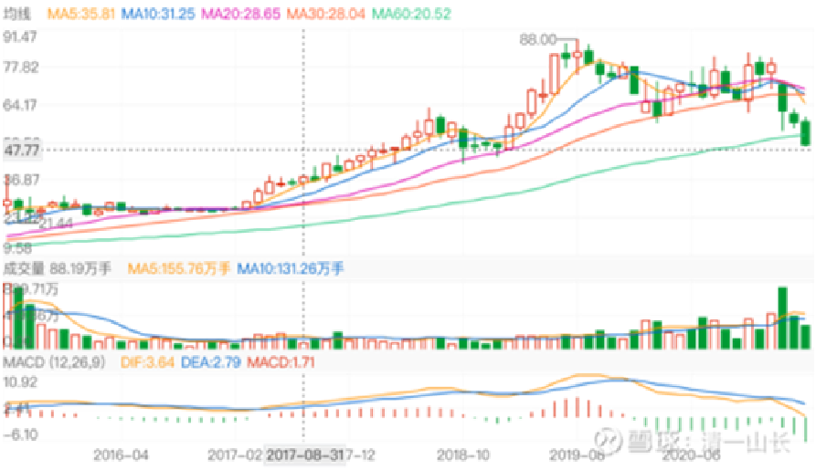

[清一山长](http://link.zhihu.com/?target=https%3A//xueqiu.com/9310099567) 2021-04-28 10:14

[$上海机场(SH600009)$](http://link.zhihu.com/?target=http%3A//xueqiu.com/S/SH600009) 这种图形，叫做下跌抵抗性走势。不是反弹。未来阴跌可能性大。从成交看，比较冷淡，所以大约低位盘整是必然的。基本面也不支持大幅反弹。

纯技术分析，不做买卖依据。教人看懂图形的。就是玩一下看线的游戏。

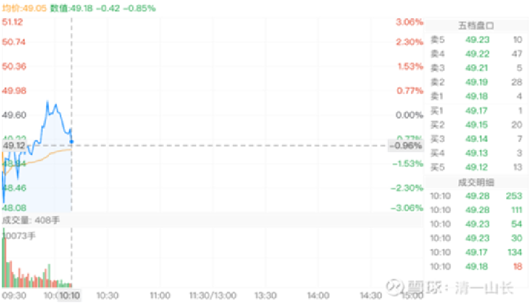

我和你吻鳖回复清一山长：

你这个分析我个人认为是不对的，19年那个点不能作为支撑点，本来去年疫情航空股就应该大跌，但上海机场有基金报团股没跌反涨，这就不正常。那么现在疫情因为阿三再度引爆，再加上抱团上机的基金和机构清仓撤资，很可能会低于你所谓的支撑点，这是正常逻辑。

[清一山长](http://link.zhihu.com/?target=https%3A//xueqiu.com/9310099567) 2021-04-28 11:00 回复[我和你吻鳖](http://link.zhihu.com/?target=http%3A//xueqiu.com/n/%25E6%2588%2591%25E5%2592%258C%25E4%25BD%25A0%25E5%2590%25BB%25E9%25B3%2596):

这样说，太残酷了[大笑]。持有的人，会受不了的。下岗程序员想死的心都有了，你还这样说，不太没同情心了吗？

所以，**我只谈技术支撑位，也许有点希望。你说的，是基本面改变，导致投资逻辑改变。所以技术支撑无效[得意]。两种不同的逻辑。**

[小散自由之路](http://link.zhihu.com/?target=http%3A//xueqiu.com/n/%25E5%25B0%258F%25E6%2595%25A3%25E8%2587%25AA%25E7%2594%25B1%25E4%25B9%258B%25E8%25B7%25AF):回复[清一山长](http://link.zhihu.com/?target=http%3A//xueqiu.com/n/%25E6%25B8%2585%25E4%25B8%2580%25E5%25B1%25B1%25E9%2595%25BF)：

这么重大的身家都全仓一只股，也太没有风险意识了。还想做私募，全仓一只股的，谁敢交钱给他？有点风险意识的、有点经验的应该都不敢。

[清一山长](http://link.zhihu.com/?target=https%3A//xueqiu.com/9310099567) 2021-04-28 12:06 回复[小散自由之路](http://link.zhihu.com/?target=http%3A//xueqiu.com/n/%25E5%25B0%258F%25E6%2595%25A3%25E8%2587%25AA%25E7%2594%25B1%25E4%25B9%258B%25E8%25B7%25AF)：

真不能这样说:别人全仓茅台的（董宝珍），不照样做私募？

[晕娜](http://link.zhihu.com/?target=http%3A//xueqiu.com/n/%25E6%2599%2595%25E5%25A8%259C) 全仓中建，他没风险意识？

看你全仓谁了。全仓高位的上海机场，的确有点疯。但上海机场十几元，20几元的时候，全仓没毛病

（标题为编者所加）

参考链接：

[清一投资号：26篇.我不买上海机场的理由（一）](https://zhuanlan.zhihu.com/p/488663182)（整理文）

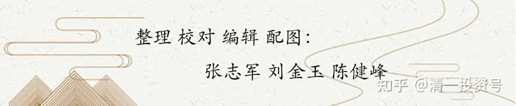