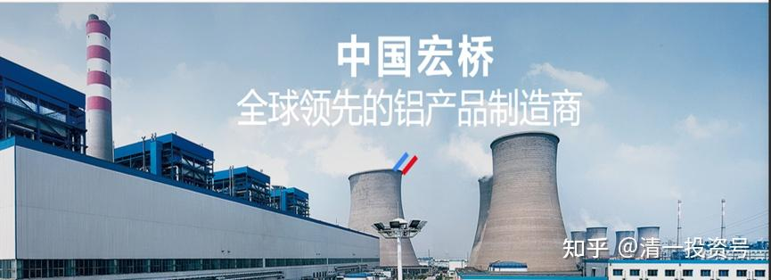
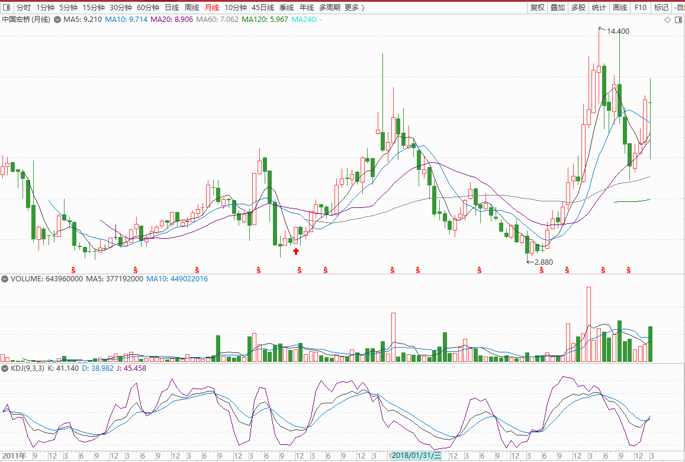
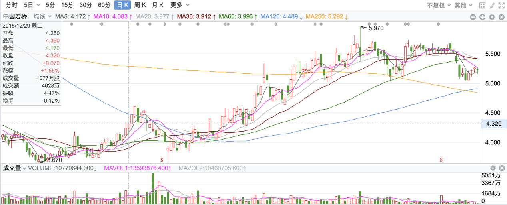
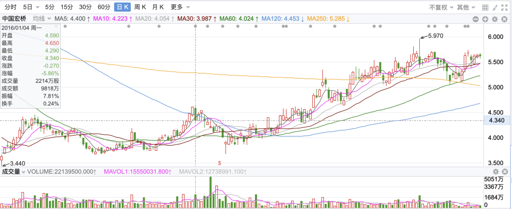
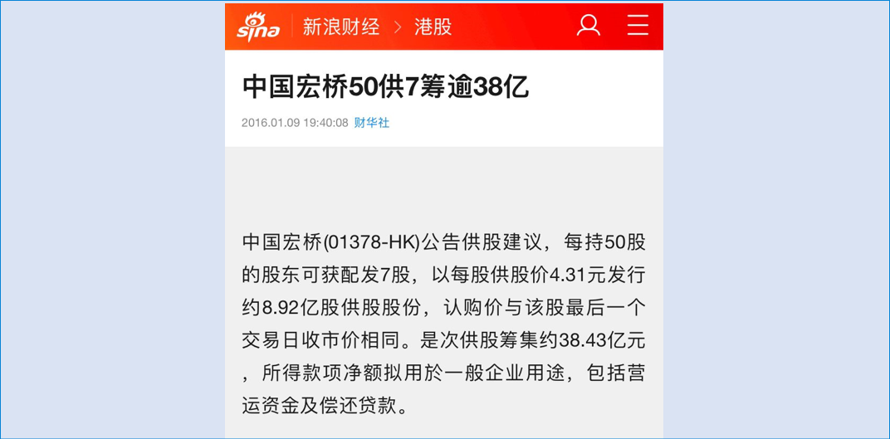

1篇.中国宏桥系列之一：建仓原则

清一山长 2015年**～**2016年

**

*中国宏桥2015年-2022年月线图，红色箭头处为建仓时间*

**

清一山长2015-12-28 13:37

$中国宏桥(01378)$ 这货也涨得太快了一点，是我建仓港股以来涨得最快的一次了，目前的账面浮盈已经一百多万了。但我并不开心我的建仓，还没有达到预期的目标仓位呢！我原本喜欢慢慢建仓的，幸亏上星期看走势不太对，最高抢着4元高价，也买了一些尾仓，不然整体仓位，会让我很不满足的。**我倒是希望它再跌回原地，把我的浮盈跌没了，再亏百万都好，**我觉得目前还不应该这样上涨的。**我要的是股，不是盈利**。宏桥未来要走的，是戴维斯双击之路。懂得珍惜的人，就好好拿住吧！最多明年还有一些困难，以后一路就是“明星股范儿”了。目前涨了，我也肯定是不卖的，但也不买了。跌了继续买，直到第一重仓股为止。我计划三年后，再考虑卖出宏桥的事。（不排除我随时根据市场情况改变计划）

提醒一句：我听说，去年年中，我告诉别人，我当时在大买华电国际电力，我的购买成本是3.8元-4.0元。我觉得低估了，靠分红都很划算，就买了。后来，有人听说我的持股重仓了华电国际，就十几元抢进去了，结果至今套牢。实际上我7元多就出手卖掉了，以后的十几元跟我无关，我一去不回头（资金后来买了2元多的国电电力，赚到了更多的钱）。我也不羡慕后来的华电差价，我觉得是庄家控盘乱炒的价格，不正常。我今年还特别提醒财猫们：不要碰电力股，以后几年不看好。我希望别以后有什么笨蛋，等宏桥十几元的时候来买股，还说是清一概念股，就麻烦了。**买股，唯廉价不败。这是我立身股市23年的成功经验——贵了，我就跑了，而且一去不回头。因此庄家吃不到我，我可以吃庄家——他们打压股价时，跌得我认为足够便宜了，我就进去了。我没有“爱股”。我只爱便宜！**

清一山长2015-12-28 14:35 回复：@枇杷先生

宏桥现在只有我原计划的六成仓位，肚子还有点小饿。只好找其他标的吃了。我是左侧投资者，不喜欢追涨，但愿意等回调。宏桥3.7元的时候，我就告诉我的学员群：这股值得买。4元的时候，也在内部吹风，这股还可以追。他们都知道这个消息，好些人都已经进货了。别以为是宏桥涨了，我才来做事后诸葛亮的。雪球是公开场所，我说话要特别小心，别得罪人，也别误导人。大多数投资见解，我不会在这种公开场合说的，只敢“误导”自己学生，说错了，他们也可以理解，起码知道我不是故意误导人。

清一山长2015-12-29 15:05

*中国宏桥 2015-12-29*

我也分析盘面玩玩：其实，**庄家喜欢“制造思维惯性”：先给你一些甜头尝，然后突然打破惯性，让你踏空或者套牢。**我玩了23年股票，见多了这种手法。所以这次宏桥故技重施，再次涨到“前期高点”，我就没敢动（我的首仓是3.78元建仓，涨到4.46元没出，居然又跌回来了。后来持仓又再度涨上去，就很惯性地想卖掉赚点短差（担心又跌回来），是强行忍住的——毕竟大头在后面，觉得为了这点小利踏空没必要。这一次到了4元左右拉锯，感觉不像回调的样子，反而还加仓买进了不少。不是不知道老板张波4.18减持的消息，**本股在一个点位4.18元，居然来回做了三次波段，典型的洗盘行为。**因此，第四次一定是陷阱——大多数本来计划长期持股的人，这个价格到了就会“自动”抛掉。所以，我很怀疑张波4.18元卖出，并不是“缺脑子”，赚点小钱。恐怕是配合庄家的要求“故意装傻”，让小股民慌乱吐出筹码的。如果这样设想的话，打下去后，他在底部故意买200万股，就已经做好后来拉锯吐出的准备，因为他不想买自己的老底子股本，200万股也不卖，就是做了玩的。他缺什么钱？在乎这一点点小利？（可能是小人之心吧，反正我认为这个价位根本没有卖出的必要）。以上纯属猜测，估计看庄家故事多了乱编的。不过，我还是希望回调给我再度买入的机会，我也凑合还想买点（假如跌到4元我就加仓）。不过恐怕难了，昨天量放大，浮码已经被抢走很多，庄家没道理吐出来的。但我现价也不愿意追涨，恐怕就这样了。

清一山长2016-01-04 18:24

*中国宏桥 2016-01-04*

$中国宏桥(01378)$ 感谢宏桥给予的机会，今天继续加码买进。别人恐惧的时候，就是我贪婪的时候。目前的持仓结构，宏桥是H股第一仓位，中信银行是第二仓位。中国建筑是A股第一仓位，兴业是第二仓位。

清一山长2016-01-10 16:47

【中国宏桥公告：中国宏桥50供7筹逾38亿】

挨打了，我的重仓股，宏桥居然玩供股？还是这个价格？如此低的点位？实在想不到。

我认为宏桥目前没有需要配股的理由，因为股息和收益，足以覆盖银行贷款利息。这个价格配股是不划算的，还不如借款划算。

当然，也可能宏桥出现了黑天鹅，老板从未想过的“银行不肯续款”情况出现了？只好低价配股来还款。毕竟这几年扩张太快了。

总体来说，供股并不可怕，只要老板是诚信的，老板比例大，拿大头，不会让自己吃亏的，我们散户跟随也不怕。就怕老板出老千……应该不会这么缺德吧！

参考链接：

[清一投资号：2篇.中国宏桥系列之二：安全边际及基本面分析](https://zhuanlan.zhihu.com/p/500915231)（整理文）

[清一投资号：3篇.中国宏桥系列之三：上涨过程中的技术分析与心态把握](https://zhuanlan.zhihu.com/p/505157634)（整理文）

[清一投资号：4篇.中国宏桥系列之四：股价走好，不放松对基本面的分析判断](https://zhuanlan.zhihu.com/p/508644489)（整理文）

[清一投资号：5篇.中国宏桥系列之五：遭遇机构做空消息后的理性分析](https://zhuanlan.zhihu.com/p/511924857)（整理文）

[清一投资号：6篇.中国宏桥系列之六：宏桥复牌后的基本面分析及盘面动态](https://zhuanlan.zhihu.com/p/518969047)（整理文）

