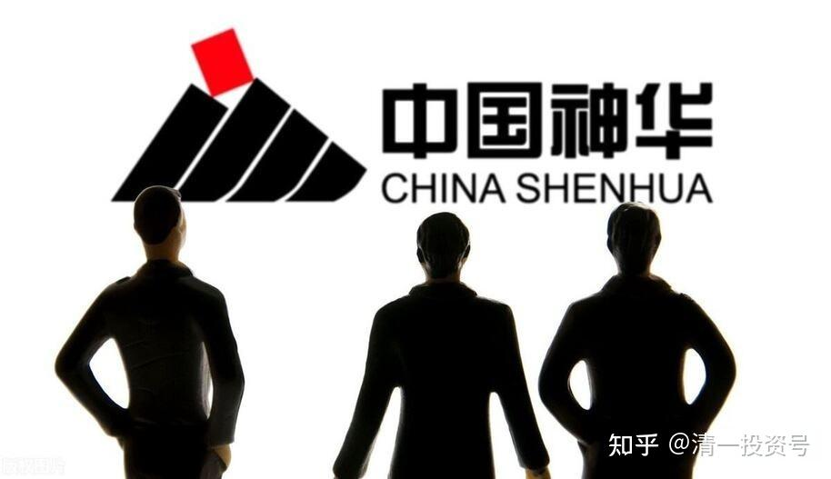
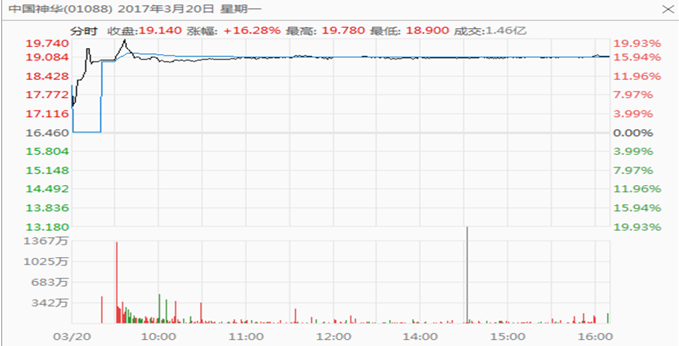
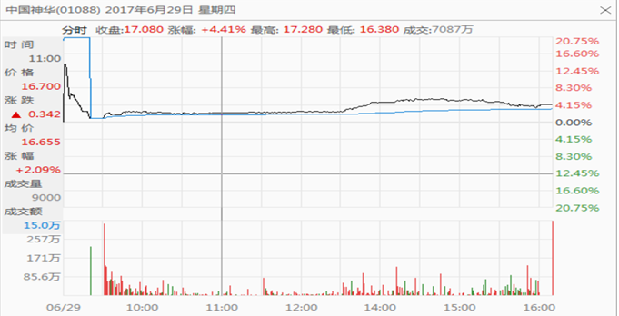
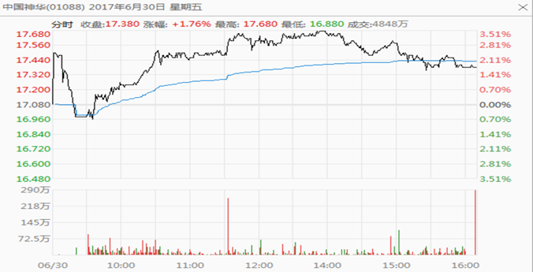

28篇.中国神华的博弈分析

清一山长 2017年2月～7月

**[清一山长](http://link.zhihu.com/?target=https%3A//xueqiu.com/9310099567/124533350) 2017-02-15 12:47**

[$中国神华(01088)$](http://link.zhihu.com/?target=http%3A//xueqiu.com/S/01088) 1月煤炭销量3310万吨，同比大增55.9%。这种公司，在股价最低的时候，居然是真实的市场竞争力最强的时候，价格最低的时候，缩减产能。**在对手们纷纷倒下，煤炭价格大幅上涨后，神华反而销量大增。**以后的市场前途，还需要担心吗？这样下去，理论上应该突破历史高点的。

所以，根据股价来投资的人，就太傻了。一定要根据企业的价值来投资。我很高兴我曾经的“**香港第一亏损股**”中国神华满血复活。现在价格16元以上，最低点跌破十元，账面有点难看。但是现在恢复很好，必将取得良好的盈利。证明一个真理：**持仓后，变化的价格不重要，关键是你持仓的理由对不对。**用投资企业的思维来投资，即使是最低迷的时候，我看到的也是神华的竞争力在不断提升。所以不仅安心持有，还在低价（10元左右）买入，因此赚钱是必然。市场想要我亏钱，就太难了。多点耐心跟市场比时间，市场一定输给我。[笑]

**[清一山长](http://link.zhihu.com/?target=https%3A//xueqiu.com/9310099567/124533350) 2017-03-20 12:10**

(中国神华2017-03-20)

[$中国神华(01088)$](http://link.zhihu.com/?target=http%3A//xueqiu.com/S/01088) 神华派发有史以来最大的红利，可喜可贺。不过，持有神华港股的要注意：分红如果以上一交易日的港股价格（16.46港币）计算，分红率是20%以上，惊人的利润率，每股分港币三元多。所以，大家持有港股神华的人，是非常划算的。

但是如果您是港股通持有的，就要扣除掉20%的股息。我的A股基本上都在冲过20以后就卖掉了，最高出手价26元。这批筹码都没丢，只是换成了H股，“套牢”了很久，低价有补了一部分仓位，所以不仅仅锁定了神华的A股利润，H股也赚了钱。比死拿a股的人多赚了一些“切换利润”。

但是现在咋办：我很不愿意被动交税这么多（每股6毛钱的税）。我是m级持仓，所以光神华交税至少就要60万元以上了（我一直是中国人中交税最多的1%的个人，是个体纳税模范[大笑]）。所以，我很心疼，希望合理避税。有可能选择在除权日前卖出，在除权后再买回来神华，这样就免除了每股6毛钱的税务负担。因为正常情况下，交易价格，会自动除权掉含税部分，我买到的是不含税的神华。这有可能是最划算的长期持有方式。

不过大家也要警惕：万一主力明白我们这些善于算小账的股民会这样来进行避税操作（其实国家的税一分钱没少，我们这样操作，是把交税权让给其他人了），也可能除权后，价格却不除权，就直接被扎空了。你就被丢下来了。所以，要小心：**这一场博弈，是否会输掉，如果自己被扎空了怎么办。否则没想好，就会吃亏的。**

还有：神华这一次超级大方的派发红利，是在暗示什么？

有可能神华已经完成了大规模的投资，今后进入了丰厚的回报期。

或者是神华利润太多，已经没地方用。

或者是主力2015年拉高神华，却被套牢，希望多分红持有现金（通过卖掉股份来换钱显然不明智）

不管怎么说，都是说明神华值得持有。我一直相信：**神华是集石油、电力、煤炭和煤化工优势于一体的中国最大，最强的能源公司，长期持有，是不会错的。**

**[清一山长](http://link.zhihu.com/?target=https%3A//xueqiu.com/9310099567/124533350) 2017-06-29 21:33**

神华的博弈：价投散户今天被出局了！

*（中国神华2017-06-29）*

[$中国神华(01088)$](http://link.zhihu.com/?target=http%3A//xueqiu.com/S/01088) 果然出现了抢权行情[哭泣]。多少斤斤计较的“神华价投”们，今天要哭晕了。说实话，对于神华的高分红，我一直很纠结：我的持仓，要缴纳接近一百万港元的红利税，觉得就是被抢劫了一样。每股神华要交0.68HKD的税。实在万分不情愿。所以一直在想：是不是除权日之前卖掉，除完权再买回来，让别人帮我付税。

但是又想：中国的价值投资者，对于股票价格多和少几分钱都很敏感，对于神华这样一个每股分红除权3.4港币的超级大红利，每股要交掉6毛多的税，一定都很肉疼。说不定很多人都跟我一样会算账：都想神华除权后再买进来，享受“免税持有”的长期持股待遇。这一点小心眼，也一定会被想要大量进货的主力大财东们算到的。所以，万一有大财主想进神华，一定会在除权日前后大量买进港股。让这些精明的h股算计者下车去。你卖出后，想要再买回，就没门了。

所以，这场博弈，我就不敢用“正常思路”来算账。就只能忍住肉痛，乖乖的交了一大笔税（三辆冠道呀，就被税务局拿走了）。就想看看到底神华除权会怎么走？我不赌避税了，选择无为而治。也在想：为啥A股停牌的利好，对港股没用？一直在压盘子？在等什么?是不是就在等今天的除权日？按道理，它作为价值股，跟招商AH一样，价差不应该太大的。

今天一看：乖乖，真的填权了。算小账的夹头都被轧空了。**你在算一点避税的小钱，别人在算你的本钱！！**昨天今天，神华H成交额每天十亿元，就是小夹头换手给大夹头了。如果我之前卖出了，今天会赶快认输，重新抢进来的。如果仓位空虚，今天该补单了。不过，既然我一直没动，还是继续看戏好了。好戏在后头！而且肯定是大戏！

祝福所有跟我买了神华的粉友们。**神华的好日子，显然快来了！坐好了，别被颠下车了！**

也祝福一直想看我笑话的黑们：你们的脸早被打肿了，还要继续被打肿！

（我的港股通神华H持仓成本，现在只有9元多，大赚了。另外还有几十万股香港账户的持仓，只交10%的红利税）

**[清一山长](http://link.zhihu.com/?target=https%3A//xueqiu.com/9310099567/124533350) 2017-06-30 11:55**

*（中国神华2017-06-30）*

[$中国神华(01088)$](http://link.zhihu.com/?target=http%3A//xueqiu.com/S/01088) 神华的博弈分析2：今天早盘研究——昨天大财东抢权，早盘略低开，让小财主们窃喜，反应快的，真想要长期持有的小散们，就直接买入了。**想更多赚的差价，等下午继续下跌的小散们，就轧空了**。今天理论上应该继续上涨，避免小财主们反应慢一拍，今天来抢回筹码。如果我的这个推理属实，港股神华的价格，今后多年都不应该看到低于17元的价格出现了。7月4日A股复牌后，估计会有利好出来。大概率是要上涨的。H股跟随补涨很正常。有可能很快走完填权行情，H股上20元很容易。

今天早盘直接温和走高，但成交量并未有效放大。代表多数投机盘出局后，目前筹码锁定良好。预期全日成交将比昨天明显萎缩（除非大幅拉高，一些本来稳定的获利盘也会出局），但今天无论是神华缩量上涨，还是放量大涨，都是港股神华开启正式启动的标志。**预期未来神华将创出近期新高。**大家好好的期待下！

一句话：**炒股要学心理学，要学博弈学。神华的博弈很精彩，盘面上迷雾重重，只有心理学和博弈学，加上对企业价值有分析的人，才有可能看懂盘面，才有可能顺势而为。如果看不懂乱作，就有可能跌跤！**

**[@晨月投资](http://link.zhihu.com/?target=http%3A//xueqiu.com/n/%25E6%2599%25A8%25E6%259C%2588%25E6%258A%2595%25E8%25B5%2584)回复[@清一山长](http://link.zhihu.com/?target=http%3A//xueqiu.com/n/%25E6%25B8%2585%25E4%25B8%2580%25E5%25B1%25B1%25E9%2595%25BF):**

跟着国王散步错不了！跟了！今天买入港股中国神华！投机不成就投资。[赚大了]

**[清一山长](http://link.zhihu.com/?target=https%3A//xueqiu.com/9310099567/124533350) 2017-07-02 12:43回复[晨月投资](http://link.zhihu.com/?target=http%3A//xueqiu.com/n/%25E6%2599%25A8%25E6%259C%2588%25E6%258A%2595%25E8%25B5%2584)：**

好意思说跟我。我现在可没有买入神华。我A股神华，两次分红后除权价是9～12元买入的持仓。最高以26元卖出了后换了港股。港股目前的除权价成本是9～16元港币买入的。你当时为何不跟？

**你们这些投机客，赚了是你们有本事。亏了是你们倒霉。可不是跟我跟的，好歹都别赖我。**[大笑]

