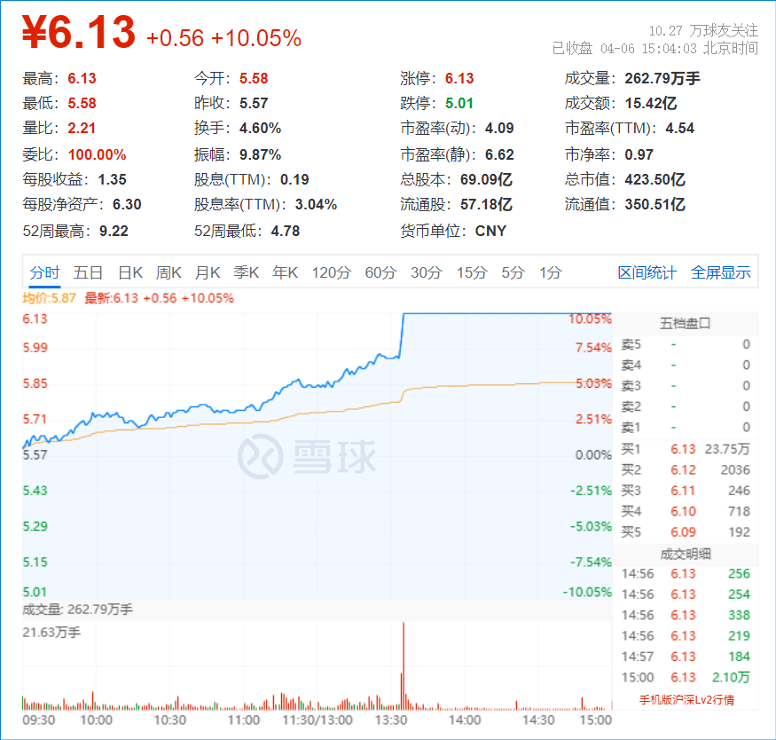
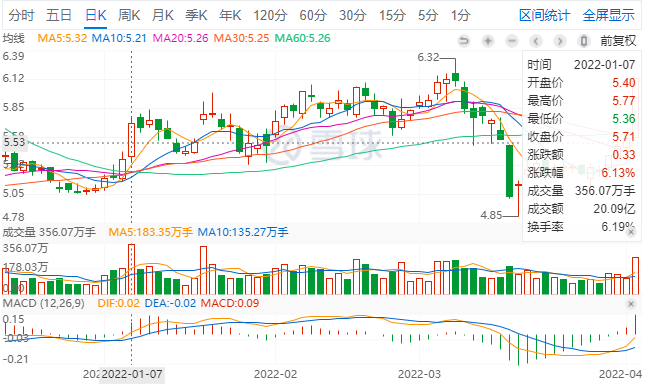
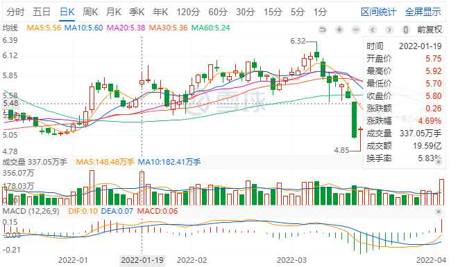
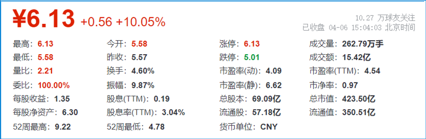

14篇.华菱钢铁涨停

清一山长 2022年4月6日

**一、华菱钢铁涨停**

山长 清一2022/4/6 14:16:16
今天一直给大家吹的华菱钢铁涨停了。不过，我准备一股都不卖。实话实说，今天上午我还在买呢！涨了2～3%的这个价格，我买了几十万股。下午冷不丁一看，居然就涨停了。感谢最近一轮的下跌，我有机会补上我想要的仓位，上次公布标的的时候，其实我还没买够。现在也不是太够，但已经买了数百万股，基本仓位算是够了。涨停了，就停手了，不贪。但也真心不想卖，因为手上觉得股数还不够，不觉得多余。不想燕京每次下跌都把我吃吐掉，所以涨了就会想走掉一些。钢铁的逻辑，才刚刚展开。大戏还在后头，有可能出现一次2007年的钢铁行情局面。

**二、买入逻辑**

山长 清一2022/4/6 14:32:20
从量能上看，今天虽然涨停，但华菱的放量不明显。

1月7日涨6%，成交量20亿。

1月19日涨了4个多点，放量19.59亿。

现在华菱才14亿成交，离收盘只有半小时了，今天应该创不了量能新高。所以肯定不是出货行为。

很可能大量的低价入货的散户，见利就走，把筹码都交给主力了。主力吃饱了，快速脱离成本区（所以，你们知道，**从基本逻辑上来看，散户就是不可能赚钱的，因为散户的思维，就是套了就死拿不放，涨了一点就走。所以，赚钱的时候，赚小钱，但如果赔钱，就会赔大钱。往往腰斩还不止**）。

另外，从基本面上来看，**我认为华菱很可能是这一轮钢铁股行情的龙头。**宝钢这个老龙头，跟它比涨幅恐怕比不赢。因为宝钢是大家都知道的中国钢铁代表股，就没多少炒作的余地了。主力炒股，要炒别人不知道的，冷门、偏门，才能赚到最多的利润。

华菱前几年很惨，差点破产，所以大多数人印象不好。但这几年死抓质量，产品创新，品质管理已经成为了钢铁企业的标杆。特别是一个利好消息：现在的造船周期，是特别利好华菱钢铁的。**我可以放弃去买中国船舶，但我不能放弃华菱。因为它占有40%的船用钢板的市场。所以，未来三年的的船运周期，应该对它特别利好。它就是卖铲子的人。**

所以，这个股是红筹概念、钢铁有色概念、船运概念，以及高利润、高技术、优质管理的典范。5元多买它，买到就是赚到。（我不支持现在追涨喔！追涨套了自己认账，反正我就是5元左右，就拼命找钱来买的主儿，看见涨了就挂眼科，不贪心。我下午已经停手了，不追涨。万一涨急了，就卖一点的人）。

**三、大资金入住的迹象**

山长 清一2022/4/6 14:37:02
提醒一下：前段时间大蓝筹破位狂跌，是一个非常险恶的大坑，吓跑了很多人，但这也是大资金入住的迹象。祝福大家经受住了这次考验[笑]。只有经历风雨的人，才能见到彩虹[抱拳]。我的账户已经创造新高了。

