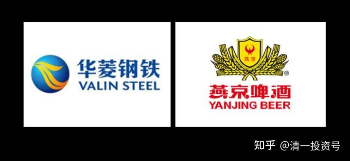
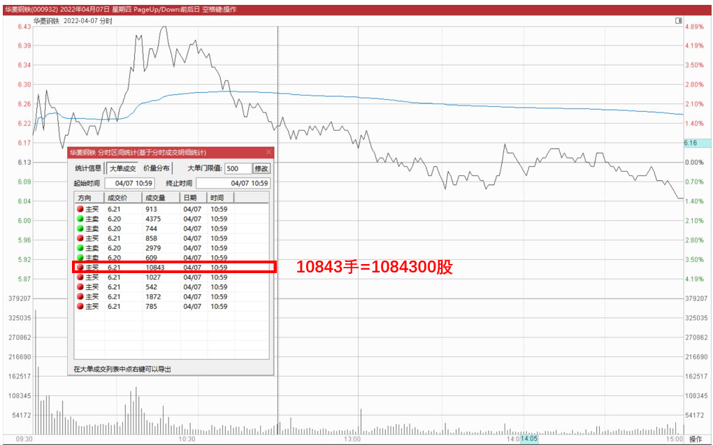

15篇.多赚股：华菱换燕京

清一山长 2022年4月7日

今天华菱的走势，有点不够争气，成交量剧烈增加。昨天上午买入的20多万股，我挂单6.34元卖出，算是做了一天的股东。但只成交了14万股多一点。这笔钱，用来买了7.31元的燕京啤酒。就当同样的一笔资金，今天比昨天多买了10%的燕京股份。没算赚钱，算是额外赚股了。

另外，看到6.21元，有一百多万股托单，正在想要不要出掉一百万股？回笼几百万的资金？**就看见一单子就被打掉了，只好算了，**百万股级，不好出货，只好拿着。反正拿着也不担心，只是赚多赚少的问题罢了。**涨了置换一点资金出来，是我的习惯，不然跌了哪有钱买货？所以，我只关心多赚股，不关心多赚钱。最终，似乎钱也多了**[大笑]

附：相关文章，清一山长新作《14篇.华菱钢铁涨停》链接：[https://zhuanlan.zhihu.com/p/497049665](https://zhuanlan.zhihu.com/p/497049665)

**

**

