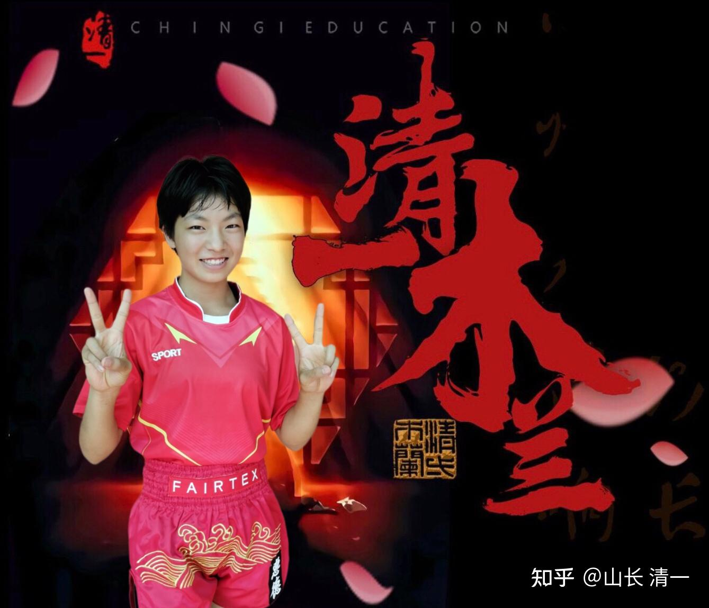
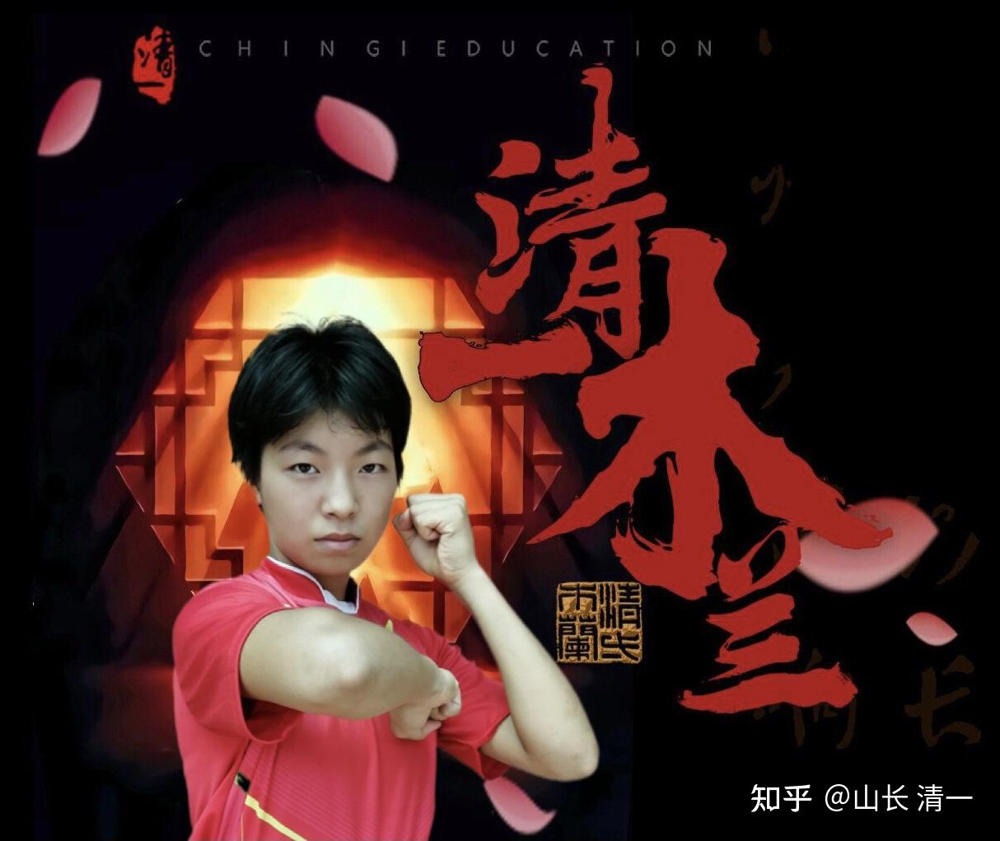
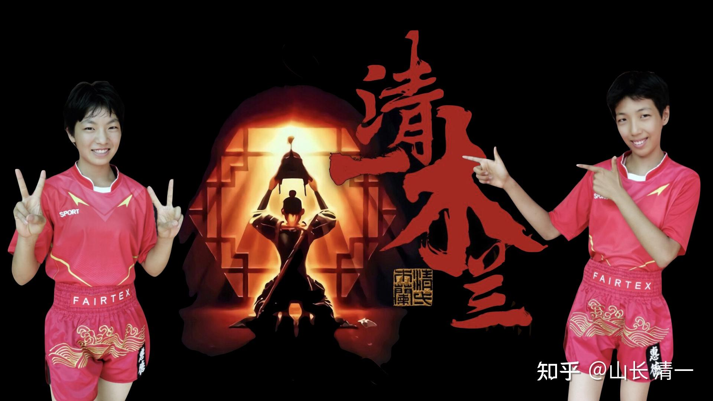
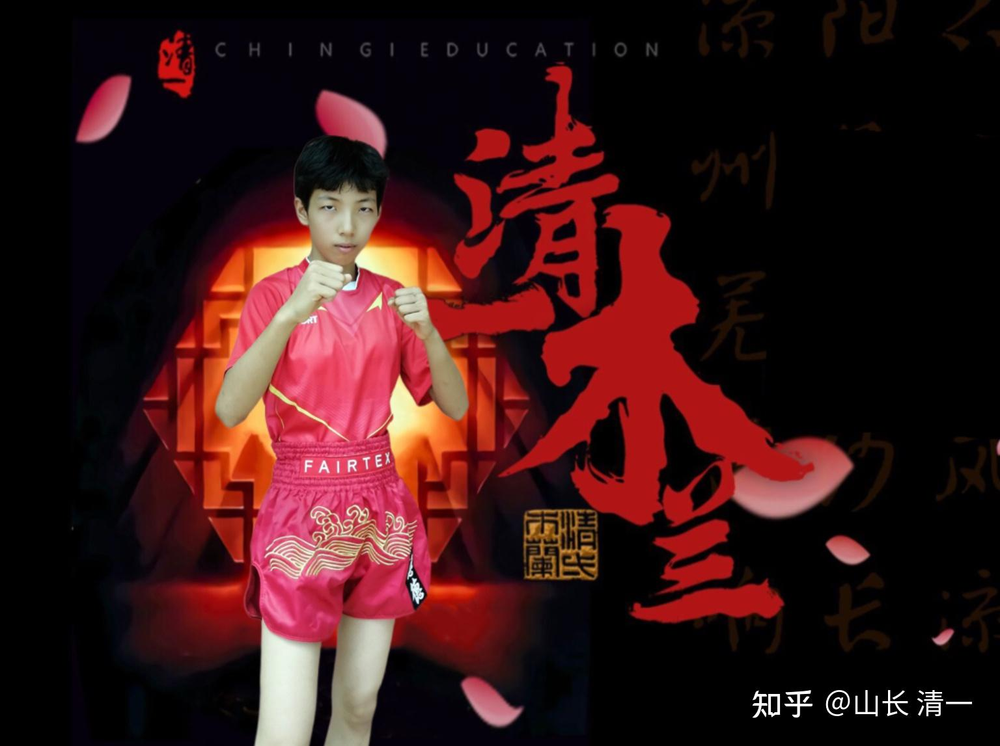

我们的小拳手，一周后要面对的泰国金腰带，大致上是什么水平的？我在油管上，找到这个视频。与日本拳手争夺K1冠军的比赛，打得还比较激烈，大致上反应了泰国女拳手的实力和水平（日本女拳手，被打得完全找不到感觉，虽然能够打到冠军争夺赛，肯定在日本也是不差的）。

[!\[image\](images/img_001.jpg)

泰国与日本拳手的K1冠军争夺赛。 https://www.zhihu.com/video/1498715655042457600](http://link.zhihu.com/?target=https%3A//www.zhihu.com/video/1498715655042457600)

我们的两个小拳手，身高体重，跟她们大致上是一个级别的，看样子年龄也差不多。我倒是期待我们的小拳手，有机会跟这个视频中的泰国女拳手碰一下，看谁更强。我相信她们在泰国一定有机会遇到这个泰拳手的。由于泰拳手，往往8-9岁就开始上擂台了，往往十几岁就拿到全国冠军。否则普通拳手，是不会出国比赛的。颁奖后，这个泰拳手身披泰国国旗拿奖杯，看起来还是很爱国的。很有荣誉感。

从场上得到表现来看，泰拳手看上去和日本拳手就不是一个级别的，完全是压着打。无论是力量和速度，腿法还是拳法，泰拳手都明显强于日本拳手。日本拳手的腿法几乎没有杀伤力，拳法也力量不足，所以这一场冠军争夺赛，就成了泰拳手的技能表演台了。由于泰拳手往往不到10岁就开始参加比赛，所以泰拳手的实战经验，看起来比日本拳手强很多。我们去的泰拳馆，里面有个女拳手，现在才刚满20岁，但据说已经“过气”了。她的冠军头衔，就是17岁拿到的，现在已经丢掉了。现在看她的技术，也没啥更强的发展。看起来，还不如视频中这个据说只有17岁的泰国女拳手厉害。

我查了一下资料：这个泰国女拳手，名字是 帕亚洪（Phayahong ），来自（Ayothaya fight gym）拳馆。她的量级是45公斤。战绩是 64-14-1，10 KO。可见是蛮狠的一个人。我查看了今年6月份，又一次她要参加的比赛 K-1 WGP女子原子量级冠军四人赛对阵分别是：S-cup冠军津村澪（40-6，4 KO）对阵泰国选手MPMF冠军帕亚洪（64-14-1，10 KO）；Krush冠军菅原美优（8-2，0 KO）对阵不败新秀松谷绮（5-0-2，0 KO）。

从战绩上来看，这个泰国拳手KO掉人的数字，比其他三个日本选手，全部加起来，还多了2.5倍。可见恐怖吧？这一场比赛中，第一局她把日本对手打到读秒。裁判刚刚恢复重新开展，她就冲上去一顿暴风骤雨的连击拳。大有当场KO日本拳手的决心，杀气很重。所以，我们的小拳手上阵，一定要小心这样子的泰拳女拳手，都是狠角色。如果被她们抓到了弱点，肯定就只能被抬下来了。

各位看到视频中，第一局的泰拳手，居然连续打出了四个凶猛有力的泰扫（最后一下打空了）。别说接住这四腿了，我们看着都痛。你们不信，自己去接一下泰扫就知道了。很多人一腿，就被直接放倒了。实际上这几腿打出来之后，效果是很好的。日本拳手就此怕了泰拳手，场上就畏畏缩缩的，不敢上去硬拼腿法了。肯定是泰国选手刚猛强硬的腿法让她吃了亏，硬度比不过别人。后来主要就拼拳法去了，出腿都很犹豫不决的样子，而且也不出力。你们可能认为这日本拳手缺乏训练，别人可是一路打到冠军争夺战来的，怎么可能实力不足？我认为其实应该是身上的硬度不足，才不敢跟泰拳手拼腿，拼技术。如果腿上的硬度强，用腿防守，也会让攻击方顾忌的【我现在也不愿意跟两个小木兰用腿去迎击了，她们的小腿硬度，已经强过大多数泰拳同级对手了，我碰都疼】。但拼拳也吃亏，日本选手，显然没有料到：泰拳手的拳法，也很厉害，连续攻击毫不含糊。甚至还一拳就把日本拳手打坐地上了。

看了这个视频，我们的一些家长就很担心：两个小木兰，一周后，如果遇到的是这种级别的泰拳手，会不会被打惨了？看起来太凶了，比男生都狠。我就安慰家长们：别担心，我们的拳手上场后，会用太极功夫来阻止泰拳手的扫腿能力发挥，让她们一个扫腿都踢不出来，更别说连续打出三个扫腿了。一旦我们居然让泰拳手发挥实力，泰拳手居然能够像视频中这样，大开大合，毫无顾忌的攻击我们拳手，就说明我们的针对性训练无效，大概率会输掉比赛的。但我认为，**月底的实战中，你们会看到泰拳手显得“很差劲”的样子，毫无冠军相。甚至连扫腿都不会用。应该会像视频中日本拳手的样子，畏畏缩缩的，出腿犹豫不决的样子，有点不会打的新手一样。**这样才是比较正常的预测。

我居然说【太极功夫，可以让泰方的凶猛扫腿失效】。你们觉得一定有啥奇招。其实一点都不神秘；太极实战格斗，强调“打死不后退”。你看视频中，第一局的日本拳手，遭到对方扫腿攻击后，是采用抱肘“退步防守”来应对的，结果就遭到对方一练四个连扫就出来了。日本拳手身上就算没有遭到攻击，但手臂一定很酸麻，严重影响战斗力。因为泰拳手训练中，靶师就是这样按照这样的预设训练的。对手如果接住了扫腿，靶师就退一步，拳手就追上去，连续狂扫。泰拳手每天都要这样练几次，甚至一口气连续打出20个连续扫腿。我相信你们在播求，善猜的训练视频中，你已经看到了这种训练，威风十足的扫腿就是这样练出来的。所以，一旦你上场去，跟她的节奏一样（其实就是大多数人的反应模式）。你不是就当拳靶了？不打死你才怪。抗击打力再强，都要被虐死的。泰拳手训练中，被踢扫腿的要求，是不能后退的。要拳手必须双脚站稳防守，硬接下对方一腿，这样没有给对方提供后续扫腿的空间，对手就只有一次扫腿的机会。然后接腿后就要马上反击，也给对方相当的打击。双方就这样一来一回的拉锯战，拼双方的消耗。这就是“纯泰”比赛的节奏。一场下来，双方都会受伤不轻，需要休息很长时间。

事实上，下一局，日本女拳手被教练提醒之后，就不退后防守了，而是站稳原地，伺机马上反击。后面就没有看到泰国拳手“三腿连扫”的镜头了。而是双方拼拳更多了。虽然不用肘法，但膝法的攻击力，日本拳手显然敌不过泰拳手，我看被击中一膝盖之后痛到身体变形了。斗志大大的受影响。

我们太极格斗的战法呢？怎样对付泰拳扫腿？就是你出扫腿？我就往前冲半步，用野马分鬃，直接打你中线。你的扫腿就自动失去攻击力了。你敢冲上来扫，我前进半步，拳就正好落在你脸上。或者我的穿心腿，正好踢在你的肚子上。你怎么还敢扫我？还敢连扫？对太极拳手，你敢用腿来打，就是找打，而且是迎击。出腿的人会很倒霉的（这就是为啥传武不支持腿法攻击，特别是速度慢的扫腿，鞭腿。传武技术里面是没有的。传武一直说“起脚半边空”的道理，强调用身法来对付腿法。因为传武就是强调上前近距离攻击的，所以没有发展扫腿，鞭腿这样的腿法技术，可惜，中国武者身法失传了，技术退步了，还以为泰扫多威风。真没骨气）。当然，这个技术，我说起来容易，你要做到，其实很不容易。首先是你必须比对方的反应速度快，要能“后发先至”。不然你往前去，就只能被动挨打，啥技术都没用了。

你要问：如果对付泰扫这么简单？为啥泰拳手不用这个技术？中国人也不用这个技术去打实战？我就告诉你一个秘密——泰拳，以及外家拳。他们的攻击发力，必须是双足支撑（就是双重发力模式）。就算是扫腿，也是先要双足站稳，然后利用身体的快速旋转来发力的。单足在双方对峙中，快速的移动转换中，他们是无法发力的。换步的时候，是最容易被打击的时候。所以强调力量的泰拳，特别强调步步为营的慢速度步伐。泰拳手是不能在前进移动中发力的，往前冲进对方站稳的地盘挨打，或者拉近距离之后，自己的力量也难以发挥，所以泰拳手不采用这种应对方式。

但太极是移动中单足发力（忌讳双重）。所以可以快人一步（大约就是快0.2秒钟左右）发起攻击。实际上，拳手在往前移动的过程中，就同时开始攻击了。而不需要前进，站稳后再攻击。这样就同水平速度的外家拳✋相比，大约快了0.2秒左右，我们就实现了“后发先至”。所以我们就不会太担心对手的换招反击（外家拳对手文站稳的换招反击时间，一般要比移动中的选手更短，所以移动攻击对他们来说是不可取的）。但这种攻击法，如果对手的水平更高，这一点加速，就不起作用了，对手就会接住你的攻击，进入内围战。更高级一点的，会让你根本就无法靠近。两个小拳手，对我用这招就不行。每次我出腿，她们一冲进来，都是挨下一腿的打（因为我转换腿法的速度，比她们攻进来的速度快），反应速度跟我匹配不上就打不了。估计还要练个几年才行。但她们现在要对付泰国拳手，这个速度应该够了。泰拳手对付我们这种前冲技术，唯一的反应，只能是拳法和内围。所以就废掉了她们的扫腿优势。逼她们跟我们拼拳法和内围战。所以，我天天强调孩子们的，就是前进。不能站原地。只要我们的孩子站下来了，不跑动了，泰拳手就可以充分发挥了。如果我们总在移动，她们就总也没机会发动有力量的攻击。会显得有点犯傻[表情]

当然，我目前只是“兵棋推演”。实战到底怎样不清楚。也许这是我的想象出来的招数。就像马保国的“闪电五连鞭”技术，场下蛮好看的，上场去就一下都用不出来了。我让孩子们练的【迎门三脚】，以及【野马分鬃】，【手挥琵琶】。也许也就是现在说嘴的。场上用不出来，被泰拳金腰带拳手狂殴一顿，变乌眼鸡了，都有可能的。泰拳的肘法膝法，给日本选手造成很大的压力，会对我们有压力吗？到时候看吧。

比赛将在9天后开始，泰国主办方，要求我们提供两拳手的照片。说要做宣传广告要用。这一场，在泰国主场举办，他们大力宣传泰拳对付中国功夫。为了吸引看客，但实战结果，对泰国的荣誉影响也很大，如果两场都败。泰国人会很没面子的。特别是这样提前很久就开始大力宣传，也说明：泰方非常的重视这场中泰实战大赛，拿出来的拳手，绝对不能差。别指望比今天视频里面的拳手差。不然泰国就丢脸丢大了。我们现在的乐观，需要有控制。

木兰 拳照

*清一木兰 佳惠 温柔版 *

*清一木兰 佳蕙 严肃版*

*木兰TWIN 好像是准备参加舞会的无害小女孩版*

*清一木兰 明晓 装厉害版*