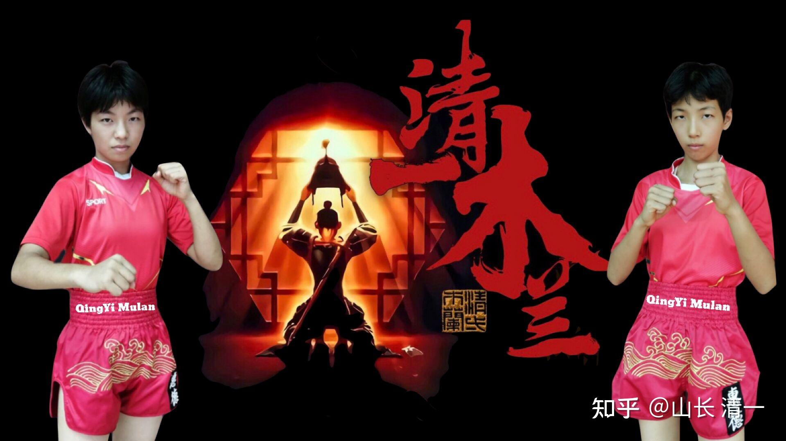

内三合，外三合，是传武的精髓。

内三合，太神秘，一般人不懂，我也不多说了。有人喜欢说，估计是这样骗人更容易。

外三合，可以用一句话来总结，就是“身步合一”。一旦做到这一点，对手实战是近不了身的。除了节节败退之外，没有其他办法，站都无法站在你的面前站稳。

4月25日，两个小木兰，将与泰拳更为强劲的对手进行再次的PK。目前这个月，她们很少去我们登记的泰拳馆训练泰拳。这让泰拳馆的教练和拳手都非常的不理解。因为比赛之前，就是要强化训练的时候，我们的小拳手居然偷懒不来拳馆，他们实在是想不通。其实，是因为上一次，因为我们小拳手从来没有实战过，所以需要去拳馆与泰拳手们对练，提高上场的感觉经验值。但现在，我们几乎已经不需要泰拳馆的“训练”了。我们已经基本上熟知了对手的训练和战术，她们在家训练的核心内容，就是“身步合一”。至于对练的项目，就是两人互相攻击。这比找泰拳手进行对练的效果更好一些。

上一次的实战，其实两孩子，还没有真正的做到“身步合一”。如果做到了，就不是上次第一局的局面了，双方看出来还“有攻有防”的局面了，泰方拳手和教练，既然还认为自己有机会拼一把，故一直在“死战”。这一次，一旦我们的小拳手一旦做到了“身步合一”，战场上，就是“一边倒”的局面，泰方选手将毫无进攻得手的机会，一进攻，就会被我们立即打回去。我方看起来，只是平平淡淡的往前推进。对手却毫无办法的不断节节败退，根本站不住的。只是我要求小拳手，尽量不要在第一二局，就KO对方。所以我们会用更保守的方式，打防守反击就行了。只需要在场上逼着对方，压制住对方的攻击就行了。不准备进行激烈的拼斗，和展示“杀招”。到了第三局，可以考虑放开一点打。事实上，我是这种比赛，当做“训练赛”来打的。没有当做“争霸赛”来做。我方并不急于用强烈的攻击，来获取胜利。但估计泰方拳手跟我们不一样，她们会希望尽快击倒我们为目标的。所以，我方的“温柔和节制”，不发动攻击。其实会给我方拳手，带来更大的压力和危险。毕竟，当我们“得机得势”的时候，拳论要求，就要用狂风暴雨一样的连续攻击，终结掉对手才行，这样拳手的风险才是最小的。这个原则，也是泰方拳手奉行的基本格斗原则。

为啥我们敢“反其道而行之”呢？其实，就是我方拳手在实力明显超出对方很多的情况下，才可以用这种战术。由于我方拳手，基本上已经练出了初级的“身步合一”攻防模式。这样，武器系统就与泰方不一样了。当我们用“步步逼近泰方推进战线”的时候，泰方拳手是守不住战场的。外家拳，只会用“双腿支撑”的“格斗平台”来对我方的看似软柔软，实际刚强的攻击，就相当于用普通的枪炮，来打我方逼近的坦克了。我方就算是不发炮终结对方，只是逼近对方，对手对此也毫无办法。泰国拳手们著名的腿，肘膝攻击等等，均不可能对我方造成“战损”压力。除非有“反坦克武器”，击毁我们的“坦克”，否则我们这种压迫式的“身步合一”打法，只会迫使泰方不断退步。一旦对方觉得连退很丢人，鼓起勇气发动猛攻，基本上就是被我们打“迎击”，导致当场击倒的结果，至少会击退数步（古书说的犯者立扑）。我认为：刚开始，泰方会向我们猛烈进攻的，但双方硬碰硬的交手几次之后（比双方的腿脚硬度谁更强？以及比双方在抵抗对方进攻中谁的承受力更强）。当泰方攻击无效，且连续遭遇几次反攻之后，面对硬度和技术都超过她们的木兰们，就会不知所措，会变成“步步后退”，苦苦熬着等结束战斗的铃声。而我们的“武力节制”就表现为：泰方如果不主动求战，只是尽量退避的话，我们就放她们一马。自己就多练练场上游戏。如果对方敢于猛攻，我们自然必须猛烈还击，犯者立扑。万一对方这样在反攻中，就被KO了，算是“意外”。我方也不准备面对对手的攻击表现过于软弱。只是不会“得理不让人”。取得优势后不会大力压上去狂打对手。但到了第三局，我允许拳手们可以自由一点发挥，可以主动攻击，打猛一点了。

这样安排的意思，也是避免完全暴露清一太极格斗的实力，也避免泰方拳手全都被打怕了，以后就不给我们安排比赛了。因为如果让泰国的教练们，看出自己的拳手，根本就没有一点获胜的希望，肯定会联合起来“封杀”我们这批外国人的，以后就可能不再跟我们安排比赛了。这样就不好玩了。

有人问：太极为何一些看上去软绵绵的攻击，却让号称凶猛的泰拳手都无法承受，甚至会狼狈地逃避打击？这就是太极“身步合一”的威力了。你看上去只是软绵绵，毫不出彩的一拳，其实配合上身步合一的训练之后，这一拳就打出了全身的重量叠加的效果。小女生们，即使只有40多公斤，如果把这几十公斤直接砸到一个大男生的胸部，我相信没几个人可以站稳的，至少要回退几步。现在一袋面粉是25公斤，直接砸你胸前，你们谁身子能接住吗？不退几步算你狠。两袋加一起扔过来，你还能站住吗？所以，一旦练出了“身步合一”，你可以理解为：就是出拳都是用身子去“撞”对方一下。泰国拳手谁接得住这种力量？自然节节败退了。

“身步合一”的第二大优势，就是“节省体力”。现代格斗，练体能的方式就是跑步。其实这对练体能帮助不是最大的，最能练体能的是“动物爬行”。对了，就是你们在今日学堂示范班看到的“动物爬”。为啥？因为一爬你就知道，好累呀。因为我们的手负重能力很差，拳击手们用手打击，摔跤手们用手格斗，是最费体能的。一旦你学会了“身步合一”的出拳方式，其实手臂是不出力的。只是一个支撑罢了，主要腰胯腿脚的力量传输给拳上的。因此你觉得只是轻飘飘的一拳出去，但对手一打就站不住了。所以，我们使用身步合一的打法，你会看到：第三局开始之后，我们拳手行若无事，但对方拳手几次急攻之后，就会气喘嘘嘘的，体能消耗严重。

身步合一的第三大优势，就是可以在移动中攻击。这才是内家拳最大的“杀手锏”。泰拳等现代格斗，本质上就是外家拳，这种拳不能说没有杀伤力，攻击力还是很强的。说要一拳打死人，是一点问题也没有的。但这种发力方式的一个最大特点就是：他必须要双腿站稳，然后利用腰胯的转动，配合大腿，小腿的蹬地力量。把力量传递到手上去。打个比方，泰拳就相当于第一代的坦克，火力威猛，但缺点就是：必须停下来，稳定住身体，才能瞄准，开火。 而身步合一的内家拳，就相当于现代坦克，可以在行进中瞄准和开火。所以，一旦现代坦克，遇到传统坦克，你也学传统坦克，停下来瞄准后再开火，你跟传统坦克没两样了。所以，传武采用泰拳的打法节奏，就毫无优势。但你如果会边开动车子，边瞄准，边开火，传统坦克就只能傻眼了，这时候，恐怕就连开火都不会开了，一心就只想：怎样到处躲起来，避免受到你的攻击了。

所以，内家拳，太极对付泰拳这种“传统坦克”的战法，绝对不能站在“原地互攻”。这是“纯泰”比赛的特点。我们必须不断前后左右的移动，让对方无法瞄准。也让对方就算是攻击，发力也落不到位，这样就失去了泰拳威猛的杀伤力。不过光游动的话，是不行的。就相当于面对坦克，你打不赢，到处跑，让坦克无法瞄准，但等你跑不动了，他就一炮轰过来。所以，我们必须学会“在移动中攻击”。这就是武当派“后发制人”的拳论优胜之处----核心不是“后发”，核心是“移动中攻击”，核心是打迎击，双方力量对冲。不然双方采用一样的技术，你需要站稳发力的话，移动者反而吃亏。也不可能就比别人更快，因为别人以静制动，天生比你快。只有你可以在移动中发力，才有可能在对手无法发力的时候，击败对手。

比如：威猛的泰扫向你打过来的时候，你只有三种可能的选项：第一是退开，暂时离开“交战场”。对方固然打不中你，但你也无法打中对方，就变成了追逐游戏了。

第二种，就是站在原地，提高自己的抗击打能力。设法承受住对方的攻击，然后趁对方收腿的时候，自己也出一个扫腿攻击，与双方一比一战平。这就是实力相近的拳手之间的“纯泰打法”。如果双方的实力差距较大，在一方出击后，你无法马上就还击，而是让对方有更多的机动空间躲开你的攻击，你就是白白挨打了，输一分。

第三种：就是太极派的打法---移动中攻击。当泰拳手发动“泰扫攻击”的时候，我方立即前进一小步，同时提膝防守。然后向对方的胸腹部打出有力量的正蹬。请注意：提膝的同时，另一脚是向前移动的。就是一个小跳步。小跳步落地的时候，正蹬发力同时完成。这就是“身步合一”的移动攻击技术。

这个技术，看起来很简单，其实要比练出有威力的泰扫来，要难多了。所以基本上没有人采用。因为：一旦你跳步前进，你需要落地站稳之后，才能发动攻击的话（大多数人都这样），你就是给对方送上门去挨打的靶子。这就是泰拳手不会这样做（前进）的原因。

第二个原因是：就算你勉强完成了攻击，但只要你身步不合一，你发力攻击的同时，脚步没有及时落地，或者支撑腿更早落地，你不仅不能“打击”对手，反而会被自己的脚步弹开来，自己出腿后把自己弄退几步，甚至打上目标后，因为目标重量远远超过你的攻击力量，所以反弹回来，你自己击倒自己。

第三个原因：正蹬这种腿法，是很难发力的。用传统的发力方式，基本上练不出有力量和速度的攻击，所以，现代格斗各派别，基本上都不把正蹬，作为有效打击手段来使用。更多的，只是作为一种阻截对手前进的方式，不作为主要的打击手段。

要练出我说的这种“空中发力”的技术，要打出比对手体重更重的力量，把对手打退，打疼，你就必须全身柔软，富有弹性才行。其实也不是啥高难度的技术，几乎所有的动物都会，特别是猫科动物，空中发力，转体技术，都是以腰脊为核心，实现这种高难度的动作的，看起来普通，其实比人灵活多了。太极要求“一身备五弓”，以及“迈步学猫行”，都是有道理的，就是模仿动物，我们就战胜了人。

练到了身步合一的地步，还可以自动出现一种你意想不到的功夫：你就拥有了强大的拳肘膝杀伤力。你会相对外家拳手，更自如你使用你的肘膝和其他身体部位 去攻击对手。而在【两腿支撑发力平台】上，要发出有力量的肘膝攻击，其实很不容易，只有很少的角度才能发出力量。但身步合一之后，一旦近身，肘膝发力几乎就是本能一样，各个方向都可以发出很强大的攻击力。这一点，将使得我们在与泰拳的内围战中，取得明显的优势。

身步合一，就是以上说的，价值很高的太极格斗技术，你们只需要相信老祖宗的话，去做出来就够了。我要求两木兰，下一场擂台赛，至少要用“身拳”，打翻泰拳手五次以上，才算练出了身拳功夫。而且最好让对方莫名其妙的摔倒，自己都不知道自己咋倒下的，才是太极功夫。实现这一点，就必须在对方发动攻击的时候，同步进行快速有力的反攻击，对方就会莫名摔倒。就看下周一她们的实战表现了！

